<div align="center">

<br>


# Universidad Peruana de Ciencias Aplicadas
### Facultad de Ingeniería · Ciclo 2026-10

<br>

# Informe de Proyecto - AV2

## Presentado por ´PetHealt Team´


## Startup: Pawtient

*Sistema de gestión de clínicas veterinarias*

<br>

**Código del Curso:** 1ASI0730 &nbsp;|&nbsp; **Nombre del Curso:** Aplicaciones Web

**NRC:** `10203`

**Profesor:** Alex Humberto Sánchez Ponce

<br>

### Integrantes de ´PetHealt Team´

`U202410239` - `Salinas Guzmán, Brianna Cristina`

`U202315007` - `Quintanilla Pozo, Gonzalo Samuel`

`U202315171` - `Salazar Miranda, Mateo Paolo`

`U202311469` - `Arroyo Gonzales, Emily Juliette`

`U202314898` - `Acuache Lucas, Mathias Joaquin`

### **Junio 2026**


<br>

</div>

---

<br>
<div align="center">
  
## Registro de Versiones del Informe

| Versión | Fecha | Participantes | Descripción de modificación |
|:-------:|:-----:|:-----:|:---------------------------|
| AV1 | 2026-04-08 | Salinas Guzmán, Brianna Cristina <br> Quintanilla Pozo, Gonzalo Samuel <br> Salazar Miranda, Mateo Paolo <br> Arroyo Gonzales, Emily Juliette <br> Acuache Lucas, Mathias Joaquin | Avance 1 del reporte del proyecto y primera versión de la landing page |
| TB1 | 2026-05-13 | Salinas Guzmán, Brianna Cristina <br> Quintanilla Pozo, Gonzalo Samuel <br> Salazar Miranda, Mateo Paolo <br> Arroyo Gonzales, Emily Juliette <br> Acuache Lucas, Mathias Joaquin | Correciones del project report y despliegue de la primera versión del frontend |
| AV2 | 2026-06-13 | Salinas Guzmán, Brianna Cristina <br> Quintanilla Pozo, Gonzalo Samuel <br> Salazar Miranda, Mateo Paolo <br> Arroyo Gonzales, Emily Juliette <br> Acuache Lucas, Mathias Joaquin | Entrega del reporte AV2 del proyecto, nueva versión de Web Applications, primera versión de Web Services, Video About-The-Product y Video About-The-Team |

</div>

---

<br>

## Project Report Collaboration Insights

<div align="center">

**URL del Repositorio:** [`https://github.com/PetHealt/Pawtient-report.git`](https://github.com/PetHealt/Pawtient-report.git)

<br>

**AV2 Collaboration Insights**

Para el desarrollo del AV2, cada integrante contribuyó de la siguiente manera:

| Integrante | Tareas Realizadas |
| -------------------------------- | ------------------------------------------------------------------------------------------------------------------------------------------------------------------------------------------------------------------------------------- |
| Salinas Guzmán, Brianna Cristina | Tareas    |
| Quintanilla Pozo, Gonzalo Samuel      | Tareas    |
| Salazar Miranda, Mateo Paolo      | Tareas    | 
| Arroyo Gonzales, Emily Juliette    | Tareas    |
| Acuache Lucas, Mathias Joaquin           | Tareas    |


</div>

<br>

---


## Tabla de Contenidos
  #### [Contenido](#-tabla-de-contenidos)
  #### [Student Outcome](#-student-outcome)

  #### [Capítulo I: Introducción](#capítulo-i-introducción-1)
  - [1.1. Startup Profile](#11-startup-profile)
    - [1.1.1. Descripción de la Startup](#111-descripción-de-la-startup)
    - [1.1.2. Perfiles de integrantes del equipo](#112-perfiles-de-integrantes-del-equipo)
  - [1.2. Solution Profile](#12-solution-profile)
    - [1.2.1. Antecedentes y problemática](#121-antecedentes-y-problemática)
    - [1.2.2. Lean UX Process](#122-lean-ux-process)
      - [1.2.2.1. Lean UX Problem Statements](#1221-lean-ux-problem-statements)
      - [1.2.2.2. Lean UX Assumptions](#1222-lean-ux-assumptions)
      - [1.2.2.3. Lean UX Hypothesis Statements](#1223-lean-ux-hypothesis-statements)
      - [1.2.2.4. Lean UX Canvas](#1224-lean-ux-canvas)
  - [1.3. Segmentos objetivo](#13-segmentos-objetivo)
 
  #### [Capítulo II: Requirements Elicitation & Analysis](#capítulo-ii-requirements-elicitation--analysis-1)
  - [2.1. Competidores](#21-competidores)
    - [2.1.1. Análisis competitivo](#211-análisis-competitivo)
    - [2.1.2. Estrategias y tácticas frente a competidores](#212-estrategias-y-tácticas-frente-a-competidores)
  - [2.2. Entrevistas](#22-entrevistas)
    - [2.2.1. Diseño de entrevistas](#221-diseño-de-entrevistas)
    - [2.2.2. Registro de entrevistas](#222-registro-de-entrevistas)
    - [2.2.3. Análisis de entrevistas](#223-análisis-de-entrevistas)
  - [2.3. Needfinding](#23-needfinding)
    - [2.3.1. User Personas](#231-user-personas)
    - [2.3.2. User Task Matrix](#232-user-task-matrix)
    - [2.3.3. User Journey Mapping](#233-user-journey-mapping)
    - [2.3.4. Empathy Mapping](#234-empathy-mapping)
  - [2.4. Big Picture Event Storming](#24-big-picture-event-storming)
  - [2.5. Ubiquitous Language](#25-ubiquitous-language)
    
  #### [Capítulo III: Requirements Specification](#capítulo-iii-requirements-specification-1)
  - [3.1. User Stories](#31-user-stories)
  - [3.2. Impact Mapping](#32-impact-mapping)
  - [3.3. Product Backlog](#33-product-backlog)
    
  #### [Capítulo IV: Product Design](#capítulo-iv-product-design-1)
  - [4.1. Style Guidelines](#41-style-guidelines)
    - [4.1.1. General Style Guidelines](#411-general-style-guidelines)
    - [4.1.2. Web Style Guidelines](#412-web-style-guidelines)
  - [4.2. Information Architecture](#42-information-architecture)
    - [4.2.1. Organization Systems](#421-organization-systems)
    - [4.2.2. Labeling Systems](#422-labeling-systems)
    - [4.2.3. SEO Tags and Meta Tags](#423-seo-tags-and-meta-tags)
    - [4.2.4. Searching Systems](#424-searching-systems)
    - [4.2.5. Navigation Systems](#425-navigation-systems)
  - [4.3. Landing Page UI Design](#43-landing-page-ui-design)
    - [4.3.1. Landing Page Wireframe](#431-landing-page-wireframe)
    - [4.3.2. Landing Page Mock-up](#432-landing-page-mock-up)
  - [4.4. Web Applications UX/UI Design](#44-web-applications-uxui-design)
    - [4.4.1. Web Applications Wireframes](#441-web-applications-wireframes)
    - [4.4.2. Web Applications Wireflow Diagrams](#442-web-applications-wireflow-diagrams)
    - [4.4.3. Web Applications Mock-ups](#443-web-applications-mock-ups)
    - [4.4.4. Web Applications User Flow Diagrams](#444-web-applications-user-flow-diagrams)
  - [4.5. Web Applications Prototyping](#45-web-applications-prototyping)
  - [4.6. Domain-Driven Software Architecture](#46-domain-driven-software-architecture)
    - [4.6.1. Design-Level Event Storming](#461-design-level-event-storming)
    - [4.6.2. Software Architecture Context Diagram](#462-software-architecture-context-diagram)
    - [4.6.3. Software Architecture Container Diagrams](#463-software-architecture-container-diagrams)
    - [4.6.4. Software Architecture Components Diagrams](#464-software-architecture-components-diagrams)
  - [4.7. Software Object-Oriented Design](#47-software-object-oriented-design)
    - [4.7.1. Class Diagrams](#471-class-diagrams)
  - [4.8. Database Design](#48-database-design)
    - [4.8.1. Database Diagrams](#481-database-diagrams)
      
  #### [Capítulo V: Product Implementation, Validation & Deployment](#capítulo-v-product-implementation-validation--deployment-1)
  - [5.1. Software Configuration Management](#51-software-configuration-management)
    - [5.1.1. Software Development Environment Configuration](#511-software-development-environment-configuration)
    - [5.1.2. Source Code Management](#512-source-code-management)
    - [5.1.3. Source Code Style Guide & Conventions](#513-source-code-style-guide--conventions)
    - [5.1.4. Software Deployment Configuration](#514-software-deployment-configuration)
  - [5.2. Landing Page, Services & Applications Implementation](#52-landing-page-services--applications-implementation)
    - [5.2.1. Sprint 1](#521-sprint-1)
    - [5.2.2. Sprint 2](#522-sprint-2)
    - [5.2.3. Sprint 3](#523-sprint-3)
  - [5.3. Validation Interviews](#52-landing-page-services--applications-implementation)
    - [5.3.1. Diseño de Entrevistas](#521-sprint-1)
    - [5.3.2. Registro de Entrevistas](#522-sprint-2)
    - [5.3.3. Evaluaciones según heurísticas](#523-sprint-3)
  - [5.4. Video About-the-Product](#52-landing-page-services--applications-implementation)
    
  #### [Conclusiones](#conclusiones-1)
  
  #### [Recomendaciones](#recomendaciones-1)

  #### [Video About-the-Team](#video-about-the-team-1)
  
  #### [Bibliografía](#-bibliografía)
  
  #### [Anexos](#anexos-1)

---

<br>

## Student Outcome

En el siguiente cuadro se describen las acciones realizadas y enunciados de conclusiones que permiten sustentar el logro alcanzado.

| Criterio específico | Acciones realizadas | Conclusiones |
|:---|:---|:---|
| **5.c1. Trabaja en equipo para proporcionar liderazgo en forma conjunta.** | **Salinas Guzmán, Brianna** <br> AV1: Demostré liderazgo colaborativo al guiar la estructuración del sistema mediante la elaboración del Ubiquitous Language, User Stories, Impact Mapping y Product Backlog, facilitando la alineación del equipo en torno al dominio del problema. <br><br> TB1: Durante el desarrollo del proyecto Pawtient, participé activamente en el trabajo colaborativo del equipo mediante la elaboración y corrección de las User Stories con Technical Stories y Epics, el Product Backlog, el Diagrama de Base de Datos y la implementación del Feature Store en Frontend. Asimismo, contribuí en la coordinación de tareas y en la toma de decisiones relacionadas con la organización de funcionalidades y estructura del sistema, manteniendo una comunicación constante con los integrantes del equipo para asegurar el cumplimiento de los objetivos del proyecto. <br><br> AV2: (acciones realizadas) <br><br> **Quintanilla Pozo, Gonzalo** <br> AV1: Ejercí el liderazgo técnico al establecer el flujo de trabajo con GitFlow, supervisando la creación de ramas y resolviendo conflictos de integración. Coordiné el Sprint Planning para alinear los objetivos del equipo con el despliegue de la Landing Page y proporcioné dirección en la arquitectura de estilos base. <br><br> TB1: (acciones realizadas) <br><br> AV2:(acciones realizadas) <br><br> **Salazar Miranda, Mateo** <br> AV1: Contribuí al liderazgo técnico mediante el análisis y diseño de la sección de Servicios y Estadísticas. Participé activamente en la toma de decisiones sobre la arquitectura C4 y el diseño de clases, aportando una visión crítica para optimizar la estructura y escalabilidad del sistema.  <br><br> TB1: (acciones realizadas) <br><br> AV2: (acciones realizadas) <br><br> **Arroyo Gonzales, Emily** <br> AV1: Demostré liderazgo colaborativo al liderar el modelado del Design Level Event Storming, facilitando la identificación de Bounded Contexts esenciales como Clinic y Appointment. Aseguré la consistencia estética y funcional mediante el diseño de componentes visuales clave. <br><br> TB1: (acciones realizadas) <br><br> AV2: (acciones realizadas) <br><br> **Acuache Lucas, Mathias** <br> AV1: Colaboré en la dirección conjunta del equipo mediante la estructuración de secciones críticas como IoT, Roles y Pricing. Mi participación en el diseño de la base de datos y diagramas de arquitectura permitió tener una visión clara de la lógica de negocio del sistema. <br><br> TB1: (acciones realizadas) <br><br> AV2: (acciones realizadas) <br><br> | El equipo PetHealt logró establecer una base sólida de trabajo mediante metodologías ágiles y GitFlow, permitiendo una integración sin fricciones. La combinación de liderazgo técnico y comunicación clara resultó en un despliegue exitoso, cumpliendo con el 100% de los objetivos planteados para esta entrega. |
| **5.c2. Crea un entorno colaborativo e inclusivo, establece metas, planifica tareas y cumple objetivos** | **Salinas Guzmán, Brianna** <br> AV1: Contribuí a la creación de un entorno colaborativo mediante la organización y priorización del Product Backlog, estableciendo metas claras para el desarrollo del sistema Pawtient. Aseguré la coherencia entre requerimientos y diseño técnico. <br><br> TB1: En el proyecto Pawtient, participé en la planificación y organización de actividades necesarias para el avance del sistema, estableciendo prioridades mediante el Product Backlog y colaborando en la definición de requerimientos y tareas técnicas. Además, promoví un entorno de trabajo colaborativo participando en reuniones de coordinación, revisión de avances y validación de entregables. Gracias a la adecuada planificación y seguimiento de tareas, se lograron completar satisfactoriamente las actividades asignadas dentro de los tiempos establecidos.<br><br> AV2: (acciones realizadas) <br><br> **Quintanilla Pozo, Gonzalo** <br> AV1: Fomenté un entorno colaborativo al configurar el entorno de despliegue continuo en Netlify y gestionar las versiones mediante la rama v1.0.0. Planifiqué y ejecuté tareas de integración técnica, cumpliendo con el objetivo de publicar la Landing Page en los tiempos establecidos. <br><br> TB1: (acciones realizadas) <br><br> AV2: (acciones realizadas) <br><br> **Salazar Miranda, Mateo** <br> AV1: Participé en la planificación de tareas mediante la estimación de tiempos para la implementación de secciones responsivas del frontend. Cumplí con los objetivos asignados al desarrollar componentes CSS modulares para las funcionalidades de estadísticas de la plataforma. <br> TB1: (acciones realizadas) <br><br> AV2: (acciones realizadas) <br><br> **Arroyo Gonzales, Emily** <br> AV1: Contribuí a un entorno inclusivo al documentar los procesos de diseño y asegurar que las necesidades de los veterinarios se reflejaran en el Event Storming. Planifiqué y cumplí con la entrega de recursos visuales para la sección Hero y de Contacto. <br> TB1: (acciones realizadas) <br><br> AV2: (acciones realizadas) <br><br> **Acuache Lucas, Mathias** <br> AV1: Demostré compromiso con las metas del Sprint al planificar e implementar la lógica de navegación y los componentes de precios. Mi proactividad en la resolución de tareas del Sprint Backlog permitió cumplir con el despliegue de una plataforma funcional y preparada para futuras integraciones. <br><br> TB1: (acciones realizadas)  <br><br> AV2: (acciones realizadas) <br><br> | AV2: (conclusion grupal) |


---

<div align="center">

# Capítulo I: Introducción

</div>

---

## 1.1. Startup Profile

### 1.1.1. Descripción de la Startup

<br>

*PetHealth* es una startup tecnológica dedicada a la modernización del sector veterinario mediante soluciones digitales orientadas a la gestión clínica integral. Su producto principal, *Pawtient*, es una plataforma web SaaS diseñada para ayudar a clínicas veterinarias y veterinarios independientes a optimizar la administración de historiales clínicos, citas, tratamientos e inventarios médicos en un entorno centralizado y accesible.

La plataforma integra en un único panel de control todas las funciones esenciales del flujo de trabajo veterinario: desde el registro y seguimiento de pacientes hasta la gestión de inventarios y la programación de citas. Esto permite eliminar procesos manuales, reducir errores administrativos y mejorar la calidad de atención ofrecida a los pacientes animales y sus propietarios.

Mediante el uso de tecnología moderna y una interfaz intuitiva, *Pawtient* facilita el acceso a la información clínica en tiempo real, permitiendo a los profesionales veterinarios tomar decisiones más rápidas e informadas. La plataforma está diseñada para adaptarse tanto a pequeñas clínicas como a centros veterinarios de mayor envergadura.

En conjunto, *PetHealth* brinda a los profesionales de la salud animal las herramientas necesarias para digitalizar y optimizar sus operaciones, contribuyendo a elevar los estándares del servicio veterinario en Latinoamérica.

<br>

<div align="center">

### Logo y nombre del proyecto:
**Pawtient** — by PetHealth <br>  <br>
  

<br>

## Misión
*"Desarrollar soluciones digitales que optimicen la gestión de clínicas veterinarias y veterinarios independientes, facilitando el control de la información clínica, la organización de procesos y la eficiencia operativa para mejorar la calidad del servicio veterinario."*

<br>

## Visión
*"Posicionarnos como una startup líder en soluciones tecnológicas para la gestión veterinaria en Latinoamérica, impulsando la digitalización y modernización de los servicios veterinarios mediante herramientas accesibles, eficientes e innovadoras."*

</div>

<br>

## Propuesta de Valor

Pawtient permite a clínicas y veterinarios independientes:

- Centralizar el historial clínico de cada paciente en un único sistema digital accesible
- Gestionar citas, tratamientos e inventarios médicos desde un panel de control unificado
- Reducir errores administrativos mediante la automatización de procesos clave
- Acceder a la información clínica en tiempo real desde cualquier dispositivo
- Mejorar la experiencia del cliente mediante un servicio más organizado y eficiente

<br>

## Valores

- **Innovación**: Desarrollo de soluciones tecnológicas modernas adaptadas al sector veterinario
- **Accesibilidad**: Herramientas diseñadas para ser simples, intuitivas y utilizables por cualquier profesional
- **Confiabilidad**: Gestión segura y responsable de la información clínica de los pacientes
- **Orientación al usuario**: Enfoque en las necesidades reales de veterinarios y clínicas
- **Calidad**: Compromiso con resultados precisos, útiles y que generen impacto real

<br>

## Objetivos

1. Desarrollar una plataforma web SaaS funcional para la gestión clínica veterinaria
2. Implementar un módulo de historiales clínicos digitales con seguimiento completo por paciente
3. Integrar la gestión de citas, tratamientos e inventarios en un único entorno centralizado
4. Garantizar la disponibilidad y seguridad de la información clínica en tiempo real
5. Diseñar una interfaz intuitiva adaptada a las necesidades de veterinarios independientes y clínicas
6. Facilitar la toma de decisiones clínicas mediante registros claros, ordenados y accesibles
7. Contribuir a la digitalización y modernización del sector veterinario en Latinoamérica

<br>

---

###   1.1.2. Perfiles de integrantes del equipo

|                                      Miembro  |                                                          Descripción                   |
|:---------------------------------------------------------------------------------------:|:---------------------------------------------------------------------------------------------------------------------------------------------------------------------------------------------------------------------------------------------------------------------------------------------------------------------------------------------------------------------------------------------------------------------------------------------------------------------------------------------------------------------------------------------------------------------------------------------------------------------------------------------------------------------------------------------------------:|
|   |                                                                                                                                                                                            **Gonzalo Samuel Quintanilla Pozo \- U202315007** <br>  Soy estudiante de la carrera de Ingeniería de Software en la UPC y tengo 20 años, como compañero me gusta apoyar y tomar iniciativa en trabajos grupales. Me especializo en los lenguajes CSS, Java y Python. Tengo experiencia desarrollando páginas web.                                                                                                                                                                                             |
| 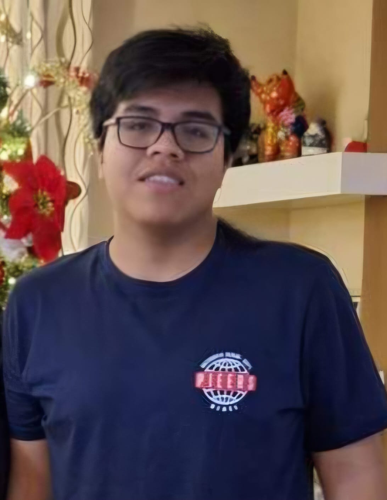 |                                                                                                                                                   **Mathias Joaquin Acuache Lucas \- U202314898** <br> Soy Mathias Joaquin Acuache Lucas, me encuentro en el sexto ciclo de la carrera de ingeniería de software, mi código de alumno es u202314898. Tengo experiencia en C++, SQL, MongoDB, además de utilizar GitHub de manera correcta . Me considero una persona que trata de apoyar en los diversos trabajos en equipo e investigar cosas nuevas.                                                                                                                                                    |
|   | **Brianna Cristina Salinas Guzman \- U202410239** <br> Soy estudiante de Ingeniería de Software con conocimientos en desarrollo de aplicaciones, estructuras de datos y programación orientada a objetos. Tengo experiencia trabajando con lenguajes como C++, Pyhton, SQL para base de datos y en la gestión de proyectos utilizando Git y GitHub para el control de versiones. Además, cuento con formación complementaria en marketing digital, lo que me permite aportar una perspectiva orientada al usuario y al posicionamiento del producto. Me considero una persona responsable, con capacidad de aprendizaje autónomo y habilidades para trabajar en equipo y comunicar ideas de manera clara. | 
|     |                                                                                                                                                                                                                 **Mateo Paolo Salazar Miranda \- U202315171**   <br>  Soy un estudiante responsable y comprometido, con interés en el desarrollo de soluciones tecnológicas innovadoras. Tengo habilidades en trabajo en equipo, pensamiento analítico y resolución de problemas                                                                                                                                                                                                                          | 
|     |                                                                                                                                                                                                            **Emily Juliette Arroyo Gonzales \- U202311469**  <br> Soy estudiante de la carrera de Ingeniería de Software, tengo 20 años, tengo experiencia en lenguajes como C++, MongoDB, en trabajos grupales me gusta aportar ideas que contribuyan a mi grupo y avanzar según lo asignado.                                                                                                                                                                                                            | 

<br>

---

## 1.2. Solution Profile

### 1.2.1. Antecedentes y problemática

#### What? (¿Qué?)


#### ¿Cuál es el problema?


Muchos centros veterinarios aún gestionan la información clínica y administrativa de forma manual o mediante herramientas poco integradas, lo que genera desorganización en historiales clínicos, citas e inventarios médicos. Esto dificulta la gestión operativa y reduce la eficiencia en la atención veterinaria.

#### When? (¿Cuándo?)


#### ¿Cuándo ocurre el problema?


El problema ocurre principalmente durante el registro de consultas, la programación de citas, el seguimiento de tratamientos y el control de insumos médicos, especialmente cuando la información no se actualiza en tiempo real o se maneja manualmente.

#### Where? (¿Dónde?)


#### ¿Dónde surge el problema?


La problemática surge en los procesos operativos y administrativos dentro de clínicas veterinarias y consultorios independientes.

#### ¿En qué tipo de centros o contextos ocurre esta problemática?


Se presenta principalmente en clínicas veterinarias pequeñas y medianas, así como en veterinarios independientes que aún utilizan registros manuales, archivos físicos o herramientas no especializadas para gestionar su información.

#### Who? (¿Quién?)


#### ¿Quiénes son los principales afectados por esta problemática?


Los principales afectados son los dueños y administradores y veterinarios independientes, quienes enfrentan dificultades para organizar información clínica, gestionar citas, controlar inventarios y optimizar sus procesos operativos.

#### ¿Quién lo utilizará?


La plataforma será utilizada por clínicas veterinarias y veterinarios independientes para registrar historiales clínicos, gestionar citas, controlar tratamientos e inventarios médicos y optimizar la administración de sus servicios.

#### Why? (¿Por qué?)


#### ¿Cuál es la causa del problema?


La principal causa es la falta de digitalización e integración de los procesos veterinarios, lo que provoca desorganización, duplicidad de información, errores en los registros y dificultades en la gestión operativa y administrativa.


#### How? (¿Cómo?)


#### ¿En qué condiciones los usuarios usarán nuestro producto?


Los usuarios utilizarán la plataforma durante sus actividades diarias para registrar consultas, gestionar citas, supervisar tratamientos, controlar inventarios y acceder a información clínica en tiempo real.

#### ¿Cómo les gustaría a los usuarios acceder a la plataforma?


Los usuarios prefieren acceder mediante computadoras y dispositivos móviles, ya que esto les permite gestionar la información clínica y administrativa de forma rápida, flexible y desde cualquier lugar.

#### How much? (¿Cuánto?)


#### ¿Cómo impacta la gestión ineficiente de la información clínica y de los insumos médicos en la calidad de atención en las clínicas veterinarias?


Esto impacta de manera significativa en la calidad de atención en las clínicas o centros veterinarios, ya que el manejo manual y no centralizado de los datos puede generar pérdida, duplicidad y dificultad en el acceso a los registros clínicos, afectando el seguimiento adecuado de los pacientes.


De acuerdo con Cedeno Ochoa et al. (2021), en muchos centros veterinarios la información aún se gestiona de forma manual, lo que dificulta la organización de los expedientes y puede ocasionar errores en los registros. Asimismo, la implementación de herramientas digitales permite reducir el tiempo de atención y mejorar la eficiencia en los procesos administrativos.


En el contexto peruano, Lolimsa (2024) señala que una inadecuada gestión en centros veterinarios, especialmente en el manejo de información e insumos, puede generar retrasos de atención, desorganización y una disminución en la calidad del servicio. En este sentido, la falta de digitalización impacta negativamente, mientras que soluciones como Pawtient permiten optimizar procesos, reducir errores y ofrecer una atención más eficiente y confiable.

<br>

---

### 1.2.2. Lean UX Process

El proceso de Lean UX es una metodología de diseño enfocada en el usuario que busca mejorar continuamente el producto a partir de la prueba de ideas, la evaluación y la retroalimentación constante. En el caso de Pawtient, se aplicará para entender mejor las necesidades de los dueños y administradores de clínicas veterinarias, así como de los veterinarios independientes, permitiendo ajustar la plataforma en función de su uso real y mejorar su experiencia de manera progresiva.

#### 1.2.2.1. Lean UX Problem Statements

Nuestro sistema busca mejorar la forma en que las clínicas veterinarias y los veterinarios independientes gestionan su información clínica, facilitando el acceso a datos y el control de sus procesos operativos.

Hemos observado que en muchos centros veterinarios y servicios independientes la información aún se maneja de forma manual o mediante herramientas no integradas, lo que dificulta el acceso a datos actualizados, el seguimiento de historiales clínicos y la correcta gestión de citas e insumos médicos.

**¿Cómo podemos lograr que las clínicas veterinarias y los veterinarios independientes gestionen su información clínica y sus procesos de manera más organizada, accesible y confiable?**

Nuestro sistema también busca optimizar la gestión administrativa y operativa dentro de las clínicas veterinarias, facilitando el control de recursos y mejorando la eficiencia en la atención.

Actualmente, muchos centros veterinarios presentan dificultades para controlar sus inventarios, organizar citas y centralizar la información clínica, lo que genera desorganización y afecta la eficiencia de sus operaciones.

**¿Cómo podemos mejorar la gestión operativa y administrativa de las clínicas veterinarias para optimizar sus procesos y reducir errores en el manejo de la información?**

Nuestro sistema busca optimizar la gestión de los recursos e insumos dentro de las clínicas veterinarias, mejorando la eficiencia de sus procesos operativos.

Hemos identificado que la gestión de insumos suele realizarse de forma manual o con herramientas poco integradas, lo que genera desorganización, errores en el control de stock y dificultades en la toma de decisiones.

**¿Cómo podemos mejorar el control y la gestión de los recursos e insumos en las clínicas veterinarias para optimizar sus procesos ?**

<br>

---

#### 1.2.2.2. Lean UX Assumptions

**Business Assumptions:**

1. **Considero que** las clínicas veterinarias y los veterinarios independientes requieren una forma más ordenada, eficiente y segura de gestionar la información clínica y administrativa de sus servicios.
2. **Estas necesidades pueden resolverse con** una plataforma web que centralice historiales clínicos, control de insumos, gestión de citas y seguimiento de tratamientos.
3. **Nuestros primeros usuarios serán** los dueños y administradores de clínicas veterinarias, así como los veterinarios independientes que buscan optimizar sus procesos operativos y mejorar la organización de la información clínica.
4. **El principal beneficio que buscan los usuarios es** mejorar la eficiencia de sus operaciones, reducir errores administrativos y tomar decisiones basadas en información actualizada.
5. **El sistema también ofrece** control de inventario, gestión de citas, seguimiento de tratamientos y acceso rápido a información clínica en tiempo real.
6. **La captación de nuestros usuarios será a través de** marketing digital, alianzas con on clínicas veterinarias y recomendaciones dentro del sector veterinario.
7. **Generaré ingresos mediante** un modelo de suscripción mensual con diferentes niveles: Paw Basic(5 USD), Paw Care(15 USD), Paw Pro(30 USD).
8. **Mi competencia estará conformada** por otros sistemas de gestión veterinaria y soluciones digitales similares.
9. **Nos diferenciamos por** ofrecer una plataforma accesible, fácil de usar y enfocada en centralizar la gestión clínica y operativa en un solo sistema.
10. **Mi principal riesgo** será la baja adopción del sistema debido a la resistencia al cambio o poca familiaridad con herramientas digitales.
11. **Abordaremos este riesgo mediante** una interfaz simple, guías de uso dentro de la plataforma y un proceso de adopción progresivo que facilite el uso desde el primer momento.

<br>

**User Assumptions:**

**¿Quiénes son nuestros usuarios?**


Los usuarios de Pawtient son dueños y administradores de clínicas veterinarias, así como veterinarios independientes que buscan optimizar la gestión de historiales clínicos, citas, tratamientos e inventarios médicos mediante herramientas digitales.

**¿Qué problemas busca resolver nuestro producto?**


Pawtient busca resolver la desorganización de la información clínica, la falta de integración de procesos y el control limitado de citas e insumos médicos dentro de clínicas veterinarias y servicios independientes.

**¿En qué momentos y de qué forma se utiliza el producto?**


La plataforma se utiliza durante consultas, gestión de citas, seguimiento de tratamientos y control de inventarios. Puede ser accedida desde computadoras o dispositivos móviles, permitiendo trabajar con información actualizada en tiempo real.

**¿Cómo se integra la solución en la rutina del usuario?**


El sistema forma parte de las actividades diarias de clínicas veterinarias y veterinarios independientes, facilitando el registro de consultas, la gestión de pacientes, el control de insumos y la organización de procesos operativos.

**¿Qué tan sencilla es la adopción de la plataforma?**


La incorporación de la plataforma será progresiva, ya que reemplaza procesos manuales por una solución más organizada. Su diseño simple y fácil de usar permite que los usuarios se adapten rápidamente sin afectar sus actividades habituales.


**¿Qué esperan ver los usuarios en la plataforma?**


La plataforma debe contar con un diseño claro y ordenado, con iconos fáciles de reconocer, colores adecuados y una estructura que facilite la navegación. Esto permite que los usuarios comprendan rápidamente las funciones y puedan interactuar de forma ágil y sencilla.

<br>

---

#### 1.2.2.3. Lean UX Hypothesis Statements

<br>

- **Hypothesis 01:**

  **Creemos que** los dueños y administradores de clínicas veterinarias mejorarán la organización de la información si centralizan los historiales clínicos en una sola plataforma.

  **Sabremos que** hemos tenido éxito.

  **Cuando** encuentren la información más rápido y disminuyan los errores al momento de registrar o consultar datos.

<br>

- **Hypothesis 02:**

  **Creemos que** los veterinarios independientes optimizarán la gestión de sus consultas si cuentan con acceso rápido y centralizado a la información clínica de sus pacientes.

  **Sabremos que** hemos tenido éxito.

  **Cuando** reduzcan el tiempo de búsqueda de información y mejoren el seguimiento de tratamientos y consultas.

<br>

- **Hypothesis 03:**

  **Creemos que** las notificaciones sobre citas y tratamientos ayudarán a los dueños y administradores de clínicas veterinarias, así como a los veterinarios independientes, a gestionar mejor sus actividades diarias.

  **Sabremos que** hemos tenido éxito.

  **Cuando** disminuyan las citas perdidas y se mejore el seguimiento de los tratamientos registrados.

<br>

- **Hypothesis 04:**

  **Creemos que** los dueños y administradores de clínicas veterinarias registrarán la información más rápido si utilizan formularios digitales dentro de la plataforma.

  **Sabremos que** hemos tenido éxito.

  **Cuando** los registros se completen en menos tiempo y sin repetir información.

<br>

- **Hypothesis 05:**

  **Creemos que** centralizar el estado clínico y los tratamientos de los pacientes ayudará a los dueños y administradores de clínicas veterinarias a mejorar el seguimiento y control de la atención médica.

  **Sabremos que** hemos tenido éxito.

  **Cuando** los usuarios consulten frecuentemente la información clínica y mejoren el seguimiento de los pacientes.

<br>

- **Hypothesis 06:**

  **Creemos que** una plataforma organizada y accesible mejorará la confianza de los dueños y administradores de clínicas veterinarias, así como de los veterinarios independientes, en la gestión de su información operativa y clínica.

  **Sabremos que** hemos tenido éxito.

  **Cuando** los usuarios utilicen constantemente la plataforma y reduzcan el uso de registros manuales o herramientas no integradas.

<br>

---

#### 1.2.2.4. Lean UX Canvas

El Lean UX Canvas es una herramienta visual que permite organizar y comprender los elementos clave de un producto, enfocándose en el problema, los usuarios y el valor que se busca ofrecer.

En el caso de Pawtient, se utiliza para identificar las necesidades de los dueños y administradores de clínicas veterinarias, así como de los veterinarios independientes, y definir cómo la plataforma aporta valor dentro de la gestión veterinaria.

A continuación, se presenta el Lean UX Canvas de Pawtient:


<br>

**Enlace al Lean UX Canvas:** [*Ver en Miro*](https://miro.com/welcomeonboard/QVN1VzZ1RmhoWEhGUm9heXpldFAyenkxK1hWQ1hiQ1dLTUlNN2twU1ArL0o2TzY2ZzdlMjc2dkJ0SEhvdy9PQTZGejBEeFNJWFQ5VUh2V1NNb3hKNlcxUnNrTWZNWmh3MitiSXhvQVdHeUtxSFhvTWN2OTNLNTk5LzZSa0lWUklzVXVvMm53MW9OWFg5bkJoVXZxdFhRPT0hdjE=?share_link_id=400022156481)

<br>

---

## 1.3. Segmentos objetivo

En el análisis del segmento objetivo para Pawtient, se ha identificado que nuestros principales usuarios serán los dueños y administradores de clínicas veterinarias, así como los veterinarios independientes.

### Dueños y administradores de clínicas veterinarias

Incluye responsables de la gestión operativa y administrativa de clínicas veterinarias, quienes necesitan organizar la información clínica, gestionar citas, controlar inventarios y optimizar los procesos del centro de forma eficiente.

- **Factores demográficos:**

  - Hombres y mujeres entre 30 y 55 años.
  - Propietarios o administradores de clínicas veterinarias urbanas.
  - Residentes principalmente en Santiago de Surco, Lima, Perú.
  - Nivel socioeconómico B y C.
  - Experiencia previa en gestión veterinaria o administración de negocios.


- **Factores psicográficos:**
   - Buscan optimizar la gestión operativa de sus clínicas.
   - Priorizan el orden, la eficiencia y el control de procesos.
   - Están interesados en modernizar y digitalizar sus servicios.
   - Buscan mejorar la organización y reducir errores administrativos.


- **Necesidades clave:**
  
   - Centralizar historiales clínicos y citas. 
   - Mejorar el control de inventarios e insumos médicos. 
   - Optimizar la gestión operativa y administrativa. 
   - Acceder rápidamente a información clínica actualizada.

### Veterinarios independientes


Incluye profesionales veterinarios que realizan consultas independientes y requieren herramientas digitales para gestionar pacientes, historiales clínicos y tratamientos de manera rápida y organizada.

- **Factores demográficos:**

    - Hombres y mujeres entre 25 y 45 años. 
    - Médicos veterinarios que trabajan de manera independiente. 
    - Residentes principalmente en Santiago de Surco, Lima, Perú.
    - Nivel socioeconómico B y C. 
    - Profesionales con experiencia en atención clínica veterinaria.


- **Factores psicográficos:**
    - Buscan herramientas digitales prácticas y accesibles. 
    - Priorizan la rapidez y movilidad en su trabajo diario. 
    - Desean reducir tareas manuales y mejorar la organización de consultas. 
    - Están interesados en gestionar información clínica desde cualquier lugar.


- **Necesidades clave:**

    - Gestionar pacientes e historiales clínicos de forma digital. 
    - Organizar citas y tratamientos veterinarios. 
    - Acceder a información clínica desde dispositivos móviles. 
    - Mejorar la eficiencia y organización de sus consultas.

<br>

---

<div align="center">

# Capítulo II: Requirements Elicitation & Analysis

</div>

---

## 2.1. Competidores

### 2.1.1. Análisis competitivo

Ahora veremos un análisis competitivo para identificar a los principales actores del mercado de software veterinario (vet-tech) en el Perú y Latinoamérica,
y evaluar sus fortalezas y debilidades. Esto nos permite definir la propuesta de valor de PetHealth y crear estrategias que nos ayuden a diferenciarnos y capturar la atención de nuestros usuarios, tanto clínicas veterinarias como dueños de mascotas.

#### Competitive Analysis Landscape
<table>
  <thead>
    <tr>
      <th colspan="7"><b>Competitive Analysis Landscape</b></th>
    </tr>
  </thead>
  <tbody>
    <tr>
      <td colspan="2" align="center">¿Por qué llevar a cabo este análisis?</td>
      <td colspan="5" align="center">El objetivo de este análisis es identificar las características de los competidores, evaluar sus fortalezas y debilidades, y encontrar maneras de diferenciarnos para obtener una ventaja competitiva en el mercado de software veterinario.</td>
    </tr>
      <tr>
    <td colspan="2" rowspan="2" valign="top">Startup y Competidores</td>
        <td valign="top" align="center">Nuestra Startup</td>
        <td valign="top" align="center"></td>
        <td valign="top" align="center"></td>
        <td valign="top" align="center"></td>
  </tr>
  <tr>
    <td valign="top" align="center"></td>
    <td valign="top" align="center"></td>
    <td valign="top" align="center"></td>
    <td valign="top" align="center"></td>
   </tr>
  <tr>
    <td rowspan="2" valign="top">Perfil</td>
    <td valign="top">Overview</td>
    <td valign="top">Es una plataforma web SaaS orientada a la gestión integral de clínicas veterinarias. Permite gestionar historiales clínicos, citas e inventarios, además de conectar directamente al veterinario con el dueño de la mascota a través de un portal de seguimiento en tiempo real.</td>
    <td valign="top">Software en la nube para la gestión de clínicas veterinarias, enfocado en simplificar la facturación, los registros médicos y la agenda para consultorios pequeños y medianos en Latinoamérica.</td>
    <td valign="top">Software de gestión veterinaria muy completo y consolidado. Centraliza desde la historia clínica hasta la facturación y cuenta con un ecosistema de herramientas empresariales muy robusto para el sector hispanohablante.</td>
    <td valign="top">Es una plataforma veterinaria avanzada basada en la nube que tiene incluido diversas herramientas de IA para dictado de notas médicas para las mascotas. Tiene un sistema “limpio”, esto permite tener una propiedad de los datos para la organización.</td>
  </tr>
  <tr>
    <td valign="top">Ventaja competitiva ¿Qué valor ofrece a los clientes?</td>
    <td valign="top">Ofrecemos una herramienta simple, accesible y centralizada. Nuestro mayor valor es la visibilidad total que le damos al dueño de la mascota sobre los tratamientos y credenciales de su veterinario, generando confianza y fidelización, todo en un entorno web fácil de usar.</td>
    <td valign="top">Destaca por su facilidad de uso inicial y su bajo costo para clínicas que recién empiezan a digitalizarse. Su soporte técnico en español es muy valorado en la región.</td>
    <td valign="top">Destaca por su extrema robustez, capacidad para administrar grupos de clínicas interconectadas, e innovación tecnológica (como el uso de IA para recomendar productos y servicios médicos al cliente).</td>
    <td valign="top">La principal diferencia es la innovación mediante IA navita. Ofrece un asistente que redacta notas médicas, además de tener un resumen del historial y automatiza la captura de cargos omitidos,etc.</td>
  </tr>
  <tr>
    <td rowspan="2" valign="top">Perfil de Marketing</td>
    <td valign="top">Mercado objetivo</td>
    <td valign="top">Clínicas veterinarias de tamaño pequeño a mediano en Perú y Latinoamérica, y dueños de mascotas que exigen transparencia y seguimiento digital de la salud de sus animales.</td>
    <td valign="top">Consultorios independientes y pequeñas clínicas en Latinoamérica que buscan salir del papel y usar su primer software de gestión.</td>
    <td valign="top">Clínicas veterinarias de tamaño medio, grandes hospitales y grupos corporativos veterinarios que buscan un control empresarial, clínico y financiero total a gran escala.</td>
    <td valign="top">Clínicas veterinarias de alta complejidad, además de clínicas con múltiples sedes y servicios especialidades o medicina móvil.</td>
  </tr>
  <tr>
    <td valign="top">Estrategias de marketing</td>
    <td valign="top">Marketing digital en redes sociales, demostraciones gratuitas a dueños de clínicas, y estrategias de referidos (dueños de mascotas que recomiendan la plataforma a su veterinario de confianza).</td>
    <td valign="top">Campañas en Google Ads, presencia en grupos de Facebook de veterinarios y un fuerte enfoque en el marketing de contenidos (blogs y webinars sobre gestión).</td>
    <td valign="top">Fuerte presencia institucional en congresos veterinarios internacionales, alianzas con colegios veterinarios, y una fuerza de ventas consultiva (B2B) para grandes cuentas.</td>
    <td valign="top">Herramientas integradas para enviar campañas, promociones y recordatorios automáticos sin esfuerzo manual. Utilizan anuncios diversos de Google Ads.</td>
  </tr>
  <tr>
    <td rowspan="3" valign="top">Perfil de Producto</td>
    <td valign="top">Productos & Servicios</td>
    <td valign="top">Historial clínico digital, agenda de citas, gestión de insumos médicos, portal web para el dueño de la mascota y registro de credenciales del personal médico.</td>
    <td valign="top">Historias clínicas, agenda, recordatorios automáticos por WhatsApp/Email, control de caja e inventario básico.</td>
    <td valign="top">Historias clínicas avanzadas, integración directa con equipos de laboratorio, módulo de hospitalización, planes de salud, compras/stock inteligente y gestión de salas de espera.</td>
    <td valign="top">Gestión de turnos, historias clínicas electrónicas, telemedicina, recetas electrónicas, informes personalizados y gestión de salud de rebaños en un solo click.</td>
  </tr>
  <tr>
    <td valign="top">Precios & Costos</td>
    <td valign="top">Anual: Desde $60 USD hasta $360 USD. Mensual: plan escalonado de $5, $15, $30 USD.</td>
    <td valign="top">Maneja un modelo de suscripción mensual por niveles: $19 USD/mes (Plan Emprendedor - básico), $39 USD/mes (Plan Clínica - intermedio) y $65 USD/mes (Plan Hospital - avanzado). Ofrece descuentos por pago anual.</td>
    <td valign="top">Su modelo es de licenciamiento B2B. Requiere un costo de implementación inicial (Setup Fee) de aprox. $500 USD y mensualidades que van desde los $55 USD hasta los $120 USD dependiendo del número de estaciones de trabajo y módulos de hospitalización activados.</td>
    <td valign="top">Es la solución más costosa (segmento Enterprise). Sus precios inician en $249 USD/mes por el Plan Core (limitado a 1 veterinario) y suben a $299 USD/mes por el Plan Pro. Cobran adicionales por almacenamiento de imágenes médicas pesadas.</td>
  </tr>
  <tr>
    <td valign="top">Canales de distribución (Web y/o Móvil)</td>
    <td valign="top">Plataforma web responsiva (SaaS) accesible desde navegadores en PC o móvil, sin necesidad de instalación.</td>
    <td valign="top">100% Software como Servicio (SaaS) accesible vía navegador web</td>
    <td valign="top">Despliegue en la nube (SaaS Cloud) o en servidor local, distribuido a través de asesores de ventas corporativos con procesos de implementación guiada.</td>
    <td valign="top">100% Web (SaaS) accesible desde cualquier navegador (PC, Mac, tablets) y App móvil para dueños de mascotas.</td>
  </tr>
  <tr>
    <td rowspan="4" valign="top">Análisis SWOT</td>
    <td valign="top">Fortalezas</td>
    <td valign="top">Enfoque dual que empodera al dueño de la mascota. Precios altamente accesibles. Interfaz moderna y sin curva de aprendizaje pronunciada.</td>
    <td valign="top">Muy posicionado en el mercado hispanohablante. Simple y directo al grano para tareas diarias.</td>
    <td valign="top">Altamente funcional y personalizable. Cuenta con control exhaustivo de inventario e integraciones con casi cualquier equipo médico de laboratorio.</td>
    <td valign="top">Alta capacidad de integración (+150 herramientas) y API abierta. Seguridad de datos con 5 capas de producción. Asistente de IA nativo para reducir la carga administrativa del médico.</td>
  </tr>
  <tr>
    <td valign="top">Debilidades</td>
    <td valign="top">Al ser una startup nueva, la notoriedad de marca es baja inicialmente. Dependencia de que ambos usuarios (clínica y dueño) adopten la plataforma para generar el valor completo.</td>
    <td valign="top">Interfaz un poco anticuada. Carece de funciones avanzadas para clínicas que crecen rápidamente y abren nuevas sedes.</td>
    <td valign="top">Al tener tantas opciones y módulos, la interfaz puede resultar abrumadora y la curva de aprendizaje es larga para el personal nuevo.</td>
    <td valign="top">Costo inicial más elevado que las soluciones locales básicas.</td>
  </tr>
  <tr>
    <td valign="top">Oportunidades</td>
    <td valign="top">La nueva generación de dueños de mascotas exige transparencia digital. Oportunidad de crear alianzas con proveedores de alimentos y medicinas.</td>
    <td valign="top">Expansión de sus integraciones con métodos de pago locales en diferentes países de Latinoamérica.</td>
    <td valign="top">Aprovechar su inmensa base de datos clínica para ofrecer analíticas predictivas y expandir versiones "Lite" a consultorios más pequeños.</td>
    <td valign="top">Creciente demanda en telemedicina y comunicación “mobile-first” en dueños de mascotas jóvenes.</td>
  </tr>
  <tr>
    <td valign="top">Amenazas</td>
    <td valign="top">Resistencia al cambio tecnológico por parte de veterinarios. Que los sistemas consolidados (como SmartVet) bajen sus precios.</td>
    <td valign="top">La aparición de startups más ágiles con mejores diseños y modelos de precios más agresivos (como PetHealth).</td>
    <td valign="top">Startups modernas con interfaces más limpias y amigables que resulten más atractivas para las nuevas generaciones de veterinarios.</td>
    <td valign="top">Inestabilidad de conexiones a internet en zonas rurales, lo que afecta a sistemas 100% nube. Surgimiento de startups locales con precios más bajos y soporte presencial en la región.</td>
  </tr>
  <tr>
</table>

---

### 2.1.2. Estrategias y tácticas frente a competidores

#### Estrategias:

- Posicionar a PetHealth como una solución moderna, accesible e intuitiva, diseñada específicamente para las clínicas veterinarias pequeñas y medianas en Perú, a diferencia de los sistemas ERP corporativos complejos y costosos (como Qvet) o plataformas con interfaces anticuadas (como SmartVet).

- Enfocarse en la funcionalidad única del modelo dual (B2B2C) que conecta al veterinario directamente con el dueño de la mascota a través de una "Libreta Sanitaria Digital", transformando el software de una simple herramienta administrativa a un canal de fidelización y marketing para la clínica.

- Ofrecer un modelo de suscripción SaaS escalonado con un plan básico de muy bajo costo ($5 USD), lo cual elimina el riesgo financiero para los emprendedores que buscan dejar el papel, haciéndolo mucho más atractivo que los competidores premium.

- Posicionar a PetHealth como una alternativa "Lite" y veloz frente a la complejidad de otras aplicaciones (como Provet Cloud). Mientras que otros requieren una curva de aprendizaje alta debido a sus múltiples módulos hospitalarios y de IA, PetHealth elimina la fricción operativa ofreciendo una interfaz web 100% responsive, optimizada para procesos de consulta rápida en clínicas medianas, garantizando que el personal médico no pierda tiempo en menús complejos.

- Capturar el segmento de veterinarios independientes(freelancers) mediante una propuesta de "oficina móvil", ofreciendo una herramienta de gestión personal que no requiere infraestructura física ni costos de implementación, superando la rigidez de los softwares tradicionales que solo están diseñados para locales fijos.

- Utilizar el diferencial de precios frente a SmartVet (\$19 USD) y Qvet (\$55+ USD) para atraer al sector informal de veterinaria, posicionando a PetHealth como la única plataforma que permite la digitalización profesional por el costo de una sola consulta básica al mes.

- Diferenciarse de Provet Cloud ofreciendo una política de exportación de datos simplificada y sin "secuestro" de información, asegurando que el veterinario independiente siempre sea dueño de su cartera de clientes sin enfrentar procesos técnicos complejos de migración.

#### Tácticas:

- Desarrollar un proceso de onboarding (registro inicial) autogestionable de menos de 10 minutos y tutoriales interactivos dentro de la plataforma para facilitar la rápida adopción por parte del personal veterinario con baja familiaridad tecnológica.

- Implementar campañas de educación y marketing en redes sociales (Instagram, TikTok, Facebook) dirigidas a los dueños de mascotas ("Pet Parents") para que sean ellos quienes exijan historiales clínicos transparentes y recomienden PetHealth a sus veterinarios.

- Establecer alianzas estratégicas con proveedores de insumos médicos, marcas de alimentos para mascotas y colegios veterinarios para llegar a un gran número de clínicas de manera directa y generar confianza institucional.

- Crear una calculadora interactiva (ROI) dentro de la Landing Page que le muestre a los dueños de las clínicas el ahorro de tiempo, la reducción de inasistencias (gracias a los recordatorios) y el aumento de ganancias que obtendrán al usar PetHealth versus sus métodos manuales actuales.

- Diseñar un módulo de agenda con geolocalización básica para que el veterinario freelancer pueda organizar sus citas diarias según su ruta de desplazamiento, diferenciándonos de la competencia que se enfoca únicamente en la gestión de salas de espera físicas. 

- Lanzar una promoción dirigida a veterinarios independientes donde el primer mes del plan básico cuesta solo \$1 USD, resaltando que el precio regular (\$5 USD) sigue siendo 4 veces más económico que SmartVet (\$19 USD).

- Implementar en la Landing Page una herramienta donde el usuario selecciona su software actual (Qvet, SmartVet o Provet) y PetHealth le calcula automáticamente cuánto dinero ahorraría al año migrando con nosotros, enfatizando la eliminación de los costos de instalación (Setup Fees) de la competencia.

- Crear un kit de marketing digital gratuito para los independientes que se suscriban al plan de \$5 USD, que incluya plantillas de Instagram y tarjetas personales con el código QR de su Libreta Sanitaria Digital, posicionándonos como una inversión de marketing más que un gasto de software.

<br>

---

## 2.2. Entrevistas

Esta sección expone la investigación basada en entrevistas realizadas a médicos veterinarios (incluyendo administradores de clínicas) y dueños de mascotas, segmentos clave del proyecto. A través de sus testimonios se buscó identificar las principales dificultades en la gestión clínica, administrativa y en el seguimiento de la salud animal, para explorar cómo una solución digital integral podría responder de manera efectiva a sus necesidades

<br>

### 2.2.1. Diseño de entrevistas

Las entrevistas fueron diseñadas aplicando buenas prácticas de investigación cualitativa, estructurando las preguntas de lo general a lo específico. El objetivo principal es recolectar información demográfica, psicográfica, conductual y tecnológica de los entrevistados. Estos datos son fundamentales para construir posteriormente nuestros arquetipos (User Personas), identificando su biografía, dispositivos de preferencia, influencias, metas y puntos de dolor respecto a la gestión de salud veterinaria.

<br>

## Segmento 1: Dueños y Administradores de Clínicas Veterinarias

**A. Información Demográfica y Antecedentes**

- ¿Podría indicarnos su edad, en qué distrito reside y cuál es su estado civil o composición familiar actual?

- ¿Cuál es su cargo exacto en la clínica y cuántos años de experiencia tiene en el rubro veterinario?

- ¿Cómo describiría su personalidad en su entorno de trabajo? (Ej. metódico, tradicional, innovador, acelerado).

**B. Objetivos y Frustraciones**

- ¿Cuáles son sus objetivos profesionales principales para su clínica este año y qué es lo que más le impide lograrlos actualmente?

- Pensando en la gestión diaria (citas, historias clínicas, inventario), ¿cuál es la tarea que considera más tediosa, desordenada o propensa a errores?

- ¿Cómo le afecta a nivel personal (estrés, falta de tiempo libre) el no tener la información de sus pacientes o el stock de insumos centralizado?

**C. Tecnología y Canales de Interacción**

- ¿Qué dispositivos utiliza con mayor frecuencia en su día a día (smartphone, laptop) tanto para su vida personal como para la clínica?

- ¿Qué tan hábil se considera aprendiendo a usar nuevos programas y cuáles son sus redes sociales favoritas para informarse o interactuar con colegas?

- ¿Hay alguna marca, empresa o figura pública dentro del rubro veterinario o tecnológico que considere un referente o influencia?

**D. Comportamiento frente a la solución**

- Si existiera una herramienta integral que le permitiera gestionar la clínica de forma centralizada, ¿qué funciones serían indispensables para que usted decida implementarla?

<br>

## Segmento 2: Veterinarios Independientes

**A. Información Demográfica y Antecedentes**

- ¿Podría indicarnos su edad, en qué distrito reside y cuál es su estado civil o composición familiar actual?

- ¿Cuántos años lleva ejerciendo como veterinario independiente y en qué tipo de consultas se especializa principalmente?

- ¿Cómo describiría su personalidad en su práctica diaria? (Ej. metódico, ágil, muy orientado al paciente, organizado).

**B. Objetivos y Frustraciones**

- ¿Cuáles son sus objetivos profesionales principales para este año y qué es lo que más le impide alcanzarlos actualmente?

- En su rutina de consultas, ¿cuál es la tarea administrativa que le resulta más tediosa o propensa a errores (registro de historiales, seguimiento de tratamientos, recordatorio de citas)?

- ¿Cómo le afecta a nivel personal no contar con un sistema centralizado para acceder a la información de sus pacientes desde cualquier lugar?

**C. Tecnología y Canales de Interacción**

- ¿Qué dispositivos utiliza con mayor frecuencia en su día a día (smartphone, laptop, tablet) tanto en consulta como fuera de ella?

- ¿Qué tan cómodo se siente adoptando nuevas herramientas digitales y qué redes sociales utiliza para mantenerse al día con el rubro?

- ¿Hay alguna marca, aplicación o referente del sector veterinario o tecnológico que considere una influencia en su forma de trabajar?

**D. Comportamiento frente a la solución**

- Si existiera una herramienta digital que le permitiera gestionar pacientes, historiales y citas desde su celular, ¿qué características harían que la use de forma constante en su práctica diaria?

<br>

---

### 2.2.2. Registro de entrevistas

<div align="center">
  
**Segmento objetivo 1: `Dueños y Administradores de Clínicas Veterinarias`**

<br>

#### Entrevista 1
*Imagen de la entrevista*


<br>

| Campo | Detalle                  |
|:------|:--------------------------------------------------------------------------------------------------------------------------------------------------------------------------------------------------------------------------------------------------------------------------------------------------------------------------------------------------------------|
| **Nombres y apellidos** | Valeria Nomberto |
| **Edad** | 23 |
| **Ubicación** | Lince |
| **Fecha de entrevista** | 21-04-2026 |
| **Duración** | 05:59 min   |
| **Enlace al video** | [Ver entrevista en Microsoft Stream](https://upcedupe-my.sharepoint.com/:v:/g/personal/u202315007_upc_edu_pe/IQAz3Em-fhe6R7-5goCWq0-YAWzVewgdUXIBFNEKZiFuhOE?e=kimAI5&nav=eyJyZWZlcnJhbEluZm8iOnsicmVmZXJyYWxBcHAiOiJTdHJlYW1XZWJBcHAiLCJyZWZlcnJhbFZpZXciOiJTaGFyZURpYWxvZy1MaW5rIiwicmVmZXJyYWxBcHBQbGF0Zm9ybSI6IldlYiIsInJlZmVycmFsTW9kZSI6InZpZXcifX0%3D) |

**Resumen:**

</div>

Valeria es una médica veterinaria de 23 años que trabaja en el distrito de Lince, Lima. Se define como una profesional responsable, empática y muy organizada, con aproximadamente dos años de experiencia en el sector. Su principal meta para este año es digitalizar los procesos de su clínica para mejorar la fidelización de los clientes y optimizar la gestión interna. Actualmente, su mayor dificultad es el desorden y la dispersión de las historias clínicas físicas, lo que le genera estrés y le resta tiempo libre. Por ello, busca una herramienta que centralice la gestión de citas, inventarios e historiales médicos en una plataforma accesible desde el celular.

<br>
<div align="center">
  
#### Entrevista 2
*Imagen de la entrevista*


<br>

| Campo | Detalle                                                     |
|:------|:------------------------------------------------------------|
| **Nombres y apellidos** | Adrian                                                      |
| **Edad** | 35                                                          |
| **Ubicación** | Miraflores                                                  |
| **Fecha de entrevista** | 22-04-2026                                                  |
| **Duración** | 05:44 min                                                   |
| **Enlace al video** | [Ver entrevista en Microsoft Stream](https://upcedupe-my.sharepoint.com/:v:/g/personal/u202315007_upc_edu_pe/IQBBtDDT9R0bQpGUDj6Uw9XeAbjQ6oExcvphcoKBd82sQ7o?e=80gFgA&nav=eyJyZWZlcnJhbEluZm8iOnsicmVmZXJyYWxBcHAiOiJTdHJlYW1XZWJBcHAiLCJyZWZlcnJhbFZpZXciOiJTaGFyZURpYWxvZy1MaW5rIiwicmVmZXJyYWxBcHBQbGF0Zm9ybSI6IldlYiIsInJlZmVycmFsTW9kZSI6InZpZXcifX0%3D) |

**Resumen:**

</div>

Adrián es un médico veterinario de 35 años residente en Miraflores con una década de experiencia profesional, quien se define como una persona metódica y responsable que busca optimizar la gestión interna y la fidelización de clientes en su clínica. Su mayor desafío es el estrés provocado por la gestión manual de citas y el uso de historias clínicas en papel o Excel, lo que le genera errores y le impide desconectarse totalmente del trabajo, por lo cual considera fundamental implementar una agenda digital automatizada y un control de inventarios en tiempo real que facilite su labor diaria y mejore la comunicación con los dueños de las mascotas.

<br>
<div align="center">
  
#### Entrevista 3

*Imagen de la entrevista*


<br>

| Campo | Detalle                                                      |
|:------|:-------------------------------------------------------------|
| **Nombres y apellidos** | Luciana Quintana                                             |
| **Edad** | 28                                                           |
| **Ubicación** | Surco                                                        |
| **Fecha de entrevista** | 22-04-2026                                                   |
| **Duración** | 05:18 min                                                     |
| **Enlace al video** | [Ver entrevista en Microsoft Stream](https://upcedupe-my.sharepoint.com/:v:/g/personal/u202315007_upc_edu_pe/IQCMlNh3l3N6TZPQPy1mHg6RAVOCx3wuJoNC11qLxFvlMrY?e=4XiPy9&nav=eyJyZWZlcnJhbEluZm8iOnsicmVmZXJyYWxBcHAiOiJTdHJlYW1XZWJBcHAiLCJyZWZlcnJhbFZpZXciOiJTaGFyZURpYWxvZy1MaW5rIiwicmVmZXJyYWxBcHBQbGF0Zm9ybSI6IldlYiIsInJlZmVycmFsTW9kZSI6InZpZXcifX0%3D) |

**Resumen:**

</div>

Luciana es una veterinaria y administradora de 28 años que reside en Surco y cuenta con tres años de experiencia, desempeñando un rol multifuncional donde su perfil organizado choca frecuentemente con la falta de tiempo y el desorden en los procesos internos. Para ella, el manejo de información no centralizada y la necesidad de resolver temas administrativos fuera del horario laboral representan su principal fuente de estrés, por lo que aspira a que la clínica crezca mediante una herramienta integral que digitalice las historias médicas y automatice los recordatorios mediante dispositivos móviles, permitiéndole ser más práctica y elevar la calidad del servicio.

---
<div align="center">
  
**Segmento objetivo 2: `Dueños de mascotas (ACTUALIZAR Veterinarios Independientes)`**

<br>

#### Entrevista 1

*Imagen de la entrevista*


<br>

| Campo | Detalle                                                     |
|:------|:------------------------------------------------------------|
| **Nombres y apellidos** | Pierina                                                     |
| **Edad** | 29                                                          |
| **Ubicación** | Surco                                                       |
| **Fecha de entrevista** | 20-04-2026                                                  |
| **Duración** | 07:57 min                                                   |
| **Enlace al video** | [Ver entrevista en Microsoft Stream](https://upcedupe-my.sharepoint.com/:v:/g/personal/u202315007_upc_edu_pe/IQAFfPb10NeoRrgpyDAsrwO9AV0mvrXDNFWqMpHT4T8IZZ4?e=LIlQpN&nav=eyJyZWZlcnJhbEluZm8iOnsicmVmZXJyYWxBcHAiOiJTdHJlYW1XZWJBcHAiLCJyZWZlcnJhbFZpZXciOiJTaGFyZURpYWxvZy1MaW5rIiwicmVmZXJyYWxBcHBQbGF0Zm9ybSI6IldlYiIsInJlZmVycmFsTW9kZSI6InZpZXcifX0%3D) |

**Resumen:**

</div>

Pierina es una estudiante de Ingeniería de Software de 19 años que vive en San Juan de Lurigancho y tiene dos perros de raza pequeña de cuatro años, adoptados de la camada de un familiar. Se considera una dueña sobreprotectora y su principal objetivo es mantener a sus mascotas saludables y libres de parásitos, especialmente por la presencia de perros callejeros en su zona. Le genera preocupación llevarlos al veterinario por posibles malos tratos y tiene dificultades para organizar el historial médico y las vacunas, ya que utiliza una cartilla física que puede perderse o no siempre está disponible. Utiliza TikTok e Instagram para buscar recomendaciones y sigue a veterinarios en redes sociales. Además, señala que usaría una plataforma digital si le permitiera organizar el historial médico, recibir recordatorios de vacunas, agendar citas y ver reseñas de veterinarias.
<br>

<div align="center">
  
#### Entrevista 2

*Imagen de la entrevista*


<br>

| Campo | Detalle                                                     |
|:------|:------------------------------------------------------------|
| **Nombres y apellidos** | Mauricio Canchis                                            |
| **Edad** | 29                                                          |
| **Ubicación** | Surco                                                       |
| **Fecha de entrevista** | 18-04-2026                                                  |
| **Duración** | 08:42 min                                                   |
| **Enlace al video** | [Ver entrevista en Microsoft Stream](https://upcedupe-my.sharepoint.com/:v:/g/personal/u202315007_upc_edu_pe/IQDpOEyAXDKrSabjI835Bo8_AaRMpQ-XQfXEVC77FQGQYfo?e=vnulnX&nav=eyJyZWZlcnJhbEluZm8iOnsicmVmZXJyYWxBcHAiOiJTdHJlYW1XZWJBcHAiLCJyZWZlcnJhbFZpZXciOiJTaGFyZURpYWxvZy1MaW5rIiwicmVmZXJyYWxBcHBQbGF0Zm9ybSI6IldlYiIsInJlZmVycmFsTW9kZSI6InZpZXcifX0%3D) |

**Resumen:**

</div>

Mauricio es un estudiante universitario de 29 años que reside en Surco y es dueño de un perro pequeño. Debido a su pesada carga académica y a que posee una memoria que él mismo describe como "frágil", le resulta complicado mantenerse al día con los cuidados de su mascota. Su principal frustración es el tiempo que consume ir al veterinario y la dificultad para recordar las fechas de vacunación o citas médicas. Es un usuario intensivo de smartphone y WhatsApp, y admite que no recuerda nombres de marcas, sino que compra productos guiándose por el reconocimiento visual de los colores del empaque. Para él, lo más valioso de una plataforma digital sería recibir notificaciones y recordatorios automáticos que le quiten la preocupación de olvidar los eventos de salud de su perro.

<br>

<div align="center">

#### Entrevista 3

*Imagen de la entrevista*


<br>

| Campo | Detalle                                                      |
|:------|:-------------------------------------------------------------|
| **Nombres y apellidos** | Jorge                                                        |
| **Edad** | 20                                                           |
| **Ubicación** | La Victoria                                                  |
| **Fecha de entrevista** | 21-04-2026                                                   |
| **Duración** | 06:16 min                                                    |
| **Enlace al video** | [Ver entrevista en Microsoft Stream](https://upcedupe-my.sharepoint.com/:v:/g/personal/u202315007_upc_edu_pe/IQACXesV91lmRpPN6yBDOZ3EAa3Z8Y0G0-DjIC18S1qX8jk?e=1VGFIk&nav=eyJyZWZlcnJhbEluZm8iOnsicmVmZXJyYWxBcHAiOiJTdHJlYW1XZWJBcHAiLCJyZWZlcnJhbFZpZXciOiJTaGFyZURpYWxvZy1MaW5rIiwicmVmZXJyYWxBcHBQbGF0Zm9ybSI6IldlYiIsInJlZmVycmFsTW9kZSI6InZpZXcifX0%3D) |

**Resumen:**

</div>

Jorge es un estudiante universitario de 20 años que vive en La Victoria junto a su hermano y tiene un perro Golden Retriever de 6 años que llegó como regalo. Se considera un dueño equilibrado entre relajado y sobreprotector, y su principal objetivo es brindarle calidad de vida a su mascota. Le genera estrés llevarlo al veterinario porque su perro le tiene miedo y porque a veces detecta problemas tarde, lo que aumenta los costos. Ha perdido indicaciones médicas anteriormente y ha tenido que volver al veterinario. Utiliza principalmente su celular y computadora, y aplicaciones como Instagram, WhatsApp y Google Calendar. Prefiere marcas de comida recomendadas como Pro Plan y sigue consejos de veterinarios en redes sociales. Además, usaría una plataforma digital si incluyera historial médico, recordatorios y recomendaciones para el cuidado de su mascota.

<br>

---

### 2.2.3. Análisis de entrevistas

**Segmento objetivo 1: `Personal de clínico de centros veterinarios`**

Tras analizar las entrevistas realizadas a los profesionales del sector veterinario, se han identificado las siguientes características objetivas y subjetivas, las cuales servirán de base para la construcción de nuestro User Persona:


* **Perfil Demográfico (Características objetivas):** El 100% de los entrevistados son profesionales activos (médicos veterinarios y administradores) con edades comprendidas entre los 23 y 35 años, operando en diversos distritos de Lima Metropolitana. El 100% cuenta con experiencia laboral previa en el rubro, variando entre 2 y 10 años.


* **Perfil Psicológico y Conductual (Características subjetivas):** El 100% de la muestra se autodefine con rasgos de personalidad orientados al orden (organizados, metódicos y responsables). A nivel de metas profesionales, el 100% tiene como objetivo principal optimizar la gestión interna de sus clínicas para mejorar la calidad del servicio y fidelizar a sus clientes.


* **Puntos de Dolor (Pain Points):** Existe una coincidencia absoluta; el 100% de los profesionales reporta altos niveles de estrés derivados de la gestión manual y desordenada de la información (uso de historias clínicas en papel o Excel y agendas manuales). Asimismo, el 100% manifiesta que esta ineficiencia operativa invade su vida personal, obligándolos a realizar labores administrativas fuera de su horario y dificultando su desconexión del trabajo.


* **Necesidades y Soluciones Esperadas:** El 100% de los entrevistados expresa la necesidad urgente de una transformación digital. Buscan una herramienta tecnológica integral, con accesibilidad móvil (mencionada explícitamente), que les permita centralizar tres pilares fundamentales: historias clínicas, agendamiento de citas y control de inventarios en tiempo real.


**Segmento objetivo 2: `Dueños de mascotas (ACTUALIZAR Veterinarios Independientes)`**

El análisis de las entrevistas a los dueños de mascotas revela patrones de comportamiento muy marcados respecto a la responsabilidad y la gestión del tiempo, delineando el siguiente perfil para el arquetipo:


* **Perfil Demográfico (Características objetivas):** El 100% de los entrevistados son jóvenes adultos y estudiantes universitarios (rango de 19 a 29 años) residentes en Lima. El 100% son dueños de perros y son usuarios intensivos de dispositivos móviles (smartphones) y plataformas digitales (Instagram, WhatsApp, TikTok).


* **Perfil Psicológico y Conductual (Características subjetivas):** El 100% tiene como prioridad fundamental garantizar la salud, prevención (libre de parásitos) y calidad de vida de sus mascotas. A nivel de personalidad frente a su mascota, el 66.7% (2 de 3) se autodenomina con tendencias "sobreprotectoras". Además, el 100% lleva un ritmo de vida acelerado y con alta carga de responsabilidades académicas.


* **Puntos de Dolor (Pain Points):** El 100% de la muestra experimenta frustración y dificultades severas para organizar la información médica de sus mascotas. Manifiestan problemas de "memoria frágil", pérdida de indicaciones médicas y extravío de cartillas físicas de vacunación. Adicionalmente, el 66.7% asocia la visita al veterinario con experiencias de estrés, ya sea por el tiempo que consume o por el miedo que experimentan sus mascotas.


* **Necesidades y Soluciones Esperadas:** El 100% de los dueños afirma que utilizaría activamente una plataforma digital si esta resuelve su problema de memoria y organización. Su necesidad principal, exigida por el 100% de la muestra, es un sistema que envíe notificaciones y recordatorios automáticos (vacunas, citas) y que digitalice el historial médico para tenerlo siempre disponible en el celular.

<br>

---

## 2.3. Needfinding

### 2.3.1. User Personas

Los siguientes User Personas se elaboraron a partir de las entrevistas realizadas a dueños y administradores de clínicas veterinarias, así como a veterinarios independientes. Cada uno representa características, comportamientos y necesidades clave que permiten orientar el diseño y la propuesta de valor de la plataforma Pawtient.

## User Persona 1: Dueños y administradores de clínicas veterinarias

Camila Ramírez de 32 años es dueña y administradora de una clínica veterinaria en Santiago de Surco. En su día a día debe coordinar citas, controlar inventarios y supervisar la información clínica de sus pacientes, por lo que busca soluciones digitales que le permitan mantener una gestión más organizada, rápida y eficiente.


<br>

## User Persona 2: Veterinarios independientes

Diego Torres es un médico veterinario independiente que atiende consultas y realiza seguimiento de pacientes en distintos puntos de Santiago de Surco. Su principal desafío es mantener organizada la información clínica y gestionar sus citas de manera eficiente, por lo que busca herramientas digitales prácticas que le permitan optimizar su trabajo diario y enfocarse más en la atención de sus pacientes.


---

### 2.3.2. User Task Matrix

<br>

## User Task Matrix - Dueños y administradores de clínicas veterinarias

Los dueños y administradores de clínicas veterinarias realizan tareas enfocadas en la organización operativa, control de información clínica y supervisión de procesos internos. Esto evidencia la necesidad de una plataforma que centralice datos y optimice la gestión diaria del centro veterinario.

| **Tareas / Tasks**                   | **Frecuencia** | **Importancia** |
|--------------------------------------|----------------|-----------------|
| Gestionar historiales clínicos       | Alta           | Muy alta        |
| Organizar citas veterinarias         | Alta           | Muy alta        |
| Controlar inventario de insumos      | Alta           | Alta            |
| Supervisar procesos operativos       | Alta           | Muy alta        |
| Consultar información de pacientes   | Alta           | Muy alta        |
| Coordinar atención del personal      | Media          | Alta            |
| Revisar reportes y registros         | Media          | Alta            |
| Gestionar información administrativa | Alta           | Muy alta        |
| Dar seguimiento a tratamientos       | Media          | Alta            |

<br>

## User Task Matrix - Veterinarios independientes

Los veterinarios independientes desarrollan tareas relacionadas con la atención clínica, el seguimiento de pacientes y la gestión de información médica en distintos entornos de trabajo. Esto refleja la necesidad de herramientas digitales accesibles que faciliten la organización y agilicen sus actividades diarias.

| **Tareas / Tasks**                          | **Frecuencia** | **Importancia** |
|---------------------------------------------|----------------|-----------------|
| Registrar consultas veterinarias            | Alta           | Muy alta        |
| Consultar historiales clínicos              | Alta           | Muy alta        |
| Gestionar citas y tratamientos              | Alta           | Alta            |
| Realizar seguimiento de pacientes           | Media          | Alta            |
| Acceder a información clínica móvil         | Alta           | Muy alta        |
| Organizar registros médicos                 | Alta           | Alta            |
| Comunicar indicaciones médicas              | Alta           | Alta            |
| Gestionar tiempos de atención               | Media          | Alta            |
| Revisar información de pacientes            | Alta           | Muy alta        |

<br>

---

### 2.3.3. User Journey Mapping

En el desarrollo de Pawtient, se elaboró un User Journey Mapping con el objetivo de comprender cómo interactúan los dueños y administradores de clínicas veterinarias, así como los veterinarios independientes, dentro de sus procesos de atención y gestión diaria. Se analizaron las distintas etapas relacionadas con la organización de consultas, manejo de historiales clínicos, control de insumos y seguimiento de pacientes, identificando problemas y oportunidades de mejora. Este análisis permitió proponer una solución que se integra de manera práctica en sus actividades diarias, optimizando la gestión de la información y mejorando la eficiencia de los procesos veterinarios.

**Dueños y administradores de clínicas veterinarias**


[Ver Imagen](https://raw.githubusercontent.com/PetHealt/Pawtient-report/refs/heads/feature/sprint2-emily/pawtient-report/assets/images/Journey%20Mapping/Journey-mapping-1.png)

<br>

**Veterinarios independientes**


[Ver Imagen](https://raw.githubusercontent.com/PetHealt/Pawtient-report/refs/heads/feature/sprint2-emily/pawtient-report/assets/images/Journey%20Mapping/Journey-mapping-2.png)

<br>

---

### 2.3.4. Empathy Mapping

En esta sección se presentarán los Empathy Maps de cada segmento objetivo, construidos a partir de los User Persona previamente definidos. Esta herramienta permite analizar de forma integral lo que los usuarios piensan, sienten, dicen y hacen, facilitando la identificación de sus necesidades, frustraciones y motivaciones. De esta manera, se obtienen insights clave que orientan el diseño de la solución propuesta.

**Dueños y administradores de clínicas veterinarias**


[Ver Imagen](https://raw.githubusercontent.com/PetHealt/Pawtient-report/refs/heads/feature/sprint2-emily/pawtient-report/assets/images/Empathy%20Mapping/Empathy-%20mapping-1.png)

<br>

**Veterinarios independientes**


[Ver Imagen](https://raw.githubusercontent.com/PetHealt/Pawtient-report/refs/heads/feature/sprint2-emily/pawtient-report/assets/images/Empathy%20Mapping/Empathy-%20mapping-2.png)

<br>

---

## 2.4. Big Picture Event Storming

En esta sección se introduce y resume el proceso realizado por el equipo para el Big Picture Event Storming, que fue realizado mediante una llamada en discord y plasmado con la ayuda de la herramienta Miro. A continuación, se explica el proceso:

<br>
ACTUALIZAR CON Veterinarios independientes

**1. OPEN**

En esta etapa el equipo se concentró en generar la mayor cantidad de eventos de dominio posibles (cosas que suceden en el negocio) escribiendo en los post-its naranjas.


**2. EXPLORE**

Después de la anterior etapa, en esta se concentró en ordenar cronológicamente los eventos, eliminar los eventos repetidos, identificar sus actores y posibles sistemas externos, y finalmente algunos puntos de dolor en post-its morados.


**3. CLOSE**

En esta última etapa, se documentaron en post-its rosados los problemas más relevantes detectados, junto con aspectos que debíamos investigar más a fondo o descartar según el alcance definido.


Luego de conversar un poco, el equipo descartó algunos eventos y identificó mejor un sistema externo:


[Ver en miro](https://miro.com/welcomeonboard/TUM0Kzk0ajRxOXdpd1EzRXpwQjU1ckx6c3JPV2trSUxpQ2dLc0p6RFZjUEFwaXYvcHpOMTZGWHExOFpibXpLRHNURWF6Zko2b1NaM2FxTEJieCsvUElhMFUwdXIwNThuaWpBa3F4dzlXUklLaXA4dFFvZUY1VjRHVXhGcklxT3BNakdSWkpBejJWRjJhRnhhb1UwcS9BPT0hdjE=?share_link_id=798329479919)

<br>

---

## 2.5. Ubiquitous Language

>*A continuación se presenta el glosario de términos clave utilizados en el dominio del sistema **Pawtient**, orientado a la gestión de clínicas veterinarias. Este lenguaje común permite una comunicación clara y sin ambigüedades entre todos los stakeholders: veterinarios, administradores, dueños de mascotas y el equipo de desarrollo.*

<br>

## 2.5. Ubiquitous Language

>*A continuación se presenta el glosario de términos clave utilizados en el dominio del sistema **Pawtient**, orientado a la gestión de clínicas veterinarias. Este lenguaje común permite una comunicación clara y sin ambigüedades entre todos los stakeholders: veterinarios, administradores y el equipo de desarrollo.*

<br>

## Actores del dominio

| Término (EN) | Término (ES) | Definición |
|:---|:---|:---|
| `Veterinarian` | Veterinario | Profesional médico registrado en el sistema con acceso a consultas, historiales clínicos, citas y recetas de los pacientes bajo su atención. |
| `Admin` | Administrador | Usuario interno de la clínica con privilegios para gestionar citas, inventario, proveedores y reportes. |
| `Supplier` | Proveedor | Entidad externa que abastece insumos médicos a la clínica. Puede ser registrado, editado o eliminado por el veterinario o administrador. |

<br>

## Gestión de clínica y usuarios

| Término (EN) | Término (ES) | Definición |
|:---|:---|:---|
| `Clinic` | Clínica | Entidad principal del sistema que agrupa veterinarios, mascotas, citas e inventario bajo una misma organización. |
| `Subscription Plan` | Plan de suscripción | Plan comercial que determina las funcionalidades habilitadas para una clínica (ej. Paw Basic). Activado al registrar la clínica. |
| `User Account` | Cuenta de usuario | Credenciales de acceso al sistema, asociadas a un rol (veterinario o administrador). |
| `Session` | Sesión | Período activo de uso del sistema tras autenticación exitosa. |
| `Access Data` | Datos de acceso | Información guardada localmente para facilitar el inicio de sesión recurrente. |

<br>

## Mascotas y pacientes

| Término (EN) | Término (ES) | Definición |
|:---|:---|:---|
| `Pet` | Mascota | Animal registrado en el sistema por el veterinario o administrador. Es la unidad de atención clínica. |
| `Pet Owner` | Dueño de mascota | Dato de contacto asociado a una mascota, registrado por el veterinario o administrador. No tiene acceso al sistema. |
| `Patient` | Paciente | Mascota en el contexto de una consulta médica activa. El término se usa cuando la mascota está siendo atendida. |
| `Triage` | Triaje | Proceso de valoración inicial del paciente al ingresar a consulta, donde se registran signos vitales básicos. |
| `Vital Signs` | Signos vitales | Mediciones fisiológicas registradas durante el triaje (temperatura, peso, frecuencia cardíaca, etc.). |

<br>

## Citas y agenda

| Término (EN) | Término (ES) | Definición |
|:---|:---|:---|
| `Appointment` | Cita | Reserva programada para la atención de un paciente en una fecha y hora específica. |
| `Availability` | Disponibilidad | Configuración de horarios en los que un veterinario puede recibir citas. |
| `Confirmed Appointment` | Cita confirmada | Cita que ha sido aceptada y agendada formalmente por el veterinario o administrador. |
| `Cancelled Appointment` | Cita cancelada | Cita que fue anulada antes de realizarse. |
| `Rescheduled Appointment` | Cita reprogramada | Cita que fue modificada a una nueva fecha u hora. |
| `Appointment Reminder` | Recordatorio de cita | Notificación generada automáticamente antes de la fecha de una cita programada. |

<br>

## Consulta médica

| Término (EN) | Término (ES) | Definición |
|:---|:---|:---|
| `Medical Consultation` | Consulta médica | Atención clínica realizada durante una cita donde el veterinario evalúa al paciente. Comienza con el triaje y finaliza con el cierre de la consulta. |
| `Diagnosis` | Diagnóstico | Identificación de una enfermedad o condición médica, emitida por el veterinario tras la evaluación. |
| `Prescription` | Receta médica | Documento generado por el veterinario que especifica medicamentos, dosis y duración del tratamiento. |
| `Medical Exam` | Examen médico | Estudio complementario solicitado durante la consulta (ej. análisis de sangre, rayos X). Se adjunta como archivo al historial. |
| `Lab Result` | Resultado de laboratorio | Resultado de un examen médico. Puede cargarse como PDF o JPG al historial del paciente. |
| `Closed Consultation` | Consulta finalizada | Estado de la consulta una vez que el veterinario ha completado el diagnóstico, emitido receta y adjuntado exámenes si aplica. |
| `Medical History` | Historial médico | Registro acumulado de todas las consultas, diagnósticos, recetas y exámenes de un paciente a lo largo del tiempo. |

<br>

## Inventario y suministros

| Término (EN) | Término (ES) | Definición |
|:---|:---|:---|
| `Medical Supply` | Insumo médico | Producto utilizado en la clínica: medicamentos, materiales de uso clínico, etc. Registrado con un stock inicial. |
| `Initial Stock` | Stock inicial | Cantidad definida al registrar un insumo médico por primera vez en el sistema. |
| `Stock Adjustment` | Ajuste de inventario | Modificación manual del nivel de stock de un insumo, registrada por el veterinario o administrador. |
| `Critical Stock Alert` | Alerta de stock crítico | Notificación generada automáticamente cuando el stock de un insumo cae por debajo del umbral mínimo. |
| `Discounted Medication` | Medicamento descontado | Medicamento dispensado al paciente durante una consulta, que descuenta unidades del inventario automáticamente. |
| `Supply Expense` | Gasto de insumos | Registro del costo asociado al uso o compra de insumos. Aparece en los reportes financieros. |

<br>

## Proveedores

| Término (EN) | Término (ES) | Definición |
|:---|:---|:---|
| `Supplier` | Proveedor | Entidad externa registrada en el sistema que abastece insumos médicos a la clínica. |

<br>

## Facturación y reportes

| Término (EN) | Término (ES) | Definición |
|:---|:---|:---|
| `Service Invoice` | Boleta de atención | Documento generado al finalizar una consulta que detalla los servicios prestados y su costo. |
| `Client Payment` | Pago de cliente | Registro del pago efectuado por el responsable de la mascota, asociado a una boleta de atención. |
| `Cancelled Sale` | Venta cancelada | Registro de una transacción que fue anulada antes o después de la emisión de la boleta. |
| `Income Report` | Reporte de ingresos | Reporte que consolida los ingresos de la clínica en un período determinado. |
| `Supply Expense Report` | Reporte de

<br>

---

<div align="center">

# Capítulo III: Requirements Specification

</div>

---

## 3.1. User Stories

## Epics

> Los siguientes Epics agrupan las User Stories y Technical Stories del sistema Pawtient. Cada Epic representa una capacidad de negocio o técnica de alto nivel.

<br>

| Epic ID | Título | Descripción | Historias |
|:---:|:---|:---|:---:|
| **EP01** | Autenticación y Gestión de Usuarios | Proveer un sistema seguro de registro, inicio de sesión y recuperación de acceso para administradores de clínica y veterinarios independientes. | US01–US03 |
| **EP02** | Gestión de Historiales Clínicos | Centralizar los registros médicos de las mascotas en formato digital, eliminando el uso de historias en papel o Excel y permitiendo el acceso desde dispositivos móviles. | US04A, US04B, US05–US07 |
| **EP03** | Programación y Gestión de Citas | Digitalizar y automatizar la agenda de citas para reducir el estrés del personal clínico y optimizar la gestión de turnos. | US08A, US08B, US09A, US09B, US10–US11 |
| **EP04** | Trazabilidad de Suministros e Inventario | Proveer control en tiempo real del inventario de medicamentos e insumos para evitar faltantes, vencimientos y errores operativos en la clínica. | US12–US13, US14A, US14B, US15 |
| **EP05** | Perfiles y Gestión de Mascotas | Permitir al profesional registrar y gestionar el perfil digital de las mascotas atendidas, con historial, vacunas y documentos accesibles desde el sistema. | US16–US17, US18A, US18B |
| **EP06** | Registro de Seguimiento Clínico | Permitir al profesional registrar notas de seguimiento, resultados de exámenes y configurar alertas internas para el control proactivo de la salud de los pacientes. | US19–US21 |
| **EP07** | Landing Page de Pawtient | Presentar la propuesta de valor de Pawtient al segmento profesional y facilitar el registro o contacto con la plataforma. | US22–US25 |
| **EP08** | Technical Stories – API Real (Backend) | Proveer endpoints seguros, documentados y funcionales con Spring Boot que soporten todas las operaciones del sistema Pawtient. | TS01, TS02A, TS02B, TS03A, TS03B, TS04, TS05A, TS05B |
| **EP09** | Technical Stories – Fake API (Frontend) | Proveer datos simulados mediante JSON Server para que el equipo de frontend pueda desarrollar y probar sin depender del backend real. | TS06–TS09 |
| **EP10** | Technical Stories – Frontend Angular | Implementar componentes, servicios y rutas en Angular que consuman la API y soporten las funcionalidades de la aplicación web. | TS10, TS11A, TS11B, TS12A, TS12B, TS13A, TS13B, TS14 |

<br>

### User Stories & Technical Stories

> *Las historias de usuario describen los requerimientos funcionales del sistema desde la perspectiva del segmento objetivo, siguiendo el formato estándar: *Como [rol], quiero [acción] para [beneficio]*. Cada historia se agrupa dentro de un epic que delimita un dominio funcional del producto y se acompaña de criterios de aceptación redactados bajo la estructura Gherkin (Given–When–Then), con tres escenarios por historia que cubren el flujo exitoso, casos límite y situaciones de error. Las historias técnicas, incluidas en los epics EP08, EP09 y EP10, documentan los requerimientos de infraestructura backend, datos simulados y componentes frontend necesarios para soportar las funcionalidades descritas en las historias de usuario.*

> Los criterios de aceptación siguen la estructura Gherkin (Given–When–Then) con tres escenarios por historia.


<br>

| Story ID | Título | Descripción | Criterios de Aceptación | Epic |
|:---:|:---|:---|:---|:---:|
| US01 | Registrar cuenta como administrador de clínica o veterinario independiente | Como administrador de clínica o veterinario independiente, quiero crear una cuenta en Pawtient con mis datos profesionales para acceder a las funcionalidades de gestión clínica. | **Escenario 1 – Registro exitoso:** Given el usuario completa todos los campos obligatorios (nombre completo, correo, contraseña, número de colegiatura y tipo de perfil), When envía el formulario de registro, Then el sistema crea la cuenta, envía un correo de verificación y muestra un mensaje de confirmación. **Escenario 2 – Correo ya registrado:** Given el usuario ingresa un correo que ya existe en el sistema, When envía el formulario, Then el sistema muestra el mensaje "El correo ya está registrado" y no crea una cuenta duplicada. **Escenario 3 – Contraseña débil:** Given el usuario ingresa una contraseña que no cumple los requisitos mínimos de seguridad, When envía el formulario, Then el sistema resalta los requisitos incumplidos y no permite que el registro continúe. | EP01 |
| US02 | Iniciar sesión en la plataforma | Como administrador de clínica o veterinario independiente, quiero iniciar sesión con mis credenciales para acceder a las funcionalidades de gestión clínica según mi perfil. | **Escenario 1 – Inicio de sesión exitoso:** Given el usuario ingresa un correo y contraseña válidos, When confirma el inicio de sesión, Then el sistema autentica al usuario, genera un token de sesión y lo redirige al panel correspondiente a su perfil. **Escenario 2 – Credenciales incorrectas:** Given el usuario ingresa una contraseña incorrecta, When intenta iniciar sesión, Then el sistema muestra el mensaje "Credenciales inválidas" sin especificar cuál campo es incorrecto y deniega el acceso. **Escenario 3 – Cuenta no verificada:** Given el usuario registrado no ha verificado su correo electrónico, When intenta iniciar sesión, Then el sistema informa que la cuenta requiere verificación y ofrece reenviar el correo de confirmación. | EP01 |
| US03 | Recuperar contraseña olvidada | Como administrador de clínica o veterinario independiente, quiero recuperar el acceso a mi cuenta en caso de olvidar mi contraseña para no perder el acceso a la plataforma. | **Escenario 1 – Correo de recuperación enviado:** Given el usuario ingresa su correo registrado en el formulario de recuperación, When confirma la solicitud, Then el sistema envía un enlace de restablecimiento válido por 30 minutos. **Escenario 2 – Correo no registrado:** Given el usuario ingresa un correo que no existe en el sistema, When confirma la solicitud, Then el sistema muestra el mensaje genérico "Si el correo está registrado, recibirás un enlace" sin confirmar ni negar la existencia de la cuenta. **Escenario 3 – Enlace expirado:** Given el usuario intenta usar un enlace de recuperación después de los 30 minutos de validez, When accede al enlace, Then el sistema indica que el enlace ha expirado y permite solicitar uno nuevo. | EP01 |
| US04A | Registrar historia clínica – formulario y validaciones | Como administrador de clínica o veterinario independiente, quiero completar el formulario de historia clínica con validaciones en tiempo real para asegurar que todos los datos obligatorios estén correctos antes de guardar. | **Escenario 1 – Campos obligatorios validados:** Given el profesional completa todos los campos obligatorios (nombre de mascota, especie, raza, peso, diagnóstico, tratamiento y fecha), When el sistema valida el formulario, Then habilita el botón de guardar sin mostrar errores. **Escenario 2 – Campos incompletos:** Given el profesional intenta guardar con campos obligatorios vacíos, When confirma el guardado, Then el sistema resalta los campos faltantes y no permite continuar hasta completarlos. **Escenario 3 – Acceso desde dispositivo móvil:** Given el profesional accede al sistema desde un dispositivo móvil, When abre el formulario de historia clínica, Then el sistema lo muestra completo y funcional sin pérdida de campos ni funcionalidades. | EP02 |
| US04B | Registrar historia clínica – persistencia y confirmación | Como administrador de clínica o veterinario independiente, quiero que la historia clínica se guarde correctamente en el sistema y recibir confirmación del registro para tener certeza de que la información quedó almacenada. | **Escenario 1 – Registro exitoso:** Given el profesional ha completado el formulario sin errores, When confirma el guardado, Then el sistema almacena el registro y muestra un mensaje de confirmación con el identificador generado. **Escenario 2 – Error de conexión al guardar:** Given el profesional intenta guardar y el servidor no está disponible temporalmente, When el sistema detecta el fallo, Then muestra el mensaje "No se pudo guardar. Intenta nuevamente" sin perder los datos ingresados. **Escenario 3 – Registro vinculado al perfil de la mascota:** Given el sistema confirma el guardado, When el profesional navega al perfil de la mascota, Then la nueva historia clínica aparece listada en el historial ordenada cronológicamente. | EP02 |
| US05 | Consultar historial médico de una mascota | Como administrador de clínica o veterinario independiente, quiero buscar y visualizar el historial completo de una mascota para tomar decisiones clínicas informadas durante la consulta. | **Escenario 1 – Búsqueda por nombre de mascota:** Given el profesional ingresa el nombre de la mascota en el buscador del módulo de historiales, When el sistema procesa la búsqueda, Then muestra los registros coincidentes ordenados cronológicamente de forma descendente. **Escenario 2 – Sin resultados:** Given el profesional realiza una búsqueda y no existe ningún registro con ese nombre, When el sistema procesa la consulta, Then muestra el mensaje "No se encontraron registros" y ofrece la opción de crear uno nuevo. **Escenario 3 – Visualización de vacunas aplicadas:** Given el profesional abre el historial de una mascota, When navega a la sección de vacunación, Then el sistema lista todas las vacunas aplicadas con fecha de aplicación, número de lote y fecha de próxima dosis. | EP02 |
| US06 | Editar y actualizar historia clínica | Como administrador de clínica o veterinario independiente, quiero actualizar la historia clínica de una mascota después de cada consulta para mantener la información vigente y con trazabilidad de cambios. | **Escenario 1 – Actualización exitosa:** Given el profesional abre un registro existente y modifica el diagnóstico o tratamiento, When guarda los cambios, Then el sistema registra la actualización incluyendo la fecha, hora y nombre del usuario que realizó el cambio. **Escenario 2 – Edición sin permisos:** Given un usuario sin rol de profesional intenta editar una historia clínica, When intenta acceder al modo de edición, Then el sistema deniega la acción y muestra el mensaje "No tienes permisos para editar este registro". **Escenario 3 – Historial de cambios visible:** Given el profesional revisa una historia clínica, When accede a la sección de trazabilidad, Then el sistema muestra un registro cronológico de todas las modificaciones con nombre del autor y fecha. | EP02 |
| US07 | Registrar vacunas aplicadas | Como administrador de clínica o veterinario independiente, quiero registrar cada vacuna aplicada durante una consulta vinculándola al historial de la mascota para mantener un calendario de vacunación actualizado. | **Escenario 1 – Registro de vacuna exitoso:** Given el profesional completa los campos de vacunación (nombre de vacuna, lote, fecha de aplicación y próxima dosis), When confirma el registro, Then el sistema guarda la entrada y la añade al historial de vacunación de la mascota. **Escenario 2 – Fecha de próxima dosis en el pasado:** Given el profesional ingresa una fecha de próxima dosis anterior a la fecha actual, When intenta guardar, Then el sistema muestra una advertencia indicando que la fecha corresponde al pasado y solicita confirmación para continuar. **Escenario 3 – Recordatorio automático programado:** Given se registra una vacuna con fecha de próxima dosis, When el sistema confirma el guardado, Then programa automáticamente un recordatorio interno para alertar al profesional 7 días antes de la fecha indicada. | EP02 |
| US08A | Agendar cita – selección y validación de horario | Como administrador de clínica o veterinario independiente, quiero seleccionar fecha, hora y mascota para una nueva cita y verificar la disponibilidad del horario antes de confirmar. | **Escenario 1 – Horario disponible habilitado:** Given el profesional selecciona fecha, hora y mascota, When el sistema verifica la disponibilidad, Then habilita el botón de confirmación indicando que el horario está libre. **Escenario 2 – Horario no disponible:** Given el profesional selecciona un horario ya ocupado, When intenta confirmar, Then el sistema indica la no disponibilidad y sugiere los próximos horarios libres. **Escenario 3 – Cita fuera del horario de atención:** Given el profesional intenta registrar una cita fuera del horario configurado, When intenta confirmar, Then el sistema muestra una advertencia indicando que el horario está fuera del rango configurado. | EP03 |
| US08B | Agendar cita – confirmación y registro en agenda | Como administrador de clínica o veterinario independiente, quiero confirmar el registro de la cita y que quede visible de inmediato en la agenda del sistema para que todo el equipo esté informado. | **Escenario 1 – Cita registrada y visible en agenda:** Given el profesional confirma la cita con horario disponible, When el sistema procesa el registro, Then añade la cita al calendario y la muestra de inmediato en la agenda del día. **Escenario 2 – Confirmación visible en la agenda:** Given el sistema registra la cita exitosamente, When el profesional accede a la agenda del día, Then la nueva cita aparece listada en el horario correspondiente con nombre de mascota y motivo de consulta. **Escenario 3 – Error al registrar la cita:** Given el profesional confirma la cita y ocurre un fallo del servidor, When el sistema detecta el error, Then muestra el mensaje "No se pudo registrar la cita. Intenta nuevamente" sin duplicar el registro. | EP03 |
| US09A | Editar cita agendada – selección y validación de nuevo horario | Como administrador de clínica o veterinario independiente, quiero modificar el horario de una cita ya registrada y verificar la disponibilidad del nuevo horario antes de confirmar el cambio. | **Escenario 1 – Nuevo horario disponible habilitado:** Given el profesional selecciona una cita existente y elige un nuevo horario, When el sistema verifica la disponibilidad, Then habilita el botón de confirmación indicando que el horario está libre. **Escenario 2 – Nuevo horario no disponible:** Given el profesional selecciona un horario ya ocupado, When intenta confirmar el cambio, Then el sistema indica la no disponibilidad y sugiere los próximos horarios libres. **Escenario 3 – Edición fuera del horario de atención:** Given el profesional intenta reasignar la cita a un horario fuera del rango configurado, When intenta confirmar, Then el sistema muestra una advertencia indicando que el horario está fuera del rango de atención. | EP03 |
| US09B | Editar cita agendada – confirmación y cancelación | Como administrador de clínica o veterinario independiente, quiero confirmar el cambio de horario de una cita o cancelarla desde el sistema para mantener la agenda actualizada en todo momento. | **Escenario 1 – Cambio de horario confirmado y visible en agenda:** Given el profesional confirma el nuevo horario con disponibilidad validada, When el sistema procesa el cambio, Then actualiza la cita en la agenda y la muestra en el nuevo horario de forma inmediata. **Escenario 2 – Cancelación de cita con anticipación:** Given el profesional cancela una cita confirmada con al menos 2 horas de anticipación, When confirma la cancelación, Then el sistema libera el horario, actualiza la agenda y elimina los recordatorios asociados. **Escenario 3 – Cancelación fuera del plazo permitido:** Given el profesional intenta cancelar una cita con menos de 2 horas de anticipación, When confirma la cancelación, Then el sistema muestra una advertencia indicando que el plazo mínimo ha pasado y solicita confirmación para continuar. | EP03 |
| US10 | Visualizar agenda del día | Como administrador de clínica o veterinario independiente, quiero ver un resumen de las citas programadas para el día en curso para organizar mi jornada de trabajo de forma eficiente. | **Escenario 1 – Visualización correcta de la agenda:** Given el profesional accede al panel principal, When selecciona la vista de agenda diaria, Then el sistema lista todas las citas del día ordenadas por hora con nombre de mascota y motivo de consulta. **Escenario 2 – Agenda vacía:** Given no existen citas programadas para el día en curso, When el profesional accede a la agenda, Then el sistema muestra el mensaje "No hay citas programadas para hoy". **Escenario 3 – Filtro por estado de cita:** Given el profesional desea ver solo las citas pendientes, When aplica el filtro por estado "Pendiente", Then el sistema muestra únicamente las citas en ese estado. | EP03 |
| US11 | Configurar recordatorios de citas | Como administrador de clínica o veterinario independiente, quiero configurar recordatorios automáticos internos previos a las citas programadas para reducir las inasistencias y mantener la agenda organizada. | **Escenario 1 – Recordatorio configurado correctamente:** Given el profesional accede a la configuración de recordatorios y define el tiempo de anticipación (24 horas, 1 hora), When guarda los cambios, Then el sistema aplica la configuración a todas las citas futuras registradas. **Escenario 2 – Recordatorio generado según configuración:** Given existe una cita confirmada y el sistema evalúa el envío, When se cumple el tiempo de anticipación configurado, Then el sistema genera el recordatorio en el panel del profesional con los datos de la cita. **Escenario 3 – Recordatorios desactivados:** Given el profesional desactiva los recordatorios de citas en la configuración, When el sistema evalúa el envío de una alerta, Then no genera ninguna notificación para ese tipo de evento hasta que se reactive manualmente. | EP03 |
| US12 | Registrar ingreso de suministros | Como administrador de clínica o veterinario independiente, quiero registrar el ingreso de nuevos suministros al inventario para mantener el stock actualizado en tiempo real. | **Escenario 1 – Ingreso registrado exitosamente:** Given el profesional completa los campos de nombre del producto, cantidad, unidad, fecha de vencimiento y proveedor, When confirma el registro, Then el sistema actualiza el stock y registra la transacción con fecha y usuario responsable. **Escenario 2 – Producto ya existente:** Given el profesional registra un suministro con el mismo nombre que uno existente, When confirma el ingreso, Then el sistema suma la cantidad al stock existente sin crear un registro duplicado. **Escenario 3 – Alerta de producto próximo a vencer:** Given un producto tiene fecha de vencimiento dentro de los próximos 30 días, When el profesional lo registra, Then el sistema genera una alerta visible en el panel indicando la proximidad del vencimiento. | EP04 |
| US13 | Consultar niveles de stock | Como administrador de clínica o veterinario independiente, quiero consultar el nivel actual de un suministro para verificar disponibilidad antes de prescribir un tratamiento. | **Escenario 1 – Consulta exitosa:** Given el profesional busca un suministro por nombre en el módulo de inventario, When el producto existe, Then el sistema muestra la cantidad disponible, la unidad de medida y la fecha de vencimiento más próxima. **Escenario 2 – Stock mínimo alcanzado:** Given el stock de un suministro cae por debajo del nivel mínimo definido, When el sistema realiza la verificación periódica, Then genera una alerta y la muestra en el panel del profesional. **Escenario 3 – Producto sin existencia:** Given el profesional busca un suministro cuyo stock es cero, When el sistema responde a la consulta, Then muestra el mensaje "Sin stock disponible" junto con la fecha del último ingreso registrado. | EP04 |
| US14A | Registrar consumo de suministros – descuento de inventario | Como administrador de clínica o veterinario independiente, quiero registrar los insumos utilizados al cerrar una consulta para que el inventario se descuente automáticamente y quede vinculado al historial clínico. | **Escenario 1 – Descuento automático exitoso:** Given el profesional selecciona los insumos usados y confirma el cierre de consulta, When el sistema procesa el registro, Then descuenta las cantidades del inventario y vincula la transacción al historial clínico de la mascota. **Escenario 2 – Cantidad supera el stock disponible:** Given el profesional intenta registrar una cantidad que supera el stock actual, When intenta guardar, Then el sistema muestra una alerta de stock insuficiente y no permite completar el registro hasta corregir la cantidad. **Escenario 3 – Trazabilidad visible en el historial:** Given el sistema confirma el descuento, When el profesional consulta el historial clínico de la mascota, Then los insumos utilizados aparecen listados dentro del registro de la consulta correspondiente. | EP04 |
| US14B | Registrar consumo de suministros – reporte mensual | Como administrador de clínica o veterinario independiente, quiero generar un reporte mensual del consumo de suministros para analizar el uso de recursos y estimar costos operativos. | **Escenario 1 – Reporte generado correctamente:** Given el profesional accede al módulo de reportes y selecciona el período mensual, When genera el reporte, Then el sistema presenta un detalle de consumo por insumo con cantidad total utilizada y costo estimado. **Escenario 2 – Reporte de período sin movimientos:** Given el profesional selecciona un mes sin consumos registrados, When genera el reporte, Then el sistema muestra el mensaje "No hay movimientos registrados para el período seleccionado". **Escenario 3 – Exportación del reporte:** Given el profesional visualiza el reporte mensual generado, When selecciona la opción de exportar, Then el sistema descarga el reporte en formato PDF con los datos del período seleccionado. | EP04 |
| US15 | Generar alertas de reabastecimiento | Como administrador de clínica o veterinario independiente, quiero recibir alertas automáticas cuando el stock de un suministro sea bajo para solicitar reposición con anticipación y evitar faltantes. | **Escenario 1 – Alerta generada automáticamente:** Given el stock de un suministro desciende al nivel mínimo configurado, When el sistema procesa la transacción de descuento, Then genera una alerta visible en el panel con el nombre del suministro y la cantidad actual. **Escenario 2 – Configuración del nivel mínimo:** Given el profesional edita la ficha de un suministro e ingresa un nivel mínimo de stock, When guarda la configuración, Then el sistema utiliza ese valor como umbral para las futuras alertas. **Escenario 3 – Alerta de vencimiento masivo:** Given varios suministros tienen fecha de vencimiento dentro de los próximos 15 días, When el sistema ejecuta la revisión diaria, Then agrupa las alertas en una sola notificación que lista todos los productos afectados. | EP04 |
| US16 | Registrar mascota en el sistema | Como administrador de clínica o veterinario independiente, quiero registrar el perfil de una mascota en la plataforma para centralizar su información médica y acceder a ella durante cualquier consulta. | **Escenario 1 – Perfil creado exitosamente:** Given el profesional completa los campos de nombre, especie, raza, fecha de nacimiento y datos del responsable, When confirma el registro, Then el sistema crea el perfil y lo muestra en el listado de mascotas de la clínica. **Escenario 2 – Registro de múltiples mascotas:** Given el profesional desea registrar una segunda mascota para el mismo responsable, When selecciona "Agregar mascota" y completa los datos, Then el sistema crea un perfil independiente y lo lista junto a las mascotas previamente registradas. **Escenario 3 – Historial visible desde el perfil:** Given el profesional abre el perfil de una mascota, When navega a la sección de historial, Then el sistema muestra todas las consultas anteriores ordenadas por fecha con diagnóstico y nombre del profesional tratante. | EP05 |
| US17 | Consultar historial médico de una mascota atendida en otra clínica | Como administrador de clínica o veterinario independiente, quiero consultar el historial médico de una mascota que fue atendida previamente en otra clínica registrada en Pawtient para contar con información clínica relevante antes de la consulta. | **Escenario 1 – Acceso mediante código temporal:** Given el profesional ingresa un código de acceso temporal generado por el profesional de origen, When el sistema valida el código, Then muestra el historial clínico completo de la mascota durante el período de validez de 24 horas. **Escenario 2 – Código expirado:** Given el profesional intenta usar un código después de las 24 horas de validez, When el sistema valida el código, Then muestra el mensaje "Código expirado" e indica que debe solicitarse un nuevo código al profesional de origen. **Escenario 3 – Acceso revocado por el profesional de origen:** Given el profesional de origen revocó el acceso al historial, When el destinatario intenta ingresar con el código, Then el sistema invalida el acceso de forma inmediata y muestra el mensaje "Acceso no disponible". | EP05 |
| US18A | Buscar mascotas registradas – búsqueda y listado | Como administrador de clínica o veterinario independiente, quiero buscar mascotas registradas en el sistema para ver un listado con su información básica y acceder rápidamente a su perfil. | **Escenario 1 – Búsqueda por nombre de mascota exitosa:** Given el profesional ingresa el nombre de la mascota en el buscador, When el sistema procesa la consulta, Then muestra un listado ordenado con nombre, especie, raza y responsable de cada resultado. **Escenario 2 – Sin resultados en la búsqueda:** Given el sistema no encuentra mascotas que coincidan con el término ingresado, When presenta los resultados, Then muestra el mensaje "No se encontraron mascotas con ese nombre" y ofrece la opción de registrar una nueva. **Escenario 3 – Acceso al perfil desde el listado:** Given el sistema retorna resultados de la búsqueda, When el profesional selecciona una mascota del listado, Then el sistema redirige al perfil completo de esa mascota con su historial y datos de vacunación. | EP05 |
| US18B | Buscar mascotas registradas – filtro y detalle | Como administrador de clínica o veterinario independiente, quiero filtrar los resultados de búsqueda por especie, raza o estado clínico y ver el detalle de cada mascota para tomar decisiones informadas antes de la consulta. | **Escenario 1 – Filtro por especie o raza:** Given el profesional aplica un filtro por especie (canino, felino) o raza, When el sistema procesa el filtro, Then muestra únicamente las mascotas que coinciden con los criterios seleccionados. **Escenario 2 – Detalle de mascota:** Given el profesional selecciona una mascota del listado filtrado, When accede a la vista de detalle, Then el sistema muestra nombre, especie, raza, fecha de nacimiento, responsable, estado clínico y opción para registrar una nueva consulta. **Escenario 3 – Historial de atenciones visible en el detalle:** Given el profesional revisa el detalle de una mascota, When navega a la sección de historial, Then el sistema muestra las tres consultas más recientes con fecha, diagnóstico y profesional tratante. | EP05 |
| US19 | Configurar recordatorios de vacunación | Como administrador de clínica o veterinario independiente, quiero configurar alertas automáticas internas cuando la vacuna de una mascota esté próxima para gestionar el calendario de vacunación de forma proactiva. | **Escenario 1 – Alerta configurada 7 días antes:** Given el profesional activa los recordatorios de vacunación y define la anticipación en 7 días, When el sistema detecta una dosis próxima, Then genera una alerta en el panel del profesional con el nombre de la mascota, la vacuna pendiente y la fecha de aplicación. **Escenario 2 – Alerta el día de la vacuna:** Given es el día en que corresponde aplicar la vacuna, When el sistema ejecuta la revisión diaria, Then genera un recordatorio urgente en el panel indicando que la vacuna corresponde a ese día. **Escenario 3 – Recordatorio cancelado tras aplicación:** Given el profesional registra la vacuna como aplicada, When el sistema actualiza el historial, Then cancela los recordatorios pendientes de esa dosis y programa el siguiente según el esquema de dosis. | EP06 |
| US20 | Configurar preferencias de notificación | Como administrador de clínica o veterinario independiente, quiero personalizar el tipo y frecuencia de notificaciones internas que recibo para gestionar las alertas del sistema según las necesidades de mi práctica. | **Escenario 1 – Configuración guardada:** Given el profesional selecciona los tipos de alerta deseados (citas, stock bajo, vacunas, seguimiento), When guarda los cambios, Then el sistema aplica las nuevas preferencias en todos los envíos posteriores. **Escenario 2 – Todas las notificaciones desactivadas:** Given el profesional desactiva todas las notificaciones, When el sistema intenta enviar cualquier alerta, Then no genera ningún aviso hasta que las preferencias sean reactivadas manualmente. **Escenario 3 – Configuración por defecto restaurada:** Given el profesional selecciona "Restaurar valores por defecto", When el sistema procesa la acción, Then habilita todas las categorías de notificación con las frecuencias estándar predefinidas. | EP06 |
| US21 | Registrar notas de seguimiento y resultados de exámenes | Como administrador de clínica o veterinario independiente, quiero registrar notas de seguimiento y resultados de exámenes en el historial de una mascota para mantener el registro clínico completo y actualizado después de cada consulta. | **Escenario 1 – Nota de seguimiento registrada exitosamente:** Given el profesional añade una nota de seguimiento al historial de una mascota y confirma el guardado, When el sistema procesa el registro, Then almacena la nota con fecha, hora y nombre del profesional, y la muestra en el historial ordenada cronológicamente. **Escenario 2 – Resultado de examen adjuntado al historial:** Given el profesional carga el resultado de un examen de laboratorio en formato PDF o JPG, When el sistema confirma la carga, Then vincula el archivo al historial clínico de la mascota y lo lista en la sección de exámenes de la consulta correspondiente. **Escenario 3 – Historial de seguimientos accesible:** Given el profesional desea revisar el seguimiento de una mascota, When accede a la sección de seguimiento en el historial, Then el sistema muestra todos los registros de los últimos 30 días ordenados cronológicamente con fecha y nombre del profesional que los registró. | EP06 |
| US22 | Propuesta de valor para clínicas y veterinarios independientes | Como administrador de clínica o veterinario independiente que visita la landing page, quiero ver los beneficios del sistema para evaluar si Pawtient se adapta a las necesidades de mi práctica profesional. | **Escenario 1 – Sección de beneficios visible:** Given el profesional navega a la sección dirigida a profesionales, When la sección carga, Then se visualizan al menos tres beneficios clave (gestión de historiales, agenda digital, control de inventario) con íconos y descripciones claras. **Escenario 2 – Llamada a la acción funcional:** Given el profesional activa la opción "Solicitar demo" o "Registrar mi clínica", When el sistema procesa el clic, Then lleva al formulario de registro sin recargar la página completa. **Escenario 3 – Visualización en dispositivos móviles:** Given el profesional accede desde un smartphone, When navega por la sección de beneficios, Then el contenido se adapta correctamente sin desbordamientos ni pérdida de información. | EP07 |
| US23 | Información general de la plataforma en la landing page | Como administrador de clínica o veterinario independiente que visita la landing page, quiero entender el alcance y las funcionalidades principales de Pawtient para decidir si me registro en la plataforma. | **Escenario 1 – Sección de funcionalidades visible:** Given el profesional navega hasta la sección de funcionalidades, When la sección carga, Then visualiza los módulos principales (historiales, agenda, inventario, notificaciones) con lenguaje claro y orientado a la práctica clínica. **Escenario 2 – Testimonios de profesionales visibles:** Given el profesional llega a la sección de testimonios, When la página carga completamente, Then se muestran al menos dos testimonios de clínicas o veterinarios con nombre, tipo de práctica y valoración. **Escenario 3 – Registro desde la landing page:** Given el profesional decide registrarse, When activa el botón de registro, Then el sistema lo redirige al formulario de creación de cuenta como administrador de clínica o veterinario independiente. | EP07 |
| US24 | Navegar entre secciones de la landing page | Como administrador de clínica o veterinario independiente que visita la landing page, quiero usar el menú de navegación para desplazarme rápidamente a cualquier sección y conocer todo el contenido disponible. | **Escenario 1 – Desplazamiento suave:** Given el profesional selecciona un elemento del menú, When el enlace apunta a una sección dentro de la misma página, Then el sistema ejecuta un desplazamiento suave hasta esa sección sin recargar la página. **Escenario 2 – Menú fijo durante el scroll:** Given el profesional hace scroll hacia abajo, When supera la altura del encabezado inicial, Then el menú permanece fijo en la parte superior y se mantiene accesible. **Escenario 3 – Sección activa resaltada:** Given el profesional se encuentra en una sección específica, When el scroll la posiciona como la principal visible, Then el ítem correspondiente del menú se resalta visualmente. | EP07 |
| US25 | Ver preguntas frecuentes en la landing page | Como administrador de clínica o veterinario independiente que visita la landing page, quiero consultar las preguntas frecuentes para resolver dudas antes de registrarme sin necesidad de contactar al equipo de soporte. | **Escenario 1 – Sección FAQ visible:** Given el profesional navega a la sección de preguntas frecuentes, When la sección carga, Then el sistema muestra al menos 6 preguntas organizadas por categoría (funcionalidades del sistema y proceso de registro). **Escenario 2 – Expansión de respuesta:** Given el profesional selecciona una pregunta, When la activa, Then el sistema expande la respuesta sin redirigir a otra página. **Escenario 3 – Enlace de contacto al final:** Given el profesional no encuentra respuesta a su duda, When llega al final de la sección, Then el sistema muestra un enlace o formulario de contacto para consultas adicionales. | EP07 |
| TS01 | Endpoint de autenticación de usuarios | Como developer backend, quiero implementar un endpoint POST /api/v1/auth/login en Spring Boot que valide credenciales y devuelva un token JWT para que el frontend gestione sesiones de forma segura. | **Escenario 1 – Autenticación exitosa (200):** Given el developer envía credenciales válidas, When el servidor las valida, Then retorna HTTP 200 con token JWT, perfil del usuario y tiempo de expiración. **Escenario 2 – Credenciales inválidas (401):** Given el developer envía credenciales incorrectas, When el servidor valida el body, Then retorna HTTP 401 con el mensaje "Invalid credentials". **Escenario 3 – Body malformado (400):** Given el developer envía una petición sin campos requeridos, When el servidor valida el body, Then retorna HTTP 400 con el mensaje "Missing required fields" y la lista de campos faltantes. | EP08 |
| TS02A | Endpoint de historia clínica – validaciones y estructura | Como developer backend, quiero implementar las validaciones del endpoint POST /api/v1/records en Spring Boot para garantizar que solo se persistan registros con datos completos y token válido. | **Escenario 1 – Campos obligatorios faltantes (400):** Given el developer envía una petición POST con campos obligatorios ausentes, When el servidor valida el body con Bean Validation, Then retorna HTTP 400 con el mensaje "Missing required fields" y la lista de campos faltantes. **Escenario 2 – Token inválido o ausente (401):** Given el developer envía la petición sin token o con uno expirado, When el servidor valida la cabecera Authorization, Then retorna HTTP 401 con el mensaje "Unauthorized". **Escenario 3 – Estructura de respuesta correcta:** Given el developer envía una petición válida, When el servidor procesa el body, Then retorna la estructura de respuesta con los campos id, petId, date y status antes de persistir. | EP08 |
| TS02B | Endpoint de historia clínica – persistencia y respuesta | Como developer backend, quiero implementar la lógica de persistencia del endpoint POST /api/v1/records para que las historias clínicas se almacenen correctamente y el frontend reciba confirmación. | **Escenario 1 – Creación exitosa (201):** Given el developer envía una petición POST con body válido y token vigente, When el servidor persiste el registro, Then retorna HTTP 201 con el objeto creado incluyendo el id generado y la marca de tiempo. **Escenario 2 – Mascota no encontrada (404):** Given el developer envía un petId inexistente en la base de datos, When el servidor busca la mascota, Then retorna HTTP 404 con el mensaje "Pet not found". **Escenario 3 – Error de persistencia (500):** Given ocurre un fallo en la base de datos al guardar el registro, When el servidor detecta la excepción, Then retorna HTTP 500 con el mensaje "Internal server error" sin exponer detalles internos. | EP08 |
| TS03A | Endpoint de citas – validación de disponibilidad | Como developer backend, quiero implementar la validación de disponibilidad en el endpoint POST /api/v1/appointments para evitar conflictos de horario antes de registrar la cita. | **Escenario 1 – Conflicto de horario (409):** Given el developer envía una solicitud para un horario ya ocupado, When el servidor valida la disponibilidad, Then retorna HTTP 409 con el mensaje "Time slot not available" y los próximos horarios disponibles. **Escenario 2 – Fecha en el pasado (422):** Given el developer envía una fecha anterior a la fecha actual del servidor, When el servidor valida el campo date, Then retorna HTTP 422 con el mensaje "Invalid or past date". **Escenario 3 – Token inválido (401):** Given el developer envía la petición sin token o con uno expirado, When el servidor valida la cabecera Authorization, Then retorna HTTP 401 con el mensaje "Unauthorized". | EP08 |
| TS03B | Endpoint de citas – registro transaccional y respuesta | Como developer backend, quiero implementar el registro transaccional de citas en el endpoint POST /api/v1/appointments para garantizar consistencia de datos y retornar la cita creada al frontend. | **Escenario 1 – Cita creada exitosamente (201):** Given el developer envía una petición POST con petId, professionalId, date y time válidos, When el servidor verifica disponibilidad y persiste la cita, Then retorna HTTP 201 con el objeto de cita incluyendo appointmentId y estado "confirmed". **Escenario 2 – Rollback ante fallo parcial:** Given ocurre un error durante la transacción de registro, When el servidor detecta la excepción, Then ejecuta rollback completo y retorna HTTP 500 sin registros parciales en la base de datos. **Escenario 3 – Notificación interna encolada tras registro:** Given el servidor persiste la cita exitosamente, When completa la transacción, Then encola automáticamente una notificación interna para el profesional responsable. | EP08 |
| TS04 | Endpoints de gestión de inventario | Como developer backend, quiero implementar endpoints GET /api/v1/inventory y POST /api/v1/inventory en Spring Boot para que el módulo de trazabilidad de suministros opere correctamente. | **Escenario 1 – Listado exitoso (200):** Given el developer envía GET con token válido y el id del profesional como parámetro, When el servidor consulta los suministros, Then retorna HTTP 200 con nombre, stock actual, unidad y fecha de vencimiento. **Escenario 2 – Ingreso exitoso (201):** Given el developer envía POST con name, quantity, unit y expirationDate válidos, When el servidor procesa la solicitud, Then retorna HTTP 201; si el producto ya existe, retorna el stock acumulado. **Escenario 3 – Flag lowStock en la respuesta:** Given el inventario tiene suministros con stock igual o menor al mínimo configurado, When el servidor retorna la lista, Then incluye el campo `lowStock: true` en los objetos que cumplen esa condición. | EP08 |
| TS05A | Endpoint de notificaciones internas – validaciones | Como developer backend, quiero implementar las validaciones del endpoint POST /api/v1/notifications/send para rechazar peticiones con datos incorrectos antes de encolar la notificación interna. | **Escenario 1 – Usuario no encontrado (404):** Given el developer envía la solicitud para un userId inexistente en el sistema, When el servidor consulta el registro del usuario, Then retorna HTTP 404 con el mensaje "User not found". **Escenario 2 – Tipo de notificación inválido (400):** Given el developer envía un notificationType no reconocido, When el servidor valida el campo, Then retorna HTTP 400 con el mensaje "Invalid notification type" y la lista de tipos aceptados. **Escenario 3 – Fecha programada en el pasado (422):** Given el developer envía una scheduledDate anterior a la fecha actual, When el servidor valida el campo, Then retorna HTTP 422 con el mensaje "Scheduled date must be in the future". | EP08 |
| TS05B | Endpoint de notificaciones internas – encolado y respuesta | Como developer backend, quiero implementar la lógica de encolado del endpoint POST /api/v1/notifications/send para que las notificaciones internas se registren correctamente y el frontend reciba confirmación. | **Escenario 1 – Notificación encolada (200):** Given el developer envía una petición POST con userId, notificationType y scheduledDate válidos, When el servidor encola la notificación, Then retorna HTTP 200 con `status: "queued"` y el notificationId generado. **Escenario 2 – Consulta de estado de notificación (200):** Given el developer consulta GET /api/v1/notifications/:id con un notificationId existente, When el servidor busca el registro, Then retorna HTTP 200 con el estado actual de la notificación (queued, sent, failed). **Escenario 3 – Fallo en el servicio de encolado (503):** Given el servicio de cola no está disponible al momento del envío, When el servidor detecta el fallo, Then retorna HTTP 503 con el mensaje "Notification service unavailable. Retry later". | EP08 |
| TS06 | Configurar JSON Server con datos de autenticación simulados | Como developer frontend, quiero configurar un JSON Server con datos de usuarios y tokens simulados para que el equipo pueda desarrollar el flujo de login sin depender del backend real. | **Escenario 1 – Servidor levantado correctamente:** Given el developer ejecuta el comando de inicio con el archivo db.json, When el servidor arranca sin errores, Then responde en el puerto configurado y el endpoint /users devuelve la lista de usuarios simulados. **Escenario 2 – Login simulado devuelve token:** Given el developer envía POST /login con credenciales definidas en db.json, When JSON Server procesa la solicitud, Then retorna un objeto con token y perfil del usuario para que el frontend lo almacene localmente. **Escenario 3 – Ruta protegida rechaza sin token:** Given el developer accede a un recurso protegido sin Authorization, When el middleware verifica el token, Then retorna HTTP 401 para que el frontend redirija al login. | EP09 |
| TS07 | Datos simulados de historiales clínicos y mascotas | Como developer frontend, quiero tener endpoints simulados de historiales clínicos y mascotas en JSON Server para desarrollar y probar los componentes de visualización y registro. | **Escenario 1 – GET de historial filtrado por petId:** Given el developer realiza GET /records con un petId como filtro, When JSON Server responde, Then retorna un array de historiales filtrados con todos los campos requeridos. **Escenario 2 – POST crea registro simulado:** Given el developer envía POST /records con campos obligatorios, When JSON Server procesa la solicitud, Then agrega el objeto a db.json y retorna HTTP 201 con id autogenerado. **Escenario 3 – GET de mascotas filtrado por clinicId:** Given el developer realiza GET /pets con el parámetro clinicId, When JSON Server responde, Then retorna únicamente las mascotas cuyo clinicId coincide con el parámetro enviado. | EP09 |
| TS08 | Datos simulados de citas e inventario | Como developer frontend, quiero endpoints simulados de citas e inventario en JSON Server para que los componentes de agenda y trazabilidad puedan desarrollarse de forma independiente. | **Escenario 1 – GET de citas filtrado por fecha:** Given el developer realiza GET /appointments con el parámetro date, When JSON Server procesa la consulta, Then retorna únicamente las citas cuya fecha coincide con el parámetro. **Escenario 2 – GET de inventario con flag lowStock:** Given el developer realiza GET /inventory, When JSON Server responde, Then retorna el listado con el campo `lowStock: true` en registros cuyo stock es menor al mínimo configurado. **Escenario 3 – DELETE de cita elimina el registro:** Given el developer realiza DELETE /appointments/:id con un id existente, When JSON Server procesa la solicitud, Then elimina el objeto de db.json y retorna HTTP 200 confirmando la eliminación. | EP09 |
| TS09 | Datos simulados de notificaciones y configuración | Como developer frontend, quiero endpoints simulados de notificaciones internas y preferencias en JSON Server para desarrollar el centro de alertas y la configuración del profesional. | **Escenario 1 – GET de notificaciones filtrado por userId:** Given el developer realiza GET /notifications con el parámetro userId, When JSON Server responde, Then retorna el listado ordenado por fecha descendente con el campo read incluido. **Escenario 2 – PUT actualiza preferencias:** Given el developer realiza PUT /settings/:userId con las preferencias actualizadas, When JSON Server procesa la solicitud, Then actualiza el objeto en db.json y retorna HTTP 200 con las preferencias modificadas. **Escenario 3 – POST registra notificación interna simulada:** Given el developer realiza POST /notifications con userId y notificationType válidos, When JSON Server procesa la solicitud, Then agrega la notificación al historial interno en db.json y retorna HTTP 201 con `status: "queued"`. | EP09 |
| TS10 | Implementar servicio de autenticación en Angular | Como developer frontend, quiero implementar un AuthService en Angular que gestione login, logout y almacenamiento del token JWT para centralizar la autenticación en la aplicación. | **Escenario 1 – Login exitoso almacena token:** Given el developer llama a login() con credenciales válidas, When el servicio realiza la petición, Then almacena el JWT en localStorage, actualiza el estado del usuario y retorna true al componente. **Escenario 2 – Token inválido fuerza logout:** Given el token ha expirado y el interceptor detecta una respuesta 401, When procesa la respuesta, Then llama a logout(), limpia el token y redirige al login. **Escenario 3 – Guard protege rutas privadas:** Given un usuario no autenticado navega a una ruta protegida, When el AuthGuard evalúa el estado, Then redirige a /login sin mostrar el contenido de la ruta. | EP10 |
| TS11A | Módulo de historiales en Angular – listado y búsqueda | Como developer frontend, quiero implementar el componente de listado y búsqueda del módulo de historiales clínicos en Angular para que los profesionales encuentren registros de forma eficiente. | **Escenario 1 – Listado carga correctamente:** Given el profesional navega al módulo de historiales, When el componente se inicializa y llama al RecordService, Then muestra los historiales ordenados cronológicamente de forma descendente. **Escenario 2 – Búsqueda filtra resultados:** Given el profesional ingresa un nombre en el buscador, When el componente procesa el input, Then filtra el listado en tiempo real mostrando solo los registros que coinciden. **Escenario 3 – Estado vacío con opción de crear:** Given el RecordService retorna un array vacío, When el componente renderiza la vista, Then muestra el mensaje "No hay registros" y un botón para crear el primero. | EP10 |
| TS11B | Módulo de historiales en Angular – creación y edición | Como developer frontend, quiero implementar los formularios de creación y edición del módulo de historiales en Angular para que los profesionales gestionen registros médicos sin recargar la página. | **Escenario 1 – Formulario valida campos obligatorios:** Given el profesional deja campos obligatorios vacíos, When intenta enviar el formulario, Then el componente muestra mensajes de validación junto a cada campo y no realiza la petición al servicio. **Escenario 2 – Edición actualiza la vista reactivamente:** Given el profesional modifica un campo y guarda los cambios, When el RecordService confirma la actualización, Then el componente de detalle refleja los cambios sin recargar la página. **Escenario 3 – Confirmación de guardado visible:** Given el RecordService retorna éxito, When el componente procesa la respuesta, Then muestra un mensaje de confirmación y redirige al detalle del historial creado o editado. | EP10 |
| TS12A | Módulo de citas en Angular – agenda diaria y disponibilidad | Como developer frontend, quiero implementar la vista de agenda diaria y la verificación de disponibilidad de horarios en el módulo de citas en Angular. | **Escenario 1 – Agenda diaria carga citas del día:** Given el profesional accede al módulo de agenda, When el componente AppointmentListComponent se inicializa con la fecha del día, Then muestra las citas ordenadas por hora con nombre de mascota y motivo de consulta. **Escenario 2 – Disponibilidad verificada al seleccionar horario:** Given el profesional selecciona fecha y hora en el formulario de nueva cita, When el AppointmentService consulta la disponibilidad del slot, Then habilita el botón de confirmación si está libre o muestra un mensaje de no disponibilidad. **Escenario 3 – Agenda vacía muestra estado informativo:** Given el AppointmentService retorna un array vacío para el día, When el componente renderiza la vista, Then muestra el mensaje "No hay citas programadas para hoy". | EP10 |
| TS12B | Módulo de citas en Angular – confirmación y cancelación | Como developer frontend, quiero implementar los flujos de confirmación y cancelación de citas en Angular para que la agenda se actualice reactivamente sin recargar la página. | **Escenario 1 – Confirmación de cita actualiza la agenda:** Given el profesional confirma una nueva cita, When el AppointmentService retorna éxito, Then la cita aparece en la lista de agenda sin recargar la página. **Escenario 2 – Cancelación elimina la cita de la vista:** Given el profesional confirma la cancelación de una cita, When el AppointmentService procesa la cancelación, Then la cita desaparece de la lista y se muestra un mensaje de confirmación. **Escenario 3 – Error de red muestra mensaje sin romper la vista:** Given el AppointmentService retorna un error al confirmar o cancelar, When el componente procesa la respuesta, Then muestra el mensaje "No se pudo completar la acción. Intenta nuevamente" sin alterar el estado actual de la agenda. | EP10 |
| TS13A | Módulo de inventario en Angular – listado y alertas | Como developer frontend, quiero implementar el listado de suministros con indicadores de stock bajo y alertas de vencimiento en el módulo de inventario en Angular. | **Escenario 1 – Indicador de stock bajo visible:** Given el InventoryService retorna suministros con `lowStock: true`, When el componente renderiza la lista, Then muestra un indicador visual en esos suministros y los ordena al inicio. **Escenario 2 – Banner de vencimiento en el panel:** Given el sistema detecta suministros con vencimiento dentro de 30 días, When el componente de alertas evalúa los datos, Then muestra un banner en el panel con el listado de productos afectados. **Escenario 3 – Listado vacío muestra estado informativo:** Given el InventoryService retorna un array vacío, When el componente renderiza la vista, Then muestra el mensaje "No hay suministros registrados" con opción para agregar el primero. | EP10 |
| TS13B | Módulo de inventario en Angular – registro de ingresos | Como developer frontend, quiero implementar el formulario de registro de ingresos de suministros en Angular para que el stock se actualice reactivamente tras cada entrada. | **Escenario 1 – Formulario suma stock al existente:** Given el profesional registra un suministro con nombre ya existente, When el InventoryService retorna el stock acumulado, Then el componente actualiza la cantidad en el listado sin duplicar el registro. **Escenario 2 – Formulario valida campos obligatorios:** Given el profesional deja campos obligatorios vacíos, When intenta guardar, Then el componente muestra mensajes de validación y no realiza la petición al servicio. **Escenario 3 – Confirmación de ingreso visible:** Given el InventoryService confirma el registro, When el componente procesa la respuesta, Then muestra un mensaje de confirmación y actualiza el stock en el listado sin recargar la página. | EP10 |
| TS14 | Implementar módulo de notificaciones en Angular | Como developer frontend, quiero implementar el módulo de notificaciones internas en Angular con centro de alertas y configuración de preferencias para que los profesionales gestionen sus alertas clínicas. | **Escenario 1 – Centro muestra historial de 30 días:** Given el profesional accede al centro de notificaciones, When el NotificationService retorna el historial, Then el componente muestra las notificaciones de los últimos 30 días ordenadas cronológicamente con indicador de leído/no leído. **Escenario 2 – Marcar como leída actualiza el badge:** Given el profesional selecciona una notificación no leída, When el NotificationService registra la acción, Then el badge decrementa el contador y la notificación pierde el resaltado de no leída. **Escenario 3 – Preferencias se persisten:** Given el profesional modifica sus preferencias de alertas internas y guarda los cambios, When el NotificationService envía la actualización, Then muestra un mensaje de confirmación y las nuevas preferencias aplican a los envíos posteriores. | EP10 |

<br>

---

## 3.2. Impact Mapping

>*El Impact Mapping de Pawtient permite alinear los objetivos del negocio con las necesidades de los usuarios, asegurando que cada funcionalidad desarrollada genere valor real. A partir de los User Personas identificados: Sebastián Navarro (veterinario independiente) y Valeria Torres (administradora de clínica veterinaria), se definieron los objetivos de negocio (Business Goals), los actores involucrados, los impactos esperados en su comportamiento y los entregables que permiten alcanzarlos.
Los Business Goals han sido formulados bajo el criterio SMART, asegurando que sean específicos, medibles, alcanzables, relevantes y definidos en el tiempo.*

<br>

<div align="center">
  
**Herramienta utilizada:** `UXPressia`

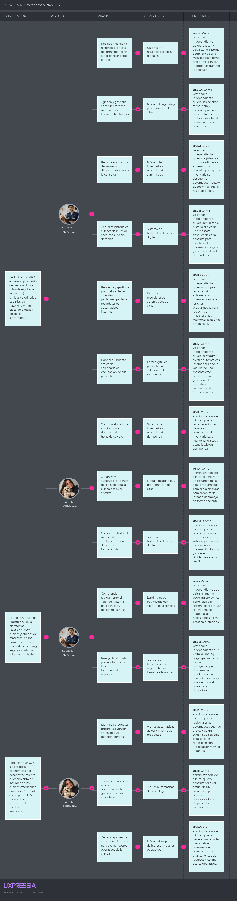

</div>

<br>

El Impact Mapping nos permitió conectar los objetivos de negocio con el comportamiento esperado de los usuarios. A partir de los User Personas, identificamos qué acciones deben realizar para lograr los objetivos, y definimos funcionalidades concretas que luego se traducen en User Stories dentro del Product Backlog.

<br>

---

## 3.3. Product Backlog

>*El Product Backlog constituye el artefacto central de gestión del proyecto Pawtient, en el que se registra de forma ordenada y priorizada el conjunto completo de funcionalidades, mejoras y requerimientos técnicos que el sistema debe satisfacer. Cada ítem se representa mediante una historia de usuario o historia técnica, estimada en Story Points según la escala Fibonacci (1, 2, 3, 5), lo que permite al equipo planificar iteraciones de manera objetiva y transparente. El backlog se organiza atendiendo al valor que cada historia aporta al segmento objetivo —administradores de clínica veterinaria y veterinarios independientes— y refleja el estado de priorización acordado con el Product Owner al cierre de la presente versión.*

Los Story Points siguen la escala Fibonacci sin superar 5 por historia (1, 2, 3, 5).

<br>

**Total de historias: 43**
**Total de Story Points: 137**

<br>

| # | Story ID | Título | Descripción | Story Points |
|:---:|:---:|:---|:---|:---:|
| 1 | TS01 | Endpoint de autenticación de usuarios | Implementar endpoint POST /api/v1/auth/login en Spring Boot que valide credenciales y devuelva un token JWT. | 3 |
| 2 | US01 | Registrar cuenta como administrador de clínica o veterinario independiente | Como administrador de clínica o veterinario independiente, quiero crear una cuenta en Pawtient con mis datos profesionales para acceder a las funcionalidades de gestión clínica. | 3 |
| 3 | US02 | Iniciar sesión en la plataforma | Como administrador de clínica o veterinario independiente, quiero iniciar sesión con mis credenciales para acceder a las funcionalidades de gestión clínica según mi perfil. | 2 |
| 4 | US03 | Recuperar contraseña olvidada | Como administrador de clínica o veterinario independiente, quiero recuperar el acceso a mi cuenta en caso de olvidar mi contraseña para no perder el acceso a la plataforma. | 2 |
| 5 | TS10 | Implementar servicio de autenticación en Angular | Implementar un AuthService en Angular que gestione login, logout y almacenamiento del token JWT para centralizar la autenticación en la aplicación. | 3 |
| 6 | TS06 | Configurar JSON Server con datos de autenticación simulados | Configurar un JSON Server con datos de usuarios y tokens simulados para que el equipo pueda desarrollar el flujo de login sin depender del backend real. | 2 |
| 7 | TS02A | Endpoint de historia clínica – validaciones y estructura | Implementar las validaciones del endpoint POST /api/v1/records en Spring Boot para garantizar que solo se persistan registros con datos completos y token válido. | 3 |
| 8 | TS02B | Endpoint de historia clínica – persistencia y respuesta | Implementar la lógica de persistencia del endpoint POST /api/v1/records para que las historias clínicas se almacenen correctamente y el frontend reciba confirmación. | 3 |
| 9 | US04A | Registrar historia clínica – formulario y validaciones | Como administrador de clínica o veterinario independiente, quiero completar el formulario de historia clínica con validaciones en tiempo real para asegurar que todos los datos obligatorios estén correctos antes de guardar. | 3 |
| 10 | US04B | Registrar historia clínica – persistencia y confirmación | Como administrador de clínica o veterinario independiente, quiero que la historia clínica se guarde correctamente en el sistema y recibir confirmación del registro para tener certeza de que la información quedó almacenada. | 3 |
| 11 | US05 | Consultar historial médico de una mascota | Como administrador de clínica o veterinario independiente, quiero buscar y visualizar el historial completo de una mascota para tomar decisiones clínicas informadas durante la consulta. | 3 |
| 12 | US06 | Editar y actualizar historia clínica | Como administrador de clínica o veterinario independiente, quiero actualizar la historia clínica de una mascota después de cada consulta para mantener la información vigente y con trazabilidad de cambios. | 3 |
| 13 | US07 | Registrar vacunas aplicadas | Como administrador de clínica o veterinario independiente, quiero registrar cada vacuna aplicada durante una consulta vinculándola al historial de la mascota para mantener un calendario de vacunación actualizado. | 3 |
| 14 | TS07 | Datos simulados de historiales clínicos y mascotas | Proveer endpoints simulados de historiales clínicos y mascotas en JSON Server para desarrollar y probar los componentes de visualización y registro. | 2 |
| 15 | TS11A | Módulo de historiales en Angular – listado y búsqueda | Implementar el componente de listado y búsqueda del módulo de historiales clínicos en Angular para que los profesionales encuentren registros de forma eficiente. | 3 |
| 16 | TS11B | Módulo de historiales en Angular – creación y edición | Implementar los formularios de creación y edición del módulo de historiales en Angular para que los profesionales gestionen registros médicos sin recargar la página. | 3 |
| 17 | TS03A | Endpoint de citas – validación de disponibilidad | Implementar la validación de disponibilidad en el endpoint POST /api/v1/appointments para evitar conflictos de horario antes de registrar la cita. | 3 |
| 18 | TS03B | Endpoint de citas – registro transaccional y respuesta | Implementar el registro transaccional de citas en el endpoint POST /api/v1/appointments para garantizar consistencia de datos y retornar la cita creada al frontend. | 3 |
| 19 | US08A | Agendar cita – selección y validación de horario | Como administrador de clínica o veterinario independiente, quiero seleccionar fecha, hora y mascota para una nueva cita y verificar la disponibilidad del horario antes de confirmar. | 3 |
| 20 | US08B | Agendar cita – confirmación y registro en agenda | Como administrador de clínica o veterinario independiente, quiero confirmar el registro de la cita y que quede visible de inmediato en la agenda del sistema para que todo el equipo esté informado. | 2 |
| 21 | US09A | Editar cita agendada – selección y validación de nuevo horario | Como administrador de clínica o veterinario independiente, quiero modificar el horario de una cita ya registrada y verificar la disponibilidad del nuevo horario antes de confirmar el cambio. | 3 |
| 22 | US09B | Editar cita agendada – confirmación y cancelación | Como administrador de clínica o veterinario independiente, quiero confirmar el cambio de horario de una cita o cancelarla desde el sistema para mantener la agenda actualizada en todo momento. | 2 |
| 23 | US10 | Visualizar agenda del día | Como administrador de clínica o veterinario independiente, quiero ver un resumen de las citas programadas para el día en curso para organizar mi jornada de trabajo de forma eficiente. | 2 |
| 24 | US11 | Configurar recordatorios de citas | Como administrador de clínica o veterinario independiente, quiero configurar recordatorios automáticos internos previos a las citas programadas para reducir las inasistencias y mantener la agenda organizada. | 2 |
| 25 | TS08 | Datos simulados de citas e inventario | Proveer endpoints simulados de citas e inventario en JSON Server para que los componentes de agenda y trazabilidad puedan desarrollarse de forma independiente. | 2 |
| 26 | TS12A | Módulo de citas en Angular – agenda diaria y disponibilidad | Implementar la vista de agenda diaria y la verificación de disponibilidad de horarios en el módulo de citas en Angular. | 3 |
| 27 | TS12B | Módulo de citas en Angular – confirmación y cancelación | Implementar los flujos de confirmación y cancelación de citas en Angular para que la agenda se actualice reactivamente sin recargar la página. | 3 |
| 28 | TS04 | Endpoints de gestión de inventario | Implementar endpoints GET /api/v1/inventory y POST /api/v1/inventory en Spring Boot para que el módulo de trazabilidad de suministros opere correctamente. | 3 |
| 29 | US12 | Registrar ingreso de suministros | Como administrador de clínica o veterinario independiente, quiero registrar el ingreso de nuevos suministros al inventario para mantener el stock actualizado en tiempo real. | 3 |
| 30 | US13 | Consultar niveles de stock | Como administrador de clínica o veterinario independiente, quiero consultar el nivel actual de un suministro para verificar disponibilidad antes de prescribir un tratamiento. | 2 |
| 31 | US14A | Registrar consumo de suministros – descuento de inventario | Como administrador de clínica o veterinario independiente, quiero registrar los insumos utilizados al cerrar una consulta para que el inventario se descuente automáticamente y quede vinculado al historial clínico. | 3 |
| 32 | US14B | Registrar consumo de suministros – reporte mensual | Como administrador de clínica o veterinario independiente, quiero generar un reporte mensual del consumo de suministros para analizar el uso de recursos y estimar costos operativos. | 3 |
| 33 | US15 | Generar alertas de reabastecimiento | Como administrador de clínica o veterinario independiente, quiero recibir alertas automáticas cuando el stock de un suministro sea bajo para solicitar reposición con anticipación y evitar faltantes. | 2 |
| 34 | TS13A | Módulo de inventario en Angular – listado y alertas | Implementar el listado de suministros con indicadores de stock bajo y alertas de vencimiento en el módulo de inventario en Angular. | 3 |
| 35 | TS13B | Módulo de inventario en Angular – registro de ingresos | Implementar el formulario de registro de ingresos de suministros en Angular para que el stock se actualice reactivamente tras cada entrada. | 2 |
| 36 | US16 | Registrar mascota en el sistema | Como administrador de clínica o veterinario independiente, quiero registrar el perfil de una mascota en la plataforma para centralizar su información médica y acceder a ella durante cualquier consulta. | 3 |
| 37 | US17 | Consultar historial médico de una mascota atendida en otra clínica | Como administrador de clínica o veterinario independiente, quiero consultar el historial médico de una mascota atendida en otra clínica registrada en Pawtient para contar con información clínica relevante antes de la consulta. | 3 |
| 38 | US18A | Buscar mascotas registradas – búsqueda y listado | Como administrador de clínica o veterinario independiente, quiero buscar mascotas registradas en el sistema para ver un listado con su información básica y acceder rápidamente a su perfil. | 2 |
| 39 | US18B | Buscar mascotas registradas – filtro y detalle | Como administrador de clínica o veterinario independiente, quiero filtrar los resultados de búsqueda por especie, raza o estado clínico y ver el detalle de cada mascota para tomar decisiones informadas antes de la consulta. | 2 |
| 40 | TS05A | Endpoint de notificaciones internas – validaciones | Implementar las validaciones del endpoint POST /api/v1/notifications/send para rechazar peticiones con datos incorrectos antes de encolar la notificación interna. | 2 |
| 41 | TS05B | Endpoint de notificaciones internas – encolado y respuesta | Implementar la lógica de encolado del endpoint POST /api/v1/notifications/send para que las notificaciones internas se registren correctamente y el frontend reciba confirmación. | 3 |
| 42 | US19 | Configurar recordatorios de vacunación | Como administrador de clínica o veterinario independiente, quiero configurar alertas automáticas internas cuando la vacuna de una mascota esté próxima para gestionar el calendario de vacunación de forma proactiva. | 2 |
| 43 | US20 | Configurar preferencias de notificación | Como administrador de clínica o veterinario independiente, quiero personalizar el tipo y frecuencia de notificaciones internas que recibo para gestionar las alertas del sistema según las necesidades de mi práctica. | 2 |
| 44 | US21 | Registrar notas de seguimiento y resultados de exámenes | Como administrador de clínica o veterinario independiente, quiero registrar notas de seguimiento y resultados de exámenes en el historial de una mascota para mantener el registro clínico completo y actualizado después de cada consulta. | 3 |
| 45 | TS09 | Datos simulados de notificaciones y configuración | Proveer endpoints simulados de notificaciones internas y preferencias en JSON Server para desarrollar el centro de alertas y la configuración del profesional. | 2 |
| 46 | TS14 | Implementar módulo de notificaciones en Angular | Implementar el módulo de notificaciones internas en Angular con centro de alertas y configuración de preferencias para que los profesionales gestionen sus alertas clínicas. | 3 |
| 47 | US22 | Propuesta de valor para clínicas y veterinarios independientes | Como profesional que visita la landing page, quiero ver los beneficios del sistema para evaluar si Pawtient se adapta a las necesidades de mi práctica profesional. | 2 |
| 48 | US23 | Información general de la plataforma en la landing page | Como profesional que visita la landing page, quiero entender el alcance y las funcionalidades principales de Pawtient para decidir si me registro en la plataforma. | 2 |
| 49 | US24 | Navegar entre secciones de la landing page | Como profesional que visita la landing page, quiero usar el menú de navegación para desplazarme rápidamente a cualquier sección y conocer todo el contenido disponible. | 1 |
| 50 | US25 | Ver preguntas frecuentes en la landing page | Como profesional que visita la landing page, quiero consultar las preguntas frecuentes para resolver dudas antes de registrarme sin necesidad de contactar al equipo de soporte. | 1 |

<br>

<div align="center">
  
**Herramienta utilizada:** `Jira`

**URL del Product Backlog:** [Ver Product Backlog en Jira](https://briupalace.atlassian.net/jira/software/projects/PAW/boards/2/backlog?atlOrigin=eyJpIjoiMTE0ZjJmNThkNjBhNDQyNzkwMzI2YTJiMzJkNjRiN2MiLCJwIjoiaiJ9)

<br>

*Captura del Product Backlog en herramienta*


</div>

<br>

### Criterios de priorización aplicados

<br>

El orden del backlog responde a los siguientes criterios en cascada:

1. **Infraestructura base (autenticación):** Las historias de registro, inicio de sesión y recuperación de contraseña (US01–US03) junto con su soporte técnico (TS01, TS06, TS10) se priorizan primero porque son el prerequisito técnico de toda la plataforma. Sin autenticación funcional ningún otro módulo puede operar de forma segura.

2. **Core del negocio (historiales clínicos):** Las historias del módulo de historiales (US04A, US04B, US05, US06, US07) y su soporte técnico (TS02A, TS02B, TS07, TS11A, TS11B) se priorizan a continuación por ser el diferencial central de Pawtient. Centralizar los registros médicos digitales es la propuesta de valor principal para ambos segmentos objetivo.

3. **Gestión operativa (citas y agenda):** Las historias del módulo de citas (US08A, US08B, US09A, US09B, US10, US11) y su soporte técnico (TS03A, TS03B, TS08, TS12A, TS12B) se ubican en tercer lugar por su impacto directo en la eficiencia operativa diaria de la clínica y la reducción de errores administrativos.

4. **Trazabilidad de inventario:** Las historias del módulo de suministros (US12, US13, US14A, US14B, US15) y su soporte técnico (TS04, TS13A, TS13B) se ubican en posición media por ser críticas para el control operativo de la clínica, aunque de menor urgencia que los módulos de historiales y citas.

5. **Perfiles de mascotas:** Las historias de registro y búsqueda de mascotas (US16, US17, US18A, US18B) se ubican en posición media-baja por ser funcionalidad de soporte sobre los módulos ya establecidos. Su valor depende de que los módulos anteriores estén operativos.

6. **Seguimiento clínico y notificaciones:** Las historias de recordatorios, vacunación y registro de seguimiento (US19, US20, US21) y su soporte técnico (TS05A, TS05B, TS09, TS14) se ubican hacia el final de las historias funcionales por ser mejoras sobre funcionalidad ya establecida que incrementan el valor de la plataforma sin ser bloqueantes.

7. **Landing page:** Las historias de presentación de la plataforma (US22–US25) se ubican al cierre del backlog funcional porque no dependen de ningún otro módulo del sistema, pueden desarrollarse en paralelo en cualquier momento y no bloquean la entrega de valor al usuario interno de la plataforma.

<br>

---

<div align="center">

# Capítulo IV: Product Design

</div>

---

## 4.1. Style Guidelines

### 4.1.1. General Style Guidelines

Las decisiones de estilo de Pawtient se basan en la necesidad de transmitir confianza, cercanía y profesionalismo en el contexto del cuidado de mascotas y la gestión de clínicas veterinarias. Se busca una interfaz clara, accesible y consistente, que facilite la interacción tanto de veterinarios como del personal administrativo.

<br>

### Branding

El branding de Pawtient está orientado a representar el cuidado y bienestar de las mascotas a través de una identidad visual moderna y amigable.

El nombre Pawtient surge de la combinación de “Paw” (pata) y “Patient” (paciente), haciendo referencia directa a las mascotas como los pacientes principales del sistema.

El logotipo de *Pawtient* está compuesto por una tipografía sans-serif moderna y amigable, que transmite claridad, accesibilidad y confianza, valores fundamentales en el contexto de la gestión clínica veterinaria.

El elemento distintivo del logotipo es la integración de una huella de mascota dentro de la letra inicial “P”, la cual funciona como isotipo. Este recurso visual refuerza de manera directa el enfoque del sistema en el cuidado de animales, permitiendo una identificación inmediata por parte del usuario.

En cuanto a la paleta de colores, el logotipo utiliza una combinación de azul y verde. El azul (#3A86FF) representa confianza, profesionalismo y seguridad en el manejo de la información, mientras que el verde (#2ECC71) evoca salud, bienestar y conexión con el cuidado de las mascotas. Esta combinación cromática genera un equilibrio visual que comunica tanto el aspecto clínico como el humano del producto.

El diseño del logotipo ha sido concebido para ser versátil y escalable, asegurando su correcta visualización en diferentes contextos, como interfaces web, aplicaciones móviles, iconos y material gráfico. Asimismo, el isotipo puede utilizarse de forma independiente en espacios reducidos, como favicon o elementos de navegación.


Los principios de identidad visual se centran en:
- Cercanía con el usuario
- Claridad en la comunicación
- Profesionalismo en el entorno clínico
- Confianza en el manejo de información

<br>

### Typography

| Tipo |   Fuente    | Uso |
|:-----|:-----------:|:----|
| Display / Heading |   Poppins   | Títulos y encabezados |
| Body |    Inter    | Texto de contenido |
| Monospace | Roboto Mono | Código y datos técnicos |


Estas tipografías fueron seleccionadas por su alta legibilidad en entornos digitales y su compatibilidad con interfaces modernas.

<br>

### Colors

| Nombre | Hex | Uso                                |
|:-------|:---:|:-----------------------------------|
| Primary | #3A86FF | Color principal de la marca        |
| Secondary | #2ECC71 | Color de apoyo (salud y bienestar) |
| Accent | #FF9F1C | Énfasis y llamados a la acción     |
| Background | #F5F5F5 | Fondo general                      |
| Text | #2E2E2E | Texto principal                    |
| Error | #E63946 | Estados de error                   |
| Success | #2ECC71 | Estados de éxito                   |


La paleta busca generar una experiencia visual equilibrada, transmitiendo seguridad, limpieza y accesibilidad.

<br>

### Spacing

El sistema de espaciado de *Pawtient* se basa en una unidad base de **8px**, siguiendo buenas prácticas de diseño UI modernas.

Se utilizan múltiplos de esta unidad para mantener consistencia:
- 8px → separación mínima
- 16px → separación estándar
- 24px / 32px → separación entre secciones
- 48px+ → separación de bloques principales

Esto permite una interfaz ordenada, clara y fácil de escanear visualmente.

<br>


### Tono de comunicación

| Dimensión |             Selección             |
|:----------|:---------------------------------:|
| Divertido / Serio |  Equilibrado (ligeramente serio)  |
| Formal / Casual |            Semi-formal            |
| Respetuoso / Irreverente |            Respetuoso             |
| Entusiasta / Sereno | Sereno con toques positivos |

El tono busca generar confianza en un entorno clínico, sin perder cercanía con los usuarios.

<br>

---

### 4.1.2. Web Style Guidelines

Las Web Style Guidelines de Pawtient definen los estándares visuales y de interacción para garantizar una experiencia consistente en la aplicación web.

<br>

### Diseño Responsive 

La aplicación se adapta a distintos dispositivos:
- Desktop
- Tablet
- Mobile

Se prioriza la usabilidad en pantallas pequeñas, asegurando navegación fluida y contenido legible.

<br>

### Componentes del sistema

Los componentes del sistema de *Pawtient* han sido diseñados siguiendo principios de simplicidad, consistencia y reutilización, tomando como referencia Material Design y adaptándose a la identidad visual del producto.

- **Navbar (Barra de navegación):**  
  Ubicada en la parte superior, permite el acceso a secciones principales como Inicio, Servicios, Nosotros y Contacto. Mantiene una estructura limpia y fija para facilitar la navegación.

- **Buttons (Botones):**  
  Botones con bordes ligeramente redondeados y estilos definidos (primary, secondary).
    - Primary: color azul (#3A86FF) para acciones principales
    - Secondary: verde (#2ECC71) para acciones complementarias  
      Incluyen estados: hover, active y disabled.

- **Hero Section:**  
  Sección principal de bienvenida con título destacado, subtítulo y call-to-action (CTA), diseñada para captar la atención del usuario y comunicar el valor del sistema.

- **Cards:**  
  Utilizadas para mostrar información estructurada como servicios, mascotas o funcionalidades. Incluyen imagen, título y descripción breve.

- **Forms (Formularios):**  
  Inputs claros con etiquetas visibles y validaciones en tiempo real. Se utilizan para registro, inicio de sesión y gestión de datos.

- **Icons (Iconos):**  
  Basados en representaciones simples y reconocibles (usuario, menú, mascota), alineados con el estilo minimalista del sistema.

<br>

### Interacciones

Las interacciones en Pawtient están diseñadas para ser intuitivas, fluidas y consistentes, mejorando la experiencia del usuario sin sobrecargar la interfaz.

- **Hover states:**  
  Los elementos interactivos (botones, links, cards) cambian sutilmente de color o elevación al pasar el cursor.

- **Feedback visual:**  
  El sistema muestra respuestas inmediatas a las acciones del usuario, como mensajes de éxito, error o carga.

- **Transiciones suaves:**  
  Se utilizan animaciones ligeras para cambios de estado, navegación o aparición de componentes.

- **Responsive interactions:**  
  En dispositivos móviles, se priorizan interacciones táctiles claras, como botones grandes y menús desplegables.

- **Call To Action (CTA):**  
  Botones destacados como “Comenzar gratis” guían al usuario hacia las acciones principales del sistema.

<br>

### Design System

El diseño de *Pawtient* se basa en un sistema de diseño modular que garantiza consistencia visual y escalabilidad en toda la aplicación.

Se toman como referencia los principios de **Material Design**, adaptados a la identidad del producto.

- **Grid system:**  
  Uso de grillas flexibles para organizar el contenido en diferentes resoluciones (desktop, tablet y mobile).

- **Spacing system:**  
  Basado en una unidad de 8px para mantener consistencia en márgenes y paddings.

- **Color system:**  
  Aplicación coherente de la paleta definida (primary, secondary, accent, neutrals) en todos los componentes.

- **Typography system:**  
  Uso consistente de jerarquías tipográficas (heading, subheading, body) para mejorar la legibilidad.

- **Component-based design:**  
  Todos los elementos UI (botones, cards, forms) son reutilizables, permitiendo mantener coherencia y facilitar el desarrollo en Angular.


<br>

---
## 4.2. Information Architecture

En nuestra aplicación Pawtient nos basamos en un enfoque centrado en el usuario, diferenciando claramanete la experiencia de captación en la Landing Page de la experiencia operativa en la Web Application.

Para la Landing Page, se ha optado por una estructura narrativa que guía al usuario a traves de toda la aplicación para guiarlo de una buena manera, centrandonos en el objetivo
de ayudar a estos usuarios como una guía de lo que ofrecemos en los planes de membresia, en esta App priorizamos la claridad visual y la confianza hacia el usuario.
Para esta Web Application, la organización es funcional y modular, permitiendo a veterinarios y administradores acceder a las herramientas de regirstro e inventario con la menor cantidad de clics
posibles, optimizando asi los procesos diarios.

<br>

### 4.2.1. Organization Systems

Se utiliza un sistema de organización jerárquica para la Landing Page, permitiendo que el usuario entienda primero la propuesta de valor y luego baje
hacia los detalles de servicios y planes. Para la Web Application, se aplica un sistema orientado a tareas, facilitando que el veterinario acceda directamente a las funciones
de registro clínico e inventario.

<br>

### 4.2.2. Labeling Systems


|  Etiqueta   | Descripción del contenido que representa                 |
|:-----------:|:---------------------------------------------------------|
|  `Inicio`   | Página principal con la propuesta de valor de Pawtient.  |
| `Servicios` | Detalle de las funcionalidades (Historial, Insumo, IoT). |
| `Membresía` | Planes de Suscripción (Basic, Mid, Pro) y beneficios     |
| `Contacto`  | Formulario para soporte y consultas de nuevos centros    |

<br>

### 4.2.3. SEO Tags and Meta Tags

**Landing Page**

```html
<title>Pawtient - Gestión Veterinaria Inteligente e Integral</title>
<meta name="description" content="Plataforma para digitalizar centros veterinarios, gestionar historiales clínicos" />
<meta name="keywords" content="veterinaria, gestión clínica, historiales médicos,control de insumos, software veterinario" />
<meta name="author" content="PetHealth" />
```

**Web Application**

```html
<title>[Título de la Web Application]</title>
<meta name="description" content="Panel de administración para veterinarios: registro clínico, control de inventario de insumos" />
<meta name="keywords" content="gestión veterinaria, dashboard, historial clínico digital" />
<meta name="author" content="PetHealth" />
```

<br>

### 4.2.4. Searching Systems


El sistema de búsqueda en Pawtient está diseñado para ser reactivo y eficiente. Se implementará una barra de búsqueda global en el DashBoard que permitirá a los veterianos encontrar
pacientes por nombre de la mascota, nombre del dueño o DNI del usuario. Ademas, se incluirán filtros avanzados en la sección de inventario para categorizar insumos por tipo. 

<br>

### 4.2.5. Navigation Systems


Se han definido tres sistemas de navegación principales para garantizar la usabilidad:

* Navegación Estructural (Menús):La Landing Page utiliza un menú superior fijo con enlaces ancla a las secciones de beneficios y precios. La Web Application utiliza una barra lateral con iconos reconocibles para el acceso rápido.
* Navegación Asociativa: Se incluyen botones de 'Llamada a la Acción' (CTA) estratégicos como 'Comenzar gratis' para convertir visitantes en usuarios.
* Navegación de Utilidad: Un menú de perfil de usuario en la esquina superior derecha para gestionar la configuración de la cuenta y el cierre de sesión, manteniendo la consistencia visual mediante el uso de avatars."

<br>

---

## 4.3. Landing Page UI Design


### 4.3.1. Landing Page Wireframe

En esta sección se presenta los wireframes de la versión Desktop de la Landing page, donde se observa la estructura
que tiene esta landing, como diversos apartados en donde el usuario pueda interacturar de manera autonoma y con una interfaz fácil de usar.

<br>

**Desktop Web Browser**


<br>

**Mobile Web Browser**


<br>

### 4.3.2. Landing Page Mock-up


En este apartado se muestra todos los Mocku-ups de nuestra App web, tanto desktop como mobile tienen una interfaz la cual es agradable para el usuario,
además de ser fácil de poder utilizar, cumple con el objetivo que nosotros queremos ofrecer, asimismo sigue un lineamiento usando
diversos tipos de colores, tipografías, etc.

<br>

**Desktop Web Browser**


<br>

**Mobile Web Browser**


<br>

---

## 4.4. Web Applications UX/UI Design

### 4.4.1. Web Applications Wireframes

**Panorama Completo de los WireFrames Desktop and Mobile**


<br>

### 4.4.2. Web Applications Wireflow Diagrams

En esta sección usamos los Wireframes. El objetivos es mostrar la lógica que queremos transmitir para nuestros usuarios

<br>

**User goal: `[Usuario y selección de Perfil]`**

El Wireflow describe la transición jerárquica desde el punto de entrada público hacia la función de la aplicación. 
En este apartado se aplica un diseño de navegación lineal, el cual va a garantizar que el usuarios defina su rol
antes de poder acceder al sistema y realizar los debido servicios. 


<br>

---
### 4.4.3. Web Applications Mock-ups

**Panorama Completo de los Mock-ups Desktop and Mobile, teniendo en cuenta los diversos styles anteriormente puesto**


<br>

---

### 4.4.4. Web Applications User Flow Diagrams

**User goal: `[Usuario y selección de Perfil/ Elección de Membresia]`**

Los diagramas de User Flow presentados ilustran la lógica de navegación y la experiencia del usuario dentro de nuestro sistema
Pawtient, centrándose en el proceso crítico de elección de rol y la elección de membresia. Esta estructura de flujos asegura 
que la aplicación web mantenga la integridad de la base de datos y ofrezca una navegación intuitiva y segura en todo momento.


<br>

---

## 4.5. Web Applications Prototyping

**Prototipo Desktop**


[Ver video de prototipo Desktop en Microsoft Stream](`URL`)

**Prototipo Mobile**


[Ver video de prototipo Mobile en Microsoft Stream](`URL`)

<br>

---

## 4.6. Domain-Driven Software Architecture

### 4.6.1. Design-Level Event Storming

En esta sección se explica y evidencia el proceso de Design-Level EventStorming, que sirvió para plantear una aproximación revisada y mejorada al modelado de nivel general para el dominio del problema.

<br>

**IAM Bounded Context**


**Profile Bounded Context**


**Clinic Bounded Context**


**Appointment Bounded Context**


**Report Bounded Context**


**Store Bounded Context**


**Bounded Contexts y sus relaciones**


En este último paso, el equipo buscó agregados que estén relacionados entre sí mediante policies para luego identificar bounded contexts y finalmente marco los eventos de dominio que fueron implementados.

[Ver en miro](https://miro.com/welcomeonboard/TUM0Kzk0ajRxOXdpd1EzRXpwQjU1ckx6c3JPV2trSUxpQ2dLc0p6RFZjUEFwaXYvcHpOMTZGWHExOFpibXpLRHNURWF6Zko2b1NaM2FxTEJieCsvUElhMFUwdXIwNThuaWpBa3F4dzlXUklLaXA4dFFvZUY1VjRHVXhGcklxT3BNakdSWkpBejJWRjJhRnhhb1UwcS9BPT0hdjE=?share_link_id=798329479919)

<br>

---

### 4.6.2. Software Architecture Context Diagram

El diagrama de contexto del sistema Pawtient presenta una vista general del sistema dentro de su entorno, identificando los actores principales que interactúan con la plataforma y los sistemas externos con los que se integra.

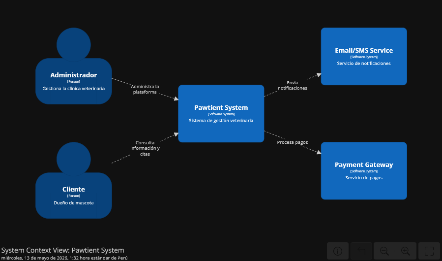

---
### 4.6.3. Software Architecture Container Diagrams

El diagrama de contenedores del sistema Pawtient presenta una vista de alto nivel de la arquitectura, mostrando los principales bloques tecnológicos y la forma en que interactúan entre sí.

El sistema está compuesto por una aplicación web (frontend), que permite la interacción de los usuarios mediante una interfaz intuitiva; un backend implementado como una API REST, encargado de procesar la lógica de negocio y gestionar las solicitudes; y una base de datos, donde se almacena la información del sistema, como usuarios, mascotas, citas e historiales médicos.

Asimismo, el sistema se integra con servicios externos para el envío de notificaciones y el procesamiento de pagos. La comunicación entre los contenedores se realiza mediante protocolos estándar, garantizando una arquitectura organizada, escalable y mantenible.

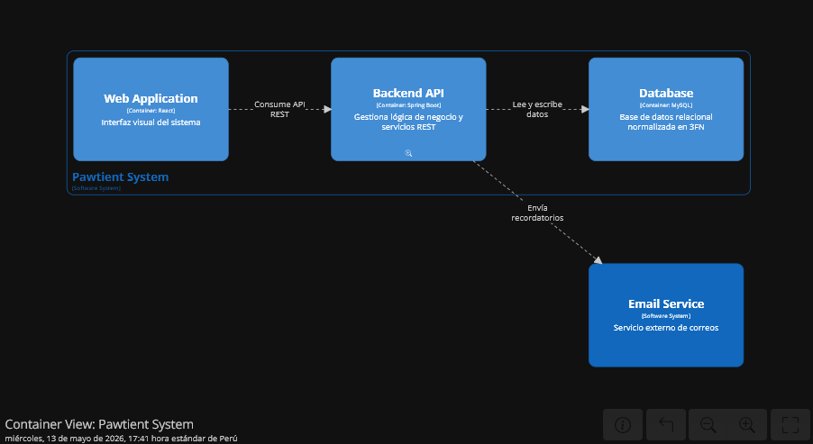

<br>

---

### 4.6.4. Software Architecture Components Diagrams

Los diagramas de componentes del sistema Pawtient representan la estructura interna del backend siguiendo el enfoque de Domain-Driven Design (DDD). La arquitectura se organiza en distintos Bounded Contexts, cada uno enfocado en una responsabilidad específica del sistema: IAM, Profile, Organization, Monitoring and Control, y Reports.

Dentro de cada Bounded Context, los componentes se estructuran en cuatro capas principales: Interfaces, Application, Domain e Infrastructure. La capa de Interfaces gestiona la interacción con los usuarios a través de endpoints REST; la capa de Application coordina la lógica de negocio y los casos de uso; la capa de Domain contiene las entidades y reglas de negocio; y la capa de Infrastructure se encarga de la persistencia de datos mediante repositorios. 

La interacción entre estas capas sigue un flujo definido donde la capa de Interfaces invoca los servicios de Application, los cuales utilizan el Domain para ejecutar la lógica de negocio y la Infrastructure para acceder a la base de datos. Este enfoque permite una clara separación de responsabilidades, facilitando la escalabilidad, mantenibilidad y evolución del sistema.

  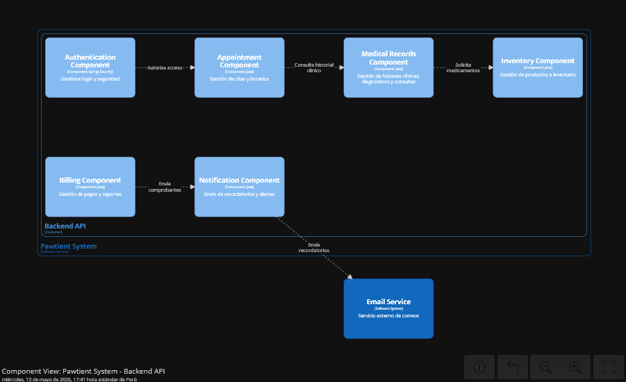
  
- Organization Bounded Context
  
- Monitoring and Control Bounded Context
  
- Reports Bounded Context
  
- Profile Bounded Context
  
- IAM Bounded Context
  

<br>

---

## 4.7. Software Object-Oriented Design

>*En esta sección se presenta el diseño orientado a objetos del sistema Pawtient mediante diagramas de clases UML, los cuales describen la estructura interna de sus componentes. El diseño se basa en los enfoques Domain-Driven Design (DDD) y el modelo C4, organizando el sistema en distintos bounded contexts como IAM, Appointments, Clinical Management, Store, Reports y Profile.
Cada bounded context se estructura en capas (domain, application, infrastructure y presentation), lo que permite una adecuada separación de responsabilidades. Los diagramas incluyen clases con atributos, métodos y niveles de visibilidad, así como sus relaciones y multiplicidades. En conjunto, proporcionan una visión clara y estructurada del sistema, sirviendo como base para su implementación.*

<br>

### 4.7.1. Class Diagrams

A continuación, se presentan los diagramas de clases UML para cada bounded context del sistema Pawtient. Estos diagramas describen las clases, sus atributos, métodos y relaciones, diferenciando los componentes de frontend y backend.

Esta representación permite comprender la organización modular del sistema y la distribución de responsabilidades entre la interfaz de usuario y la lógica de negocio, asegurando coherencia con la arquitectura definida. El frontend está desarrollado en Vue.js con Pinia como manejador de estado, siguiendo una arquitectura en capas: domain, application, infrastructure y presentation. El backend está implementado en ASP .NET Core, organizando cada bounded context en entidades de dominio, comandos, servicios, repositorios y controladores REST.

<br>

**1. Bounded Context: `IAM (Identity & Access)`**

<br>

Este diagrama corresponde al Identity & Access Bounded Context, encargado de gestionar la autenticación y autorización de los usuarios dentro del sistema Pawtient. La entidad principal User administra la información esencial del usuario, incluyendo su identificador, nombre, correo electrónico, contraseña, rol y plan de suscripción. El sistema contempla dos roles: administrador de clínica (`admin`) y veterinario independiente (`freelancer`), los cuales determinan las funcionalidades disponibles dentro de la plataforma. El flujo de registro incluye la selección de plan de suscripción como paso posterior al registro de cuenta.

<br>
<div align="center">

**Frontend Components Diagrams**

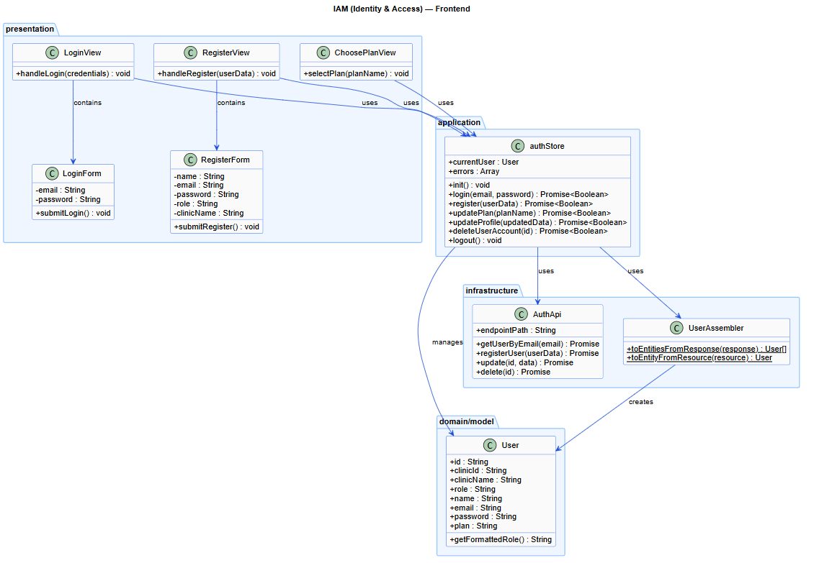

</div>
<br>

El módulo IAM en frontend permite a los usuarios registrarse, iniciar sesión y seleccionar su plan de suscripción. Incluye las vistas `LoginView`, `RegisterView` y `ChoosePlanView`, junto con los componentes `LoginForm` y `RegisterForm`. El `authStore` centraliza el estado de autenticación, gestiona la sesión mediante `localStorage` y coordina la comunicación con el backend a través de `AuthApi` y `UserAssembler`.

<br>
<div align="center">

**Backend Components Diagrams**

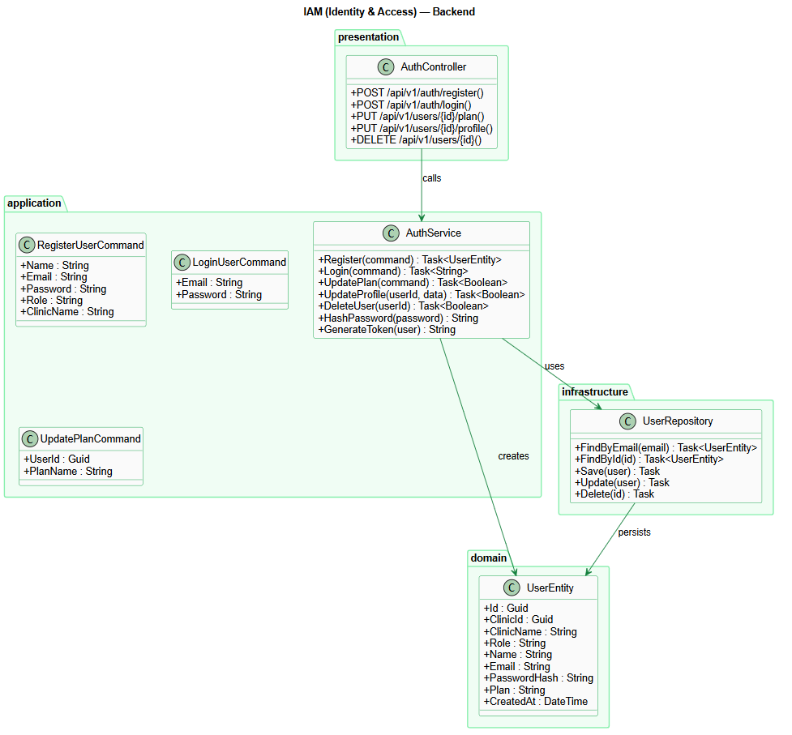

</div>
<br>

El módulo IAM en backend gestiona la lógica de autenticación y control de acceso. Implementa comandos como `RegisterUserCommand` y `LoginUserCommand`, procesados por `AuthService`, que se encarga del hash de contraseñas y la generación de tokens JWT. El `UserRepository` gestiona la persistencia de usuarios mediante Entity Framework Core, y el `AuthController` expone los endpoints REST de registro, login, actualización de plan y eliminación de cuenta.

<br>

**2. Bounded Context: `Appointment Management`**

<br>

Este diagrama corresponde al contexto de gestión de citas, responsable de administrar la programación, modificación y cancelación de citas médicas para los pacientes. La entidad principal `Appointment` contiene información clave como el nombre de la mascota, el responsable, la fecha, la hora, el estado de la cita, el motivo de consulta y el monto asociado. El sistema contempla el estado `scheduled` como valor por defecto, permitiendo llevar un control preciso del ciclo de vida de cada atención y filtrar citas pendientes en tiempo real mediante propiedades computadas.

<br>
<div align="center">

**Frontend Components Diagrams**

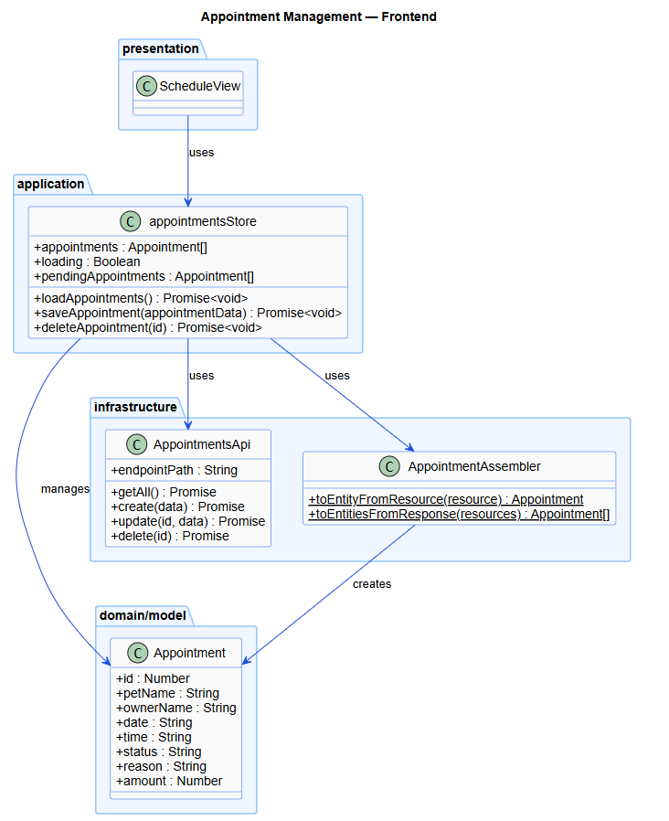

</div>
<br>

El módulo Appointments en frontend permite visualizar, registrar, editar y eliminar citas. El `appointmentsStore` gestiona el estado reactivo de las citas, expone la propiedad computada `pendingAppointments` para filtrar citas con estado `scheduled`, y coordina la comunicación con el backend a través de `AppointmentsApi` y `AppointmentAssembler`. La vista principal `ScheduleView` centraliza toda la interacción del usuario con la agenda.

<br>
<div align="center">

**Backend Components Diagrams**

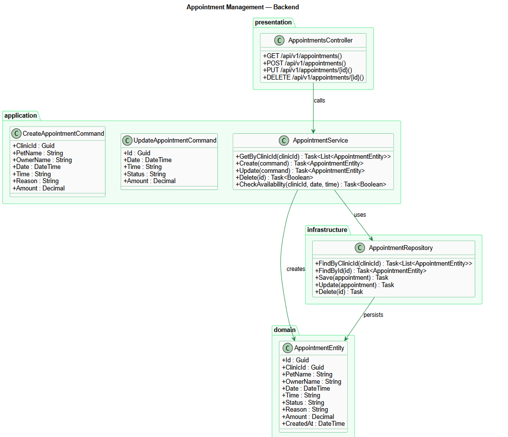

</div>
<br>

El módulo Appointments en backend gestiona la lógica de negocio relacionada con la programación de citas. Implementa los comandos `CreateAppointmentCommand` y `UpdateAppointmentCommand`, procesados por `AppointmentService`, que incluye la validación de disponibilidad de horarios. El `AppointmentRepository` gestiona la persistencia y el `AppointmentsController` expone los endpoints REST de consulta, creación, actualización y eliminación de citas.

<br>

**3. Bounded Context: `Clinical Management`**

<br>

Este diagrama corresponde al contexto principal de gestión clínica del sistema Pawtient. La entidad `Pet` representa al paciente veterinario, incluyendo nombre, tipo de especie, raza, edad y referencia al responsable. La entidad `Owner` almacena los datos de contacto del responsable de la mascota (nombre, DNI, teléfono) como dato administrativo sin acceso al sistema. Este contexto permite centralizar el registro y gestión de los pacientes de la clínica, facilitando el acceso rápido a su información durante cualquier consulta.

<br>
<div align="center">

**Frontend Components Diagrams**

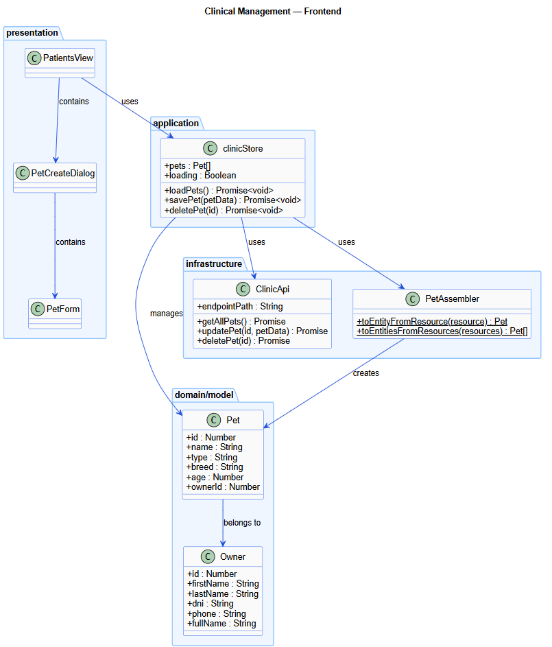

</div>
<br>

El módulo Clinical Management en frontend permite registrar, editar y eliminar mascotas. El `clinicStore` gestiona el estado reactivo de los pacientes, filtrando siempre por `clinicId` del usuario activo, y coordina la comunicación con el backend a través de `ClinicApi` y `PetAssembler`. La vista `PatientsView` centraliza el listado de pacientes e incorpora el componente `PetCreateDialog`, que contiene el formulario `PetForm` para el registro detallado de mascotas.

<br>
<div align="center">

**Backend Components Diagrams**

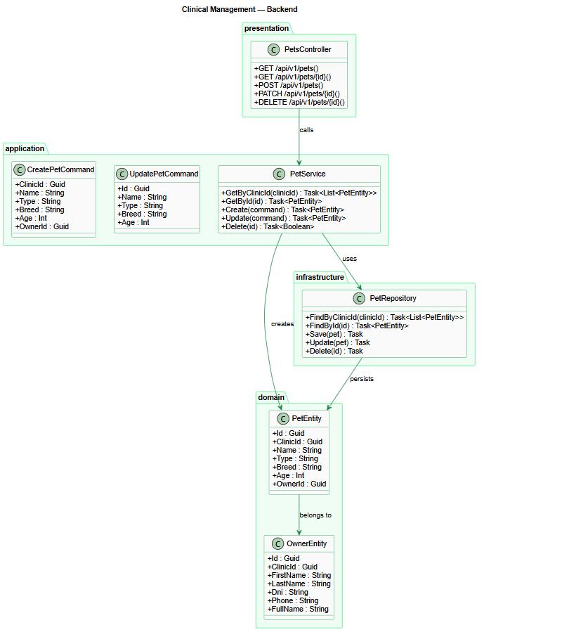

</div>
<br>

El módulo Clinical Management en backend gestiona la lógica de negocio relacionada con pacientes y sus responsables. Implementa los comandos `CreatePetCommand` y `UpdatePetCommand`, procesados por `PetService`. El `PetRepository` gestiona la persistencia de mascotas mediante Entity Framework Core, y el `PetsController` expone los endpoints REST de consulta, creación, actualización parcial (PATCH) y eliminación de pacientes.

<br>

**4. Bounded Context: `Store (Inventory)`**

<br>

Este diagrama corresponde al contexto de gestión de inventario, encargado de administrar los productos e insumos médicos y los proveedores de la clínica. La entidad `Product` contiene nombre, stock actual, stock mínimo y precio, e incluye el método de dominio `isLowStock()` para detectar alertas de reabastecimiento. La entidad `Supplier` registra los datos de contacto y categoría de cada proveedor. Ambas entidades se filtran por `clinicId` para garantizar el aislamiento de datos entre clínicas.

<br>
<div align="center">

**Frontend Components Diagrams**

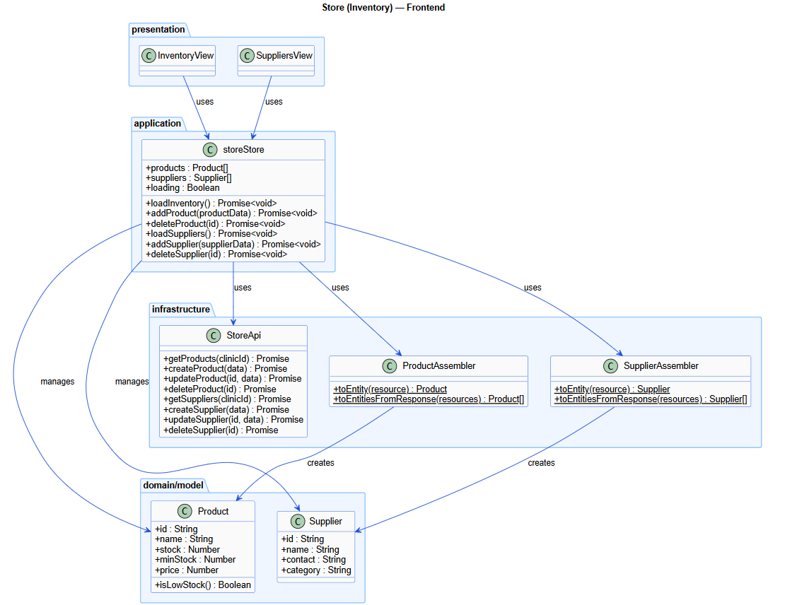

</div>
<br>

El módulo Store en frontend gestiona dos recursos independientes: productos e inventario, y proveedores. El `storeStore` centraliza el estado de ambos recursos y coordina la comunicación con el backend a través de `StoreApi`, `ProductAssembler` y `SupplierAssembler`. Las vistas `InventoryView` y `SuppliersView` permiten visualizar, crear, editar y eliminar productos y proveedores respectivamente, con soporte para alertas visuales de stock bajo basadas en el método `isLowStock()`.

<br>
<div align="center">

**Backend Components Diagrams**

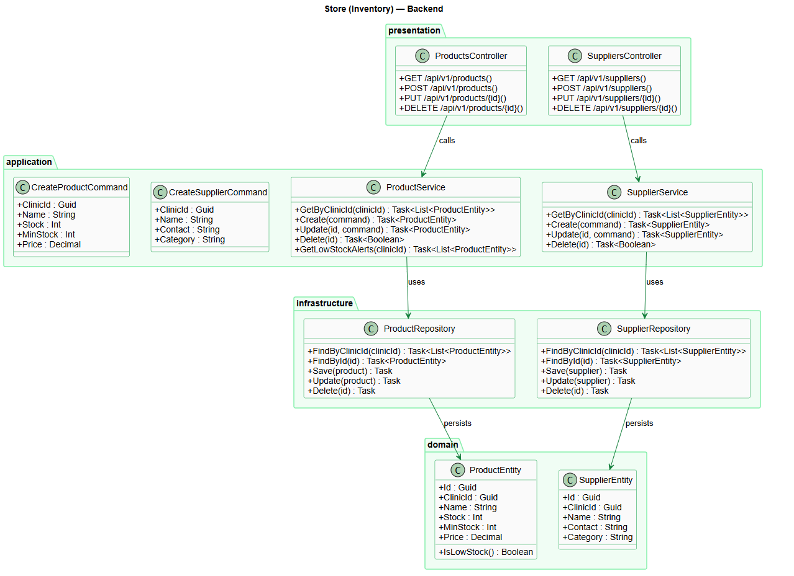

</div>
<br>

El módulo Store en backend gestiona la lógica de negocio de inventario y proveedores en servicios independientes. `ProductService` implementa la detección de stock bajo mediante `GetLowStockAlerts`, mientras que `SupplierService` gestiona el ciclo de vida completo de proveedores. Cada servicio cuenta con su propio repositorio (`ProductRepository`, `SupplierRepository`) y controlador REST (`ProductsController`, `SuppliersController`), manteniendo una separación clara de responsabilidades.

<br>

**5. Bounded Context: `Reports & Billing`**

<br>

Este diagrama corresponde al contexto de reportes y facturación, encargado de consolidar la información financiera y operativa de la clínica. La entidad `ReportSummary` agrega los indicadores clave del negocio: ingresos totales, gastos de inventario, rentabilidad neta, alertas de stock bajo y número de citas atendidas. La entidad `InvoiceEntity` registra las boletas de pago asociadas a cada atención, con soporte para generación y descarga de PDF mediante la librería jsPDF.

<br>
<div align="center">

**Frontend Components Diagrams**

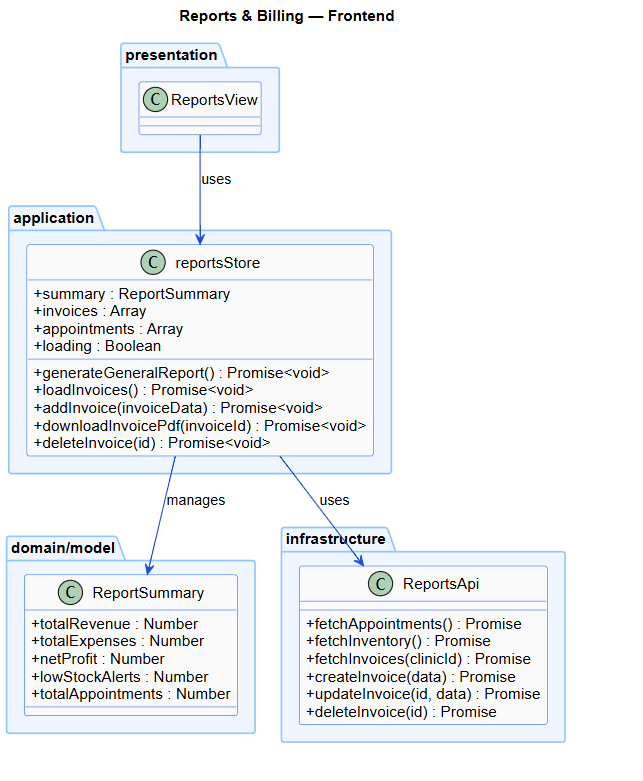

</div>
<br>

El módulo Reports en frontend consolida datos de múltiples bounded contexts para generar el reporte general de la clínica. El `reportsStore` combina información de citas e inventario para calcular el `ReportSummary`, gestiona el ciclo de vida de las boletas de pago y expone la función `downloadInvoicePdf` para la descarga de comprobantes en formato PDF. La vista `ReportsView` centraliza la visualización de KPIs y el historial de boletas.

<br>
<div align="center">

**Backend Components Diagrams**

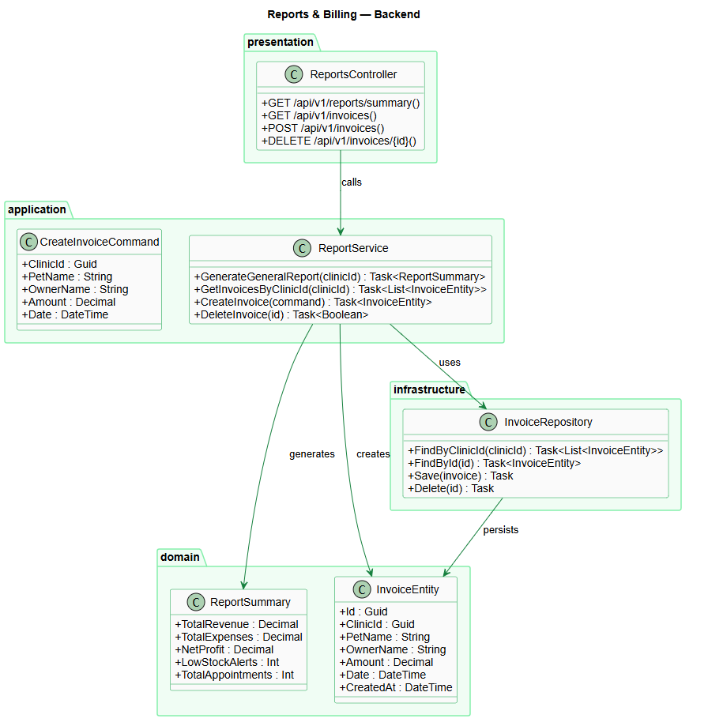

</div>
<br>

El módulo Reports en backend gestiona la generación de reportes financieros y el ciclo de vida de las boletas de pago. El `ReportService` consolida datos de citas e inventario para generar el `ReportSummary`, y gestiona la creación y eliminación de facturas a través del `InvoiceRepository`. El `ReportsController` expone endpoints REST para consultar el resumen general, listar boletas, registrar nuevos pagos y eliminar registros.

<br>

**6. Bounded Context: `Profile`**

<br>

Este diagrama corresponde al contexto de gestión de perfil de usuario, encargado de administrar la información personal de los profesionales registrados en el sistema. La entidad `Profile` almacena nombre, apellido, correo electrónico y dirección, derivada de campos separados (calle, número, ciudad) mediante lógica de dominio. Este contexto comparte el endpoint de usuarios con el bounded context IAM, dado que el perfil se construye sobre los datos del usuario autenticado.

<br>
<div align="center">

**Frontend Components Diagrams**

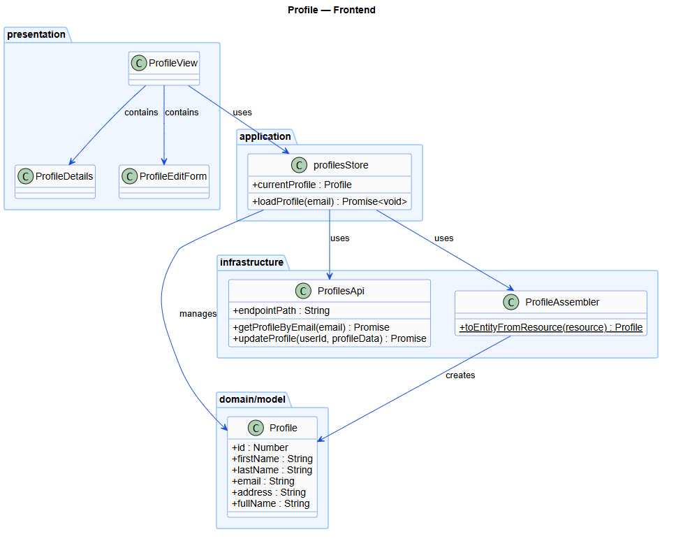

</div>
<br>

El módulo Profile en frontend permite visualizar y actualizar la información personal del profesional activo. El `profilesStore` carga el perfil por correo electrónico y coordina la comunicación con el backend a través de `ProfilesApi` y `ProfileAssembler`. La vista `ProfileView` integra los componentes `ProfileDetails` para la visualización y `ProfileEditForm` para la edición de datos.

<br>
<div align="center">

**Backend Components Diagrams**

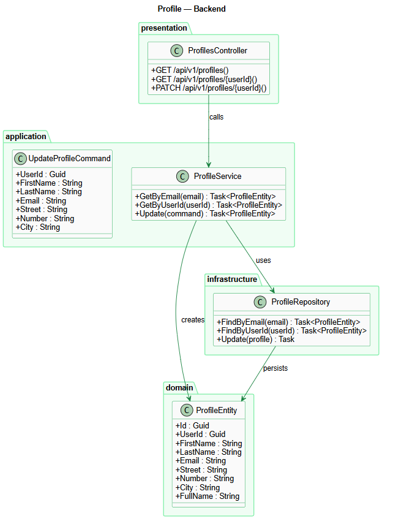

</div>
<br>

El módulo Profile en backend gestiona la lógica de actualización de perfiles de usuario. El `ProfileService` expone operaciones de consulta por correo electrónico y por identificador de usuario, y delega la persistencia en el `ProfileRepository`. El `ProfilesController` expone endpoints REST para consultar y actualizar el perfil del profesional autenticado mediante operaciones PATCH.

<br>

<div align="center">

**Shared Frontend Diagram**

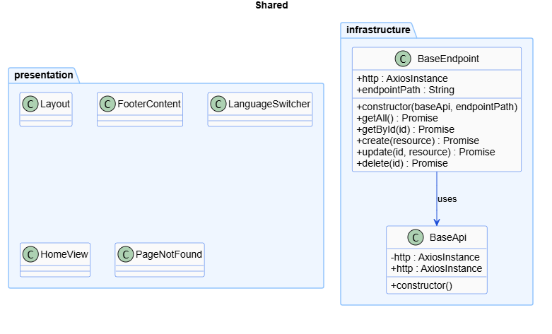

</div>
<br>

El módulo compartido (`shared`) provee la infraestructura base de comunicación HTTP para todos los bounded contexts del frontend. `BaseApi` encapsula la instancia de Axios configurada con la URL base del entorno, mientras que `BaseEndpoint` estandariza las operaciones CRUD (`getAll`, `getById`, `create`, `update`, `delete`) que heredan todas las clases de API del sistema. Las vistas compartidas incluyen `Layout` con el sidebar de navegación, `HomeView` como pantalla de inicio post-login, `LanguageSwitcher` para soporte multiidioma y `PageNotFound` para el manejo de rutas inexistentes.

<br>

---

## 4.8. Database Design

>*En esta sección se presenta el diseño de la base de datos del sistema Pawtient, estructurado en función de los bounded contexts definidos previamente en el modelo de dominio. El diseño sigue un enfoque relacional que permite la persistencia eficiente y consistente de la información del sistema.
El modelo incluye tablas con atributos definidos bajo una nomenclatura uniforme, así como claves primarias y foráneas que establecen relaciones entre entidades. Estas relaciones garantizan la integridad referencial y permiten mantener la coherencia de los datos entre los distintos módulos del sistema. Asimismo, la organización por bounded contexts facilita la separación de responsabilidades y la escalabilidad del sistema.*

<br>

---

### 4.8.1. Database Diagrams

>*El diagrama de base de datos de Pawtient refleja una arquitectura orientada al dominio y organiza las entidades según los bounded contexts del sistema. Para su elaboración se utilizó MySQL Workbench, herramienta que permitió diseñar, visualizar y estructurar las tablas, columnas y relaciones de forma clara. Aunque el modelo es único a nivel físico, las tablas se agrupan visualmente según el bounded context al que pertenecen, lo que facilita la comprensión de la estructura sin generar duplicación de datos.*

<br>

<div align="center">

**`Database Diagram`**

<br>

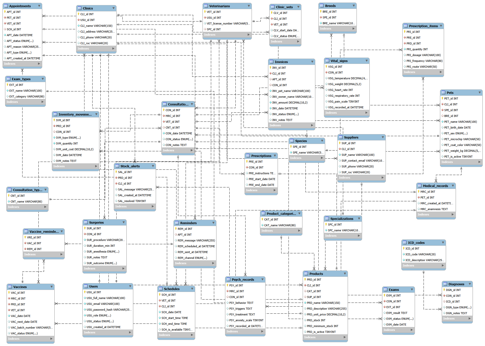

</div>

<br>

*Explicación:*

<br>

La base de datos de Pawtient está diseñada en MySQL bajo el esquema de normalización en Tercera Forma Normal (3FN) y gestiona dos segmentos de usuario: administradores de clínica veterinaria y veterinarios independientes. En total el esquema comprende **31 tablas** organizadas en **seis módulos cohesivos**: IAM, Mascotas, Historia Clínica, Citas y Agenda, Inventario y Facturación.

El **módulo IAM** (5 tablas) centraliza la autenticación en `Users`, desde la cual se extienden los perfiles `Clinics` (para administradores) y `Veterinarians` (con especialización referenciada mediante el catálogo `Specializations`). La relación entre veterinarios y clínicas es de muchos a muchos, resuelta a través de `Clinic_vets`, lo que permite que un veterinario trabaje en múltiples clínicas sin duplicar su registro.

El **módulo de Mascotas** (3 tablas) registra los pacientes asociados a cada clínica mediante `Pets`. La especie y la raza están desacopladas en tablas independientes `Species` y `Breeds`, eliminando la dependencia transitiva que existiría al almacenar ambos valores como texto libre en la tabla de mascotas. La raza admite valor nulo para registrar animales mestizos.

El **módulo de Historia Clínica** es el más extenso del sistema con 13 tablas. Se articula alrededor de `Medical_records`, que actúa como raíz permanente del expediente de cada paciente en relación 1:1 con `Pets`. A partir de ella se ramifican las `Consultations`, que concentran los signos vitales (`Vital_signs`), diagnósticos referenciados al catálogo `ICD_codes` (`Diagnoses`), prescripciones con sus ítems de medicación (`Prescriptions`, `Prescription_items`), tipos y resultados de exámenes complementarios (`Exam_types`, `Exams`) y cirugías derivadas de una consulta en relación 1:1 (`Surgeries`). El módulo incluye además registros independientes de vacunación (`Vaccines`) y de psicología animal (`Psych_records`), ambos vinculados directamente a la historia clínica del paciente.

El **módulo de Citas y Agenda** (4 tablas) combina `Schedules` para definir los bloques de disponibilidad horaria por veterinario y clínica, `Appointments` para registrar la cita concreta con tipo, estado y motivo, y `Reminders` para las notificaciones multicanal asociadas a cada cita. La tabla `Vaccine_reminders` vincula los recordatorios directamente a las vacunas registradas, permitiendo alertas automáticas cuando se aproxima la fecha de la próxima dosis.

El **módulo de Inventario** (5 tablas) gestiona productos clasificados por categoría (`Product_categories`) y proveedor (`Suppliers`), ambos con alcance por clínica mediante `CLI_id`. Los movimientos de entrada, salida y ajuste se registran en `Inventory_movements`, vinculados opcionalmente a una consulta para trazabilidad de consumo clínico. Las alertas automáticas de stock mínimo se gestionan mediante `Stock_alerts`, también scoped a nivel de clínica. Las prescripciones enlazan con los productos del inventario a través de `Prescription_items`, cerrando el ciclo entre la atención clínica y el control de insumos.

El **módulo de Facturación** (1 tabla) registra las boletas de pago mediante `Invoices`, asociadas a la clínica y opcionalmente a una cita o consulta. Incluye campos desnormalizados de nombre de mascota y responsable para facilitar la generación de reportes sin requerir joins adicionales, soporte requerido por el módulo de reportes del sistema.

<br>

---


<div align="center">

# Capítulo V: Product Implementation, Validation & Deployment

</div>

---

## 5.1. Software Configuration Management

### 5.1.1. Software Development Environment Configuration

Para el desarrollo de Pawtient, el equipo ha estandarizado un entorno de desarrollo y un conjunto de tecnologías que aseguran la compatibilidad y fluidez del trabajo conjunto en todo el ciclo de vida del producto:

| Categoría | Producto | Propósito | URL |
|:----------|:---------|:----------|:----|
| Project Management | Jira | Gestión ágil de Sprints, tareas y Product Backlog | https://jira.atlassian.com |
| Requirements Management | UXPressia | Elaboración de Impact Maps y User Personas | https://uxpressia.com |
| Requirements Management | Miro | Diseño colaborativo de mapas de experiencia (As-Is y To-Be) | https://miro.com |
| Product UX/UI Design | Figma | Wireframes, Mockups y Prototipos UI | https://figma.com |
| Software Development | Visual Studio Code | Editor principal para desarrollo web (HTML, CSS, JS) | https://code.visualstudio.com |
| Software Development | Vue Framework | Framework principal para el Frontend Web Application | https://vuejs.org |
| Software Development | ASP . NET Core Framework | Framework principal para los RESTful Web Services | https://dotnet.microsoft.com/apps/aspnet |
| Software Deployment | GitHub Pages | Despliegue estático de la Landing Page | https://pages.github.com |
| Software Documentation | Swagger / OpenAPI | Documentación interactiva de los Web Services | https://swagger.io |
| Version Control | Git + GitHub | Control de versiones y trabajo colaborativo | https://github.com |

<br>

---

### 5.1.2. Source Code Management

El código fuente de Pawtient se gestiona bajo una arquitectura de repositorios separados para garantizar modularidad.

**Organización de GitHub:** [PetHealt](https://github.com/PetHealt)

|      Producto       |       Repositorio       | URL                                             |
|:-------------------:|:-----------------------:|:------------------------------------------------|
| Organización Flowey |       `Pawtient`        | https://github.com/FloweyTech     |
|    Landing Page     | `Pawtient-landing-page` | https://github.com/PetHealt/Pawtient-landing-page     |
|       Report        |    `Pawtient-report`    | https://github.com/PetHealt/Pawtient-report    |

**GitFlow Workflow:**

Se implementará GitFlow con las siguientes ramas:

| Rama | Propósito | Convención de nombre |
|:-----|:---------:|:---------------------|
| `main` | Código en producción | `main` |
| `develop` | Integración de features | `develop` |
| `feature/*` | Desarrollo de características | `feature/<nombre-descriptivo>` |
| `release/*` | Preparación de releases | `release/vX.Y.Z` (ej: `release/1.0.0`) |
| `hotfix/*` | Correcciones urgentes en producción | `hotfix/<problema>` |

**Semantic Versioning:** Se aplica [Semantic Versioning 2.0.0](https://semver.org/) para nombrar los releases (`MAJOR.MINOR.PATCH`).

**Conventional Commits:** Se aplican [Conventional Commits](https://www.conventionalcommits.org/) para los mensajes de commits:

<br>

---

### 5.1.3. Source Code Style Guide & Conventions

| Lenguaje / Framework | Convención adoptada | Referencia |
|:--------------------:|:-------------------:|:-----------|
| HTML | HTML Style Guide | https://www.w3schools.com/html/html5_syntax.asp |
| CSS | BEM & Custom Properties | Guía de estilo interna (Uso estricto de variables en `:root`) |
| JavaScript / TypeScript | Google TypeScript Style Guide | https://google.github.io/styleguide/tsguide.html |
| Angular | Angular coding style guide | https://angular.io/guide/styleguide |
| Java | Google Java Style Guide | https://google.github.io/styleguide/javaguide.html |
| Spring Boot | Spring Boot Features | https://docs.spring.io/spring-boot/docs/current/reference/html/features.html |
| Gherkin (Acceptance Criteria) | Gherkin Conventions | https://specflow.org/gherkin/gherkin-conventions-for-readable-specifications/ |

> **Nota:** Para todos los lenguajes se aplica la nomenclatura en **inglés**.

<br>

---

### 5.1.4. Software Deployment Configuration

1. **Ingresar a Netlify**<br>
   Accedemos a la plataforma mediante nuestras credenciales de Github en "Log in with GitHub".
   

2. **Autorizar a Netlify**<br>
   Damos permisos a Netlify de acceder a nuestra cuenta de GitHub para luego ir a la sección "Sites" y presionar "Add new site". Entonces, le damos a "Import an existing project".
    
3. **Escoger tu deploy**<br>
   En la parte de "Let's deploy your project with..." seleccionamos GitHub.
    

4. **Escoger tu repositorio**<br>
    Dado que nuestro repositorio está bajo una organización, la seleccionamos.
    
5. **Configurar el despliegue**<br>
   Ahora procedemos a configurar el despliegue, colocando el Site Name y seleccionando el Team, también debemos escoger una rama que en este caso será la Main.
    

6. **Seguir configurando**<br>
   Seguimos configurando, pero esta vez seleccionando el "Publish directory" colocamos public, para finalmente darle a "Deploy demy-academy".
    

7. **Despliegue listo**<br>
   Ahora podemos observar que el deploy está listo y podremos ver el enlace de la web al front-end recién desplegado.
    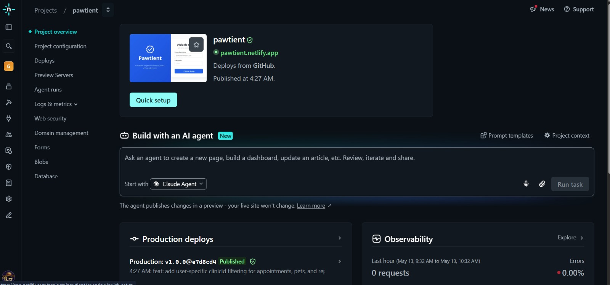

8. **Verificar la configuración del proyecto**<br>
     Verificamos que el proyecto haya sido creado correctamente dentro de Netlify, comprobando el nombre del sitio, repositorio vinculado y estado general de la configuración del despliegue.
    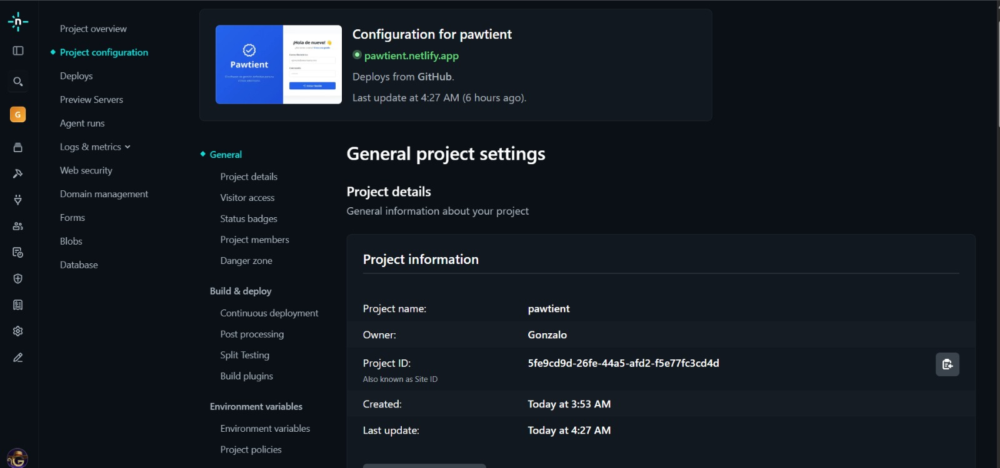

9. **Confirmar despliegues automáticos**<br>
     Por último, revisamos la sección Deploys, donde se observa que los despliegues automáticos quedaron habilitados correctamente. De esta forma, cada nuevo push realizado en la rama principal actualiza automáticamente la aplicación desplegada. 
     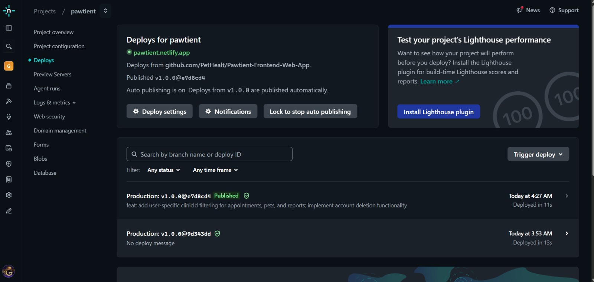

[Ver Front-End desplegado](`https://pawtient.netlify.app/login`)

<br>

---

## 5.2. Landing Page, Services & Applications Implementation
### 5.2.1. Sprint 1
#### 5.2.1.1. Sprint Planning 1

A continuación se presentará el sprint planning para esta primera entrega, donde definimos qué trabajo se va a realizar para el próximo sprint y cómo se va a lograr.

| Sprint #                             | Sprint 1                                                                                                                                                                                                                                                                                          |
|--------------------------------------|---------------------------------------------------------------------------------------------------------------------------------------------------------------------------------------------------------------------------------------------------------------------------------------------------|
| Sprint planning <br> background      |                                                                                                                                                                                                                                                                                                   |
| Date                                 | 2026/04/10                                                                                                                                                                                                                                                                                        |
| Time                                 | 8:00 PM                                                                                                                                                                                                                                                                                           |
| Location                             | Llamada grupal en la plataforma Discord                                                                                                                                                                                                                                                           |
| Prepared By                          | Gonzalo Quintanilla                                                                                                                                                                                                                                                                               |
| Attendees <br> (to planning meeting) | Brianna Salinas, Emily Arroyo, Mateo Salazar, Mathias Acuache y Gonzalo Quintanilla                                                                                                                                                                                                               |
| **Sprint Goal & User Stories** |                                                                                                                                                                                                                                                                                                   |
| Sprint 1 Goal                        | Nuestro enfoque está en presentar una landing page que muestre todas las <br> funcionalidades y características de Pawtient a los visitantes. <br> Creemos que esto generará una sólida primera impresión sobre el valor de la plataforma para clínicas y dueños de mascotas. <br> Esto se confirmará cuando la página esté desplegada, sea responsiva y sus enlaces funcionen correctamente. |
| Sprint 1 Velocity                    | 15                                                                                                                                                                                                                                                                                                |
| Sum of story points                  | 10                                                                                                                                                                                                                                                                                                |

<br>

---

#### 5.2.1.2. Aspect Leaders and Collaborators

Ahora presentaremos nuestro LACX (Leadership-and-Collaboration Matrix) que nos ayudará a saber quién lidera y quién colabora en cada aspecto de este primer sprint.<br>
Los aspectos que tomamos en cuenta para este primer sprint fueron los features de nuestra Landing Page desarrollados por el equipo de Pawtient.

<div style="font-size:70%;">

| **Team Member** <br> Last Name, First Name |      **GitHub Username**       | **Hero & Global** <br> L/C | **Nav & About us** <br> L/C | **Services & Stats** <br> L/C | **IoT & Roles** <br> L/C | **Pricing & Contact** <br> L/C |
|:------------------------------------------:|:------------------------------:|:-----------------:|:---------------------:|:---------------------:|:-------------------------:|:--------------------:|
|         **Quintanilla, Gonzalo** |             GoldQP             |         L         |           C           |           C           |             C             |          C           |
|         **Salinas, Brianna** |        brianna-salinas         |         C         |           L           |           C           |             C             |          C           |
|         **Salazar, Mateo** |  Mateo Paolo Salazar Miranda   |         C         |           C           |           L           |             C             |          C           |
|         **Arroyo, Emily** |             Em2920             |         C         |           C           |           C           |             L             |          C           |
|         **Acuache, Mathias** |           mathiasA25           |         C         |           C           |           C           |             C             |          L           |

</div>

<div style="text-align: center; font-size:85%; margin-top: 0.5rem;">

**Nota.** L = *Leader* (responsable principal del aspecto).  
C = *Collaborator* (apoya el desarrollo del aspecto).

</div>

<br>

---

#### 5.2.1.3. Sprint Backlog 1

El objetivo principal de este Sprint es **diseñar, implementar y desplegar la Landing Page** de la plataforma Pawtient, de modo que los usuarios (tanto personal clínico como dueños de mascotas) puedan conocer la propuesta de valor, características de la arquitectura, planes de suscripción y medios de contacto. Esto permitirá la primera validación con usuarios reales y sentará las bases para la adquisición B2B y B2C.

<table>
  <tr>
    <td><b>Sprint #</b></td>
    <td colspan="7">Sprint 1</td>
  </tr>
  <tr>
    <td colspan="2"><b>User Story</b></td>
    <td colspan="2"><b>Work-Item / Task</b></td>
    <td><b>Description</b></td>
    <td><b>Estimation (Hours)</b></td>
    <td><b>Assigned To</b></td>
    <td><b>Status (To-do / In-Process / To-Review / Done)</b></td>
  </tr>
  <tr>
    <td><b>Id</b></td>
    <td><b>Title</b></td>
    <td><b>Id</b></td>
    <td><b>Title</b></td>
    <td></td>
    <td></td>
    <td></td>
    <td></td>
  </tr>
  <tr>
    <td>US22</td>
    <td>Propuesta de valor para clínicas</td>
    <td>T01</td>
    <td>Implementar Hero y Global CSS</td>
    <td>Estructurar base HTML, variables CSS nativas y vista principal de captación.</td>
    <td>5</td>
    <td>Gonzalo Q.</td>
    <td>Done</td>
  </tr>
  <tr>
    <td>US22</td>
    <td>Propuesta de valor para clínicas</td>
    <td>T02</td>
    <td>Implementar sección IoT y Roles</td>
    <td>Maquetar tarjetas dinámicas de roles y sección de visualización de equipos IoT.</td>
    <td>4</td>
    <td>Emily A.</td>
    <td>Done</td>
  </tr>
  <tr>
    <td>US23</td>
    <td>Propuesta de valor para dueños</td>
    <td>T03</td>
    <td>Implementar Navbar y About Us</td>
    <td>Crear encabezado interactivo, menús de navegación y sección "Nosotros".</td>
    <td>4</td>
    <td>Brianna S.</td>
    <td>Done</td>
  </tr>
  <tr>
    <td>US24</td>
    <td>Navegación en landing page</td>
    <td>T04</td>
    <td>Implementar Servicios y Estadísticas</td>
    <td>Estilos CSS responsive en Grid/Flexbox para los beneficios y estadísticas.</td>
    <td>4</td>
    <td>Mateo S.</td>
    <td>Done</td>
  </tr>
  <tr>
    <td>US25</td>
    <td>Preguntas frecuentes y Contacto</td>
    <td>T05</td>
    <td>Implementar Pricing y Contacto</td>
    <td>Formularios de contacto e interruptor interactivo para la tabla de precios.</td>
    <td>4</td>
    <td>Mathias A.</td>
    <td>Done</td>
  </tr>
  <tr>
    <td>-</td>
    <td>-</td>
    <td>T06</td>
    <td>Configuración de entorno de trabajo (Git)</td>
    <td>Crear repositorios, estructurar ramas (GitFlow) y resolver conflictos de fusión.</td>
    <td>3</td>
    <td>Gonzalo Q.</td>
    <td>Done</td>
  </tr>
  <tr>
    <td>-</td>
    <td>-</td>
    <td>T07</td>
    <td>Despliegue del Frontend (CI/CD)</td>
    <td>Configurar entorno en Netlify conectado a la rama main de GitHub.</td>
    <td>2</td>
    <td>Gonzalo Q.</td>
    <td>Done</td>
  </tr>
</table>
</div>

<br>

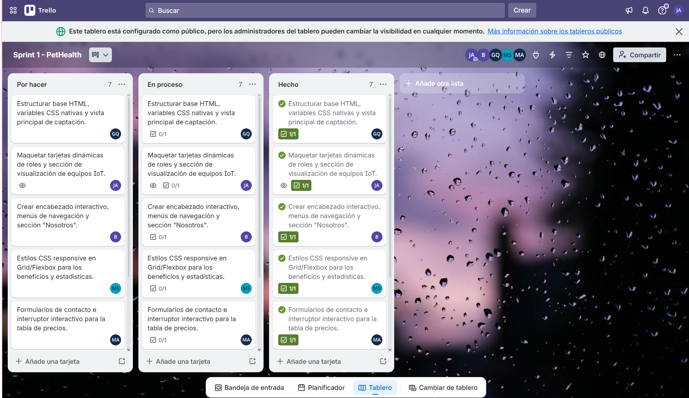
[Ver imagen en Trello](https://trello.com/invite/b/6a04c26d44c138fd083131b5/ATTI04ef86782e73ed695b865a4b575cdff591158CE5/sprint-1-pethealth)

<br>

---

#### 5.2.1.4. Development Evidence for Sprint Review

Durante el Sprint 1 se implementó la Landing Page de la solución Pawtient, la cual incluyó la creación de las secciones principales: Hero, Nosotros, Servicios, IoT & Roles, Precios y Contacto. El desarrollo se realizó en el repositorio público https://github.com/PetHealt/Pawtient-landing-page, utilizando un flujo de ramas basado en feature branches (GitFlow).

**Development Evidence – Sprint 1**

| Repository | Branch | Commit Id | Commit Message | Commit Message Body | Committed on (Date) |
| :--- | :--- | :--- | :--- | :--- | :--- |
| PetHealt/Pawtient-landing-page | main | 8ea012a | release: integra todos los componentes de la landing page en main | Integración final de todos los módulos unificados en la rama principal lista para producción. | 25/04/2026 |
| PetHealt/Pawtient-landing-page | develop | 9f54109 | fix:Bug fixes when joining branches | Corrección de errores de código generados durante la fusión de ramas del equipo. | 25/04/2026 |
| PetHealt/Pawtient-landing-page | develop | d2ebdb9 | fix: integra a gonzalo | Integración de los componentes de la rama feat/gonzalo a develop. | 25/04/2026 |
| PetHealt/Pawtient-landing-page | develop | 872d972 | fix: integra a mathias | Integración de los componentes de la rama feat/mathias a develop. | 25/04/2026 |
| PetHealt/Pawtient-landing-page | develop | fafe731 | fix: integra a mateo | Integración de los componentes de la rama feat/mateo a develop. | 25/04/2026 |
| PetHealt/Pawtient-landing-page | develop | 682dca8 | fix:resolves conflict by keeping Emilys CSS files | Resolución manual de conflictos de fusión priorizando los estilos CSS de Emily. | 25/04/2026 |
| PetHealt/Pawtient-landing-page | develop | 02a7120 | Merge pull request #1 from PetHealt/feat/brianna | Aprobación e integración del Pull Request de Brianna hacia develop. | 25/04/2026 |
| PetHealt/Pawtient-landing-page | feat/emily | 2564363 | feat: add hero.css file | Implementación de estilos visuales específicos para la sección Hero. | 25/04/2026 |
| PetHealt/Pawtient-landing-page | feat/emily | a2e3058 | feat: add contact.css file | Implementación de estilos visuales para la sección y formulario de contacto. | 25/04/2026 |
| PetHealt/Pawtient-landing-page | feat/mathias | 62c19f0 | feat: implement navigation bar styles | Desarrollo de estilos responsivos para la barra de navegación interactiva. | 25/04/2026 |
| PetHealt/Pawtient-landing-page | feat/mathias | 4c2fa8c | feat: implement iot section styles and logic | Implementación visual y de lógica para el módulo de equipos IoT. | 25/04/2026 |
| PetHealt/Pawtient-landing-page | feat/mateo | d9f1939 | feat: implement stats section | Desarrollo de la sección de estadísticas clave de la plataforma. | 24/04/2026 |
| PetHealt/Pawtient-landing-page | feat/mateo | 4861df8 | feat: implement services section | Implementación de la sección descriptiva de servicios ofrecidos. | 24/04/2026 |
| PetHealt/Pawtient-landing-page | feat/brianna | a8efe10 | feat: update pricing responsive styles | Ajuste de estilos móviles y responsivos para la tabla de planes de suscripción. | 24/04/2026 |
| PetHealt/Pawtient-landing-page | feat/brianna | 7db2f60 | feat: update script behavior and refine styles | Refinamiento de la lógica de JavaScript y estilos generales del componente. | 24/04/2026 |
| PetHealt/Pawtient-landing-page | feat/brianna | edfe80e | feat: refactor styles structure | Refactorización de la estructura de archivos de estilos modulares. | 24/04/2026 |
| PetHealt/Pawtient-landing-page | feat/gonzalo | 3b3cffb | feat: add index, script, global and about code | Código base HTML, configuración global de CSS Variables y script principal. | 23/04/2026 |
| PetHealt/Pawtient-landing-page | develop | b38d1d8 | chore: creates an empty folder and file structure | Creación del "molde" inicial con carpetas y archivos CSS vacíos para el equipo. | 23/04/2026 |
| PetHealt/Pawtient-landing-page | main | df95928 | landing page files | Primer commit con los recursos estáticos iniciales de la Landing Page. | 13/04/2026 |

<br>

---

#### 5.2.1.5. Execution Evidence for Sprint Review

Durante el **Sprint 1** se implementó la **Landing Page** de la plataforma Pawtient, cumpliendo satisfactoriamente con los objetivos definidos en el Sprint Backlog.  
La Landing Page constituye el primer punto de interacción con los usuarios, mostrando de forma clara la propuesta de valor dual de la plataforma: herramientas de gestión clínica e inventario para centros veterinarios (B2B) y seguimiento médico para dueños de mascotas (B2C).

El desarrollo tecnológico se centró en:
- Diseño responsive (Mobile-First) y navegación estructurada mediante anclas.
- Secciones implementadas: *Hero, Nosotros, Servicios, Estadísticas, IoT & Roles, Precios y Contacto*.
- Implementación de **Modo Oscuro (Dark Mode)** nativo e interactivo.
- Tarjetas desplegables e interruptores dinámicos en la tabla de planes de suscripción.

A continuación, se presentan las capturas de las principales vistas desarrolladas y desplegadas en producción:


Asimismo, se elaboró un **video demostrativo** que muestra la navegación fluida de la Landing Page, comprobando su responsividad, el cambio de temas (claro/oscuro) y explicando cada una de las secciones implementadas por el equipo:  
[Ver video demostrativo de Pawtient](https://upcedupe-my.sharepoint.com/:v:/g/personal/u202315007_upc_edu_pe/IQCmFsBAO3FvTpMOpMAylR0gAUDFExNbahk7ihbfPEj4jSI?e=BnRltz&nav=eyJyZWZlcnJhbEluZm8iOnsicmVmZXJyYWxBcHAiOiJTdHJlYW1XZWJBcHAiLCJyZWZlcnJhbFZpZXciOiJTaGFyZURpYWxvZy1MaW5rIiwicmVmZXJyYWxBcHBQbGF0Zm9ybSI6IldlYiIsInJlZmVycmFsTW9kZSI6InZpZXcifX0%3D)

<br>

---

#### 5.2.1.6. Services Documentation Evidence for Sprint Review

Durante el Sprint 1, el esfuerzo técnico y el alcance principal se centraron exclusivamente en el diseño, implementación y despliegue de la Landing Page de captación. Por este motivo, en esta fase iterativa no se desarrollaron servicios de backend (RESTful API) asociados a la lógica de negocio profunda.

Sin embargo, a partir de las *Technical Stories* definidas en el Product Backlog, se ha establecido la arquitectura inicial de los Web Services y se ha previsto la integración con OpenAPI/Swagger. Esto permitirá, en los sprints posteriores, documentar formalmente los contratos de los endpoints que darán soporte a las funcionalidades *Core* de la plataforma, tales como la autenticación de roles (IAM), la programación de citas médicas, la gestión de historiales clínicos y el control de inventario de suministros veterinarios.

<br>

---

#### 5.2.1.7. Software Deployment Evidence for Sprint Review

## Software Deployment Evidence for Sprint Review

Durante el **Sprint 1** se realizó el despliegue exitoso de la **Landing Page** en la plataforma **Netlify**, utilizando el repositorio [PetHealt/Pawtient-landing-page](https://github.com/PetHealt/Pawtient-landing-page).  
Se optó por Netlify debido a su facilidad para implementar **Continuous Deployment (CD)** desde GitHub. Esto asegura que cualquier cambio aprobado y subido a la rama `main` se publique automáticamente en el servidor de producción sin intervención manual adicional.

### Proceso seguido
1. **Conexión de cuenta:** Se vinculó la cuenta de GitHub de la organización **PetHealt** con la plataforma Netlify.
2. **Selección de repositorio:** Se seleccionó el proyecto `Pawtient-landing-page` para la creación del nuevo sitio.
3. **Configuración de Build:** Se definió la rama `main` como la rama de producción. Dado que es un sitio estático, no se requirieron comandos de compilación (Build commands) complejos.
4. **Despliegue inicial:** Se ejecutó el *Deploy* inicial, donde Netlify procesó los archivos HTML, CSS y JavaScript del repositorio.
5. **Generación de URL:** Una vez finalizado el proceso de *Provisioning* y *Deploy*, la plataforma generó una URL pública segura (HTTPS).

**URL del despliegue:** [https://pawtient.netlify.app/](https://pethealt.netlify.app/)

<br>

### Evidencias
A continuación, se presentan las capturas de pantalla que documentan el estado "Published" en el panel de Netlify y la correcta visualización del sitio en el navegador:

1. **Captura del Panel de Netlify:** Donde se vea el estado "Site is live" y la conexión con el repo de GitHub.
2. **Captura de Deploys Log:** Mostrando el historial de despliegues exitosos.
3. **Captura del Sitio Web:** La Landing Page cargada en el navegador con el candado de seguridad HTTPS activo.


<br>

---

#### 5.2.1.8. Team Collaboration Insights during Sprint

Durante el Sprint 1, el equipo trabajó siguiendo la estrategia de ramificación estandarizada **GitFlow**, creando ramas específicas por cada desarrollador y característica asignada (ejemplo: `feat/gonzalo`, `feat/brianna`, `feat/mateo`, `feat/emily`, `feat/mathias`).

El trabajo asíncrono se gestionó de manera eficiente: cada integrante empujó (*push*) sus cambios a su respectiva rama remota. Posteriormente, el Líder Técnico se encargó de realizar la integración progresiva (*merge*) de todas las ramas hacia `develop`, resolviendo los conflictos de fusión de estilos CSS que surgieron al unir los componentes. Tras la validación en el entorno de desarrollo, el código unificado se consolidó en la rama principal `main` para su despliegue a producción.

A continuación, se presentan los **analíticos de GitHub (Insights & Network Graph)**, que evidencian la participación del equipo en *commits*, gestión de ramas y *merges* durante el Sprint. Estas evidencias confirman la colaboración activa, equilibrada y estructurada de todos los miembros del equipo:


<br>

---

### 5.2.2. Sprint 2
#### 5.2.2.1. Sprint Planning 2

A continuación se presentará el sprint planning para el trabajo parcial, donde definimos qué trabajo se va a realizar para el próximo sprint y cómo se va a lograr.

| Sprint #                             | Sprint 2                                                                                                                                                                                                                                                                                                                                                                                                                                                                                                                                                                                                                                                                                                                                        |
|--------------------------------------|-------------------------------------------------------------------------------------------------------------------------------------------------------------------------------------------------------------------------------------------------------------------------------------------------------------------------------------------------------------------------------------------------------------------------------------------------------------------------------------------------------------------------------------------------------------------------------------------------------------------------------------------------------------------------------------------------------------------------------------------------|
| Sprint planning <br> background      |                                                                                                                                                                                                                                                                                                                                                                                                                                                                                                                                                                                                                                                                                                                                                 |
| Date                                 | 2026/05/10                                                                                                                                                                                                                                                                                                                                                                                                                                                                                                                                                                                                                                                                                                                                      |
| Time                                 | 8:00 PM                                                                                                                                                                                                                                                                                                                                                                                                                                                                                                                                                                                                                                                                                                                                         |
| Location                             | Llamada grupal en la plataforma Discord                                                                                                                                                                                                                                                                                                                                                                                                                                                                                                                                                                                                                                                                                                         |
| Prepared By                          | Gonzalo Quintanilla                                                                                                                                                                                                                                                                                                                                                                                                                                                                                                                                                                                                                                                                                                                             |
| Attendees <br> (to planning meeting) | Brianna Salinas, Emily Arroyo, Mateo Salazar, Mathias Acuache y Gonzalo Quintanilla                                                                                                                                                                                                                                                                                                                                                                                                                                                                                                                                                                                                                                                             |
| Sprint 1 Review Summary              | Durante el Sprint 1 se desarrolló la landing page de Pawtient, permitiendo presentar las principales funcionalidades y características de la plataforma a clínicas veterinarias y veterinarios independientes. Como resultado, se obtuvo una primera validación positiva respecto al valor de la solución, además de verificar que la página fuera responsiva, accesible y funcional en distintos dispositivos.                                                                                                                                                                                                                                                                                                                                 |
| Sprint 1 Retrospective Summary       | El equipo tuvo poca comunicación, habían distintas opiniones respecto al diseño y no se tenía una visión clara sobre algunos aspectos del producto pero aún asi se logró llegar a una cuerdo.                                                                                                                                                                                                                                                                                                                                                                                                                                                                                                                                                   |
| **Sprint Goal & User Stories**       |                                                                                                                                                                                                                                                                                                                                                                                                                                                                                                                                                                                                                                                                                                                                                 |
| Sprint 2 Goal                        | Nuestro enfoque en el Sprint 2 estuvo orientado al desarrollo del front-end funcional de Pawtient, integrando las principales vistas y módulos de la plataforma junto con endpoints estructurados bajo el enfoque Domain-Driven Design (DDD). Además, se realizaron mejoras y correcciones basadas en el feedback proporcionado, permitiendo refinar la organización de la solución y alinear mejor la arquitectura del proyecto. Consideramos que esto contribuye a una estructura más escalable, mantenible y eficiente en la interacción entre la interfaz y los servicios de la aplicación. Esto se validó mediante la correcta conexión del front-end con los endpoints y el funcionamiento adecuado de las funcionalidades implementadas. |
| Sprint 2 Velocity                    | 14                                                                                                                                                                                                                                                                                                                                                                                                                                                                                                                                                                                                                                                                                                                                              |
| Sum of story points                  | 50                                                                                                                                                                                                                                                                                                                                                                                                                                                                                                                                                                                                                                                                                                                                              |

<br>

---

#### 5.2.2.2. Aspect Leaders and Collaborators

Ahora presentaremos nuestro LACX (Leadership-and-Collaboration Matrix) que nos ayudará a saber quién lidera y quién colabora en cada aspecto de este segundo sprint.<br>
Los aspectos que tomamos en cuenta para este segundo sprint fueron los endpoints de nuestro Front-End desarrollados por el equipo de Pawtient.

<div style="font-size:70%;">

| **Team Member** <br> Last Name, First Name |      **GitHub Username**       | **Reports** <br> L/C | **Appointments** <br> L/C | **Clinic** <br> L/C | **Profiles** <br> L/C | **Store** <br> L/C |
|:------------------------------------------:|:------------------------------:|:--------------------:|:-------------------------:|:-------------------:|:---------------------:|:------------------:|
|         **Quintanilla, Gonzalo** |             GoldQP             |          C           |             C             |          C          |           L           |         C          |
|         **Salinas, Brianna** |        brianna-salinas         |          C           |             C             |          C          |           C           |         L          |
|         **Salazar, Mateo** |  Mateo Paolo Salazar Miranda   |          C           |             C             |          L          |           C           |         C          |
|         **Arroyo, Emily** |             Em2920             |          L           |             C             |          C          |           C           |         C          |
|         **Acuache, Mathias** |           mathiasA25           |          C           |             L             |          C          |           C           |         C          |

</div>

<div style="text-align: center; font-size:85%; margin-top: 0.5rem;">

**Nota.** L = *Leader* (responsable principal del aspecto).  
C = *Collaborator* (apoya el desarrollo del aspecto).

</div>

<br>

---

#### 5.2.3.3. Sprint Backlog 2

El objetivo principal de este Sprint es **diseñar, implementar y desplegar el Front-End** de la plataforma Pawtient, de modo que los usuarios (tanto dueños y administradores de clínicas veterinarias como veterinarios independientes) puedan interactuar con las principales funcionalidades del sistema y visualizar de manera práctica cómo la plataforma optimiza la gestión clínica y operativa. Asimismo, se busca ofrecer una experiencia funcional e intuitiva que permita validar la estructura de la solución, la navegación entre módulos y la integración con los endpoints desarrollados.

<div>
<table>
  <tr>
    <td><b>Sprint #</b></td>
    <td colspan="7">Sprint 2</td>
  </tr>

  <tr>
    <td colspan="2"><b>User Story</b></td>
    <td colspan="2"><b>Work-Item / Task</b></td>
    <td><b>Description</b></td>
    <td><b>Estimation (Hours)</b></td>
    <td><b>Assigned To</b></td>
    <td><b>Status (To-do / In-Process / To-Review / Done)</b></td>
  </tr>

  <tr>
    <td><b>Id</b></td>
    <td><b>Title</b></td>
    <td><b>Id</b></td>
    <td><b>Title</b></td>
    <td></td>
    <td></td>
    <td></td>
    <td></td>
  </tr>

  <tr>
    <td>US01</td>
    <td>Registrar cuenta como veterinario</td>
    <td>T01</td>
    <td>Implementar formulario de registro</td>
    <td>Desarrollar interfaz de registro conectada al endpoint de autenticación y validación de campos.</td>
    <td>5</td>
    <td>Emily A.</td>
    <td>Done</td>
  </tr>

  <tr>
    <td>US02</td>
    <td>Iniciar sesión en la plataforma</td>
    <td>T02</td>
    <td>Implementar autenticación de usuarios</td>
    <td>Construir vista de login y manejo de sesión mediante token JWT.</td>
    <td>4</td>
    <td>Gonzalo Q.</td>
    <td>Done</td>
  </tr>

  <tr>
    <td>US04</td>
    <td>Registrar historia clínica de mascota</td>
    <td>T03</td>
    <td>Implementar registro de historias clínicas</td>
    <td>Desarrollar formulario para registrar información médica de mascotas.</td>
    <td>6</td>
    <td>Brianna S.</td>
    <td>Done</td>
  </tr>

  <tr>
    <td>US05</td>
    <td>Consultar historial médico de una mascota</td>
    <td>T04</td>
    <td>Implementar búsqueda de historiales</td>
    <td>Construir módulo de búsqueda y visualización de historiales clínicos.</td>
    <td>5</td>
    <td>Mateo S.</td>
    <td>Done</td>
  </tr>

  <tr>
    <td>US06</td>
    <td>Editar y actualizar historia clínica</td>
    <td>T05</td>
    <td>Implementar edición de registros clínicos</td>
    <td>Permitir actualización de diagnósticos, tratamientos y trazabilidad de cambios.</td>
    <td>5</td>
    <td>Emily A.</td>
    <td>Done</td>
  </tr>

  <tr>
    <td>US08</td>
    <td>Agendar cita desde la clínica</td>
    <td>T06</td>
    <td>Implementar módulo de citas</td>
    <td>Desarrollar calendario veterinario y registro de citas desde la clínica.</td>
    <td>5</td>
    <td>Gonzalo Q.</td>
    <td>Done</td>
  </tr>

  <tr>
    <td>US10</td>
    <td>Visualizar agenda del día</td>
    <td>T07</td>
    <td>Implementar agenda diaria</td>
    <td>Construir vista de agenda con listado de citas y filtros por veterinario.</td>
    <td>4</td>
    <td>Gonzalo Q.</td>
    <td>Done</td>
  </tr>

  <tr>
    <td>US12</td>
    <td>Registrar ingreso de suministros</td>
    <td>T08</td>
    <td>Implementar registro de inventario</td>
    <td>Desarrollar módulo para registrar suministros y actualizar stock.</td>
    <td>5</td>
    <td>Brianna S.</td>
    <td>Done</td>
  </tr>

  <tr>
    <td>US13</td>
    <td>Consultar niveles de stock</td>
    <td>T09</td>
    <td>Implementar visualización de stock</td>
    <td>Construir panel de inventario con alertas de stock mínimo.</td>
    <td>4</td>
    <td>Mateo S.</td>
    <td>Done</td>
  </tr>

  <tr>
    <td>TS01</td>
    <td>Endpoint de autenticación de usuarios</td>
    <td>T10</td>
    <td>Integrar endpoint de autenticación</td>
    <td>Conectar frontend con endpoint RESTful de login utilizando arquitectura DDD.</td>
    <td>4</td>
    <td>Mathias A.</td>
    <td>Done</td>
  </tr>

  <tr>
    <td>TS02</td>
    <td>Endpoint de creación de historia clínica</td>
    <td>T11</td>
    <td>Integrar endpoint de historiales clínicos</td>
    <td>Conectar formularios clínicos con servicios RESTful para registro de historias.</td>
    <td>5</td>
    <td>Emily A.</td>
    <td>Done</td>
  </tr>

  <tr>
    <td>TS03</td>
    <td>Endpoint de programación de citas</td>
    <td>T12</td>
    <td>Integrar endpoint de citas</td>
    <td>Conectar agenda veterinaria con endpoints de programación de citas.</td>
    <td>4</td>
    <td>Gonzalo Q.</td>
    <td>Done</td>
  </tr>

  <tr>
    <td>TS04</td>
    <td>Endpoint de gestión de inventario</td>
    <td>T13</td>
    <td>Integrar endpoint de inventario</td>
    <td>Consumir endpoints RESTful para consulta y actualización de suministros.</td>
    <td>4</td>
    <td>Brianna S.</td>
    <td>Done</td>
  </tr>

  <tr>
    <td>-</td>
    <td>-</td>
    <td>T14</td>
    <td>Configurar arquitectura Frontend DDD</td>
    <td>Estructurar módulos, bounded contexts y servicios para el frontend de Pawtient.</td>
    <td>5</td>
    <td>Gonzalo Q.</td>
    <td>Done</td>
  </tr>

  <tr>
    <td>-</td>
    <td>-</td>
    <td>T15</td>
    <td>Despliegue del Frontend</td>
    <td>Configurar despliegue continuo del frontend en Netlify conectado al repositorio GitHub.</td>
    <td>3</td>
    <td>Gonzalo Q.</td>
    <td>Done</td>
  </tr>
</table>
</div>

<br>

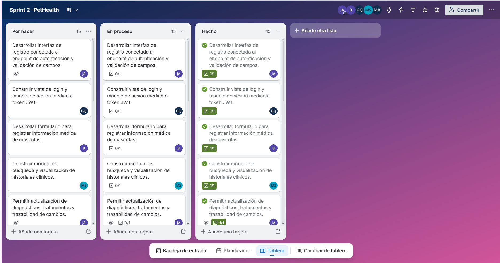

[Ver enlace trello](https://trello.com/invite/b/6a04c5f0c2abdeec5c930425/ATTIc7eb47f5f43708a30c1456fa6cb7578e00C5BA81/sprint-2-pethealth)

<br>

---

#### 5.2.2.4. Development Evidence for Sprint Review

Durante el Sprint 2 se implementó el front-end de la solución Pawtient, incorporando módulos para la gestión de pacientes, agenda médica, inventario, proveedores y reportes administrativos. El desarrollo se realizó en el repositorio público https://github.com/PetHealt/Pawtient-Frontend-Web-App, utilizando un flujo de ramas basado en feature branches (GitFlow).

**Development Evidence – Sprint 1**

| Repository                          | Branch | Commit Id | Commit Message | Commit Message Body | Committed on (Date) |
|:------------------------------------|:-------------|:---|:---|:---|:---|
| PetHealt/Pawtient-Front-end-Web-app | v1.0.0 | 202bf69 | chore: rename files for improved structure in store module | Refactorización y mejora de estructura del módulo store. | 13/05/2026 |
| PetHealt/Pawtient-Front-end-Web-app | v1.0.0 | 31ef079 | feat: add billing and reports dashboard view | Implementación de vista dashboard para facturación y reportes. | 13/05/2026 |
| PetHealt/Pawtient-Front-end-Web-app | v1.0.0 | 5df53d2 | feat: add reports api service | Integración del servicio API para reportes. | 13/05/2026 |
| PetHealt/Pawtient-Front-end-Web-app | v1.0.0 | b97019d | feat: create report entity model | Creación de entidad Report para el dominio de reportes. | 13/05/2026 |
| PetHealt/Pawtient-Front-end-Web-app | v1.0.0 | db5a9bd | feat: create the reports folder and add reports.store.js inside the application layer | Implementación de carpeta reports y store en la capa de aplicación. | 13/05/2026 |
| PetHealt/Pawtient-Front-end-Web-app | v1.0.0 | 5c03221 | refactor: Add components to make it compatible with db.json | Adaptación de componentes para compatibilidad con db.json. | 12/05/2026 |
| PetHealt/Pawtient-Front-end-Web-app | main | e753031 | feature: store complete | Finalización e integración del módulo store. | 25/04/2026 |
| PetHealt/Pawtient-Front-end-Web-app | v1.0.0 | 9c0098d | feat: add clinic folder | Creación de estructura inicial del módulo clinic. | 13/05/2026 |
| PetHealt/Pawtient-Front-end-Web-app | develop | 515b398 | feat: update user profile details for Gonzalo Samuel Quintanilla Pozo | Actualización de detalles del perfil de usuario. | 11/05/2026 |
| PetHealt/Pawtient-Front-end-Web-app | develop | 5b94912 | feat: add profile view route and update authentication guard logic | Implementación de ruta de perfil y actualización del guard de autenticación. | 10/05/2026 |
| PetHealt/Pawtient-Front-end-Web-app | v1.0.0 | 2fb2f4e | feat: add ProfilesApi class for updating user profiles | Creación de servicio API para actualización de perfiles. | 13/05/2026 |
| PetHealt/Pawtient-Front-end-Web-app | develop | c996f10 | feat: add profiles store with loadProfile functionality | Implementación del store de perfiles y funcionalidad loadProfile. | 12/05/2026 |
| PetHealt/Pawtient-Front-end-Web-app | v1.0.0 | 433edc4 | feat: add profile editing functionality with data persistence | Implementación de edición persistente de perfiles. | 13/05/2026 |
| PetHealt/Pawtient-Front-end-Web-app | develop | 9dc0f0a | feat: add profile edit form component with validation and emit functionality | Creación de formulario de edición con validaciones. | 12/05/2026 |
| PetHealt/Pawtient-Front-end-Web-app | develop | dce1a16 | feat: add profile details component with user information display | Implementación de componente de visualización de perfil. | 12/05/2026 |
| PetHealt/Pawtient-Front-end-Web-app | develop | be30e5f | feat: add profile entity and profile details component | Creación de entidad Profile y componente de detalles. | 12/05/2026 |
| PetHealt/Pawtient-Front-end-Web-app | main | 10b7840 | add ProfileAssembler to convert resource to Profile entity | Implementación de assembler para conversión de recursos Profile. | 11/05/2026 |
| PetHealt/Pawtient-Front-end-Web-app | main | e436aa7 | Add "Mi Perfil" route and logout functionality to sidebar | Integración de ruta Mi Perfil y logout en sidebar. | 13/05/2026 |
| PetHealt/Pawtient-Front-end-Web-app | main | 1dd4dfc | refactor(home.vue): enhance dashboard layout and add profile editing functionality | Mejora del dashboard principal y edición de perfiles. | 13/04/2026 |

<br>

---

#### 5.2.2.5. Execution Evidence for Sprint Review

Durante el **Sprint 2** se implementó el **Front-End** de la plataforma Pawtient, cumpliendo satisfactoriamente con los objetivos definidos en el Sprint Backlog.  

El desarrollo tecnológico se centró en:
- Diseño responsive (Mobile-First) y navegación estructurada mediante anclas.
- Implementación de módulos funcionales para pacientes, agenda, inventario, proveedores y reportes.
- Desarrollo de dashboards y vistas administrativas para la gestión clínica y operativa.
- Organización modular del Front-End para mejorar la escalabilidad y mantenimiento del sistema.
- Configuración del despliegue continuo mediante Netlify y GitHub.

A continuación, se presentan las capturas de las principales vistas desarrolladas y desplegadas en producción:


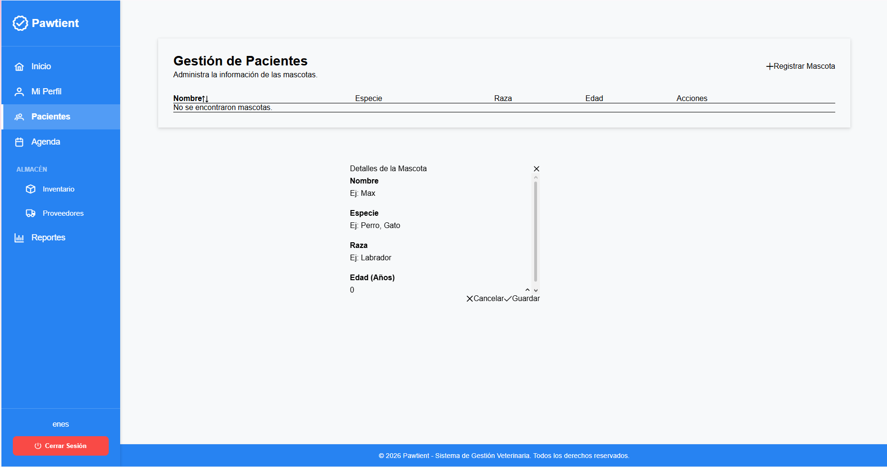
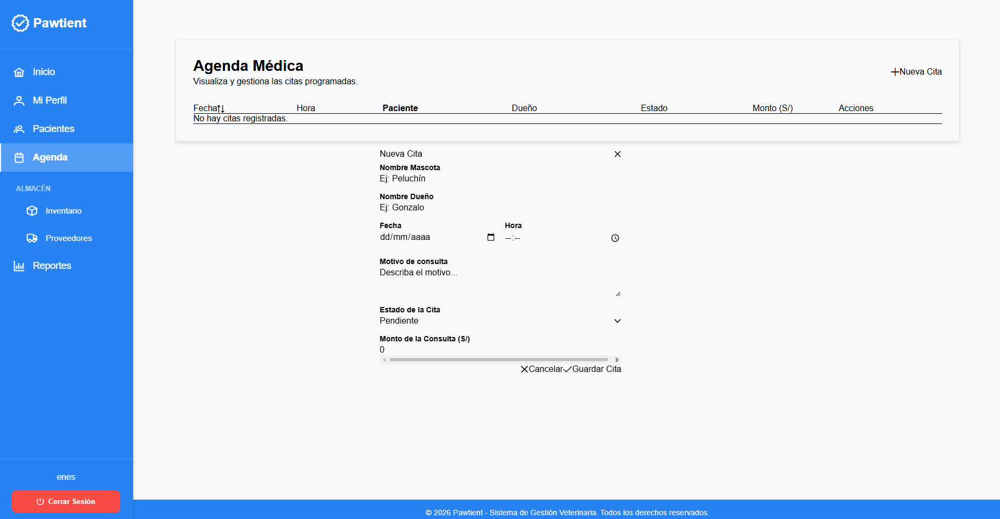
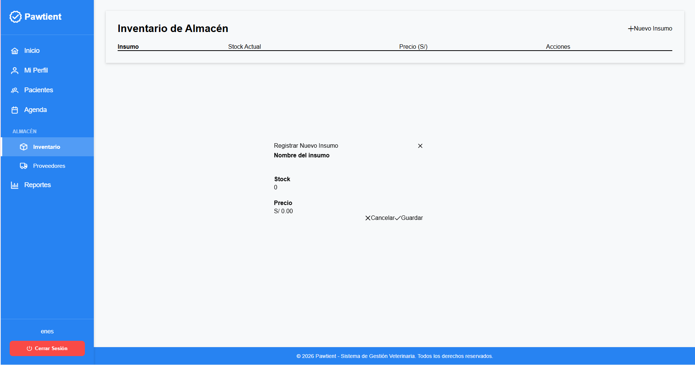
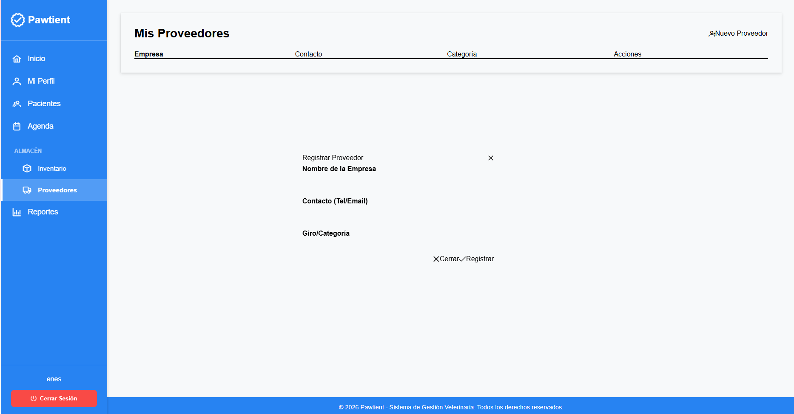
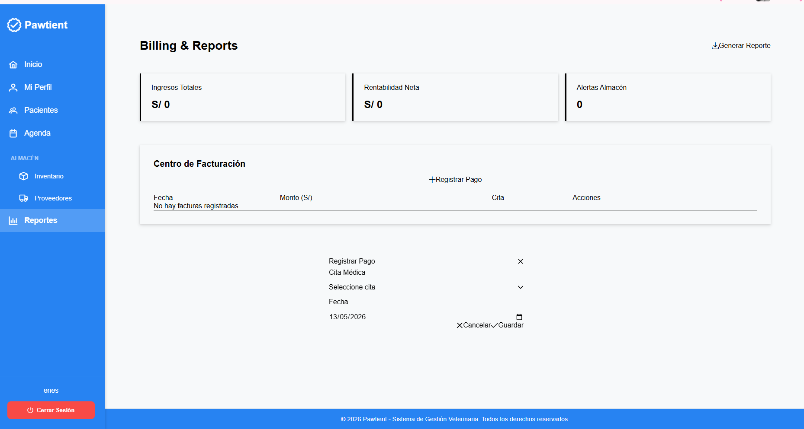

Asimismo, se elaboró un **video demostrativo** que muestra la navegación fluida del frontend:

[Ver video demostrativo de Pawtient]([https://upcedupe-my.sharepoint.com/:v:/g/personal/u202311469_upc_edu_pe/IQA2vengUzUuS4seoi1K_jSXAdn-WEneaPJZtWg47Zge2Hc])

<br>

---

#### 5.2.2.6. Services Documentation Evidence for Sprint Review

Durante el Sprint 2, el esfuerzo técnico se centró en el diseño, implementación y despliegue del Front-End funcional de Pawtient. Además, se integró la estructura inicial de endpoints organizados, permitiendo una arquitectura más modular y preparada para futuras integraciones y documentación mediante OpenAPI/Swagger.

<br>

---

#### 5.2.2.7. Software Deployment Evidence for Sprint Review

Durante el **Sprint 2** se realizó el despliegue exitoso del **Frontend** en la plataforma **Netlify**, utilizando el repositorio [PetHealt/Pawtient-Frontend-Web-App](https://github.com/PetHealt/Pawtient-Frontend-Web-App).  
Se optó por Netlify debido a su facilidad para implementar **Continuous Deployment (CD)** desde GitHub. Esto asegura que cualquier cambio aprobado y subido a la rama `main` se publique automáticamente en el servidor de producción sin intervención manual adicional.

### Proceso seguido
1. **Conexión de cuenta:** Se vinculó la cuenta de GitHub de la organización **PetHealt** con la plataforma Netlify.
2. **Selección de repositorio:** Se seleccionó el proyecto `Pawtient-Frontend-Web-App` para la creación del nuevo sitio.
3. **Configuración de Build:** Se definió la rama `main` como la rama de producción. Dado que es un sitio estático, no se requirieron comandos de compilación (Build commands) complejos.
4. **Despliegue inicial:** Se ejecutó el *Deploy* inicial, donde Netlify procesó los archivos del repositorio.
5. **Generación de URL:** Una vez finalizado el proceso de *Provisioning* y *Deploy*, la plataforma generó una URL pública segura (HTTPS).

**URL del despliegue:** [https://pawtient.netlify.app/login](https://pawtient.netlify.app/login)

<br>

### Evidencias
A continuación, se presentan las capturas de pantalla que documentan el estado "Published" en el panel de Netlify y la correcta visualización del sitio en el navegador:

1. **Captura del Panel de Netlify:** Donde se vea el estado "Site is live" y la conexión con el repo de GitHub.
2. **Captura de Deploys Log:** Mostrando el historial de despliegues exitosos.
3. **Captura del Sitio Web:** Frontend cargado en el navegador con el candado de seguridad HTTPS activo.


<br>

---

#### 5.2.2.8. Team Collaboration Insights during Sprint

Durante el Sprint 2, el equipo trabajó siguiendo la estrategia de ramificación estandarizada **GitFlow**, creando ramas específicas por endpoint asignado (ejemplo: `feature/appointments`, `feature/clinic`, `feature/profiles`, `feature/reports`, `feature/store`).

El trabajo asíncrono se gestionó de manera eficiente: cada integrante empujó (*push*) sus cambios a su respectiva rama remota. Posteriormente, el Líder Técnico se encargó de realizar la integración progresiva (*merge*) de todas las ramas hacia `develop`, resolviendo los conflictos de fusión de estilos CSS que surgieron al unir los componentes. Tras la validación en el entorno de desarrollo, el código unificado se consolidó en la rama principal `main` para su despliegue a producción.

A continuación, se presentan los **analíticos de GitHub (Insights & Network Graph)**, que evidencian la participación del equipo en *commits*, gestión de ramas y *merges* durante el Sprint. Estas evidencias confirman la colaboración activa, equilibrada y estructurada de todos los miembros del equipo:

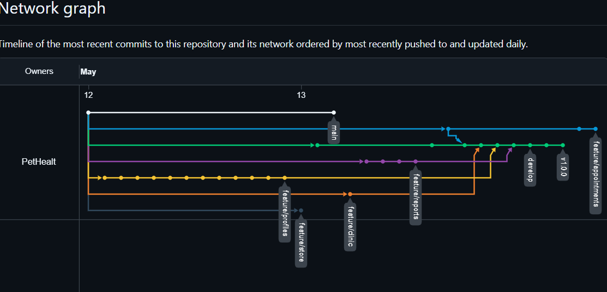
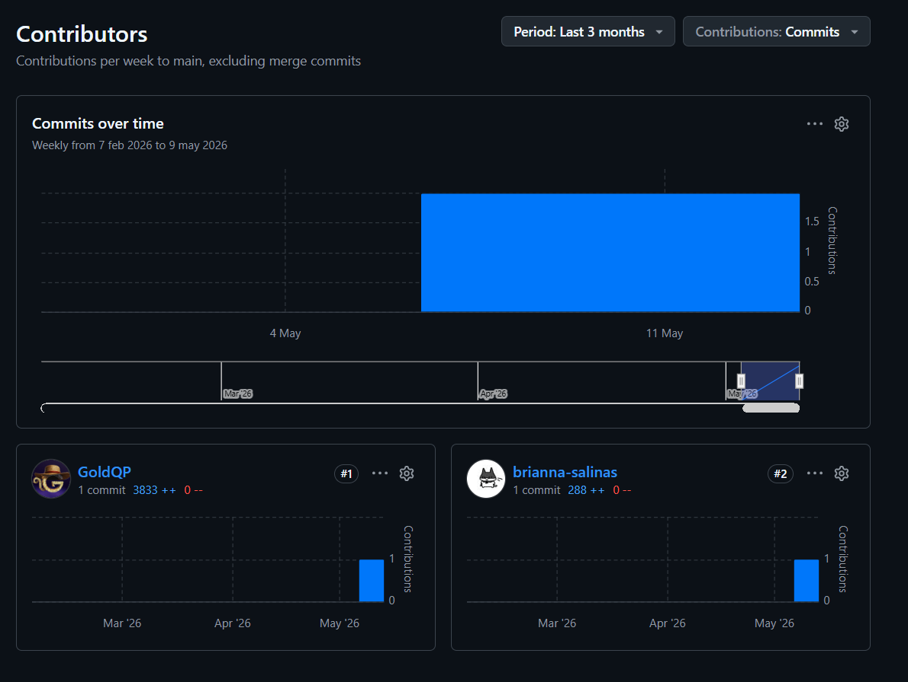

<br>

---

### 5.2.3. Sprint 3

#### 5.2.3.1. Sprint Planning 3

A continuación se presentará el sprint planning para esta primera entrega, donde definimos qué trabajo se va a realizar para el próximo sprint y cómo se va a lograr.

| Sprint #                             | Sprint 3                                                                                                                                                                                                                                                                                                                                                                                                    |
|--------------------------------------|-------------------------------------------------------------------------------------------------------------------------------------------------------------------------------------------------------------------------------------------------------------------------------------------------------------------------------------------------------------------------------------------------------------|
| Sprint planning <br> background      |                                                                                                                                                                                                                                                                                                                                                                                                             |
| Date                                 | 2026/05/25                                                                                                                                                                                                                                                                                                                                                                                                  |
| Time                                 | 8:00 PM                                                                                                                                                                                                                                                                                                                                                                                                     |
| Location                             | Llamada grupal en la plataforma Discord                                                                                                                                                                                                                                                                                                                                                                     |
| Prepared By                          | Gonzalo Quintanilla                                                                                                                                                                                                                                                                                                                                                                                         |
| Attendees <br> (to planning meeting) | Brianna Salinas, Emily Arroyo, Mateo Salazar, Mathias Acuache y Gonzalo Quintanilla                                                                                                                                                                                                                                                                                                                         |
| **Sprint Goal & User Stories** |                                                                                                                                                                                                                                                                                                                                                                                                             |
| Sprint 1 Goal                        | Nuestro enfoque está en presentar nuestra primera versión del Backend y conectarlo con el Front que muestre todas las <br> funcionalidades y características de Pawtient a los visitantes. <br> Creemos que esto generará una sólida primera impresión sobre el valor de la plataforma para clínicas y dueños de mascotas. <br> Esto se confirmará cuando el backend este levantado y conectado al Frontend |
| Sprint 1 Velocity                    | 15                                                                                                                                                                                                                                                                                                                                                                                                          |
| Sum of story points                  | 10                                                                                                                                                                                                                                                                                                                                                                                                          |

<br>

---

#### 5.2.3.2. Aspect Leaders and Collaborators
Ahora presentaremos nuestro LACX (Leadership-and-Collaboration Matrix) que nos ayudará a saber quién lidera y quién colabora en cada aspecto de este tercer sprint.<br>
Los aspectos que tomamos en cuenta para este segundo sprint fueron los endpoints de nuestro Backend desarrollados por el equipo de Pawtient.

<div style="font-size:70%;">

| **Team Member** <br> Last Name, First Name |      **GitHub Username**       | **Reports** <br> L/C | **Appointments** <br> L/C | **Clinic** <br> L/C | **Profiles** <br> L/C | **Store** <br> L/C |
|:------------------------------------------:|:------------------------------:|:--------------------:|:-------------------------:|:-------------------:|:---------------------:|:------------------:|
|         **Quintanilla, Gonzalo** |             GoldQP             |          C           |             L             |          C          |           L           |         L          |
|         **Salinas, Brianna** |        brianna-salinas         |          C           |             C             |          C          |           C           |         C          |
|         **Salazar, Mateo** |  Mateo Paolo Salazar Miranda   |          C           |             C             |          C          |           C           |         C          |
|         **Arroyo, Emily** |             Em2920             |          C           |             C             |          C          |           C           |         C          |
|         **Acuache, Mathias** |           mathiasA25           |          L           |             C             |          L          |           C           |         C          |

</div>

<div style="text-align: center; font-size:85%; margin-top: 0.5rem;">

**Nota.** L = *Leader* (responsable principal del aspecto).  
C = *Collaborator* (apoya el desarrollo del aspecto).

</div>
<br>

---

#### 5.2.3.3. Sprint Backlog 3
El objetivo principal de este Sprint es **implementar y desplegar el Backend y Conectarlo con el Front End** de la plataforma Pawtient, de modo que los usuarios (tanto dueños y administradores de clínicas veterinarias como veterinarios independientes) puedan interactuar con las principales funcionalidades del sistema y visualizar de manera práctica cómo la plataforma optimiza la gestión clínica y operativa. Asimismo, se busca ofrecer una experiencia funcional e intuitiva que permita validar la estructura de la solución, la navegación entre módulos y la integración con los endpoints desarrollados.

<div>
<table>
  <tr>
    <td><b>Sprint #</b></td>
    <td colspan="7">Sprint 2</td>
  </tr>

  <tr>
    <td colspan="2"><b>User Story</b></td>
    <td colspan="2"><b>Work-Item / Task</b></td>
    <td><b>Description</b></td>
    <td><b>Estimation (Hours)</b></td>
    <td><b>Assigned To</b></td>
    <td><b>Status (To-do / In-Process / To-Review / Done)</b></td>
  </tr>

  <tr>
    <td><b>Id</b></td>
    <td><b>Title</b></td>
    <td><b>Id</b></td>
    <td><b>Title</b></td>
    <td></td>
    <td></td>
    <td></td>
    <td></td>
  </tr>

  <tr>
    <td>US01</td>
    <td>Registrar cuenta como veterinario</td>
    <td>T01</td>
    <td>Implementar formulario de registro</td>
    <td>Desarrollar interfaz de registro conectada al endpoint de autenticación y validación de campos.</td>
    <td>5</td>
    <td>Emily A.</td>
    <td>Done</td>
  </tr>

  <tr>
    <td>US02</td>
    <td>Iniciar sesión en la plataforma</td>
    <td>T02</td>
    <td>Implementar autenticación de usuarios</td>
    <td>Construir vista de login y manejo de sesión mediante token JWT.</td>
    <td>4</td>
    <td>Gonzalo Q.</td>
    <td>Done</td>
  </tr>

  <tr>
    <td>US04</td>
    <td>Registrar historia clínica de mascota</td>
    <td>T03</td>
    <td>Implementar registro de historias clínicas</td>
    <td>Desarrollar formulario para registrar información médica de mascotas.</td>
    <td>6</td>
    <td>Brianna S.</td>
    <td>Done</td>
  </tr>

  <tr>
    <td>US05</td>
    <td>Consultar historial médico de una mascota</td>
    <td>T04</td>
    <td>Implementar búsqueda de historiales</td>
    <td>Construir módulo de búsqueda y visualización de historiales clínicos.</td>
    <td>5</td>
    <td>Mateo S.</td>
    <td>Done</td>
  </tr>

  <tr>
    <td>US06</td>
    <td>Editar y actualizar historia clínica</td>
    <td>T05</td>
    <td>Implementar edición de registros clínicos</td>
    <td>Permitir actualización de diagnósticos, tratamientos y trazabilidad de cambios.</td>
    <td>5</td>
    <td>Emily A.</td>
    <td>Done</td>
  </tr>

  <tr>
    <td>US08</td>
    <td>Agendar cita desde la clínica</td>
    <td>T06</td>
    <td>Implementar módulo de citas</td>
    <td>Desarrollar calendario veterinario y registro de citas desde la clínica.</td>
    <td>5</td>
    <td>Gonzalo Q.</td>
    <td>Done</td>
  </tr>

  <tr>
    <td>US10</td>
    <td>Visualizar agenda del día</td>
    <td>T07</td>
    <td>Implementar agenda diaria</td>
    <td>Construir vista de agenda con listado de citas y filtros por veterinario.</td>
    <td>4</td>
    <td>Gonzalo Q.</td>
    <td>Done</td>
  </tr>

  <tr>
    <td>US12</td>
    <td>Registrar ingreso de suministros</td>
    <td>T08</td>
    <td>Implementar registro de inventario</td>
    <td>Desarrollar módulo para registrar suministros y actualizar stock.</td>
    <td>5</td>
    <td>Brianna S.</td>
    <td>Done</td>
  </tr>

  <tr>
    <td>US13</td>
    <td>Consultar niveles de stock</td>
    <td>T09</td>
    <td>Implementar visualización de stock</td>
    <td>Construir panel de inventario con alertas de stock mínimo.</td>
    <td>4</td>
    <td>Mateo S.</td>
    <td>Done</td>
  </tr>

  <tr>
    <td>TS01</td>
    <td>Endpoint de autenticación de usuarios</td>
    <td>T10</td>
    <td>Integrar endpoint de autenticación</td>
    <td>Conectar frontend con endpoint RESTful de login utilizando arquitectura DDD.</td>
    <td>4</td>
    <td>Mathias A.</td>
    <td>Done</td>
  </tr>

  <tr>
    <td>TS02</td>
    <td>Endpoint de creación de historia clínica</td>
    <td>T11</td>
    <td>Integrar endpoint de historiales clínicos</td>
    <td>Conectar formularios clínicos con servicios RESTful para registro de historias.</td>
    <td>5</td>
    <td>Emily A.</td>
    <td>Done</td>
  </tr>

  <tr>
    <td>TS03</td>
    <td>Endpoint de programación de citas</td>
    <td>T12</td>
    <td>Integrar endpoint de citas</td>
    <td>Conectar agenda veterinaria con endpoints de programación de citas.</td>
    <td>4</td>
    <td>Gonzalo Q.</td>
    <td>Done</td>
  </tr>

  <tr>
    <td>TS04</td>
    <td>Endpoint de gestión de inventario</td>
    <td>T13</td>
    <td>Integrar endpoint de inventario</td>
    <td>Consumir endpoints RESTful para consulta y actualización de suministros.</td>
    <td>4</td>
    <td>Brianna S.</td>
    <td>Done</td>
  </tr>

  <tr>
    <td>-</td>
    <td>-</td>
    <td>T14</td>
    <td>Configurar arquitectura Frontend DDD</td>
    <td>Estructurar módulos, bounded contexts y servicios para el frontend de Pawtient.</td>
    <td>5</td>
    <td>Gonzalo Q.</td>
    <td>Done</td>
  </tr>

  <tr>
    <td>-</td>
    <td>-</td>
    <td>T15</td>
    <td>Despliegue del Frontend</td>
    <td>Configurar despliegue continuo del frontend en Netlify conectado al repositorio GitHub.</td>
    <td>3</td>
    <td>Gonzalo Q.</td>
    <td>Done</td>
  </tr>
</table>
</div>

<br>

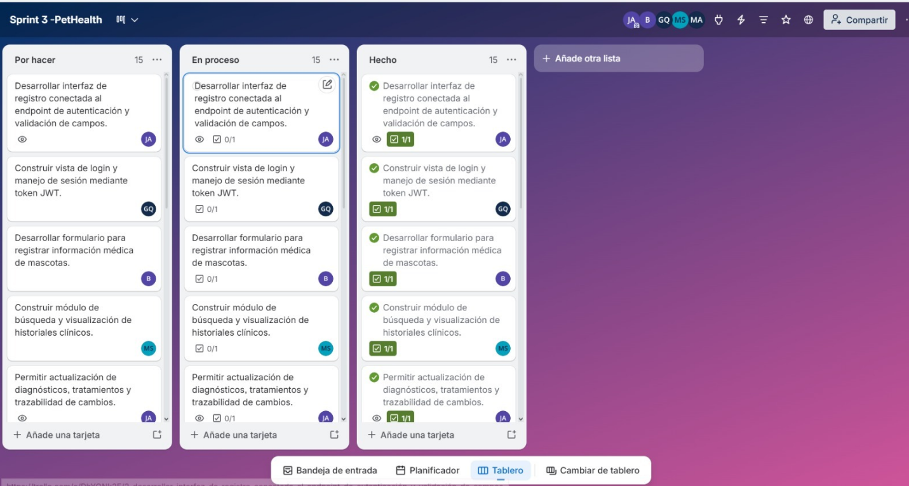

[Ver enlace trello](https://trello.com/invite/b/6a04c5f0c2abdeec5c930425/ATTIc7eb47f5f43708a30c1456fa6cb7578e00C5BA81/sprint-2-pethealth)

<br>

---

#### 5.2.3.4. Development Evidence for Sprint Review
Durante el Sprint 3 se implementó el back-end de la solución Pawtient, incorporando módulos para la gestión de pacientes, agenda médica, inventario, proveedores y reportes administrativos. El desarrollo se realizó en el repositorio público https://github.com/PetHealt/Pawtient-Web-Services, utilizando un flujo de ramas basado en feature branches (GitFlow).

**Development Evidence – Sprint 1**

| Repository                          | Branch     | Commit Id | Commit Message | Commit Message Body | Committed on (Date) |
|:------------------------------------|:-----------|:---|:---|:---|:--------------------|
| PetHealt/Pawtient-Back-end-Web-app  | v1.0.0     | 202bf69 | fix: update assembly informational version | Refactorización y mejora de estructura del módulo store. | 16/06/2026          |
| PetHealt/Pawtient-Back-end-Web-app | v1.0.0     | 31ef079 | feat: add report application boundend context application and interfaces | Implementación de vista dashboard para facturación y reportes. | 16/06/2026          |
| PetHealt/Pawtient-Back-end-Web-app | v1.0.0     | 5df53d2 | fix: update assembly informational version | Integración del servicio API para reportes. | 12/06/2026          |
| PetHealt/Pawtient-Back-end-Web-app | v1.0.0     | b97019d | feat:add clinic application adn interfaces | Creación de entidad Report para el dominio de reportes. | 16/06/2026          |
| PetHealt/Pawtient-Back-end-Web-app | v1.0.0     | db5a9bd | feat: add command and query service interfaces for supplier management
| Implementación de carpeta reports y store en la capa de aplicación. | 16/06/2026 |
| PetHealt/Pawtient-Back-end-Web-app | v1.0.0     | 5c03221 |feat: add CreateSupplierResource record for supplier creation
| Adaptación de componentes para compatibilidad con db.json. | 18/06/2026 |
| PetHealt/Pawtient-Back-end-Web-app | main       | e753031 | fix: update database connection string in appsettings.json | Finalización e integración del módulo store. | 16/06/20266         |
| PetHealt/Pawtient-Back-end-Web-app | v1.0.0     | 9c0098d | feat: add CreateProductResource record for product creation
| Creación de estructura inicial del módulo clinic. | 18/06/2026 |
| PetHealt/Pawtient-Back-end-Web-app | develop    | 515b398 | refactor: reorganize DbSet properties and update entity configurations in AppDbContext
| Actualización de detalles del perfil de usuario. | 18/06/2026 |
| PetHealt/Pawtient-Back-end-Web-app | develop    | 5b94912 |feat: add invoice management functionality with command and query services
| Implementación de ruta de perfil y actualización del guard de autenticación. | 18/06/2026 |
| PetHealt/Pawtient-Back-end-Web-app | v1.0.0     | 2fb2f4e |Integración limpia de clinic: descartar archivos de compilación
| Creación de servicio API para actualización de perfiles. | 15/06/2026 |
| PetHealt/Pawtient-Back-end-Web-app | develop    | c996f10 | fix password in appsettings
| Implementación del store de perfiles y funcionalidad loadProfile. | 18/06/2026 |
| PetHealt/Pawtient-Back-end-Web-app | v1.0.0     | 433edc4 | feat: one users endpoint example added
| Implementación de edición persistente de perfiles. | 15/06/2026 |
| PetHealt/Pawtient-Back-end-Web-app | develop    | 9dc0f0a | feat: mysql database connection and entitys creation
| Creación de formulario de edición con validaciones. | 18/06/2026 |
| PetHealt/Pawtient-Back-end-Web-app | develop    | dce1a16 | Update README.md | Implementación de componente de visualización de perfil. | 12/06/2026          |
| PetHealt/Pawtient-Back-end-Web-app | develop    | be30e5f | feat: implement product and supplier management services and controllers
| Creación de entidad Profile y componente de detalles. | 18/06/2026 |

<br>

---

#### 5.2.3.5. Execution Evidence for Sprint Review
Durante el Sprint 1 se implementó la Landing Page de la plataforma Pawtient, cumpliendo satisfactoriamente con los objetivos definidos en el Sprint Backlog.
La Landing Page constituye el primer punto de interacción con los usuarios, mostrando de forma clara la propuesta de valor dual de la plataforma: herramientas de gestión clínica e inventario para centros veterinarios (B2B) y seguimiento médico para dueños de mascotas (B2C).
Luego en el Sprint 2 se implemento el Front End de la Plataforma Pawtient, siguiendo la estructura de domain driven design.
Y en este Sprint 3 se realizo la creación de la Primera versión del Back End en el cual se ha realizado todo de acordo a lo que se ha establezido en un principio, asimismo tambien se ha realizado el Deploy de nuestro Backend y la Conexión con nuestro Front End.

El desarrollo tecnológico se centró en realizar el Backend y la conexión con el Front End.
A continuación las Evidencias:

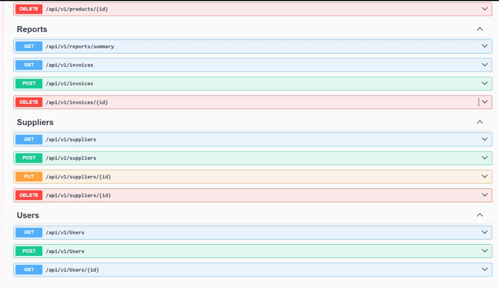
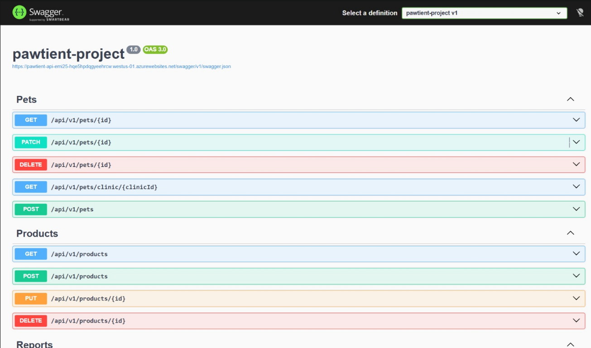
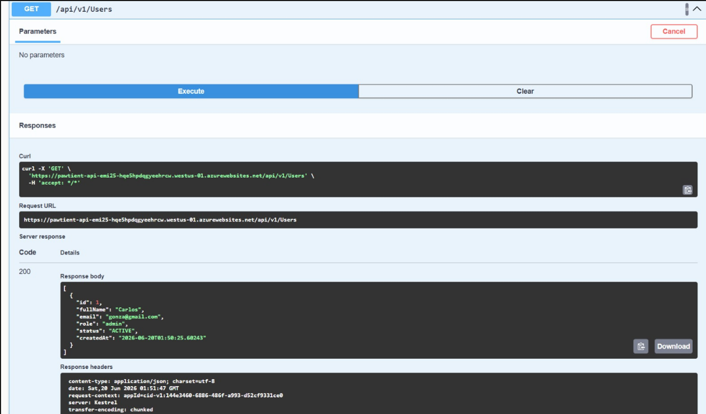

<br>

---

#### 5.2.3.6. Services Documentation Evidence for Sprint Review
Durante el Sprint 3, el esfuerzo técnico y el alcance principal se centraron exclusivamente en el diseño, implementación y despliegue del Back End.

Por ende, luego de haber realizado el diseño del Backend Hemos podido llegar a una de las ultimas partes de nuestro proyecto que es la conexión entre el Front End y el Back End, esto hace 
que ya se tenga una primera parte de nuestro proyecto general, para que posteriormente se pueda transmitir nuestro proyecto a nuestros segmentos usuarios establecidos.
<br>

---

#### 5.2.3.7. Software Deployment Evidence for Sprint Review
Durante el Sprint 3 se realizó el despliegue exitoso de la primera versión del Back End en la plataforma Azure, utilizando el repositorio PetHealt/Pawtient-Web-Services.
Se optó por Azure debido a su facilidad para implementar Continuous Deployment (CD) desde GitHub. 

Proceso seguido

URL del despliegue: [Click Aqui](https://pawtient-api-emi25-hqe5hpdqgyeehrcw.westus-01.azurewebsites.net/swagger/index.html)


Evidencias
A continuación, se presentan las capturas de pantalla que documentan el estado de nuestro Back End.

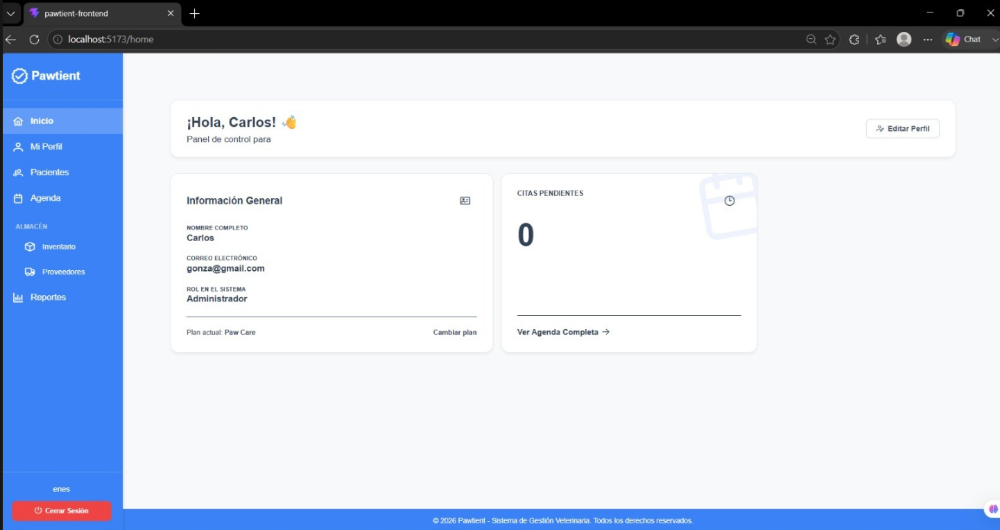

<br>

---

## 5.3. Validation Interviews

### 5.3.1. Diseño de Entrevistas

<br>

---

### 5.3.2. Registro de Entrevistas

<br>

---

### 5.3.3. Evaluaciones según heurísticas

<br>


---

## 5.4. Video About-the-Product

<br>

---

## Conclusiones


1. 

2. 

3. 

4. 

5. 

6. 
 

<br>

---

## Recomendaciones

1. 

2. 

3. 

4. 

5. 

6. 

7. 


<br>

---

## Video About-The-Team


<br>

---

## Bibliografía

1. Cedeño Ochoa, A., Catuto Murillo, A., & Rodas-Silva, J. (31 de agosto de 2020). *Use of Web applications for the management of veterinary clinics and their impact on the improvement of administrative processes*. Portal AmeliCA. https://portal.amelica.org/ameli/jatsRepo/606/6062739010/index.html
2. Chacon, S., & Straub, B. (2014). *Pro Git* (2nd ed.). Apress. https://git-scm.com/book/en/v2
3. Evans, E. (2004). *Domain-Driven Design: Tackling Complexity in the Heart of Software*. Addison-Wesley Professional.
4. Gutiérrez Lerma, R. A. (5 de octubre de 2024). *Los principales problemas con clientes y motivos de insatisfacción en clínicas veterinarias*. VetStrategies Consulting. https://www.vetstrategiesconsulting.com/blog/los-principales-problemas-con-clientes-y-motivos-de-insatisfaccion-en-clinicas-veterinarias
5. Lolimsa. (12 de marzo de 2024). *Problemas comunes en clínicas veterinarias y cómo prevenirlos*. Lolimsa Blog. https://www.lolimsa.com.pe/blog/problemas-comunes-en-clinicas-veterinarias-y-como-prevenirlos/
6. Schwaber, K., & Sutherland, J. (2020). *The Scrum Guide*. Scrum.org. https://scrumguides.org/scrum-guide.html
7. W3C. (2023). *HTML5 Semantic Elements*. World Wide Web Consortium. https://www.w3.org/TR/html52/

<br>

---

## Anexos
- Landing page: desplegada en Netlify [https://pethealt.netlify.app/](https://pethealt.netlify.app/)
- Video de exposición [Click Aqui](https://upcedupe-my.sharepoint.com/:v:/g/personal/u202315007_upc_edu_pe/IQDjBMv1FAbeT7vu70wgG-jjAUtpp41LDZw-REsa8JLOJ3U?e=mhXlkB&nav=eyJyZWZlcnJhbEluZm8iOnsicmVmZXJyYWxBcHAiOiJTdHJlYW1XZWJBcHAiLCJyZWZlcnJhbFZpZXciOiJTaGFyZURpYWxvZy1MaW5rIiwicmVmZXJyYWxBcHBQbGF0Zm9ybSI6IldlYiIsInJlZmVycmFsTW9kZSI6InZpZXcifX0%3D)
- Prototipo web [Click Aqui](https://upcedupe-my.sharepoint.com/:v:/g/personal/u202315007_upc_edu_pe/IQCmFsBAO3FvTpMOpMAylR0gAUDFExNbahk7ihbfPEj4jSI?e=BnRltz&nav=eyJyZWZlcnJhbEluZm8iOnsicmVmZXJyYWxBcHAiOiJTdHJlYW1XZWJBcHAiLCJyZWZlcnJhbFZpZXciOiJTaGFyZURpYWxvZy1MaW5rIiwicmVmZXJyYWxBcHBQbGF0Zm9ybSI6IldlYiIsInJlZmVycmFsTW9kZSI6InZpZXcifX0%3D)
