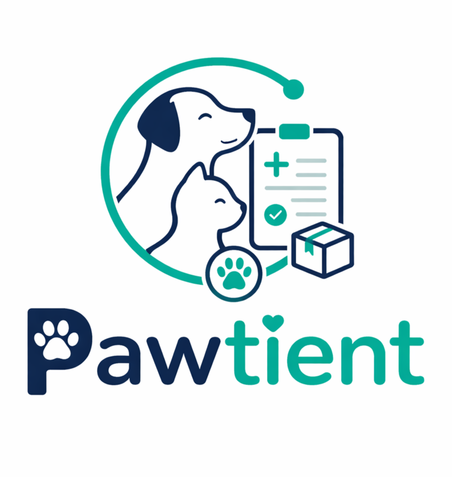
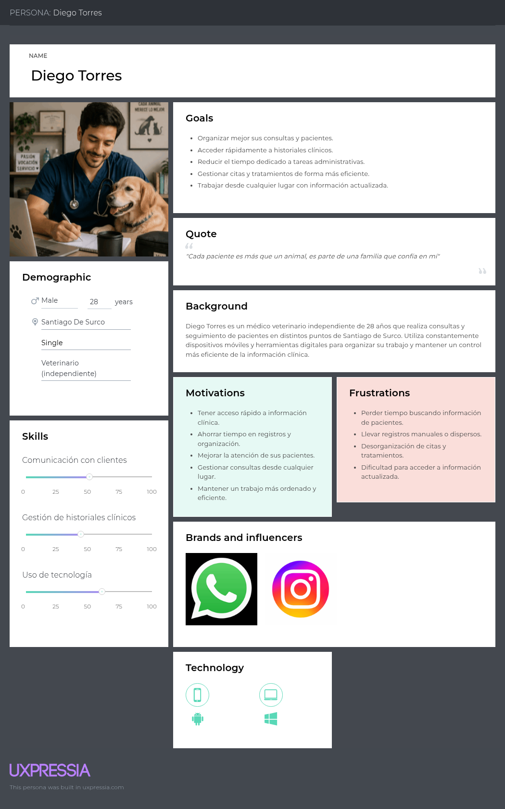
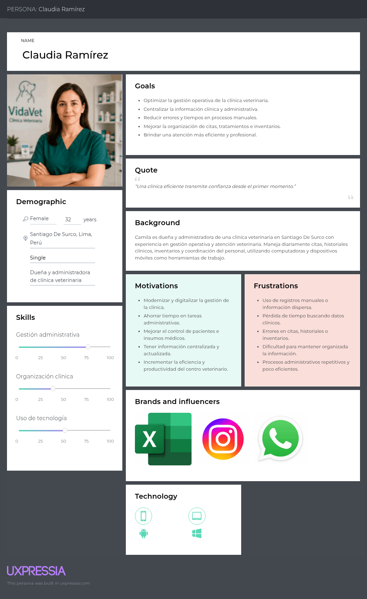

<div align="center">

<br>


# Universidad Peruana de Ciencias Aplicadas
### Facultad de Ingeniería · Ciclo 2026-10

<br>

# Informe de Proyecto - Avance 1

## Presentado por ´PetHealt Team´




## Startup: Pawtient

*Sistema de gestión de clínicas veterinarias*

<br>

**Código del Curso:** 1ASI0730 &nbsp;|&nbsp; **Nombre del Curso:** Aplicaciones Web

**NRC:** `10203`

**Profesor:** Alex Humberto Sánchez Ponce

<br>

### Integrantes de ´PetHealt Team´

`U202410239` - `Salinas Guzmán, Brianna Cristina`

`U202315007` - `Quintanilla Pozo, Gonzalo Samuel`

`U202315171` - `Salazar Miranda, Mateo Paolo`

`U202311469` - `Arroyo Gonzales, Emily Juliette`

`U202314898` - `Acuache Lucas, Mathias Joaquin`

### **Abril 2026**

</div>

---

<br>
<div align="center">
  
## Registro de Versiones del Informe

| Versión | Fecha | Participantes | Descripción de modificación |
|:-------:|:-----:|:-----:|:---------------------------|
| AV1 | 2026-04-08 | Salinas Guzmán, Brianna Cristina <br> Quintanilla Pozo, Gonzalo Samuel <br> Salazar Miranda, Mateo Paolo <br> Arroyo Gonzales, Emily Juliette <br> Acuache Lucas, Mathias Joaquin | Avance 1 del reporte del proyecto y primera versión de la landing page |
| | | | |

</div>

---

<br>

## Project Report Collaboration Insights

**URL del Repositorio:** [`https://github.com/PetHealt/Pawtient-report.git`](https://github.com/PetHealt/Pawtient-report.git)

*(Esta sección se irá expandiendo con cada entrega)*

---

<br>

## Tabla de Contenidos
  #### [Contenido](#-tabla-de-contenidos)
  #### [Student Outcome](#-student-outcome)

  #### [Capítulo I: Introducción](#capítulo-i-introducción-1)
  - [1.1. Startup Profile](#11-startup-profile)
    - [1.1.1. Descripción de la Startup](#111-descripción-de-la-startup)
    - [1.1.2. Perfiles de integrantes del equipo](#112-perfiles-de-integrantes-del-equipo)
  - [1.2. Solution Profile](#12-solution-profile)
    - [1.2.1. Antecedentes y problemática](#121-antecedentes-y-problemática)
    - [1.2.2. Lean UX Process](#122-lean-ux-process)
      - [1.2.2.1. Lean UX Problem Statements](#1221-lean-ux-problem-statements)
      - [1.2.2.2. Lean UX Assumptions](#1222-lean-ux-assumptions)
      - [1.2.2.3. Lean UX Hypothesis Statements](#1223-lean-ux-hypothesis-statements)
      - [1.2.2.4. Lean UX Canvas](#1224-lean-ux-canvas)
  - [1.3. Segmentos objetivo](#13-segmentos-objetivo)
 
  #### [Capítulo II: Requirements Elicitation & Analysis](#capítulo-ii-requirements-elicitation--analysis-1)
  - [2.1. Competidores](#21-competidores)
    - [2.1.1. Análisis competitivo](#211-análisis-competitivo)
    - [2.1.2. Estrategias y tácticas frente a competidores](#212-estrategias-y-tácticas-frente-a-competidores)
  - [2.2. Entrevistas](#22-entrevistas)
    - [2.2.1. Diseño de entrevistas](#221-diseño-de-entrevistas)
    - [2.2.2. Registro de entrevistas](#222-registro-de-entrevistas)
    - [2.2.3. Análisis de entrevistas](#223-análisis-de-entrevistas)
  - [2.3. Needfinding](#23-needfinding)
    - [2.3.1. User Personas](#231-user-personas)
    - [2.3.2. User Task Matrix](#232-user-task-matrix)
    - [2.3.3. User Journey Mapping](#233-user-journey-mapping)
    - [2.3.4. Empathy Mapping](#234-empathy-mapping)
  - [2.4. Big Picture Event Storming](#24-big-picture-event-storming)
  - [2.5. Ubiquitous Language](#25-ubiquitous-language)
    
  #### [Capítulo III: Requirements Specification](#capítulo-iii-requirements-specification-1)
  - [3.1. User Stories](#31-user-stories)
  - [3.2. Impact Mapping](#32-impact-mapping)
  - [3.3. Product Backlog](#33-product-backlog)
    
  #### [Capítulo IV: Product Design](#capítulo-iv-product-design-1)
  - [4.1. Style Guidelines](#41-style-guidelines)
    - [4.1.1. General Style Guidelines](#411-general-style-guidelines)
    - [4.1.2. Web Style Guidelines](#412-web-style-guidelines)
  - [4.2. Information Architecture](#42-information-architecture)
    - [4.2.1. Organization Systems](#421-organization-systems)
    - [4.2.2. Labeling Systems](#422-labeling-systems)
    - [4.2.3. SEO Tags and Meta Tags](#423-seo-tags-and-meta-tags)
    - [4.2.4. Searching Systems](#424-searching-systems)
    - [4.2.5. Navigation Systems](#425-navigation-systems)
  - [4.3. Landing Page UI Design](#43-landing-page-ui-design)
    - [4.3.1. Landing Page Wireframe](#431-landing-page-wireframe)
    - [4.3.2. Landing Page Mock-up](#432-landing-page-mock-up)
  - [4.4. Web Applications UX/UI Design](#44-web-applications-uxui-design)
    - [4.4.1. Web Applications Wireframes](#441-web-applications-wireframes)
    - [4.4.2. Web Applications Wireflow Diagrams](#442-web-applications-wireflow-diagrams)
    - [4.4.3. Web Applications Mock-ups](#443-web-applications-mock-ups)
    - [4.4.4. Web Applications User Flow Diagrams](#444-web-applications-user-flow-diagrams)
  - [4.5. Web Applications Prototyping](#45-web-applications-prototyping)
  - [4.6. Domain-Driven Software Architecture](#46-domain-driven-software-architecture)
    - [4.6.1. Design-Level Event Storming](#461-design-level-event-storming)
    - [4.6.2. Software Architecture Context Diagram](#462-software-architecture-context-diagram)
    - [4.6.3. Software Architecture Container Diagrams](#463-software-architecture-container-diagrams)
    - [4.6.4. Software Architecture Components Diagrams](#464-software-architecture-components-diagrams)
  - [4.7. Software Object-Oriented Design](#47-software-object-oriented-design)
    - [4.7.1. Class Diagrams](#471-class-diagrams)
  - [4.8. Database Design](#48-database-design)
    - [4.8.1. Database Diagrams](#481-database-diagrams)
      
  #### [Capítulo V: Product Implementation, Validation & Deployment](#capítulo-v-product-implementation-validation--deployment-1)
  - [5.1. Software Configuration Management](#51-software-configuration-management)
    - [5.1.1. Software Development Environment Configuration](#511-software-development-environment-configuration)
    - [5.1.2. Source Code Management](#512-source-code-management)
    - [5.1.3. Source Code Style Guide & Conventions](#513-source-code-style-guide--conventions)
    - [5.1.4. Software Deployment Configuration](#514-software-deployment-configuration)
  - [5.2. Landing Page, Services & Applications Implementation](#52-landing-page-services--applications-implementation)
    - [5.2.1. Sprint 1](#521-sprint-1)
  - [5.3. Validation Interviews](#53-validation-interviews)
  - [5.4. Video About-the-Product](#54-video-about-the-product)
    
  #### [Conclusiones](#conclusiones-1)
  
  #### [Recomendaciones](#recomendaciones-1)

  #### [Video About-the-Team](#video-about-the-team-1)
  
  #### [Bibliografía](#-bibliografía)
  
  #### [Anexos](#anexos-1)

---

<br>

## Student Outcome

En el siguiente cuadro se describen las acciones realizadas y enunciados de conclusiones que permiten sustentar el logro alcanzado.

| Criterio específico | Acciones realizadas | Conclusiones |
|:---|:---|:---|
| **5.c1. Trabaja en equipo para proporcionar liderazgo en forma conjunta.** | **Salinas Guzmán, Brianna** <br> AV1: (acción específica) <br><br> **Quintanilla Pozo, Gonzalo** <br> AV1: (acción específica) <br><br> **Salazar Miranda, Mateo** <br> AV1: (acción específica) <br><br> **Arroyo Gonzales, Emily** <br> AV1: (acción específica) <br><br> **Acuache Lucas, Mathias** <br> AV1: (acción específica) | (Completar de forma grupal en cada entrega) |
| **5.c2. Crea un entorno colaborativo e inclusivo, establece metas, planifica tareas y cumple objetivos** | **Salinas Guzmán, Brianna** <br> AV1: (acción específica) <br><br> **Quintanilla Pozo, Gonzalo** <br> AV1: (acción específica) <br><br> **Salazar Miranda, Mateo** <br> AV1: (acción específica) <br><br> **Arroyo Gonzales, Emily** <br> AV1: (acción específica) <br><br> **Acuache Lucas, Mathias** <br> AV1: (acción específica) | (Completar de forma grupal en cada entrega) |

---

<div align="center">

# Capítulo I: Introducción

</div>

---

## 1.1. Startup Profile

### 1.1.1. Descripción de la Startup

**PetHealth** es una startup tecnológica enfocada en la modernización del sector veterinario mediante soluciones digitales. Nuestro producto principal, **Pawtient**, es una plataforma web diseñada para gestionar la información médica de las mascotas, facilitando el registro de consultas, el seguimiento de tratamientos y el control de historiales clínicos. A través de esta solución, se conecta al personal de las clínicas veterinarias con los dueños de mascotas en un mismo sistema, facilitando la comunicación y el acceso a la información, mejorando la organización de los datos, la gestión de insumos médicos y el monitoreo continuo de cada paciente.


- **Misión:** Desarrollar soluciones digitales que mejoren la gestión de los centros veterinarios, facilitando el acceso y control de la información clínica, así como promoviendo una mejor comunicación entre la parte profesional y los dueños de mascotas para brindar una atención de mejor calidad.


- **Visión:** Posicionarnos como una startup líder en soluciones tecnológicas para el sector veterinario en Latinoamérica, destacando por una gestión más eficiente y moderna de la salud animal mediante el uso de herramientas digitales.

---

###   1.1.2. Perfiles de integrantes del equipo

|                                        Miembro                                         |                                                                                                                                                                                                                                                                                                                                                Descripción                                                                                                                                                                                                                                                                                                                                                |
|:--------------------------------------------------------------------------------------:|:---------------------------------------------------------------------------------------------------------------------------------------------------------------------------------------------------------------------------------------------------------------------------------------------------------------------------------------------------------------------------------------------------------------------------------------------------------------------------------------------------------------------------------------------------------------------------------------------------------------------------------------------------------------------------------------------------------:|
|  |                                                                                                                                                                                            **Gonzalo Samuel Quintanilla Pozo \- U202315007** <br>  Soy estudiante de la carrera de Ingeniería de Software en la UPC y tengo 20 años, como compañero me gusta apoyar y tomar iniciativa en trabajos grupales. Me especializo en los lenguajes CSS, Java y Python. Tengo experiencia desarrollando páginas web.                                                                                                                                                                                             |
|             |                                                                                                                                                   **Mathias Joaquin Acuache Lucas \- U202314898** <br> Soy Mathias Joaquin Acuache Lucas, me encuentro en el sexto ciclo de la carrera de ingeniería de software, mi código de alumno es u202314898. Tengo experiencia en C++, SQL, MongoDB, además de utilizar GitHub de manera correcta . Me considero una persona que trata de apoyar en los diversos trabajos en equipo e investigar cosas nuevas.                                                                                                                                                    |
|             | **Brianna Cristina Salinas Guzman \- U202410239** <br> Soy estudiante de Ingeniería de Software con conocimientos en desarrollo de aplicaciones, estructuras de datos y programación orientada a objetos. Tengo experiencia trabajando con lenguajes como C++, Pyhton, SQL para base de datos y en la gestión de proyectos utilizando Git y GitHub para el control de versiones. Además, cuento con formación complementaria en marketing digital, lo que me permite aportar una perspectiva orientada al usuario y al posicionamiento del producto. Me considero una persona responsable, con capacidad de aprendizaje autónomo y habilidades para trabajar en equipo y comunicar ideas de manera clara. | 
|             |                                                                                                                                                                                                                                                                                                                          **Mateo Paolo Salazar Miranda \- U202315171**   <br>  -                                                                                                                                                                                                                                                                                                                          | 
|    |                                                                                                                                                                                                            **Emily Juliette Arroyo Gonzales \- U202311469**  <br> Soy estudiante de la carrera de Ingeniería de Software, tengo 20 años, tengo experiencia en lenguajes como C++, MongoDB, en trabajos grupales me gusta aportar ideas que contribuyan a mi grupo y avanzar según lo asignado.                                                                                                                                                                                                            | 

---

## 1.2. Solution Profile

### 1.2.1. Antecedentes y problemática

#### What? (¿Qué?)


#### ¿Cuál es el problema?


El problema es que en muchos centros veterinarios la información médica aún se gestiona de forma desordenada o poco organizada, con historiales clínicos dispersos y un control limitado de los insumos. Esto hace que sea más difícil dar un seguimiento adecuado a la salud de las mascotas, afectando la calidad de la atención y reduciendo la confianza de los dueños en el servicio.


#### When? (¿Cuándo?)


#### ¿Cuándo ocurre el problema?


El problema ocurre principalmente durante el registro de consultas, el seguimiento de tratamientos y la gestión de insumos médicos, sobre todo cuando la información se maneja de forma manual o no se actualiza a tiempo, lo que aumenta el riesgo de errores e inconsistencias.


#### Where? (¿Dónde?)


#### ¿Dónde surge el problema?


El problema surge en los procesos internos de la gestión clínica y administrativa dentro de los centros veterinarios, donde la información suele manejarse de forma poco organizada o no centralizada.


#### ¿En qué tipo de centros o contextos ocurre esta problemática?


Se presenta principalmente en centros veterinarios pequeños y medianos, donde aún se utilizan registros manuales o herramientas poco integradas. Sin embargo, también puede darse en centros más grandes que no cuentan con sistemas unificados, lo que dificulta el acceso oportuno a la información y su correcta gestión.


#### Who? (¿Quién?)


#### ¿Quiénes son los principales afectados por esta problemática?


Los principales afectados son el personal de las clínicas veterinarias y los dueños de mascotas. El personal clínico enfrenta dificultades para acceder a información completa y actualizada, así como para gestionar insumos y operaciones de manera eficiente. Por su parte, los dueños de mascotas tienen un acceso limitado al seguimiento de sus animales y a información clara sobre la atención, lo que puede afectar su confianza en el servicio.


#### ¿Quién lo utilizará?


El sistema será utilizado por el personal de las clínicas veterinarias para registrar diagnósticos, gestionar tratamientos, supervisar operaciones y controlar insumos. Por su parte, los dueños de mascotas lo utilizarán para consultar el historial médico y dar seguimiento al estado de salud de sus mascotas.

#### Why? (¿Por qué?)


#### ¿Cuál es la causa del problema?


La principal causa es la falta de digitalización e integración de los procesos dentro de los centros veterinarios, lo que hace que la información se maneje de forma desorganizada, se generen errores en los registros y exista poca comunicación entre los distintos usuarios. Como consecuencia, se dificulta la toma de decisiones, el control de los recursos y la calidad de la atención.


#### How? (¿Cómo?)


#### ¿En qué condiciones los usuarios usarán nuestro producto?


Los usuarios utilizarán la plataforma en sus actividades diarias. El personal de las clínicas veterinarias la empleará durante la atención para registrar diagnósticos, gestionar tratamientos, supervisar insumos y consultar información en tiempo real. Por su parte, los dueños de mascotas la utilizarán para revisar el historial médico, dar seguimiento al estado de sus animales y conocer la información de los profesionales que los atienden.

#### ¿Cómo les gustaría a los usuarios acceder a la plataforma?


Los dueños de mascotas prefieren acceder desde sus teléfonos móviles para consultar rápidamente el historial médico, dar seguimiento al estado de salud de sus mascotas y revisar la información de los profesionales. Por su parte, el personal de las clínicas veterinarias utiliza tanto computadoras como dispositivos móviles, ya que esto les permite registrar información clínica en tiempo real y gestionar tratamientos, insumos y operaciones del centro de forma más eficiente.

#### How much? (¿Cuánto?)


#### ¿Cómo impacta la gestión ineficiente de la información clínica y de los insumos médicos en la calidad de atención en las clínicas veterinarias?


Esto impacta de manera significativa en la calidad de atención en las clínicas o centros veterinarios, ya que el manejo manual y no centralizado de los datos puede generar pérdida, duplicidad y dificultad en el acceso a los registros clínicos, afectando el seguimiento adecuado de los pacientes.


De acuerdo con Cedeno Ochoa et al. (2021), en muchos centros veterinarios la información aún se gestiona de forma manual, lo que dificulta la organización de los expedientes y puede ocasionar errores en los registros. Asimismo, la implementación de herramientas digitales permite reducir el tiempo de atención y mejorar la eficiencia en los procesos administrativos.


En el contexto peruano, Lolimsa (2024) señala que una inadecuada gestión en centros veterinarios, especialmente en el manejo de información e insumos, puede generar retrasos de atención, desorganización y una disminución en la calidad del servicio. En este sentido, la falta de digitalización impacta negativamente, mientras que soluciones como Pawtient permiten optimizar procesos, reducir errores y ofrecer una atención más eficiente y confiable.

---

### 1.2.2. Lean UX Process

El proceso de Lean UX es una metodología de diseño enfocada en el usuario que busca mejorar continuamente el producto a partir de la prueba de ideas, la evaluación y la retroalimentación constante. En el caso de Pawtient, se aplicará para entender mejor las necesidades del personal clínico y dueños de mascotas, permitiendo ajustar la plataforma en función de su uso real y mejorar su experiencia de manera progresiva.

#### 1.2.2.1. Lean UX Problem Statements

Nuestro sistema busca mejorar la forma en que los centros veterinarios gestionan su información clínica, facilitando el acceso a datos y control de sus procesos.


Hemos observado que en muchos centros la información se maneja de forma manual o mediante sistemas no integrados, lo que dificulta el acceso a datos actualizados, el seguimiento de historiales y la correcta gestión de los insumos médicos.


**¿Cómo podemos lograr que los centros veterinarios gestionen su información clínica y sus insumos de manera más organizada, accesible y confiable?**


Nuestro producto también busca mejorar la experiencia de los dueños de mascotas, brindándoles mayor acceso y visibilidad sobre la atención que reciben sus animales.


Actualmente, muchos dueños cuentan con un acceso limitado a la información sobre la salud de sus mascotas y poca visibilidad sobre la experiencia de los veterinarios, lo que puede generar desconfianza.


**¿Cómo podemos facilitar a los dueños de mascotas el acceso a información clara, actualizada y confiable sobre la salud de sus mascotas y la atención brindada?**


Nuestro sistema busca optimizar la gestión de los recursos e insumos dentro de las clínicas veterinarias, mejorando la eficiencia de sus procesos operativos.


Hemos identificado que la gestión de insumos suele realizarse de forma manual o con herramientas poco integradas, lo que genera desorganización, errores en el control de stock y dificultades en la toma de decisiones.


**¿Cómo podemos mejorar el control y la gestión de los recursos e insumos en las clínicas veterinarias para optimizar sus procesos operativos?**

---

#### 1.2.2.2. Lean UX Assumptions

**Business Assumptions:**

1. **Considero que** los centros veterinarios requieren una forma más ordenada y segura de manejar la información clínica y el seguimiento de sus pacientes.
2. **Estas necesidades pueden resolverse con** una plataforma web que centralice historiales médicos, control de insumos y gestión de citas.
3. **Nuestros primeros usuarios serán** el personal clínico de los centros veterinarios, así como los dueños de mascotas interesados en acceder y dar seguimiento a la información de salud de sus mascotas.
4. **El principal beneficio que buscan los usuarios es** mejorar la calidad de atención y tomar decisiones basadas en información actualizada.
5. **El sistema también ofrece** control de inventario, seguimiento de tratamientos y acceso a información del personal veterinario.
6. **La captación de nuestros usuarios será a través de** marketing digital, alianzas con centros veterinarios y recomendaciones dentro del sector.
7. **Generaré ingresos mediante** un modelo de suscripción mensual con diferentes niveles: Paw Basic(5 USD), Paw Care(15 USD), Paw Pro(30 USD).
8. **Mi competencia estará conformada** por otros sistemas de gestión veterinaria y soluciones digitales similares.
9. **Nos diferenciamos por** ofrecer una plataforma fácil de usar, con información centralizada y mayor transparencia para los usuarios.
10. **Mi principal riesgo** será la baja adopción del sistema debido a la resistencia al cambio o poca familiaridad con herramientas digitales.
11. **Abordaremos este riesgo mediante** una interfaz simple, guías de uso dentro de la plataforma y un proceso de adopción progresivo que facilite el uso desde el primer momento.

**User Assumptions:**

**¿Quiénes son nuestros usuarios?**


Los usuarios de Pawtient son centros veterinarios, incluyendo al personal clínico que buscan mejorar la gestión de la información clínica. También participan los dueños de mascotas, quienes necesitan acceder al historial médico de sus mascotas y conocer información sobre la atención y los profesionales que los atienden.


**¿Qué problemas busca resolver nuestro producto?**


Pawtient busca resolver la desorganización en los historiales clínicos, la falta de integración de la información y el control limitado de los insumos médicos. También aborda la poca visibilidad que tienen los dueños de mascotas sobre la salud de sus mascotas y la información de los veterinarios.


**¿En qué momentos y de qué forma se utiliza el producto?**


La plataforma se utiliza durante consultas, seguimiento de tratamientos, gestión de citas y control de insumos. Puede ser accedida desde computadoras o dispositivos móviles, lo que permite trabajar con información en tiempo real desde cualquier lugar.


**¿Cómo se integra la solución en la rutina del usuario?**


El sistema forma parte de la rutina diaria de los centros veterinarios. El personal clínico lo utiliza durante la atención para registrar diagnósticos, hacer seguimiento a los pacientes y gestionar la información y los recursos del centro. Por su parte, los dueños de mascotas lo utilizan para acceder al historial, consultar información y revisar las citas de sus mascotas.

**¿Qué tan sencilla es la adopción de la plataforma?**


La incorporación de la plataforma será progresiva, ya que reemplaza procesos manuales por una solución más organizada. Su diseño simple y fácil de usar permite que los usuarios se adapten rápidamente sin afectar sus actividades habituales.


**¿Qué esperan ver los usuarios en la plataforma?**


La plataforma debe contar con un diseño claro y ordenado, con iconos fáciles de reconocer, colores adecuados y una estructura que facilite la navegación. Esto permite que los usuarios comprendan rápidamente las funciones y puedan interactuar de forma ágil y sencilla.


---

#### 1.2.2.3. Lean UX Hypothesis Statements

- **Hypothesis 01:**

  <br>**Creemos que** el personal clínico mejorará la organización de la información si centraliza los historiales clínicos en una sola plataforma.

  <br>**Sabremos que** hemos tenido éxito.

  <br>**Cuando** encuentren la información más rápido y disminuyan los errores al momento de registrar o consultar datos.


- **Hypothesis 02:**

  <br>**Creemos que** los dueños de mascotas se sentirán más tranquilos con la atención si pueden revisar la información médica de sus mascotas.

  <br>**Sabremos que** hemos tenido éxito.

  <br>**Cuando** consulten el historial de sus mascotas con frecuencia y expresen mayor seguridad en la información recibida.


- **Hypothesis 03:**

  <br>**Creemos que** las notificaciones sobre citas y tratamientos ayudarán a que los usuarios cumplan mejor con estas actividades.

  <br>**Sabremos que** hemos tenido éxito.

  <br>**Cuando** disminuyan las citas perdidas y los usuarios respondan con mayor frecuencia a las notificaciones.


- **Hypothesis 04:**

  <br>**Creemos que** el personal clínico registrará la información más rápido si utilizan formularios dentro de la plataforma.

  <br>**Sabremos que** hemos tenido éxito.

  <br>**Cuando** los registros se completen en menos tiempo y sin repetir información.


- **Hypothesis 05:**

  <br>**Creemos que** mostrar el estado actualizado de las mascotas ayudará a los dueños a tomar mejores decisiones.

  <br>**Sabremos que** hemos tenido éxito.

  <br>**Cuando** los usuarios consulten con frecuencia esta información y la utilicen para el seguimiento de sus mascotas.


- **Hypothesis 06:**

  <br>**Creemos que** mostrar la experiencia y credenciales de los veterinarios generará mayor confianza en los dueños de mascotas.

  <br>**Sabremos que** hemos tenido éxito.

  <br>**Cuando** los usuarios consulten los perfiles de los veterinarios y manifiesten mayor confianza en la atención recibida.

---

#### 1.2.2.4. Lean UX Canvas

El Lean UX Canvas es una herramienta visual que permite organizar y comprender los elementos clave de un producto, enfocándose en el problema, los usuarios y el valor que se busca ofrecer. En el caso de Pawtient, se utiliza para identificar las necesidades del personal clínico y de los dueños de mascotas, y definir cómo la plataforma aporta valor dentro de los centros veterinarios

A continuación, se presenta el Lean UX Canvas de Pawtient:


**Enlace al Lean UX Canvas:** [*Ver en Miro*](https://miro.com/app/board/uXjVGi5z7Cc=/?share_link_id=379450686428)

---

## 1.3. Segmentos objetivo

En el análisis del segmento objetivo para Pawtient, se ha identificado que nuestros principales usuarios serán el personal clínico de los centros veterinarios y los dueños de mascotas.

### Personal de clínico de centros veterinarios

Incluye veterinarios y personal administrativo, quienes necesitan gestionar la información clínica, registrar consultas, controlar insumos y organizar los procesos del centro de forma eficiente.

- **Edad:** 20 a 60 años


- **Necesidad clave:** Centralizar información clínica y optimizar la gestión del centro.


- **Nivel educativo:** Formación técnica o profesional


- **Uso de tecnología:** Uso frecuente de computadoras y dispositivos móviles.

### Dueños de mascotas


Los dueños de mascotas buscan estar informados sobre la salud de sus mascotas y entender mejor la atención que reciben. Muchas veces no cuentan con acceso a esta.


- **Edad:** 18 a 60 años


- **Necesidad clave:** Consultar el estado de salud de sus mascotas.


- **Nivel educativo:** Variado


- **Uso de tecnología:** Uso frecuente de teléfonos móviles.


---


<div align="center">

# Capítulo II: Requirements Elicitation & Analysis

</div>

---

## 2.1. Competidores

> *(Identificar y describir mínimo 3 competidores directos o indirectos con modelos de negocio basados en productos digitales similares)*

### 2.1.1. Análisis competitivo

**¿Por qué llevar a cabo este análisis?**
*(Escribir la pregunta que busca responder o el objetivo de este análisis)*

#### Competitive Analysis Landscape

| | **BrandRadar** | **Competidor 1** | **Competidor 2** | **Competidor 3** |
|:--|:--:|:--:|:--:|:--:|
| **Logo** | *(logo)* | *(logo)* | *(logo)* | *(logo)* |
| **Overview** | | | | |
| **Ventaja competitiva** | | | | |
| **Mercado objetivo** | | | | |
| **Estrategias de marketing** | | | | |
| **Productos & Servicios** | | | | |
| **Precios & Costos** | | | | |
| **Canales de distribución** | | | | |
| **Fortalezas** | | | | |
| **Debilidades** | | | | |
| **Oportunidades** | | | | |
| **Amenazas** | | | | |

---

### 2.1.2. Estrategias y tácticas frente a competidores

*(Describir las estrategias y tácticas preliminares que aplicará el startup para afrontar las fortalezas y aprovechar las debilidades de los competidores, así como el contexto de oportunidades y amenazas)*

---

## 2.2. Entrevistas

> *(Investigación basada en recolección de información mediante entrevistas a representantes de los segmentos objetivo)*

### 2.2.1. Diseño de entrevistas

*(Incluir las preguntas principales y complementarias para entrevistas, dirigidas a cada segmento objetivo)*

**Segmento objetivo 1: `[Nombre del segmento]`**

*Preguntas principales:*
1. *(Pregunta 1)*
2. *(Pregunta 2)*
3. *(Pregunta 3)*

*Preguntas complementarias:*
1. *(Pregunta complementaria 1)*
2. *(Pregunta complementaria 2)*

---

**Segmento objetivo 2: `[Nombre del segmento]`**

*Preguntas principales:*
1. *(Pregunta 1)*
2. *(Pregunta 2)*
3. *(Pregunta 3)*

*Preguntas complementarias:*
1. *(Pregunta complementaria 1)*
2. *(Pregunta complementaria 2)*

---

### 2.2.2. Registro de entrevistas
<div align="center">
  
**Segmento objetivo 1: `nombre del segmento`**

<br>

#### Entrevista 1
*Imagen de la entrevista*


<br>

| Campo | Detalle |
|:------|:--------|
| **Nombres y apellidos** | `[Nombre del entrevistado]` |
| **Edad** | `[Edad]` |
| **Ubicación** | `[Distrito]` |
| **Fecha de entrevista** | `YYYY-MM-DD` |
| **Duración** | `[HH:MM]` |
| **Enlace al video** | [Ver entrevista en Microsoft Stream](`URL`) — Inicia en `[MM:SS]` |

**Resumen:**

</div>

*(Redactar resumen de la entrevista)*

<br>
<div align="center">
  
#### Entrevista 2
*Imagen de la entrevista*


<br>

| Campo | Detalle |
|:------|:--------|
| **Nombres y apellidos** | `[Nombre del entrevistado]` |
| **Edad** | `[Edad]` |
| **Ubicación** | `[Distrito]` |
| **Fecha de entrevista** | `YYYY-MM-DD` |
| **Duración** | `[HH:MM]` |
| **Enlace al video** | [Ver entrevista en Microsoft Stream](`URL`) — Inicia en `[MM:SS]` |

**Resumen:**

</div>

*(Redactar resumen de la entrevista)*

<br>
<div align="center">
  
#### Entrevista 3

*Imagen de la entrevista*


<br>

| Campo | Detalle |
|:------|:--------|
| **Nombres y apellidos** | `[Nombre del entrevistado]` |
| **Edad** | `[Edad]` |
| **Ubicación** | `[Distrito]` |
| **Fecha de entrevista** | `YYYY-MM-DD` |
| **Duración** | `[HH:MM]` |
| **Enlace al video** | [Ver entrevista en Microsoft Stream](`URL`) — Inicia en `[MM:SS]` |

**Resumen:**

</div>

*Redactar resumen de la entrevista*

---
<div align="center">
  
**Segmento objetivo 2: `nombre del segmento`**

<br>

#### Entrevista 1

*Imagen de la entrevista*


<br>

| Campo | Detalle |
|:------|:--------|
| **Nombres y apellidos** | `[Nombre del entrevistado]` |
| **Edad** | `[Edad]` |
| **Ubicación** | `[Distrito]` |
| **Fecha de entrevista** | `YYYY-MM-DD` |
| **Duración** | `[HH:MM]` |
| **Enlace al video** | [Ver entrevista en Microsoft Stream](`URL`) — Inicia en `[MM:SS]` |

**Resumen:**

</div>

*(Redactar de forma descriptiva las respuestas del entrevistado a las preguntas realizadas. Incluir todas las características objetivas y subjetivas: personalidad, marcas e influencias, tecnología, canales de interacción, browser, dispositivos, etc.)*

<br>

<div align="center">
  
#### Entrevista 2

*Imagen de la entrevista*


<br>

| Campo | Detalle |
|:------|:--------|
| **Nombres y apellidos** | `[Nombre del entrevistado]` |
| **Edad** | `[Edad]` |
| **Ubicación** | `[Distrito]` |
| **Fecha de entrevista** | `YYYY-MM-DD` |
| **Duración** | `[HH:MM]` |
| **Enlace al video** | [Ver entrevista en Microsoft Stream](`URL`) — Inicia en `[MM:SS]` |

**Resumen:**

</div>

*(Redactar resumen de la entrevista)*

<br>

<div align="center">

#### Entrevista 3

*Imagen de la entrevista*


<br>

| Campo | Detalle |
|:------|:--------|
| **Nombres y apellidos** | `[Nombre del entrevistado]` |
| **Edad** | `[Edad]` |
| **Ubicación** | `[Distrito]` |
| **Fecha de entrevista** | `YYYY-MM-DD` |
| **Duración** | `[HH:MM]` |
| **Enlace al video** | [Ver entrevista en Microsoft Stream](`URL`) — Inicia en `[MM:SS]` |

**Resumen:**

</div>

*(Redactar resumen de la entrevista)*

---

### 2.2.3. Análisis de entrevistas

> *(Análisis por segmento objetivo con sustento estadístico — porcentajes)*

**Segmento objetivo 1: `[Nombre del segmento]`**

*(Identificar con sustento estadístico todas las características objetivas y subjetivas representativas del segmento, necesarias para la construcción de los arquetipos)*

**Segmento objetivo 2: `[Nombre del segmento]`**

*(Identificar con sustento estadístico todas las características objetivas y subjetivas representativas del segmento, necesarias para la construcción de los arquetipos)*

---

## 2.3. Needfinding

### 2.3.1. User Personas

Los siguientes User Personas se elaboraron a partir de las entrevistas realizadas, representando a los principales segmentos del proyecto. Cada uno sintetiza características, comportamientos y necesidades que orientan el diseño y la propuesta de valor de la plataforma.

User Persona 1: Personal clínico veterinario

Sebastián Navarro es un veterinario joven que trabaja en una clínica y atiende a varios pacientes al día. Su principal reto es organizar la información clínica, gestionar citas e insumos y optimizar su tiempo, por lo que busca herramientas digitales que le permitan trabajar de manera más eficiente.



User Persona 2: Dueña de mascota

Camila Rodríguez es una joven dueña de mascota que busca mantener la salud de su perro bajo control. Su principal dificultad es no contar con información clara y centralizada, por lo que valora soluciones simples que le permitan hacer seguimiento y tomar decisiones con mayor seguridad.



---

### 2.3.2. User Task Matrix

##### User Task Matrix - Personal clínico 

| **Tareas / Tasks**                   | **Frecuencia** | **Importancia** |
|--------------------------------------|----------------|-----------------|
| Registrar historias clínicas         | Alta           | Muy alta        |
| Consultar información de pacientes   | Alta           | Muy alta        |
| Gestionar citas                      | Alta           | Alta            |
| Controlar inventario de insumos      | Media          | Alta            |
| Coordinar atención con clientes      | Alta           | Muy alta        |
| Revisar stock de insumos             | Media          | Alta            |
| Organizar información clínica        | Alta           | Muy alta        |
| Realizar seguimiento de tratamientos | Media          | Alta            |
| Comunicar indicaciones a los dueños  | Alta           | Alta            |

El personal clínico desarrolla tareas constantes enfocadas en el registro, consulta y gestión de información médica, así como en la coordinación de citas y control de insumos. Lo que refleja la necesidad de sistemas que centralicen la información y optimicen el tiempo de trabajo.

##### User Task Matrix - Dueños de mascotas

| **Tareas / Tasks**                          | **Frecuencia** | **Importancia** |
|---------------------------------------------|----------------|-----------------|
| Llevar a su mascota al veterinario          | Media          | Muy alta        |
| Recordar vacunas y tratamiento              | Media          | Muy alta        |
| Consultar información respecto a su mascota | Alta           | Alta            |
| Organizar citas veterinarias                | Media          | Alta            |
| Verificar el estado de salud de su mascota  | Alta           | Muy alta        |
| Revisar historial antes de una consulta     | Baja           | Alta            |
| Comprar productos para su mascota           | Media          | Media           |
| Consultar reseñas de veterinarias           | Alta           | Alta            |
| Registrar o guardar información médica      | Baja           | Alta            |

Los dueños de mascotas realizan actividades para asegurar su bienestar, vigilar su estado y tomar decisiones sobre su salud. Las tareas principales incluyen administrar vacunas, buscar información confiable y agendar visitas, lo que resalta la necesidad de herramientas para llevar un registro y evitar la pérdida de información.

---

### 2.3.3. User Journey Mapping

En el desarrollo de Pawtient, se elaboró un user journey mapping con el fin de comprender como es que interactúan los dueños de mascotas y el personal clínico en el contexto de atención veterinaria. Analizamos las distintas etapas que atraviesan, desde la detección de un problema hasta el seguimiento posterior al tratamiento, identificando dificultades y oportunidades de mejora. Este análisis nos permite plantear una solución que se integra de forma natural en sus actividades diarias, facilitando el acceso a la información, mejorando la organización de los procesos y fortaleciendo la calidad de la atención.

**User Journey Map — Personal clínico**


[Ver Imagen](https://raw.githubusercontent.com/PetHealt/Pawtient-report/refs/heads/feature/sprint1-emily/pawtient-report/assets/images/Journey%20Mapping/Journey-mapping-segment-1.png)

---

**User Journey Map — Dueños de mascotas**


[Ver Imagen](https://raw.githubusercontent.com/PetHealt/Pawtient-report/refs/heads/feature/sprint1-emily/pawtient-report/assets/images/Journey%20Mapping/Journey-mapping-segment-2.png)

---

### 2.3.4. Empathy Mapping

En esta sección se presentarán los Empathy Maps de cada segmento objetivo, construidos a partir de los User Persona previamente definidos. Esta herramienta permite analizar de forma integral lo que los usuarios piensan, sienten, dicen y hacen, facilitando la identificación de sus necesidades, frustraciones y motivaciones. De esta manera, se obtienen insights clave que orientan el diseño de la solución propuesta.

**Empathy Map — Personal clínico**


[Ver Imagen](https://raw.githubusercontent.com/PetHealt/Pawtient-report/refs/heads/feature/sprint1-emily/pawtient-report/assets/images/Empathy%20Mapping/Empathy-map-segment-1.png)

---

**Empathy Map — Dueños de mascotas**


[Ver Imagen](https://raw.githubusercontent.com/PetHealt/Pawtient-report/refs/heads/feature/sprint1-emily/pawtient-report/assets/images/Empathy%20Mapping/Empathy-map-segment-2.png)

---

## 2.4. Big Picture Event Storming

> *(Sesión colaborativa enfocada en entender el dominio del negocio en general. Referencia: https://bit.ly/bpes-guide)*

*(Introducción al proceso realizado y explicación de las etapas)*

*(Capturas del Big Picture Event Storming elaborado en LucidChart / Miro)*


*(Explicación de los eventos, actores y flujos identificados)*

---

## 2.5. Ubiquitous Language


---

<div align="center">

# Capítulo III: Requirements Specification

</div>

---

## 3.1. User Stories

*(Introducción a los User Stories y Epics definidos)*

> **Nota:** Los criterios de aceptación se redactan en tiempo presente, tercera persona, sin referencia a detalles de interfaz de usuario, y siguen la estructura **Gherkin (Given-When-Then)**.

| Epic / Story ID | Título | Descripción | Criterios de Aceptación | Relacionado con (Epic ID) |
|:---------------:|:------:|:------------|:------------------------|:-------------------------:|
| **EP01** | `[Título del Epic 1]` | *(Descripción del Epic)* | — | — |
| US01 | `[Título de User Story]` | Como `[rol]`, deseo `[acción]`, para `[beneficio]`. | **Scenario 1:** `[Nombre]` <br> **Given** `[contexto]` <br> **When** `[acción]` <br> **Then** `[resultado esperado]` | EP01 |
| US02 | `[Título de User Story]` | Como `[rol]`, deseo `[acción]`, para `[beneficio]`. | **Scenario 1:** `[Nombre]` <br> **Given** `[contexto]` <br> **When** `[acción]` <br> **Then** `[resultado esperado]` | EP01 |
| **EP02** | `[Título del Epic 2]` | *(Descripción del Epic)* | — | — |
| US03 | `[Título de User Story]` | Como `[rol]`, deseo `[acción]`, para `[beneficio]`. | **Scenario 1:** `[Nombre]` <br> **Given** `[contexto]` <br> **When** `[acción]` <br> **Then** `[resultado esperado]` | EP02 |
| **EP0n** | `[Landing Page Epic]` | *(Epic para user stories del sitio estático)* | — | — |
| US0n | `[User Story Landing Page]` | Como visitante, deseo `[acción]`, para `[beneficio]`. | **Scenario 1:** `[Nombre]` <br> **Given** `[contexto]` <br> **When** `[acción]` <br> **Then** `[resultado esperado]` | EP0n |
| **TS01** | `[Technical Story — API]` | Como Developer, deseo `[endpoint]`, para `[propósito]`. | **Scenario 1:** `[Nombre]` <br> **Given** `[request context]` <br> **When** `[se llama al endpoint]` <br> **Then** `[response esperado]` | — |

---

## 3.2. Impact Mapping

*(Introducción y capturas del Impact Mapping elaborado en la herramienta indicada — UXPressia)*

*(Business Goals deben cumplir criterios SMART. Ejemplo: "Alcanzar los 600 usuarios suscritos al plan A en el lapso de 8 meses.")*


*(Explicación del Impact Map: Business Goals, Actors/Personas, Impacts, Deliverables y User Stories)*

---

## 3.3. Product Backlog

*(Introducción al Product Backlog)*

> **Herramienta utilizada:** `[Pivotal Tracker / JetBrains YouTrack / Jira / Trello]`
>
> **URL del Product Backlog:** [`[URL pública del Product Backlog]`](`[URL]`)

*(Captura del Product Backlog en la herramienta indicada)*


| # Orden | User Story ID | Título | Descripción | Story Points |
|:-------:|:-------------:|:------:|:------------|:------------:|
| 1 | US01 | `[Título]` | Como `[rol]`, deseo `[acción]`, para `[beneficio]`. | `1 / 2 / 3 / 5 / 8` |
| 2 | US02 | `[Título]` | Como `[rol]`, deseo `[acción]`, para `[beneficio]`. | |
| 3 | US03 | `[Título]` | Como `[rol]`, deseo `[acción]`, para `[beneficio]`. | |
| 4 | US04 | `[Título]` | Como `[rol]`, deseo `[acción]`, para `[beneficio]`. | |
| 5 | US05 | `[Título]` | Como `[rol]`, deseo `[acción]`, para `[beneficio]`. | |
| n | TS01 | `[Technical Story]` | Como Developer, deseo `[endpoint]`, para `[propósito]`. | |

---

<div align="center">

# Capítulo IV: Product Design

</div>

---

## 4.1. Style Guidelines

### 4.1.1. General Style Guidelines

*(Explicar las decisiones y referencias visuales sobre conceptos generales: Branding, Typography, Colors, Spacing y tono de comunicación)*

**Branding**

*(Descripción del branding de BrandRadar: logo, isotipo, naming, y principios de identidad visual)*

**Typography**

| Tipo | Fuente | Uso |
|:-----|:------:|:----|
| Display / Heading | `[Fuente principal]` | Títulos y encabezados |
| Body | `[Fuente secundaria]` | Texto de contenido |
| Monospace | `[Fuente monoespaciada]` | Código y datos técnicos |

**Colors**

| Nombre | Hex | Uso |
|:-------|:---:|:----|
| Primary | `#XXXXXX` | Color principal de la marca |
| Secondary | `#XXXXXX` | Color de apoyo |
| Accent | `#XXXXXX` | Énfasis y llamados a la acción |
| Background | `#XXXXXX` | Fondo general |
| Text | `#XXXXXX` | Texto principal |
| Error | `#XXXXXX` | Estados de error |
| Success | `#XXXXXX` | Estados de éxito |

**Spacing**

*(Describir el sistema de espaciado y las unidades base utilizadas)*

**Tono de comunicación**

| Dimensión | Selección |
|:----------|:---------:|
| Divertido / Serio | *(indicar posición en la escala)* |
| Formal / Casual | *(indicar posición en la escala)* |
| Respetuoso / Irreverente | *(indicar posición en la escala)* |
| Entusiasta / Sereno | *(indicar posición en la escala)* |

---

### 4.1.2. Web Style Guidelines

*(Decisiones sobre los estándares visuales y de interacción para responsive web interfaces)*

*(Incluir capturas o especificaciones visuales del Design System basado en Material Design y Angular Material)*

---

## 4.2. Information Architecture

*(Decisiones que dirigen la organización del contenido en las experiencias web — Landing Page y Web Application)*

### 4.2.1. Organization Systems

*(Explicar en qué grupos de información se aplica cada sistema de organización: jerárquica, secuencial o matricial; y los esquemas de categorización: alfabético, cronológico, por tópicos, según audiencia)*

### 4.2.2. Labeling Systems

*(Especificar las etiquetas a utilizar con el mínimo número de palabras, para representar los conjuntos de información y sus asociaciones)*

| Etiqueta | Descripción del contenido que representa |
|:--------:|:-----------------------------------------|
| `[Etiqueta]` | *(Descripción)* |
| `[Etiqueta]` | *(Descripción)* |
| `[Etiqueta]` | *(Descripción)* |

### 4.2.3. SEO Tags and Meta Tags

**Landing Page**

```html
<title>[Título del Landing Page]</title>
<meta name="description" content="[Descripción del Landing Page]" />
<meta name="keywords" content="[keywords, separadas, por, comas]" />
<meta name="author" content="[Nombre del Startup]" />
```

**Web Application**

```html
<title>[Título de la Web Application]</title>
<meta name="description" content="[Descripción de la Web Application]" />
<meta name="keywords" content="[keywords, separadas, por, comas]" />
<meta name="author" content="[Nombre del Startup]" />
```

### 4.2.4. Searching Systems

*(Describir qué opciones de búsqueda ofrecen las aplicaciones, con qué filtros contará el usuario y cómo lucirán los datos después de la búsqueda)*

### 4.2.5. Navigation Systems

*(Explicar las acciones y técnicas que guiarán a los usuarios a través del Landing Page y las aplicaciones, describiendo cómo recorrerán el contenido)*

---

## 4.3. Landing Page UI Design

*(Introducción explicando cómo se traducen las decisiones de diseño y arquitectura de información)*

### 4.3.1. Landing Page Wireframe

*(Wireframes del Landing Page para Desktop Web Browser y Mobile Web Browser)*

**Desktop Web Browser**


**Mobile Web Browser**


### 4.3.2. Landing Page Mock-up

*(Mock-ups del Landing Page para Desktop y Mobile, con Design System aplicado)*

**Desktop Web Browser**


**Mobile Web Browser**


---

## 4.4. Web Applications UX/UI Design

*(Propuesta visual y de interacción para las aplicaciones web)*

### 4.4.1. Web Applications Wireframes

*(Wireframes de las aplicaciones web con principios de diseño inclusivo y arquitectura de información aplicados)*


### 4.4.2. Web Applications Wireflow Diagrams

*(Un Wireflow por cada User goal, considerando los User Personas definidos)*

**User goal: `[Nombre del User goal]`**

*(Descripción del flujo especificado)*


---

**User goal: `[Nombre del User goal]`**

*(Descripción del flujo especificado)*


### 4.4.3. Web Applications Mock-ups

*(Mock-ups de las aplicaciones web con Design System aplicado)*


### 4.4.4. Web Applications User Flow Diagrams

*(User Flows incluyendo Mock-ups de vistas, happy paths y unhappy paths)*

**User goal: `[Nombre del User goal]`**

*(Descripción de los flujos y condiciones especificadas)*


---

## 4.5. Web Applications Prototyping

*(Introducción explicando los principales criterios para las decisiones de interacción)*

*(Prototipos de UI para Desktop y Mobile Web Browser con simulación de interacción y navegación)*

**Prototipo Desktop**


[Ver video de prototipo Desktop en Microsoft Stream](`URL`)

**Prototipo Mobile**


[Ver video de prototipo Mobile en Microsoft Stream](`URL`)

---

## 4.6. Domain-Driven Software Architecture

### 4.6.1. Design-Level Event Storming

*(Introducción y explicación del proceso de Design-Level EventStorming realizado. Referencia: https://bit.ly/dles-guide)*

*(Capturas del Event Storming elaborado en LucidChart / Miro)*


*(Identificación de Bounded Contexts, Aggregates, Events, Commands and Queries)*

### 4.6.2. Software Architecture Context Diagram

*(Introducción y explicación del Context Diagram — C4 Model elaborado en Structurizr)*

*(El sistema como recuadro central, rodeado por usuarios y sistemas externos con los que interactúa)*


*(Explicación del diagrama)*

### 4.6.3. Software Architecture Container Diagrams

*(Introducción y explicación del Container Diagram — C4 Model)*

*(Elementos de alto nivel de la arquitectura, distribución de responsabilidades, tecnologías y comunicación entre containers)*


*(Explicación del diagrama)*

### 4.6.4. Software Architecture Components Diagrams

*(Component Diagrams para cada Container identificado — C4 Model)*

**Bounded Context: `[Nombre del Bounded Context]`**


*(Explicación de los components, sus responsabilidades y detalles de implementación/tecnología)*

---

## 4.7. Software Object-Oriented Design

*(Introducción resumiendo las principales características de los diagramas)*

### 4.7.1. Class Diagrams

*(Class Diagrams UML para cada bounded context, incluyendo clases, interfaces, enumeraciones, atributos, métodos, scope y relaciones con multiplicidad)*

**Bounded Context: `[Nombre del Bounded Context]`**


*(Explicación del Class Diagram)*

---

## 4.8. Database Design

*(Introducción resumiendo las principales características de los Database Diagrams)*

### 4.8.1. Database Diagrams

*(Database Diagrams para cada bounded context — tablas, columnas, constraints, relaciones)*

**Bounded Context: `[Nombre del Bounded Context]`**


*(Explicación del Database Diagram)*


---

<div align="center">

# Capítulo V: Product Implementation, Validation & Deployment

</div>

---

## 5.1. Software Configuration Management

### 5.1.1. Software Development Environment Configuration

*(Especificar los productos de software que deben utilizar los miembros del equipo para colaborar en el ciclo de vida del producto digital)*

| Categoría | Producto | Propósito | Ruta / URL |
|:----------|:--------:|:---------:|:-----------|
| Project Management | `[Producto]` | `[Descripción del propósito]` | `[URL]` |
| Requirements Management | `[Producto]` | `[Descripción del propósito]` | `[URL]` |
| Product UX/UI Design | Figma | Wireframes, Mockups y Prototipos | https://figma.com |
| Product UX/UI Design | UXPressia | User Personas, Journey Maps, Empathy Maps | https://uxpressia.com |
| Software Development | IntelliJ IDEA / VS Code | Desarrollo de Web Services y Frontend | `[URL de descarga]` |
| Software Development | Angular CLI | Frontend Web Application | https://angular.io |
| Software Development | Spring Boot | RESTful Web Services | https://spring.io |
| Software Deployment | `[Plataforma cloud]` | Despliegue de productos | `[URL]` |
| Software Documentation | Swagger / OpenAPI | Documentación de Web Services | `[URL]` |
| Version Control | Git + GitHub | Control de versiones | https://github.com |

---

### 5.1.2. Source Code Management

*(Medios y esquema de organización para el seguimiento de modificaciones)*

**Organización de GitHub:** [`[URL de la organización]`](`[URL]`)

| Producto | Repositorio | URL |
|:--------:|:-----------:|:----|
| Landing Page | `[nombre-repo]` | `[URL]` |
| Frontend Web Application | `[nombre-repo]` | `[URL]` |
| Web Services (RESTful API) | `[nombre-repo]` | `[URL]` |
| Project Report | `[nombre-repo]` | `[URL]` |

**GitFlow Workflow:**

Se implementará GitFlow con las siguientes ramas:

| Rama | Propósito | Convención de nombre |
|:-----|:---------:|:---------------------|
| `main` | Código en producción | `main` |
| `develop` | Integración de features | `develop` |
| `feature/*` | Desarrollo de características | `feature/[descripción-corta]` |
| `release/*` | Preparación de releases | `release/[versión]` (ej: `release/1.0.0`) |
| `hotfix/*` | Correcciones urgentes en producción | `hotfix/[descripción-corta]` |

**Semantic Versioning:** Se aplica [Semantic Versioning 2.0.0](https://semver.org/) para nombrar los releases (`MAJOR.MINOR.PATCH`).

**Conventional Commits:** Se aplican [Conventional Commits](https://www.conventionalcommits.org/) para los mensajes de commits:

```
<tipo>[ámbito opcional]: <descripción>

Tipos: feat | fix | docs | style | refactor | test | chore
```

---

### 5.1.3. Source Code Style Guide & Conventions

*(Convenciones de nombrado y programación para cada lenguaje utilizado en la solución)*

| Lenguaje / Framework | Convención adoptada | Referencia |
|:--------------------:|:-------------------:|:-----------|
| HTML | HTML Style Guide | https://www.w3schools.com/html/html5_syntax.asp |
| CSS | Google HTML/CSS Style Guide | https://google.github.io/styleguide/htmlcssguide.html |
| JavaScript / TypeScript | Google TypeScript Style Guide | https://google.github.io/styleguide/tsguide.html |
| Angular | Angular coding style guide | https://angular.io/guide/styleguide |
| Java | Google Java Style Guide | https://google.github.io/styleguide/javaguide.html |
| Spring Boot | Spring Boot Features | https://docs.spring.io/spring-boot/docs/current/reference/html/features.html |
| Gherkin (Acceptance Criteria) | Gherkin Conventions | https://specflow.org/gherkin/gherkin-conventions-for-readable-specifications/ |

> **Nota:** Para todos los lenguajes se aplica la nomenclatura en **inglés**.

---

### 5.1.4. Software Deployment Configuration

*(Configuración del despliegue de la solución — pasos necesarios para lograr el despliegue de cada producto)*

**Landing Page:**
*(Describir pasos de despliegue del Landing Page — plataforma, configuración, automatización)*

**Frontend Web Application:**
*(Describir pasos de despliegue de la Web Application — plataforma, configuración, automatización)*

**Web Services (RESTful API):**
*(Describir pasos de despliegue del API — plataforma, configuración, automatización)*

---

## 5.2. Landing Page, Services & Applications Implementation

### 5.2.1. Sprint 1

#### 5.2.1.1. Sprint Planning 1

*(Introducción al Sprint Planning 1)*

| Campo | Detalle |
|:------|:--------|
| **Sprint #** | Sprint 1 |
| **Date** | `YYYY-MM-DD` |
| **Time** | `HH:MM AM/PM` |
| **Location** | `[Descripción de la ubicación — física o virtual]` |
| **Prepared By** | `[Apellido, Nombre — Team Leader]` |
| **Attendees** | `[Apellido1, Nombre1]` / `[Apellido2, Nombre2]` / ... |
| **Sprint 0 Review Summary** | *(Para el primer sprint, describir el estado inicial del proyecto)* |
| **Sprint 0 Retrospective Summary** | *(Para el primer sprint, describir las expectativas del equipo)* |
| **Sprint 1 Goal** | *(Definir el Goal siguiendo la estructura: Our focus is on... We believe it delivers... This will be confirmed when...)* |
| **Sprint 1 Velocity** | `[Story Points que puede aceptar el equipo]` |
| **Sum of Story Points** | `[Suma de Story Points del Sprint]` |

---

#### 5.2.1.2. Aspect Leaders and Collaborators

*(Introducción explicando los principales aspectos del Sprint)*

| Team Member (Last Name, First Name) | GitHub Username | `[Aspecto 1]` | `[Aspecto 2]` | `[Aspecto 3]` | `[Aspecto n]` |
|:-----------------------------------:|:---------------:|:-------------:|:-------------:|:-------------:|:-------------:|
| `[Apellido, Nombre]` | `[username]` | L | C | C | L |
| `[Apellido, Nombre]` | `[username]` | C | L | C | C |
| `[Apellido, Nombre]` | `[username]` | C | C | L | C |
| `[Apellido, Nombre]` | `[username]` | C | C | C | L |
| `[Apellido, Nombre]` | `[username]` | L | C | C | C |

> **L** = Leader &nbsp;|&nbsp; **C** = Collaborator

---

#### 5.2.1.3. Sprint Backlog 1

*(Introducción que resume el objetivo principal del Sprint 1)*

**URL del Board en herramienta de control:** [`[URL pública del Board]`](`[URL]`)

*(Screenshot del Board del Sprint 1)*


| Sprint # | | | | | | | |
|:--------:|---|---|---|---|---|---|---|
| **Sprint 1** | **User Story** | | **Work-Item / Task** | | | | |
| | **ID** | **Título** | **ID** | **Título** | **Descripción** | **Estimación (h)** | **Asignado a** | **Estado** |
| | US01 | `[Título]` | T01 | `[Título del task]` | `[Descripción]` | `[n]` | `[Nombre]` | To-do / In-Process / To-Review / Done |
| | US01 | | T02 | `[Título del task]` | `[Descripción]` | `[n]` | `[Nombre]` | |
| | US02 | `[Título]` | T03 | `[Título del task]` | `[Descripción]` | `[n]` | `[Nombre]` | |

---

#### 5.2.1.4. Development Evidence for Sprint Review

*(Introducción resumiendo los principales avances en implementación del Sprint 1)*

| Repository | Branch | Commit ID | Commit Message | Commit Message Body | Committed on (Date) |
|:----------:|:------:|:---------:|:--------------:|:-------------------:|:-------------------:|
| `[user/repo]` | `[branch]` | `[commit-id]` | `[mensaje]` | `[cuerpo]` | `YYYY-MM-DD` |
| | | | | | |

---

#### 5.2.1.5. Execution Evidence for Sprint Review

*(Resumen de lo alcanzado en el Sprint 1 — screenshots de vistas implementadas)*

*(Descripción de las vistas implementadas)*


[Ver video de ejecución Sprint 1](`URL`)

---

#### 5.2.1.6. Services Documentation Evidence for Sprint Review

*(Introducción resumiendo los logros de Documentación de Web Services para el Sprint 1)*

> *(Para el Sprint 1, enfocado en Landing Page, puede no aplicar. Documentar si se implementaron endpoints)*

| Endpoint | Acción | Verbo HTTP | Sintaxis | Parámetros | Response ejemplo | URL documentación |
|:--------:|:------:|:----------:|:--------:|:----------:|:----------------:|:-----------------:|
| `[endpoint]` | `[acción]` | `GET/POST/PUT/DELETE` | `[sintaxis]` | `[params]` | `[JSON]` | `[URL]` |

---

#### 5.2.1.7. Software Deployment Evidence for Sprint Review

*(Introducción explicando las actividades de despliegue realizadas durante el Sprint 1)*

*(Capturas e instrucciones de los pasos realizados durante el Sprint: creación de cuentas, configuración de recursos en cloud, configuración de proyectos)*


---

#### 5.2.1.8. Team Collaboration Insights during Sprint

*(Descripción de las actividades de implementación y capturas de analíticos de colaboración en GitHub)*

*(Capturas de analíticos de commits por miembro del equipo en GitHub)*


---

## 5.3. Validation Interviews

### 5.3.1. Diseño de Entrevistas

*(Elementos a incluir en la sesión de validación por segmento objetivo — Landing Page y aplicaciones)*

**Segmento objetivo 1:**
*(Especificar user flows que formarán parte del proceso de validación)*

**Segmento objetivo 2:**
*(Especificar user flows que formarán parte del proceso de validación)*

### 5.3.2. Registro de Entrevistas

*(Para cada segmento se requiere de 3 a 5 entrevistas de validación)*

**Segmento objetivo 1:**

| Campo | Detalle |
|:------|:--------|
| **Nombres y apellidos** | `[Nombre]` |
| **Edad** | `[Edad]` |
| **Distrito** | `[Distrito]` |
| **Enlace al video** | [Ver en Microsoft Stream](`URL`) — Inicia en `[MM:SS]` |

*(Screenshot del video de validación)*


**Resumen:** *(Descripción de las principales apreciaciones del entrevistado)*

### 5.3.3. Evaluaciones según heurísticas

*(Ver formato completo en el Anexo D del enunciado del proyecto)*

**UX Heuristics & Principles Evaluation**
*Usability – Inclusive Design – Information Architecture*

**Site o App a evaluar:** BrandRadar

**Tareas a evaluar:**
1. *(Tarea 1)*
2. *(Tarea 2)*
3. *(Tarea 3)*

**Escala de Severidad:**

| Nivel | Descripción |
|:-----:|:------------|
| 1 | Problema superficial — puede superarse fácilmente o rara vez ocurre |
| 2 | Problema menor — ocurre con más frecuencia o es algo difícil de superar |
| 3 | Problema mayor — ocurre frecuentemente o los usuarios no pueden resolverlo |
| 4 | Problema muy grave — impide al usuario continuar usando la herramienta |

**Tabla Resumen:**

| # | Problema | Severidad | Heurística / Principio violado |
|:-:|:---------|:---------:|:-------------------------------|
| 1 | *(Descripción del problema)* | `[1-4]` | `[Heurística]` |
| 2 | *(Descripción del problema)* | `[1-4]` | `[Heurística]` |

---

## 5.4. Video About-the-Product

*(Introducción y descripción del Video About-the-Product)*

- **Público objetivo:** Visitantes del Landing Page y usuarios de las aplicaciones
- **Duración:** 1 a 3 minutos
- **URL Microsoft Stream:** [`[Nombre del video]`](`URL`)
- **URL YouTube (para incrustar en Landing Page):** [`[Nombre del video]`](`URL`)

*(Screenshot del video)*


---
<br>

## Conclusiones

*(Esta sección se desarrolla progresivamente en cada entrega)*

## Recomendaciones

*(Esta sección se desarrolla progresivamente en cada entrega)*

## Video About-The-Team

*(Incluir screenshot, URL de Microsoft Stream y YouTube, y timing del video)*

---

<br>

##  Bibliografía

*(Listar referencias en formato APA)*


---

<br>

## Anexos


### Anexo A: Participant Performance Report

*(Adjuntar como documento Word y PDF por separado)*

### Anexo B: Videos de Exposiciones

| Entrega | Título | Enlace |
|:-------:|:------:|:------:|
| AV1 | `upc-pre-202610-1asi0729-[10203]-[pethealt]-expo-av1` | `[URL Microsoft Stream]` |


---

<div align="center">

<br>

*PetHealt · Aplicaciones Web · UPC 2026-10*

</div>
