<div align="center">

<br>


# Universidad Peruana de Ciencias Aplicadas
### Facultad de Ingeniería · Ciclo 2026-10

<br>

# Informe de Proyecto - Avance 1

## Presentado por ´PetHealt Team´


## Startup: Pawtient

*Sistema de gestión de clínicas veterinarias*

<br>

**Código del Curso:** 1ASI0730 &nbsp;|&nbsp; **Nombre del Curso:** Aplicaciones Web

**NRC:** `10203`

**Profesor:** Alex Humberto Sánchez Ponce

<br>

### Integrantes de ´PetHealt Team´

`U202410239` - `Salinas Guzmán, Brianna Cristina`

`U202315007` - `Quintanilla Pozo, Gonzalo Samuel`

`U202315171` - `Salazar Miranda, Mateo Paolo`

`U202311469` - `Arroyo Gonzales, Emily Juliette`

`U202314898` - `Acuache Lucas, Mathias Joaquin`

### **Abril 2026**

</div>

---

<br>
<div align="center">
  
## Registro de Versiones del Informe

| Versión | Fecha | Participantes | Descripción de modificación |
|:-------:|:-----:|:-----:|:---------------------------|
| AV1 | 2026-04-08 | Salinas Guzmán, Brianna Cristina <br> Quintanilla Pozo, Gonzalo Samuel <br> Salazar Miranda, Mateo Paolo <br> Arroyo Gonzales, Emily Juliette <br> Acuache Lucas, Mathias Joaquin | Avance 1 del reporte del proyecto y primera versión de la landing page |
| | | | |

</div>

---

<br>

## Project Report Collaboration Insights

**URL del Repositorio:** [`https://github.com/PetHealt/Pawtient-report.git`](https://github.com/PetHealt/Pawtient-report.git)

*(Esta sección se irá expandiendo con cada entrega)*

---

<br>

## Tabla de Contenidos
  #### [Contenido](#-tabla-de-contenidos)
  #### [Student Outcome](#-student-outcome)

  #### [Capítulo I: Introducción](#capítulo-i-introducción-1)
  - [1.1. Startup Profile](#11-startup-profile)
    - [1.1.1. Descripción de la Startup](#111-descripción-de-la-startup)
    - [1.1.2. Perfiles de integrantes del equipo](#112-perfiles-de-integrantes-del-equipo)
  - [1.2. Solution Profile](#12-solution-profile)
    - [1.2.1. Antecedentes y problemática](#121-antecedentes-y-problemática)
    - [1.2.2. Lean UX Process](#122-lean-ux-process)
      - [1.2.2.1. Lean UX Problem Statements](#1221-lean-ux-problem-statements)
      - [1.2.2.2. Lean UX Assumptions](#1222-lean-ux-assumptions)
      - [1.2.2.3. Lean UX Hypothesis Statements](#1223-lean-ux-hypothesis-statements)
      - [1.2.2.4. Lean UX Canvas](#1224-lean-ux-canvas)
  - [1.3. Segmentos objetivo](#13-segmentos-objetivo)
 
  #### [Capítulo II: Requirements Elicitation & Analysis](#capítulo-ii-requirements-elicitation--analysis-1)
  - [2.1. Competidores](#21-competidores)
    - [2.1.1. Análisis competitivo](#211-análisis-competitivo)
    - [2.1.2. Estrategias y tácticas frente a competidores](#212-estrategias-y-tácticas-frente-a-competidores)
  - [2.2. Entrevistas](#22-entrevistas)
    - [2.2.1. Diseño de entrevistas](#221-diseño-de-entrevistas)
    - [2.2.2. Registro de entrevistas](#222-registro-de-entrevistas)
    - [2.2.3. Análisis de entrevistas](#223-análisis-de-entrevistas)
  - [2.3. Needfinding](#23-needfinding)
    - [2.3.1. User Personas](#231-user-personas)
    - [2.3.2. User Task Matrix](#232-user-task-matrix)
    - [2.3.3. User Journey Mapping](#233-user-journey-mapping)
    - [2.3.4. Empathy Mapping](#234-empathy-mapping)
  - [2.4. Big Picture Event Storming](#24-big-picture-event-storming)
  - [2.5. Ubiquitous Language](#25-ubiquitous-language)
    
  #### [Capítulo III: Requirements Specification](#capítulo-iii-requirements-specification-1)
  - [3.1. User Stories](#31-user-stories)
  - [3.2. Impact Mapping](#32-impact-mapping)
  - [3.3. Product Backlog](#33-product-backlog)
    
  #### [Capítulo IV: Product Design](#capítulo-iv-product-design-1)
  - [4.1. Style Guidelines](#41-style-guidelines)
    - [4.1.1. General Style Guidelines](#411-general-style-guidelines)
    - [4.1.2. Web Style Guidelines](#412-web-style-guidelines)
  - [4.2. Information Architecture](#42-information-architecture)
    - [4.2.1. Organization Systems](#421-organization-systems)
    - [4.2.2. Labeling Systems](#422-labeling-systems)
    - [4.2.3. SEO Tags and Meta Tags](#423-seo-tags-and-meta-tags)
    - [4.2.4. Searching Systems](#424-searching-systems)
    - [4.2.5. Navigation Systems](#425-navigation-systems)
  - [4.3. Landing Page UI Design](#43-landing-page-ui-design)
    - [4.3.1. Landing Page Wireframe](#431-landing-page-wireframe)
    - [4.3.2. Landing Page Mock-up](#432-landing-page-mock-up)
  - [4.4. Web Applications UX/UI Design](#44-web-applications-uxui-design)
    - [4.4.1. Web Applications Wireframes](#441-web-applications-wireframes)
    - [4.4.2. Web Applications Wireflow Diagrams](#442-web-applications-wireflow-diagrams)
    - [4.4.3. Web Applications Mock-ups](#443-web-applications-mock-ups)
    - [4.4.4. Web Applications User Flow Diagrams](#444-web-applications-user-flow-diagrams)
  - [4.5. Web Applications Prototyping](#45-web-applications-prototyping)
  - [4.6. Domain-Driven Software Architecture](#46-domain-driven-software-architecture)
    - [4.6.1. Design-Level Event Storming](#461-design-level-event-storming)
    - [4.6.2. Software Architecture Context Diagram](#462-software-architecture-context-diagram)
    - [4.6.3. Software Architecture Container Diagrams](#463-software-architecture-container-diagrams)
    - [4.6.4. Software Architecture Components Diagrams](#464-software-architecture-components-diagrams)
  - [4.7. Software Object-Oriented Design](#47-software-object-oriented-design)
    - [4.7.1. Class Diagrams](#471-class-diagrams)
  - [4.8. Database Design](#48-database-design)
    - [4.8.1. Database Diagrams](#481-database-diagrams)
      
  #### [Capítulo V: Product Implementation, Validation & Deployment](#capítulo-v-product-implementation-validation--deployment-1)
  - [5.1. Software Configuration Management](#51-software-configuration-management)
    - [5.1.1. Software Development Environment Configuration](#511-software-development-environment-configuration)
    - [5.1.2. Source Code Management](#512-source-code-management)
    - [5.1.3. Source Code Style Guide & Conventions](#513-source-code-style-guide--conventions)
    - [5.1.4. Software Deployment Configuration](#514-software-deployment-configuration)
  - [5.2. Landing Page, Services & Applications Implementation](#52-landing-page-services--applications-implementation)
    - [5.2.1. Sprint 1](#521-sprint-1)
  - [5.3. Validation Interviews](#53-validation-interviews)
  - [5.4. Video About-the-Product](#54-video-about-the-product)
    
  #### [Conclusiones](#conclusiones-1)
  
  #### [Recomendaciones](#recomendaciones-1)

  #### [Video About-the-Team](#video-about-the-team-1)
  
  #### [Bibliografía](#-bibliografía)
  
  #### [Anexos](#anexos-1)

---

<br>

## Student Outcome

En el siguiente cuadro se describen las acciones realizadas y enunciados de conclusiones que permiten sustentar el logro alcanzado.

| Criterio específico | Acciones realizadas | Conclusiones |
|:---|:---|:---|
| **5.c1. Trabaja en equipo para proporcionar liderazgo en forma conjunta.** | **Salinas Guzmán, Brianna** <br> AV1: (acción específica) <br><br> **Quintanilla Pozo, Gonzalo** <br> AV1: (acción específica) <br><br> **Salazar Miranda, Mateo** <br> AV1: (acción específica) <br><br> **Arroyo Gonzales, Emily** <br> AV1: (acción específica) <br><br> **Acuache Lucas, Mathias** <br> AV1: (acción específica) | (Completar de forma grupal en cada entrega) |
| **5.c2. Crea un entorno colaborativo e inclusivo, establece metas, planifica tareas y cumple objetivos** | **Salinas Guzmán, Brianna** <br> AV1: (acción específica) <br><br> **Quintanilla Pozo, Gonzalo** <br> AV1: (acción específica) <br><br> **Salazar Miranda, Mateo** <br> AV1: (acción específica) <br><br> **Arroyo Gonzales, Emily** <br> AV1: (acción específica) <br><br> **Acuache Lucas, Mathias** <br> AV1: (acción específica) | (Completar de forma grupal en cada entrega) |

---

<div align="center">

# Capítulo I: Introducción

</div>

---

## 1.1. Startup Profile

### 1.1.1. Descripción de la Startup


---

###   1.1.2. Perfiles de integrantes del equipo

<div align="center">
  
#### Integrante 1


| Campo | Detalle |
|:------|:--------|
| **Nombres y Apellidos** | `Salinas Guzmán, Brianna` |
| **Código de estudiante** | `U202410239` |
| **Carrera** | Ingeniería de Software |

</div>
<br>

**Descripción:**
*Soy estudiante de Ingeniería de Software con conocimientos en desarrollo de aplicaciones, estructuras de datos y programación orientada a objetos. Tengo experiencia trabajando con lenguajes como C++, Pyhton, SQL para base de datos y en la gestión de proyectos utilizando Git y GitHub para el control de versiones. Además, cuento con formación complementaria en marketing digital, lo que me permite aportar una perspectiva orientada al usuario y al posicionamiento del producto. Me considero una persona responsable, con capacidad de aprendizaje autónomo y habilidades para trabajar en equipo y comunicar ideas de manera clara.*

---

<br>

<div align="center">
  
#### Integrante 2


| Campo | Detalle |
|:------|:--------|
| **Nombres y Apellidos** | `Apellidos, Nombres` |
| **Código de estudiante** | `codigo` |
| **Carrera** | Ingeniería de Software |
</div>

**Descripción:**
*(Párrafo describiendo principales conocimientos técnicos y habilidades que puede aportar al equipo)*

---
<br>

<div align="center">
  
#### Integrante 3


| Campo | Detalle |
|:------|:--------|
| **Nombres y Apellidos** | `Apellidos, Nombres` |
| **Código de estudiante** | `codigo` |
| **Carrera** | Ingeniería de Software |
</div>

**Descripción:**
*(Párrafo describiendo principales conocimientos técnicos y habilidades que puede aportar al equipo)*

---
<br>
<div align="center">

#### Integrante 4


| Campo | Detalle |
|:------|:--------|
| **Nombres y Apellidos** | `Apellidos, Nombres` |
| **Código de estudiante** | `codigo` |
| **Carrera** | Ingeniería de Software |
</div>

**Descripción:**
*(Párrafo describiendo principales conocimientos técnicos y habilidades que puede aportar al equipo)*

---
<br>
<div align="center">
  
#### Integrante 5


| Campo | Detalle |
|:------|:--------|
| **Nombres y Apellidos** | `Apellidos, Nombres` |
| **Código de estudiante** | `codigo` |
| **Carrera** | Ingeniería de Software |
</div>

**Descripción:**
*(Párrafo describiendo principales conocimientos técnicos y habilidades que puede aportar al equipo)*

---
<br>


## 1.2. Solution Profile

### 1.2.1. Antecedentes y problemática


---

### 1.2.2. Lean UX Process


#### 1.2.2.1. Lean UX Problem Statements


**Problem Statement 1:**


---

#### 1.2.2.2. Lean UX Assumptions

**Business Assumptions:**


**User Assumptions:**


---

#### 1.2.2.3. Lean UX Hypothesis Statements

> *(Estructura: "Creemos que [resultado] se logrará si [usuario] logra [beneficio] con [característica]")*

**Hypothesis 1:**
> Creemos que **[resultado de negocio]** se logrará si **[usuario/segmento]** logra **[beneficio esperado]** con **[característica o solución propuesta]**.

**Hypothesis 2:**
> Creemos que **[resultado de negocio]** se logrará si **[usuario/segmento]** logra **[beneficio esperado]** con **[característica o solución propuesta]**.

**Hypothesis 3:**
> Creemos que **[resultado de negocio]** se logrará si **[usuario/segmento]** logra **[beneficio esperado]** con **[característica o solución propuesta]**.

---

#### 1.2.2.4. Lean UX Canvas

*(Incluir captura de imagen del Lean UX Canvas elaborado en la herramienta indicada)*


*(Descripción y análisis del Lean UX Canvas)*

---

## 1.3. Segmentos objetivo

> *(Describir los segmentos asociados al dominio del problema, incluyendo características demográficas e información estadística de sustento)*

### Segmento objetivo 1: `[Nombre del segmento]`

*(Descripción del segmento: características demográficas, perfil, necesidades y estadísticas de respaldo)*

**Características demográficas:**
- **Edad:** `[rango de edad]`
- **Género:** `[distribución]`
- **Ubicación:** `[contexto geográfico]`
- **Ocupación:** `[tipo de ocupación]`
- **Nivel socioeconómico:** `[nivel]`

*(Estadísticas de sustento con fuentes referenciadas)*

---

### Segmento objetivo 2: `[Nombre del segmento]`

*(Descripción del segmento: características demográficas, perfil, necesidades y estadísticas de respaldo)*

**Características demográficas:**
- **Edad:** `[rango de edad]`
- **Género:** `[distribución]`
- **Ubicación:** `[contexto geográfico]`
- **Ocupación:** `[tipo de ocupación]`
- **Nivel socioeconómico:** `[nivel]`

*(Estadísticas de sustento con fuentes referenciadas)*

---

<div align="center">

# Capítulo II: Requirements Elicitation & Analysis

</div>

---

## 2.1. Competidores

### 2.1.1. Análisis competitivo

Ahora veremos un análisis competitivo para identificar a los principales actores del mercado de software veterinario (vet-tech) en el Perú y Latinoamérica,
y evaluar sus fortalezas y debilidades. Esto nos permite definir la propuesta de valor de PetHealth y crear estrategias que nos ayuden a diferenciarnos y capturar la atención de nuestros usuarios, tanto clínicas veterinarias como dueños de mascotas.

#### Competitive Analysis Landscape
<table>
  <thead>
    <tr>
      <th colspan="7"><b>Competitive Analysis Landscape</b></th>
    </tr>
  </thead>
  <tbody>
    <tr>
      <td colspan="2" align="center">¿Por qué llevar a cabo este análisis?</td>
      <td colspan="5" align="center">El objetivo de este análisis es identificar las características de los competidores, evaluar sus fortalezas y debilidades, y encontrar maneras de diferenciarnos para obtener una ventaja competitiva en el mercado de software veterinario.</td>
    </tr>
      <tr>
    <td colspan="2" rowspan="2" valign="top">Startup y Competidores</td>
        <td valign="top" align="center">Nuestra Startup</td>
        <td valign="top" align="center"></td>
        <td valign="top" align="center"></td>
        <td valign="top" align="center"></td>
  </tr>
  <tr>
    <td valign="top" align="center"></td>
    <td valign="top" align="center">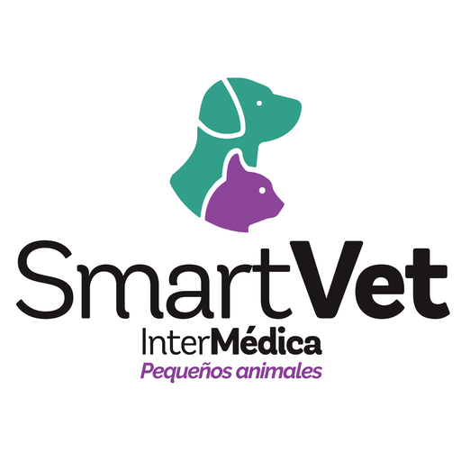</td>
    <td valign="top" align="center">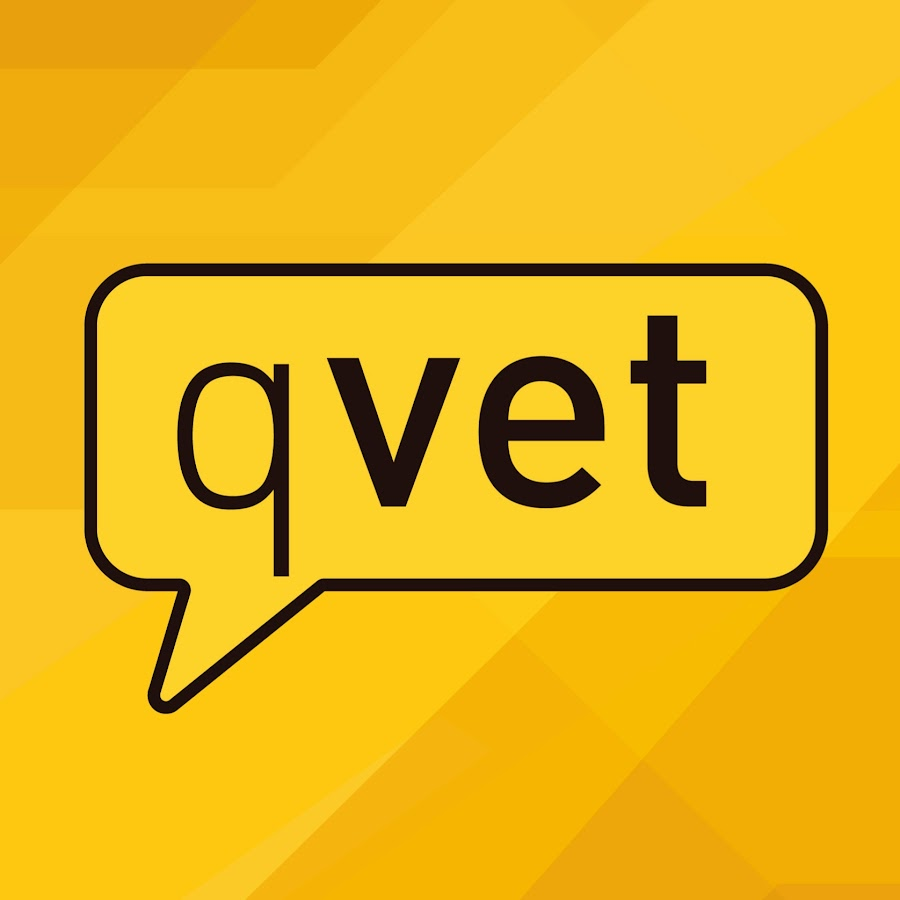</td>
    <td valign="top" align="center">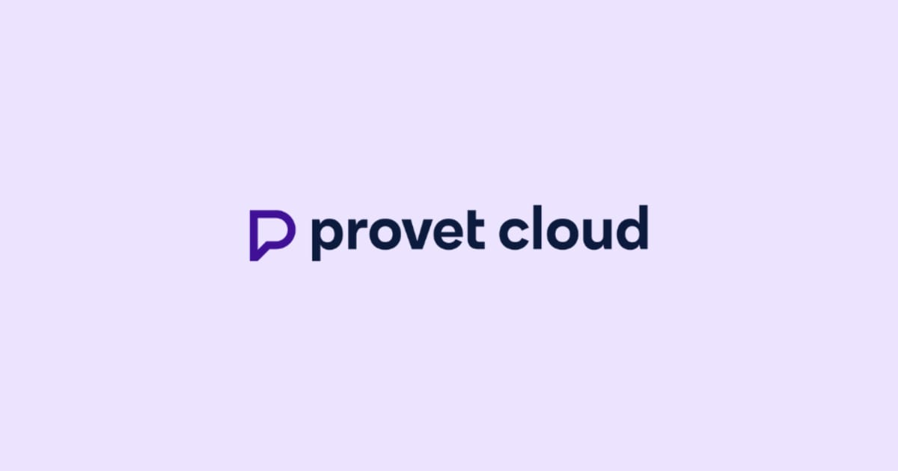</td>
   </tr>
  <tr>
    <td rowspan="2" valign="top">Perfil</td>
    <td valign="top">Overview</td>
    <td valign="top">Es una plataforma web SaaS orientada a la gestión integral de clínicas veterinarias. Permite gestionar historiales clínicos, citas e inventarios, además de conectar directamente al veterinario con el dueño de la mascota a través de un portal de seguimiento en tiempo real.</td>
    <td valign="top">Software en la nube para la gestión de clínicas veterinarias, enfocado en simplificar la facturación, los registros médicos y la agenda para consultorios pequeños y medianos en Latinoamérica.</td>
    <td valign="top">Software de gestión veterinaria muy completo y consolidado. Centraliza desde la historia clínica hasta la facturación y cuenta con un ecosistema de herramientas empresariales muy robusto para el sector hispanohablante.</td>
    <td valign="top">Es una plataforma veterinaria avanzada basada en la nube que tiene incluido diversas herramientas de IA para dictado de notas médicas para las mascotas. Tiene un sistema “limpio”, esto permite tener una propiedad de los datos para la organización.</td>
  </tr>
  <tr>
    <td valign="top">Ventaja competitiva ¿Qué valor ofrece a los clientes?</td>
    <td valign="top">Ofrecemos una herramienta simple, accesible y centralizada. Nuestro mayor valor es la visibilidad total que le damos al dueño de la mascota sobre los tratamientos y credenciales de su veterinario, generando confianza y fidelización, todo en un entorno web fácil de usar.</td>
    <td valign="top">Destaca por su facilidad de uso inicial y su bajo costo para clínicas que recién empiezan a digitalizarse. Su soporte técnico en español es muy valorado en la región.</td>
    <td valign="top">Destaca por su extrema robustez, capacidad para administrar grupos de clínicas interconectadas, e innovación tecnológica (como el uso de IA para recomendar productos y servicios médicos al cliente).</td>
    <td valign="top">La principal diferencia es la innovación mediante IA navita. Ofrece un asistente que redacta notas médicas, además de tener un resumen del historial y automatiza la captura de cargos omitidos,etc.</td>
  </tr>
  <tr>
    <td rowspan="2" valign="top">Perfil de Marketing</td>
    <td valign="top">Mercado objetivo</td>
    <td valign="top">Clínicas veterinarias de tamaño pequeño a mediano en Perú y Latinoamérica, y dueños de mascotas que exigen transparencia y seguimiento digital de la salud de sus animales.</td>
    <td valign="top">Consultorios independientes y pequeñas clínicas en Latinoamérica que buscan salir del papel y usar su primer software de gestión.</td>
    <td valign="top">Clínicas veterinarias de tamaño medio, grandes hospitales y grupos corporativos veterinarios que buscan un control empresarial, clínico y financiero total a gran escala.</td>
    <td valign="top">Clínicas veterinarias de alta complejidad, además de clínicas con múltiples sedes y servicios especialidades o medicina móvil.</td>
  </tr>
  <tr>
    <td valign="top">Estrategias de marketing</td>
    <td valign="top">Marketing digital en redes sociales, demostraciones gratuitas a dueños de clínicas, y estrategias de referidos (dueños de mascotas que recomiendan la plataforma a su veterinario de confianza).</td>
    <td valign="top">Campañas en Google Ads, presencia en grupos de Facebook de veterinarios y un fuerte enfoque en el marketing de contenidos (blogs y webinars sobre gestión).</td>
    <td valign="top">Fuerte presencia institucional en congresos veterinarios internacionales, alianzas con colegios veterinarios, y una fuerza de ventas consultiva (B2B) para grandes cuentas.</td>
    <td valign="top">Herramientas integradas para enviar campañas, promociones y recordatorios automáticos sin esfuerzo manual. Utilizan anuncios diversos de Google Ads.</td>
  </tr>
  <tr>
    <td rowspan="3" valign="top">Perfil de Producto</td>
    <td valign="top">Productos & Servicios</td>
    <td valign="top">Historial clínico digital, agenda de citas, gestión de insumos médicos, portal web para el dueño de la mascota y registro de credenciales del personal médico.</td>
    <td valign="top">Historias clínicas, agenda, recordatorios automáticos por WhatsApp/Email, control de caja e inventario básico.</td>
    <td valign="top">Historias clínicas avanzadas, integración directa con equipos de laboratorio, módulo de hospitalización, planes de salud, compras/stock inteligente y gestión de salas de espera.</td>
    <td valign="top">Gestión de turnos, historias clínicas electrónicas, telemedicina, recetas electrónicas, informes personalizados y gestión de salud de rebaños en un solo click.</td>
  </tr>
  <tr>
    <td valign="top">Precios & Costos</td>
    <td valign="top">Anual: Desde $60 USD hasta $360 USD. Mensual: plan escalonado de $5, $15, $30 USD.</td>
    <td valign="top">Anual: Desde $240 USD hasta $480 USD. Mensual: Desde $20 a $40 USD dependiendo del país y funciones.</td>
    <td valign="top">Anual: Desde $600 USD hasta cotizaciones personalizadas elevadas para grupos de clínicas. Mensual: Desde $50 USD a $100+ USD mensuales, dependiendo fuertemente de los módulos adicionales contratados.</td>
    <td valign="top">Plan Core: Desde $249/mes incluye 1 veterinarios; personal de apoyo ilimitado gratuito. Plan Pro Desde $299/mes para clínicas con múltiples sedes.</td>
  </tr>
  <tr>
    <td valign="top">Canales de distribución (Web y/o Móvil)</td>
    <td valign="top">Plataforma web responsiva (SaaS) accesible desde navegadores en PC o móvil, sin necesidad de instalación.</td>
    <td valign="top">100% Software como Servicio (SaaS) accesible vía navegador web</td>
    <td valign="top">Despliegue en la nube (SaaS Cloud) o en servidor local, distribuido a través de asesores de ventas corporativos con procesos de implementación guiada.</td>
    <td valign="top">100% Web (SaaS) accesible desde cualquier navegador (PC, Mac, tablets) y App móvil para dueños de mascotas.</td>
  </tr>
  <tr>
    <td rowspan="4" valign="top">Análisis SWOT</td>
    <td valign="top">Fortalezas</td>
    <td valign="top">Enfoque dual que empodera al dueño de la mascota. Precios altamente accesibles. Interfaz moderna y sin curva de aprendizaje pronunciada.</td>
    <td valign="top">Muy posicionado en el mercado hispanohablante. Simple y directo al grano para tareas diarias.</td>
    <td valign="top">Altamente funcional y personalizable. Cuenta con control exhaustivo de inventario e integraciones con casi cualquier equipo médico de laboratorio.</td>
    <td valign="top">Alta capacidad de integración (+150 herramientas) y API abierta. Seguridad de datos con 5 capas de producción. Asistente de IA nativo para reducir la carga administrativa del médico.</td>
  </tr>
  <tr>
    <td valign="top">Debilidades</td>
    <td valign="top">Al ser una startup nueva, la notoriedad de marca es baja inicialmente. Dependencia de que ambos usuarios (clínica y dueño) adopten la plataforma para generar el valor completo.</td>
    <td valign="top">Interfaz un poco anticuada. Carece de funciones avanzadas para clínicas que crecen rápidamente y abren nuevas sedes.</td>
    <td valign="top">Al tener tantas opciones y módulos, la interfaz puede resultar abrumadora y la curva de aprendizaje es larga para el personal nuevo.</td>
    <td valign="top">Costo inicial más elevado que las soluciones locales básicas.</td>
  </tr>
  <tr>
    <td valign="top">Oportunidades</td>
    <td valign="top">La nueva generación de dueños de mascotas exige transparencia digital. Oportunidad de crear alianzas con proveedores de alimentos y medicinas.</td>
    <td valign="top">Expansión de sus integraciones con métodos de pago locales en diferentes países de Latinoamérica.</td>
    <td valign="top">Aprovechar su inmensa base de datos clínica para ofrecer analíticas predictivas y expandir versiones "Lite" a consultorios más pequeños.</td>
    <td valign="top">Creciente demanda en telemedicina y comunicación “mobile-first” en dueños de mascotas jóvenes.</td>
  </tr>
  <tr>
    <td valign="top">Amenazas</td>
    <td valign="top">Resistencia al cambio tecnológico por parte de veterinarios. Que los sistemas consolidados (como SmartVet) bajen sus precios.</td>
    <td valign="top">La aparición de startups más ágiles con mejores diseños y modelos de precios más agresivos (como PetHealth).</td>
    <td valign="top">Startups modernas con interfaces más limpias y amigables que resulten más atractivas para las nuevas generaciones de veterinarios.</td>
    <td valign="top">Inestabilidad de conexiones a internet en zonas rurales, lo que afecta a sistemas 100% nube. Surgimiento de startups locales con precios más bajos y soporte presencial en la región.</td>
  </tr>
  <tr>
</table>

---

### 2.1.2. Estrategias y tácticas frente a competidores

#### Estrategias:

- Posicionar a PetHealth como una solución moderna, accesible e intuitiva, diseñada específicamente para las clínicas veterinarias pequeñas y medianas en Perú, a diferencia de los sistemas ERP corporativos complejos y costosos (como Qvet) o plataformas con interfaces anticuadas (como SmartVet).
- Enfocarse en la funcionalidad única del modelo dual (B2B2C) que conecta al veterinario directamente con el dueño de la mascota a través de una "Libreta Sanitaria Digital", transformando el software de una simple herramienta administrativa a un canal de fidelización y marketing para la clínica.
- Ofrecer un modelo de suscripción SaaS escalonado con un plan básico de muy bajo costo ($5 USD), lo cual elimina el riesgo financiero para los emprendedores que buscan dejar el papel, haciéndolo mucho más atractivo que los competidores premium.
- Posicionar a PetHealth como una alternativa "Lite" y veloz frente a la complejidad de otras aplicaciones (como Provet Cloud). Mientras que otros requieren una curva de aprendizaje alta debido a sus múltiples módulos hospitalarios y de IA, PetHealth elimina la fricción operativa ofreciendo una interfaz web 100% responsive, optimizada para procesos de consulta rápida en clínicas medianas, garantizando que el personal médico no pierda tiempo en menús complejos.

#### Tácticas:

- Desarrollar un proceso de onboarding (registro inicial) autogestionable de menos de 10 minutos y tutoriales interactivos dentro de la plataforma para facilitar la rápida adopción por parte del personal veterinario con baja familiaridad tecnológica.
- Implementar campañas de educación y marketing en redes sociales (Instagram, TikTok, Facebook) dirigidas a los dueños de mascotas ("Pet Parents") para que sean ellos quienes exijan historiales clínicos transparentes y recomienden PetHealth a sus veterinarios.
- Establecer alianzas estratégicas con proveedores de insumos médicos, marcas de alimentos para mascotas y colegios veterinarios para llegar a un gran número de clínicas de manera directa y generar confianza institucional.
- Crear una calculadora interactiva (ROI) dentro de la Landing Page que le muestre a los dueños de las clínicas el ahorro de tiempo, la reducción de inasistencias (gracias a los recordatorios) y el aumento de ganancias que obtendrán al usar PetHealth versus sus métodos manuales actuales


---

## 2.2. Entrevistas

Esta sección expone la investigación basada en entrevistas realizadas a médicos veterinarios (incluyendo administradores de clínicas) y dueños de mascotas, segmentos clave del proyecto. A través de sus testimonios se buscó identificar las principales dificultades en la gestión clínica, administrativa y en el seguimiento de la salud animal, para explorar cómo una solución digital integral podría responder de manera efectiva a sus necesidades

### 2.2.1. Diseño de entrevistas

Las entrevistas fueron diseñadas aplicando buenas prácticas de investigación cualitativa, estructurando las preguntas de lo general a lo específico. El objetivo principal es recolectar información demográfica, psicográfica, conductual y tecnológica de los entrevistados. Estos datos son fundamentales para construir posteriormente nuestros arquetipos (User Personas), identificando su biografía, dispositivos de preferencia, influencias, metas y puntos de dolor respecto a la gestión de salud veterinaria.

**Segmento 1: Médicos Veterinarios y Administradores de Clínicas**

**A. Información Demográfica y Antecedentes**

- ¿Podría indicarnos su edad, en qué distrito reside y cuál es su estado civil o composición familiar actual?

- ¿Cuál es su cargo exacto en la clínica y cuántos años de experiencia tiene en el rubro veterinario?

- ¿Cómo describiría su personalidad en su entorno de trabajo? (Ej. metódico, tradicional, innovador, acelerado).

**B. Objetivos y Frustraciones**

- ¿Cuáles son sus objetivos profesionales principales para su clínica este año y qué es lo que más le impide lograrlos actualmente?

- Pensando en la gestión diaria (citas, historias clínicas, inventario), ¿cuál es la tarea que considera más tediosa, desordenada o propensa a errores?

- ¿Cómo le afecta a nivel personal (estrés, falta de tiempo libre) el no tener la información de sus pacientes o el stock de insumos centralizados?

**C. Tecnología y Canales de Interacción**

- ¿Qué dispositivos utiliza con mayor frecuencia en su día a día (Smartphone, Laptop) tanto para su vida personal como para la clínica?

- ¿Qué tan hábil se considera aprendiendo a usar nuevos programas y cuáles son sus redes sociales favoritas para informarse o interactuar con colegas?

- ¿Hay alguna marca, empresa o figura pública dentro del rubro veterinario o tecnológico que considere un referente o influencia?

**D. Comportamiento frente a la solución**

Si existiera una herramienta integral que le permitiera gestionar la clínica y fidelizar a sus clientes, ¿qué funciones serían indispensables para que usted decida implementarla?

---

**Segmento 2: Dueños de Mascotas (Pet Parents)**

**A. Información Demográfica y Antecedentes**

- ¿Podría indicarnos su edad, ocupación actual, en qué distrito reside y con quiénes vive actualmente?

- Hábleme de su mascota: ¿Qué especie es, cuántos años tiene y cómo llegó a su vida?

- ¿Cómo describiría su personalidad como dueño de mascota? (Ej. sobreprotector, relajado, muy organizado con sus cosas).

**B. Objetivos y Frustraciones**

- ¿Cuál es su objetivo principal respecto a la salud de su mascota y qué es lo que más le genera estrés cuando tiene que llevarla al veterinario?

- ¿Cómo se organiza para recordar sus vacunas, citas o encontrar su historial médico si tiene que ir a una clínica nueva?

- ¿Alguna vez ha olvidado una indicación médica importante o ha perdido una receta física? ¿Cómo resolvió esa situación?

**C. Tecnología y Canales de Interacción**

- ¿Qué dispositivos tecnológicos utiliza principalmente en su rutina y cuáles son las aplicaciones o redes sociales donde pasa más tiempo?

- Cuando compra productos para su mascota (comida, accesorios), ¿qué marcas suele preferir y por qué confía en ellas?

- ¿Sigue a algún influencer de mascotas, veterinario en redes sociales o blog que influya en la manera en que cuida a su animal?

**D. Comportamiento frente a la solución**

- Si existiera una plataforma web donde pudiera ver todo el historial de su mascota, recibir recordatorios y agendar citas desde su celular, ¿qué características harían que la use constantemente?

---

### 2.2.2. Registro de entrevistas
<div align="center">
  
**Segmento objetivo 1: `nombre del segmento`**

<br>

#### Entrevista 1
*Imagen de la entrevista*


<br>

| Campo | Detalle |
|:------|:--------|
| **Nombres y apellidos** | `[Nombre del entrevistado]` |
| **Edad** | `[Edad]` |
| **Ubicación** | `[Distrito]` |
| **Fecha de entrevista** | `YYYY-MM-DD` |
| **Duración** | `[HH:MM]` |
| **Enlace al video** | [Ver entrevista en Microsoft Stream](`URL`) — Inicia en `[MM:SS]` |

**Resumen:**

</div>

*(Redactar resumen de la entrevista)*

<br>
<div align="center">
  
#### Entrevista 2
*Imagen de la entrevista*


<br>

| Campo | Detalle |
|:------|:--------|
| **Nombres y apellidos** | `[Nombre del entrevistado]` |
| **Edad** | `[Edad]` |
| **Ubicación** | `[Distrito]` |
| **Fecha de entrevista** | `YYYY-MM-DD` |
| **Duración** | `[HH:MM]` |
| **Enlace al video** | [Ver entrevista en Microsoft Stream](`URL`) — Inicia en `[MM:SS]` |

**Resumen:**

</div>

*(Redactar resumen de la entrevista)*

<br>
<div align="center">
  
#### Entrevista 3

*Imagen de la entrevista*


<br>

| Campo | Detalle |
|:------|:--------|
| **Nombres y apellidos** | `[Nombre del entrevistado]` |
| **Edad** | `[Edad]` |
| **Ubicación** | `[Distrito]` |
| **Fecha de entrevista** | `YYYY-MM-DD` |
| **Duración** | `[HH:MM]` |
| **Enlace al video** | [Ver entrevista en Microsoft Stream](`URL`) — Inicia en `[MM:SS]` |

**Resumen:**

</div>

*Redactar resumen de la entrevista*

---
<div align="center">
  
**Segmento objetivo 2: `nombre del segmento`**

<br>

#### Entrevista 1

*Imagen de la entrevista*


<br>

| Campo | Detalle |
|:------|:--------|
| **Nombres y apellidos** | `[Nombre del entrevistado]` |
| **Edad** | `[Edad]` |
| **Ubicación** | `[Distrito]` |
| **Fecha de entrevista** | `YYYY-MM-DD` |
| **Duración** | `[HH:MM]` |
| **Enlace al video** | [Ver entrevista en Microsoft Stream](`URL`) — Inicia en `[MM:SS]` |

**Resumen:**

</div>

*(Redactar de forma descriptiva las respuestas del entrevistado a las preguntas realizadas. Incluir todas las características objetivas y subjetivas: personalidad, marcas e influencias, tecnología, canales de interacción, browser, dispositivos, etc.)*

<br>

<div align="center">
  
#### Entrevista 2

*Imagen de la entrevista*


<br>

| Campo | Detalle |
|:------|:--------|
| **Nombres y apellidos** | `[Nombre del entrevistado]` |
| **Edad** | `[Edad]` |
| **Ubicación** | `[Distrito]` |
| **Fecha de entrevista** | `YYYY-MM-DD` |
| **Duración** | `[HH:MM]` |
| **Enlace al video** | [Ver entrevista en Microsoft Stream](`URL`) — Inicia en `[MM:SS]` |

**Resumen:**

</div>

*(Redactar resumen de la entrevista)*

<br>

<div align="center">

#### Entrevista 3

*Imagen de la entrevista*


<br>

| Campo | Detalle |
|:------|:--------|
| **Nombres y apellidos** | `[Nombre del entrevistado]` |
| **Edad** | `[Edad]` |
| **Ubicación** | `[Distrito]` |
| **Fecha de entrevista** | `YYYY-MM-DD` |
| **Duración** | `[HH:MM]` |
| **Enlace al video** | [Ver entrevista en Microsoft Stream](`URL`) — Inicia en `[MM:SS]` |

**Resumen:**

</div>

*(Redactar resumen de la entrevista)*

---

### 2.2.3. Análisis de entrevistas

> *(Análisis por segmento objetivo con sustento estadístico — porcentajes)*

**Segmento objetivo 1: `[Nombre del segmento]`**

*(Identificar con sustento estadístico todas las características objetivas y subjetivas representativas del segmento, necesarias para la construcción de los arquetipos)*

**Segmento objetivo 2: `[Nombre del segmento]`**

*(Identificar con sustento estadístico todas las características objetivas y subjetivas representativas del segmento, necesarias para la construcción de los arquetipos)*

---

## 2.3. Needfinding

> *(Artefactos resultantes del proceso de análisis de la información recolectada)*

### 2.3.1. User Personas

*(Introducción explicando la relación entre los artefactos y las principales características tomadas del análisis de entrevistas y competencia)*

**User Persona — Segmento 1: `[Nombre del Persona]`**

*(Captura de la ficha elaborada en UXPressia)*


---

**User Persona — Segmento 2: `[Nombre del Persona]`**

*(Captura de la ficha elaborada en UXPressia)*


---

### 2.3.2. User Task Matrix

*(Introducción estableciendo los segmentos considerados)*

| Tarea (Task) | `[Persona 1]` Frecuencia | `[Persona 1]` Importancia | `[Persona 2]` Frecuencia | `[Persona 2]` Importancia |
|:-------------|:------------------------:|:-------------------------:|:------------------------:|:-------------------------:|
| *(Tarea 1)* | Alta / Media / Baja | Alta / Media / Baja | Alta / Media / Baja | Alta / Media / Baja |
| *(Tarea 2)* | | | | |
| *(Tarea 3)* | | | | |
| *(Tarea 4)* | | | | |
| *(Tarea 5)* | | | | |

*(Explicación resaltando las tareas con mayor frecuencia e importancia, principales diferencias y coincidencias entre los User Personas)*

---

### 2.3.3. User Journey Mapping

*(Introducción resumiendo el end-to-end journey que se pretende ilustrar — versión As-Is)*

**User Journey Map — `[Persona 1]`**

*(Captura del diagrama elaborado en UXPressia)*


---

**User Journey Map — `[Persona 2]`**

*(Captura del diagrama elaborado en UXPressia)*


---

### 2.3.4. Empathy Mapping

*(Resumen del proceso de elaboración y capturas de los Empathy Maps)*

**Empathy Map — `[Persona 1]`**

*(Captura elaborada en UXPressia)*


---

**Empathy Map — `[Persona 2]`**

*(Captura elaborada en UXPressia)*


---

## 2.4. Big Picture Event Storming

En esta sección se introduce y resume el proceso realizado por el equipo para el Big Picture Event Storming, que fue realizado mediante una llamada en discord y plasmado con la ayuda de la herramienta Miro. A continuación, se explica el proceso:

**1. OPEN**

En esta etapa el equipo se concentró en generar la mayor cantidad de eventos de dominio posibles (cosas que suceden en el negocio) escribiendo en los post-its naranjas.

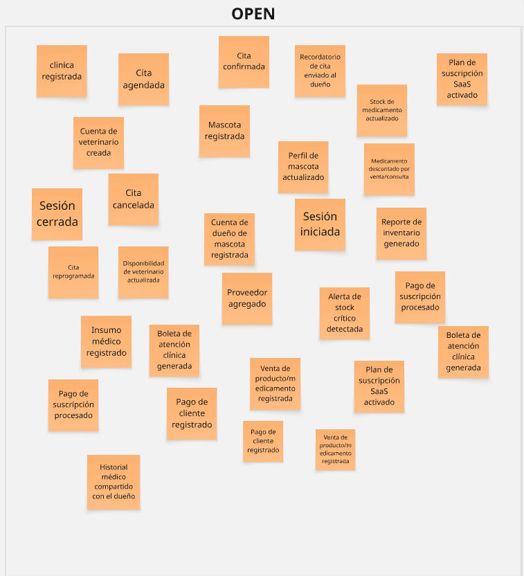

**2. Explore**

Después de la anterior etapa, en esta se concentró en ordenar cronológicamente los eventos, eliminar los eventos repetidos, identificar sus actores y posibles sistemas externos, y finalmente algunos puntos de dolor en post-its morados.

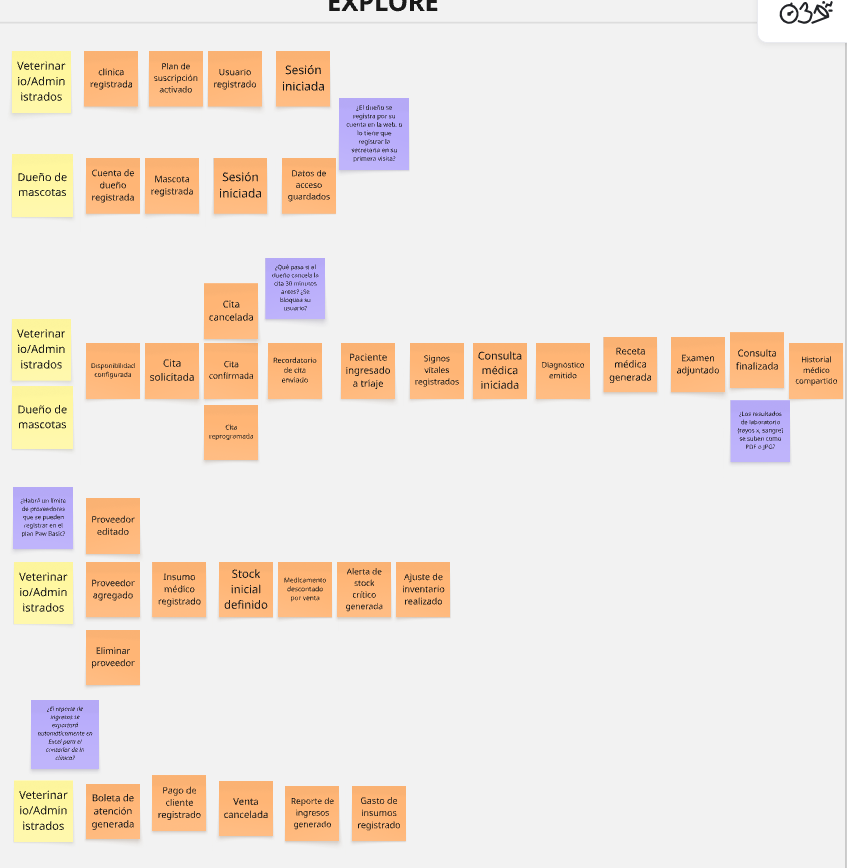

**3. Close**

En esta última etapa, se documentaron en post-its rosados los problemas más relevantes detectados, junto con aspectos que debíamos investigar más a fondo o descartar según el alcance definido.

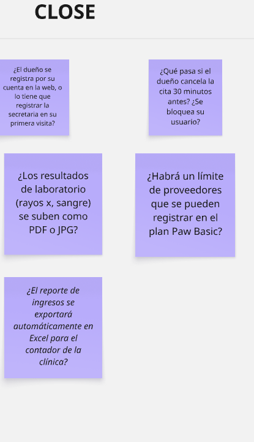

Luego de conversar un poco, el equipo descartó algunos eventos y identificó mejor un sistema externo:

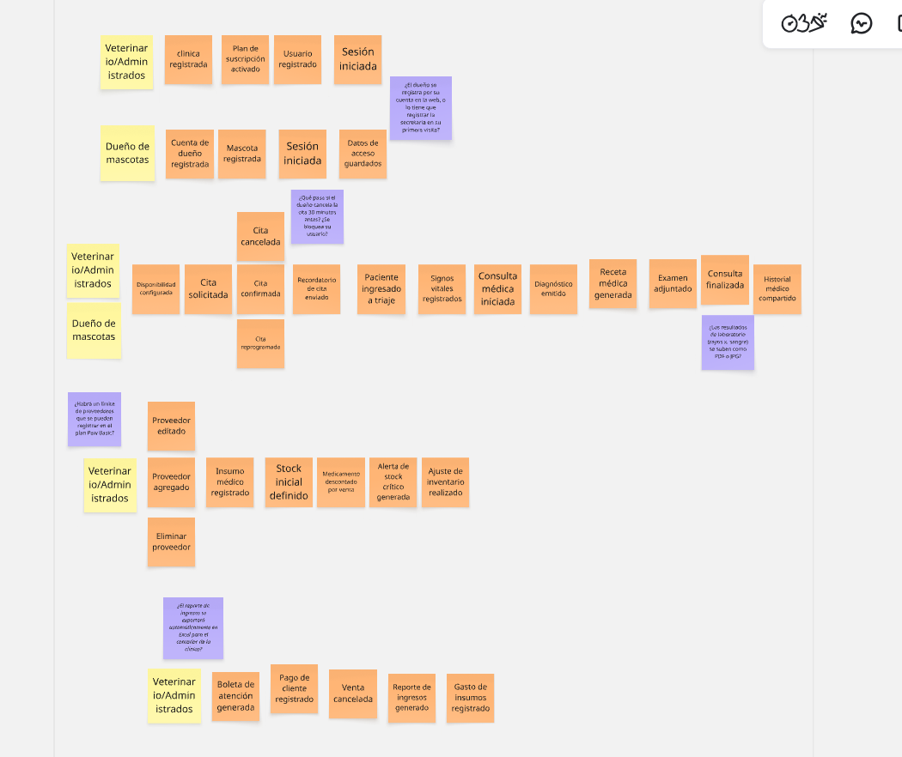

---

## 2.5. Ubiquitous Language

> *A continuación, se presenta el glosario de términos clave utilizados en el dominio del sistema Pawtient, orientado a la gestión de clínicas veterinarias. Este lenguaje común permite una comunicación clara y sin ambigüedades entre todos los stakeholders.*

<br>

| Término (EN) | Término (ES) | Definición |
|:-------------|:-------------|:-----------|
| `Patient` | Paciente | Animal que recibe atención médica en la clínica veterinaria. |
| `Pet Owner` | Propietario de la mascota | Persona responsable del paciente, encargada de autorizar tratamientos y gestionar citas. |
| `Veterinarian` | Veterinario | Profesional de la salud encargado de diagnosticar, tratar y dar seguimiento al paciente. |
| `Clinical Record` | Historia clínica | Registro detallado del estado de salud del paciente, incluyendo diagnósticos, tratamientos y antecedentes. |
| `Medical History` | Historial médico | Conjunto de registros previos relacionados con la salud del paciente a lo largo del tiempo. |
| `Appointment` | Cita | Reserva programada para la atención de un paciente en una fecha y hora específica. |
| `Consultation` | Consulta | Atención médica realizada durante una cita donde se evalúa al paciente. |
| `Diagnosis` | Diagnóstico | Identificación de una enfermedad o condición médica basada en la evaluación del veterinario. |
| `Treatment` | Tratamiento | Conjunto de acciones o procedimientos indicados para mejorar la salud del paciente. |
| `Prescription` | Receta médica | Documento que especifica medicamentos, dosis y duración del tratamiento. |
| `Medication` | Medicamento | Sustancia utilizada para tratar o prevenir enfermedades en el paciente. |
| `Vaccine` | Vacuna | Sustancia administrada para prevenir enfermedades específicas en el paciente. |
| `Check-up` | Chequeo | Evaluación general del estado de salud del paciente, generalmente preventiva. |
| `Emergency Case` | Caso de emergencia | Situación médica crítica que requiere atención inmediata. |
| `Symptom` | Síntoma | Manifestación observable de una enfermedad o condición en el paciente. |
| `Allergy` | Alergia | Reacción adversa del paciente a ciertos medicamentos, alimentos o factores ambientales. |
| `Procedure` | Procedimiento | Intervención médica realizada al paciente, como cirugías o tratamientos específicos. |
| `Supply` | Suministro | Producto o insumo utilizado en la clínica, como medicamentos o materiales médicos. |
| `Inventory` | Inventario | Conjunto de suministros disponibles en la clínica en un momento determinado. |
| `Stock Level` | Nivel de stock | Cantidad disponible de un suministro en el inventario. |
| `Stock Movement` | Movimiento de stock | Registro de entradas y salidas de suministros dentro del inventario. |
| `Supply Traceability` | Trazabilidad de suministros | Capacidad de rastrear el origen, uso y destino de los suministros. |
| `Supplier` | Proveedor | Entidad que abastece de productos o insumos a la clínica. |
| `Batch` | Lote | Grupo de suministros producidos o adquiridos bajo las mismas condiciones. |
| `Expiration Date` | Fecha de vencimiento | Fecha límite en la que un suministro puede ser utilizado de forma segura. |
| `Restock` | Reabastecimiento | Proceso de reposición de suministros en el inventario. |
| `Appointment Schedule` | Agenda de citas | Organización de todas las citas programadas en la clínica. |
| `Availability` | Disponibilidad | Horarios en los que un veterinario puede atender citas. |
| `Follow-up` | Seguimiento | Evaluación posterior al tratamiento para verificar la evolución del paciente. |
| `Clinical Note` | Nota clínica | Observaciones registradas por el veterinario durante o después de una consulta. |
| `Weight Record` | Registro de peso | Historial del peso del paciente para control de su salud. |
| `Treatment Plan` | Plan de tratamiento | Estrategia médica definida para tratar una condición específica del paciente. |

<br>

---

<div align="center">

# Capítulo III: Requirements Specification

</div>

---

## 3.1. User Stories

*(Introducción a los User Stories y Epics definidos)*

> **Nota:** Los criterios de aceptación se redactan en tiempo presente, tercera persona, sin referencia a detalles de interfaz de usuario, y siguen la estructura **Gherkin (Given-When-Then)**.

| Epic / Story ID | Título | Descripción | Criterios de Aceptación | Relacionado con (Epic ID) |
|:---------------:|:------:|:------------|:------------------------|:-------------------------:|
| **EP01** | `[Título del Epic 1]` | *(Descripción del Epic)* | — | — |
| US01 | `[Título de User Story]` | Como `[rol]`, deseo `[acción]`, para `[beneficio]`. | **Scenario 1:** `[Nombre]` <br> **Given** `[contexto]` <br> **When** `[acción]` <br> **Then** `[resultado esperado]` | EP01 |
| US02 | `[Título de User Story]` | Como `[rol]`, deseo `[acción]`, para `[beneficio]`. | **Scenario 1:** `[Nombre]` <br> **Given** `[contexto]` <br> **When** `[acción]` <br> **Then** `[resultado esperado]` | EP01 |
| **EP02** | `[Título del Epic 2]` | *(Descripción del Epic)* | — | — |
| US03 | `[Título de User Story]` | Como `[rol]`, deseo `[acción]`, para `[beneficio]`. | **Scenario 1:** `[Nombre]` <br> **Given** `[contexto]` <br> **When** `[acción]` <br> **Then** `[resultado esperado]` | EP02 |
| **EP0n** | `[Landing Page Epic]` | *(Epic para user stories del sitio estático)* | — | — |
| US0n | `[User Story Landing Page]` | Como visitante, deseo `[acción]`, para `[beneficio]`. | **Scenario 1:** `[Nombre]` <br> **Given** `[contexto]` <br> **When** `[acción]` <br> **Then** `[resultado esperado]` | EP0n |
| **TS01** | `[Technical Story — API]` | Como Developer, deseo `[endpoint]`, para `[propósito]`. | **Scenario 1:** `[Nombre]` <br> **Given** `[request context]` <br> **When** `[se llama al endpoint]` <br> **Then** `[response esperado]` | — |

---

## 3.2. Impact Mapping

*(Introducción y capturas del Impact Mapping elaborado en la herramienta indicada — UXPressia)*

*(Business Goals deben cumplir criterios SMART. Ejemplo: "Alcanzar los 600 usuarios suscritos al plan A en el lapso de 8 meses.")*


*(Explicación del Impact Map: Business Goals, Actors/Personas, Impacts, Deliverables y User Stories)*

---

## 3.3. Product Backlog

*(Introducción al Product Backlog)*

> **Herramienta utilizada:** `[Pivotal Tracker / JetBrains YouTrack / Jira / Trello]`
>
> **URL del Product Backlog:** [`[URL pública del Product Backlog]`](`[URL]`)

*(Captura del Product Backlog en la herramienta indicada)*


| # Orden | User Story ID | Título | Descripción | Story Points |
|:-------:|:-------------:|:------:|:------------|:------------:|
| 1 | US01 | `[Título]` | Como `[rol]`, deseo `[acción]`, para `[beneficio]`. | `1 / 2 / 3 / 5 / 8` |
| 2 | US02 | `[Título]` | Como `[rol]`, deseo `[acción]`, para `[beneficio]`. | |
| 3 | US03 | `[Título]` | Como `[rol]`, deseo `[acción]`, para `[beneficio]`. | |
| 4 | US04 | `[Título]` | Como `[rol]`, deseo `[acción]`, para `[beneficio]`. | |
| 5 | US05 | `[Título]` | Como `[rol]`, deseo `[acción]`, para `[beneficio]`. | |
| n | TS01 | `[Technical Story]` | Como Developer, deseo `[endpoint]`, para `[propósito]`. | |

---

<div align="center">

# Capítulo IV: Product Design

</div>

---

## 4.1. Style Guidelines

### 4.1.1. General Style Guidelines

*(Explicar las decisiones y referencias visuales sobre conceptos generales: Branding, Typography, Colors, Spacing y tono de comunicación)*

**Branding**

*(Descripción del branding de BrandRadar: logo, isotipo, naming, y principios de identidad visual)*

**Typography**

| Tipo | Fuente | Uso |
|:-----|:------:|:----|
| Display / Heading | `[Fuente principal]` | Títulos y encabezados |
| Body | `[Fuente secundaria]` | Texto de contenido |
| Monospace | `[Fuente monoespaciada]` | Código y datos técnicos |

**Colors**

| Nombre | Hex | Uso |
|:-------|:---:|:----|
| Primary | `#XXXXXX` | Color principal de la marca |
| Secondary | `#XXXXXX` | Color de apoyo |
| Accent | `#XXXXXX` | Énfasis y llamados a la acción |
| Background | `#XXXXXX` | Fondo general |
| Text | `#XXXXXX` | Texto principal |
| Error | `#XXXXXX` | Estados de error |
| Success | `#XXXXXX` | Estados de éxito |

**Spacing**

*(Describir el sistema de espaciado y las unidades base utilizadas)*

**Tono de comunicación**

| Dimensión | Selección |
|:----------|:---------:|
| Divertido / Serio | *(indicar posición en la escala)* |
| Formal / Casual | *(indicar posición en la escala)* |
| Respetuoso / Irreverente | *(indicar posición en la escala)* |
| Entusiasta / Sereno | *(indicar posición en la escala)* |

---

### 4.1.2. Web Style Guidelines

*(Decisiones sobre los estándares visuales y de interacción para responsive web interfaces)*

*(Incluir capturas o especificaciones visuales del Design System basado en Material Design y Angular Material)*

---

## 4.2. Information Architecture

*(Decisiones que dirigen la organización del contenido en las experiencias web — Landing Page y Web Application)*

### 4.2.1. Organization Systems

*(Explicar en qué grupos de información se aplica cada sistema de organización: jerárquica, secuencial o matricial; y los esquemas de categorización: alfabético, cronológico, por tópicos, según audiencia)*

### 4.2.2. Labeling Systems

*(Especificar las etiquetas a utilizar con el mínimo número de palabras, para representar los conjuntos de información y sus asociaciones)*

| Etiqueta | Descripción del contenido que representa |
|:--------:|:-----------------------------------------|
| `[Etiqueta]` | *(Descripción)* |
| `[Etiqueta]` | *(Descripción)* |
| `[Etiqueta]` | *(Descripción)* |

### 4.2.3. SEO Tags and Meta Tags

**Landing Page**

```html
<title>[Título del Landing Page]</title>
<meta name="description" content="[Descripción del Landing Page]" />
<meta name="keywords" content="[keywords, separadas, por, comas]" />
<meta name="author" content="[Nombre del Startup]" />
```

**Web Application**

```html
<title>[Título de la Web Application]</title>
<meta name="description" content="[Descripción de la Web Application]" />
<meta name="keywords" content="[keywords, separadas, por, comas]" />
<meta name="author" content="[Nombre del Startup]" />
```

### 4.2.4. Searching Systems

*(Describir qué opciones de búsqueda ofrecen las aplicaciones, con qué filtros contará el usuario y cómo lucirán los datos después de la búsqueda)*

### 4.2.5. Navigation Systems

*(Explicar las acciones y técnicas que guiarán a los usuarios a través del Landing Page y las aplicaciones, describiendo cómo recorrerán el contenido)*

---

## 4.3. Landing Page UI Design

*(Introducción explicando cómo se traducen las decisiones de diseño y arquitectura de información)*

### 4.3.1. Landing Page Wireframe

*(Wireframes del Landing Page para Desktop Web Browser y Mobile Web Browser)*

**Desktop Web Browser**


**Mobile Web Browser**


### 4.3.2. Landing Page Mock-up

*(Mock-ups del Landing Page para Desktop y Mobile, con Design System aplicado)*

**Desktop Web Browser**


**Mobile Web Browser**


---

## 4.4. Web Applications UX/UI Design

*(Propuesta visual y de interacción para las aplicaciones web)*

### 4.4.1. Web Applications Wireframes

*(Wireframes de las aplicaciones web con principios de diseño inclusivo y arquitectura de información aplicados)*


### 4.4.2. Web Applications Wireflow Diagrams

*(Un Wireflow por cada User goal, considerando los User Personas definidos)*

**User goal: `[Nombre del User goal]`**

*(Descripción del flujo especificado)*


---

**User goal: `[Nombre del User goal]`**

*(Descripción del flujo especificado)*


### 4.4.3. Web Applications Mock-ups

*(Mock-ups de las aplicaciones web con Design System aplicado)*


### 4.4.4. Web Applications User Flow Diagrams

*(User Flows incluyendo Mock-ups de vistas, happy paths y unhappy paths)*

**User goal: `[Nombre del User goal]`**

*(Descripción de los flujos y condiciones especificadas)*


---

## 4.5. Web Applications Prototyping

*(Introducción explicando los principales criterios para las decisiones de interacción)*

*(Prototipos de UI para Desktop y Mobile Web Browser con simulación de interacción y navegación)*

**Prototipo Desktop**


[Ver video de prototipo Desktop en Microsoft Stream](`URL`)

**Prototipo Mobile**


[Ver video de prototipo Mobile en Microsoft Stream](`URL`)

---

## 4.6. Domain-Driven Software Architecture

### 4.6.1. Design-Level Event Storming

En esta sección se explica y evidencia el proceso de Design-Level EventStorming, que sirvió para plantear una aproximación revisada y mejorada al modelado de nivel general para el dominio del problema.


**IAM Bounded Context**
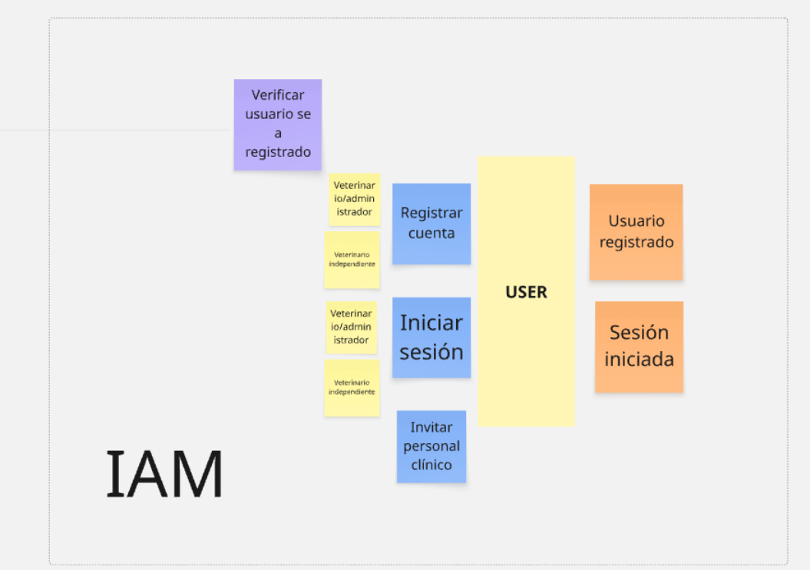

**Profile Bounded Context**
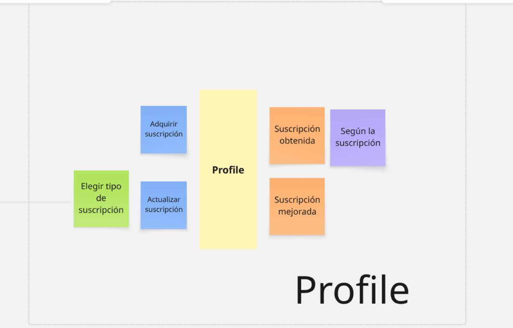

**Clinic Bounded Context**
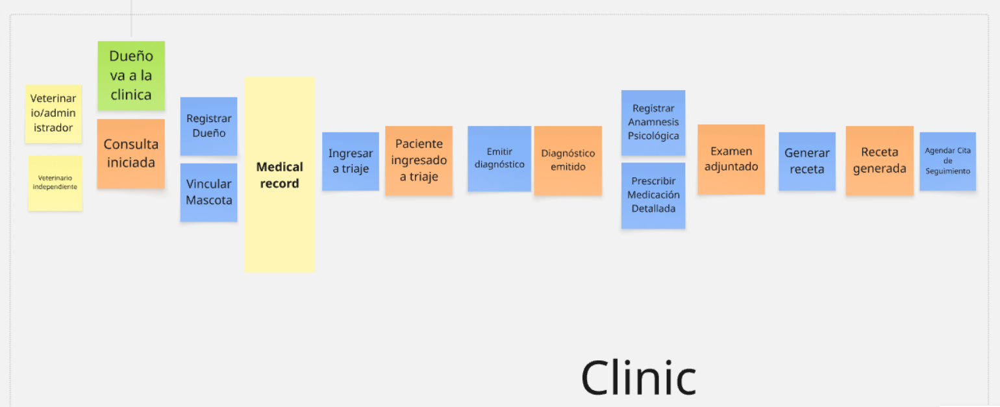

**Appointment Bounded Context**
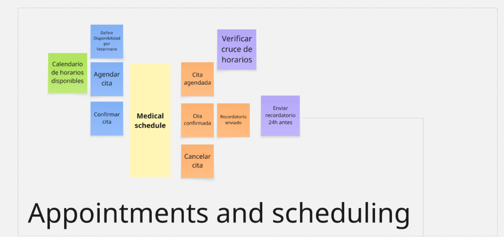

**Report Bounded Context**
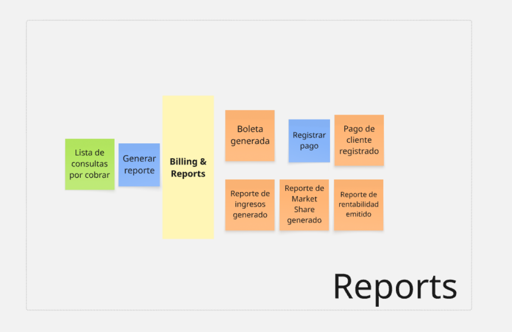

**Store Bounded Context**
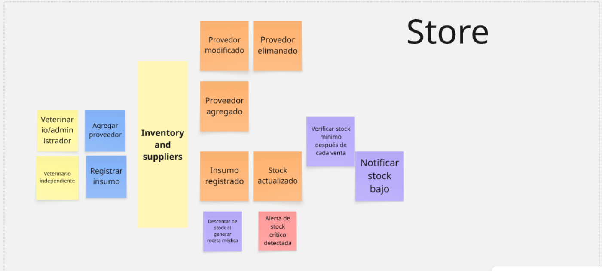

**Bounded Contexts y sus relaciones**
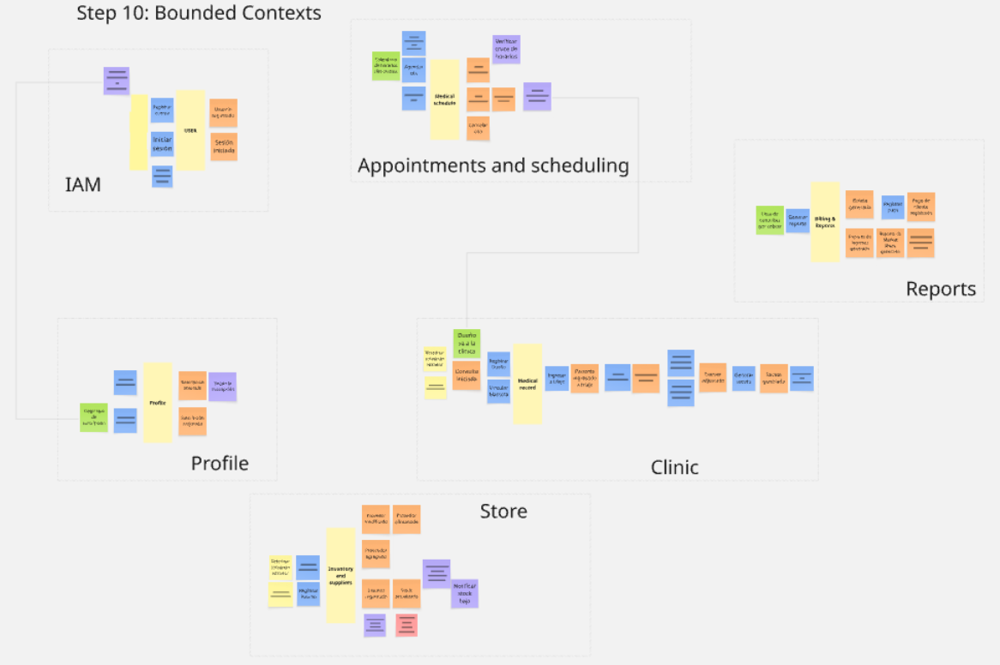
En este último paso, el equipo buscó agregados que estén relacionados entre sí mediante policies para luego identificar bounded contexts y finalmente marco los eventos de dominio que fueron implementados.

[Ver en miro](`https://miro.com/welcomeonboard/TUM0Kzk0ajRxOXdpd1EzRXpwQjU1ckx6c3JPV2trSUxpQ2dLc0p6RFZjUEFwaXYvcHpOMTZGWHExOFpibXpLRHNURWF6Zko2b1NaM2FxTEJieCsvUElhMFUwdXIwNThuaWpBa3F4dzlXUklLaXA4dFFvZUY1VjRHVXhGcklxT3BNakdSWkpBejJWRjJhRnhhb1UwcS9BPT0hdjE=?share_link_id=798329479919`)

### 4.6.2. Software Architecture Context Diagram

*(Introducción y explicación del Context Diagram — C4 Model elaborado en Structurizr)*

*(El sistema como recuadro central, rodeado por usuarios y sistemas externos con los que interactúa)*


*(Explicación del diagrama)*

### 4.6.3. Software Architecture Container Diagrams

*(Introducción y explicación del Container Diagram — C4 Model)*

*(Elementos de alto nivel de la arquitectura, distribución de responsabilidades, tecnologías y comunicación entre containers)*


*(Explicación del diagrama)*

### 4.6.4. Software Architecture Components Diagrams

*(Component Diagrams para cada Container identificado — C4 Model)*

**Bounded Context: `[Nombre del Bounded Context]`**


*(Explicación de los components, sus responsabilidades y detalles de implementación/tecnología)*

---

## 4.7. Software Object-Oriented Design

*(Introducción resumiendo las principales características de los diagramas)*

### 4.7.1. Class Diagrams

*(Class Diagrams UML para cada bounded context, incluyendo clases, interfaces, enumeraciones, atributos, métodos, scope y relaciones con multiplicidad)*

**Bounded Context: `[Nombre del Bounded Context]`**


*(Explicación del Class Diagram)*

---

## 4.8. Database Design

*(Introducción resumiendo las principales características de los Database Diagrams)*

### 4.8.1. Database Diagrams

*(Database Diagrams para cada bounded context — tablas, columnas, constraints, relaciones)*

**Bounded Context: `[Nombre del Bounded Context]`**


*(Explicación del Database Diagram)*


---

<div align="center">

# Capítulo V: Product Implementation, Validation & Deployment

</div>

---

## 5.1. Software Configuration Management

### 5.1.1. Software Development Environment Configuration

*(Especificar los productos de software que deben utilizar los miembros del equipo para colaborar en el ciclo de vida del producto digital)*

| Categoría | Producto | Propósito | Ruta / URL |
|:----------|:--------:|:---------:|:-----------|
| Project Management | `[Producto]` | `[Descripción del propósito]` | `[URL]` |
| Requirements Management | `[Producto]` | `[Descripción del propósito]` | `[URL]` |
| Product UX/UI Design | Figma | Wireframes, Mockups y Prototipos | https://figma.com |
| Product UX/UI Design | UXPressia | User Personas, Journey Maps, Empathy Maps | https://uxpressia.com |
| Software Development | IntelliJ IDEA / VS Code | Desarrollo de Web Services y Frontend | `[URL de descarga]` |
| Software Development | Angular CLI | Frontend Web Application | https://angular.io |
| Software Development | Spring Boot | RESTful Web Services | https://spring.io |
| Software Deployment | `[Plataforma cloud]` | Despliegue de productos | `[URL]` |
| Software Documentation | Swagger / OpenAPI | Documentación de Web Services | `[URL]` |
| Version Control | Git + GitHub | Control de versiones | https://github.com |

---

### 5.1.2. Source Code Management

*(Medios y esquema de organización para el seguimiento de modificaciones)*

**Organización de GitHub:** [`[URL de la organización]`](`[URL]`)

| Producto | Repositorio | URL |
|:--------:|:-----------:|:----|
| Landing Page | `[nombre-repo]` | `[URL]` |
| Frontend Web Application | `[nombre-repo]` | `[URL]` |
| Web Services (RESTful API) | `[nombre-repo]` | `[URL]` |
| Project Report | `[nombre-repo]` | `[URL]` |

**GitFlow Workflow:**

Se implementará GitFlow con las siguientes ramas:

| Rama | Propósito | Convención de nombre |
|:-----|:---------:|:---------------------|
| `main` | Código en producción | `main` |
| `develop` | Integración de features | `develop` |
| `feature/*` | Desarrollo de características | `feature/[descripción-corta]` |
| `release/*` | Preparación de releases | `release/[versión]` (ej: `release/1.0.0`) |
| `hotfix/*` | Correcciones urgentes en producción | `hotfix/[descripción-corta]` |

**Semantic Versioning:** Se aplica [Semantic Versioning 2.0.0](https://semver.org/) para nombrar los releases (`MAJOR.MINOR.PATCH`).

**Conventional Commits:** Se aplican [Conventional Commits](https://www.conventionalcommits.org/) para los mensajes de commits:

```
<tipo>[ámbito opcional]: <descripción>

Tipos: feat | fix | docs | style | refactor | test | chore
```

---

### 5.1.3. Source Code Style Guide & Conventions

*(Convenciones de nombrado y programación para cada lenguaje utilizado en la solución)*

| Lenguaje / Framework | Convención adoptada | Referencia |
|:--------------------:|:-------------------:|:-----------|
| HTML | HTML Style Guide | https://www.w3schools.com/html/html5_syntax.asp |
| CSS | Google HTML/CSS Style Guide | https://google.github.io/styleguide/htmlcssguide.html |
| JavaScript / TypeScript | Google TypeScript Style Guide | https://google.github.io/styleguide/tsguide.html |
| Angular | Angular coding style guide | https://angular.io/guide/styleguide |
| Java | Google Java Style Guide | https://google.github.io/styleguide/javaguide.html |
| Spring Boot | Spring Boot Features | https://docs.spring.io/spring-boot/docs/current/reference/html/features.html |
| Gherkin (Acceptance Criteria) | Gherkin Conventions | https://specflow.org/gherkin/gherkin-conventions-for-readable-specifications/ |

> **Nota:** Para todos los lenguajes se aplica la nomenclatura en **inglés**.

---

### 5.1.4. Software Deployment Configuration

*(Configuración del despliegue de la solución — pasos necesarios para lograr el despliegue de cada producto)*

**Landing Page:**
*(Describir pasos de despliegue del Landing Page — plataforma, configuración, automatización)*

**Frontend Web Application:**
*(Describir pasos de despliegue de la Web Application — plataforma, configuración, automatización)*

**Web Services (RESTful API):**
*(Describir pasos de despliegue del API — plataforma, configuración, automatización)*

---

## 5.2. Landing Page, Services & Applications Implementation

### 5.2.1. Sprint 1

#### 5.2.1.1. Sprint Planning 1

*(Introducción al Sprint Planning 1)*

| Campo | Detalle |
|:------|:--------|
| **Sprint #** | Sprint 1 |
| **Date** | `YYYY-MM-DD` |
| **Time** | `HH:MM AM/PM` |
| **Location** | `[Descripción de la ubicación — física o virtual]` |
| **Prepared By** | `[Apellido, Nombre — Team Leader]` |
| **Attendees** | `[Apellido1, Nombre1]` / `[Apellido2, Nombre2]` / ... |
| **Sprint 0 Review Summary** | *(Para el primer sprint, describir el estado inicial del proyecto)* |
| **Sprint 0 Retrospective Summary** | *(Para el primer sprint, describir las expectativas del equipo)* |
| **Sprint 1 Goal** | *(Definir el Goal siguiendo la estructura: Our focus is on... We believe it delivers... This will be confirmed when...)* |
| **Sprint 1 Velocity** | `[Story Points que puede aceptar el equipo]` |
| **Sum of Story Points** | `[Suma de Story Points del Sprint]` |

---

#### 5.2.1.2. Aspect Leaders and Collaborators

*(Introducción explicando los principales aspectos del Sprint)*

| Team Member (Last Name, First Name) | GitHub Username | `[Aspecto 1]` | `[Aspecto 2]` | `[Aspecto 3]` | `[Aspecto n]` |
|:-----------------------------------:|:---------------:|:-------------:|:-------------:|:-------------:|:-------------:|
| `[Apellido, Nombre]` | `[username]` | L | C | C | L |
| `[Apellido, Nombre]` | `[username]` | C | L | C | C |
| `[Apellido, Nombre]` | `[username]` | C | C | L | C |
| `[Apellido, Nombre]` | `[username]` | C | C | C | L |
| `[Apellido, Nombre]` | `[username]` | L | C | C | C |

> **L** = Leader &nbsp;|&nbsp; **C** = Collaborator

---

#### 5.2.1.3. Sprint Backlog 1

*(Introducción que resume el objetivo principal del Sprint 1)*

**URL del Board en herramienta de control:** [`[URL pública del Board]`](`[URL]`)

*(Screenshot del Board del Sprint 1)*


| Sprint # | | | | | | | |
|:--------:|---|---|---|---|---|---|---|
| **Sprint 1** | **User Story** | | **Work-Item / Task** | | | | |
| | **ID** | **Título** | **ID** | **Título** | **Descripción** | **Estimación (h)** | **Asignado a** | **Estado** |
| | US01 | `[Título]` | T01 | `[Título del task]` | `[Descripción]` | `[n]` | `[Nombre]` | To-do / In-Process / To-Review / Done |
| | US01 | | T02 | `[Título del task]` | `[Descripción]` | `[n]` | `[Nombre]` | |
| | US02 | `[Título]` | T03 | `[Título del task]` | `[Descripción]` | `[n]` | `[Nombre]` | |

---

#### 5.2.1.4. Development Evidence for Sprint Review

*(Introducción resumiendo los principales avances en implementación del Sprint 1)*

| Repository | Branch | Commit ID | Commit Message | Commit Message Body | Committed on (Date) |
|:----------:|:------:|:---------:|:--------------:|:-------------------:|:-------------------:|
| `[user/repo]` | `[branch]` | `[commit-id]` | `[mensaje]` | `[cuerpo]` | `YYYY-MM-DD` |
| | | | | | |

---

#### 5.2.1.5. Execution Evidence for Sprint Review

*(Resumen de lo alcanzado en el Sprint 1 — screenshots de vistas implementadas)*

*(Descripción de las vistas implementadas)*


[Ver video de ejecución Sprint 1](`URL`)

---

#### 5.2.1.6. Services Documentation Evidence for Sprint Review

*(Introducción resumiendo los logros de Documentación de Web Services para el Sprint 1)*

> *(Para el Sprint 1, enfocado en Landing Page, puede no aplicar. Documentar si se implementaron endpoints)*

| Endpoint | Acción | Verbo HTTP | Sintaxis | Parámetros | Response ejemplo | URL documentación |
|:--------:|:------:|:----------:|:--------:|:----------:|:----------------:|:-----------------:|
| `[endpoint]` | `[acción]` | `GET/POST/PUT/DELETE` | `[sintaxis]` | `[params]` | `[JSON]` | `[URL]` |

---

#### 5.2.1.7. Software Deployment Evidence for Sprint Review

*(Introducción explicando las actividades de despliegue realizadas durante el Sprint 1)*

*(Capturas e instrucciones de los pasos realizados durante el Sprint: creación de cuentas, configuración de recursos en cloud, configuración de proyectos)*


---

#### 5.2.1.8. Team Collaboration Insights during Sprint

*(Descripción de las actividades de implementación y capturas de analíticos de colaboración en GitHub)*

*(Capturas de analíticos de commits por miembro del equipo en GitHub)*


---

## 5.3. Validation Interviews

### 5.3.1. Diseño de Entrevistas

*(Elementos a incluir en la sesión de validación por segmento objetivo — Landing Page y aplicaciones)*

**Segmento objetivo 1:**
*(Especificar user flows que formarán parte del proceso de validación)*

**Segmento objetivo 2:**
*(Especificar user flows que formarán parte del proceso de validación)*

### 5.3.2. Registro de Entrevistas

*(Para cada segmento se requiere de 3 a 5 entrevistas de validación)*

**Segmento objetivo 1:**

| Campo | Detalle |
|:------|:--------|
| **Nombres y apellidos** | `[Nombre]` |
| **Edad** | `[Edad]` |
| **Distrito** | `[Distrito]` |
| **Enlace al video** | [Ver en Microsoft Stream](`URL`) — Inicia en `[MM:SS]` |

*(Screenshot del video de validación)*


**Resumen:** *(Descripción de las principales apreciaciones del entrevistado)*

### 5.3.3. Evaluaciones según heurísticas

*(Ver formato completo en el Anexo D del enunciado del proyecto)*

**UX Heuristics & Principles Evaluation**
*Usability – Inclusive Design – Information Architecture*

**Site o App a evaluar:** BrandRadar

**Tareas a evaluar:**
1. *(Tarea 1)*
2. *(Tarea 2)*
3. *(Tarea 3)*

**Escala de Severidad:**

| Nivel | Descripción |
|:-----:|:------------|
| 1 | Problema superficial — puede superarse fácilmente o rara vez ocurre |
| 2 | Problema menor — ocurre con más frecuencia o es algo difícil de superar |
| 3 | Problema mayor — ocurre frecuentemente o los usuarios no pueden resolverlo |
| 4 | Problema muy grave — impide al usuario continuar usando la herramienta |

**Tabla Resumen:**

| # | Problema | Severidad | Heurística / Principio violado |
|:-:|:---------|:---------:|:-------------------------------|
| 1 | *(Descripción del problema)* | `[1-4]` | `[Heurística]` |
| 2 | *(Descripción del problema)* | `[1-4]` | `[Heurística]` |

---

## 5.4. Video About-the-Product

*(Introducción y descripción del Video About-the-Product)*

- **Público objetivo:** Visitantes del Landing Page y usuarios de las aplicaciones
- **Duración:** 1 a 3 minutos
- **URL Microsoft Stream:** [`[Nombre del video]`](`URL`)
- **URL YouTube (para incrustar en Landing Page):** [`[Nombre del video]`](`URL`)

*(Screenshot del video)*


---
<br>

## Conclusiones

*(Esta sección se desarrolla progresivamente en cada entrega)*

## Recomendaciones

*(Esta sección se desarrolla progresivamente en cada entrega)*

## Video About-The-Team

*(Incluir screenshot, URL de Microsoft Stream y YouTube, y timing del video)*

---

<br>

##  Bibliografía

*(Listar referencias en formato APA)*


---

<br>

## Anexos


### Anexo A: Participant Performance Report

*(Adjuntar como documento Word y PDF por separado)*

### Anexo B: Videos de Exposiciones

| Entrega | Título | Enlace |
|:-------:|:------:|:------:|
| AV1 | `upc-pre-202610-1asi0729-[10203]-[pethealt]-expo-av1` | `[URL Microsoft Stream]` |


---

<div align="center">

<br>

*PetHealt · Aplicaciones Web · UPC 2026-10*

</div>
