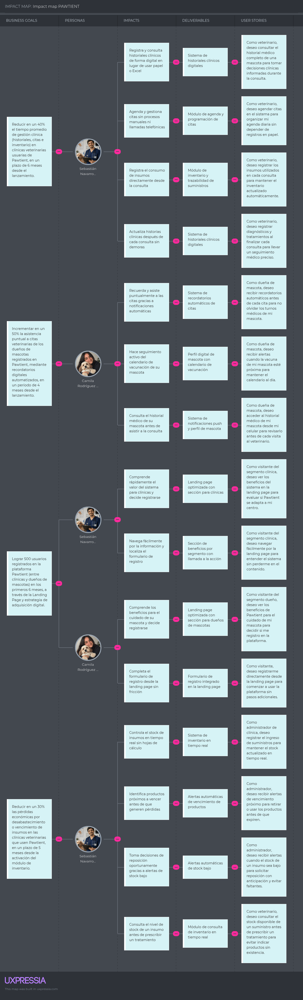
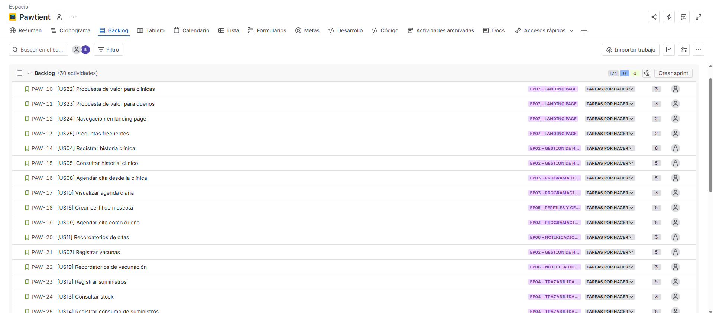
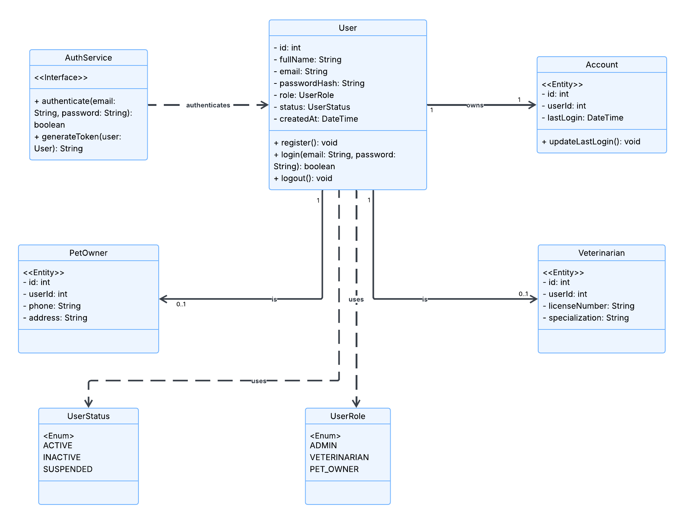
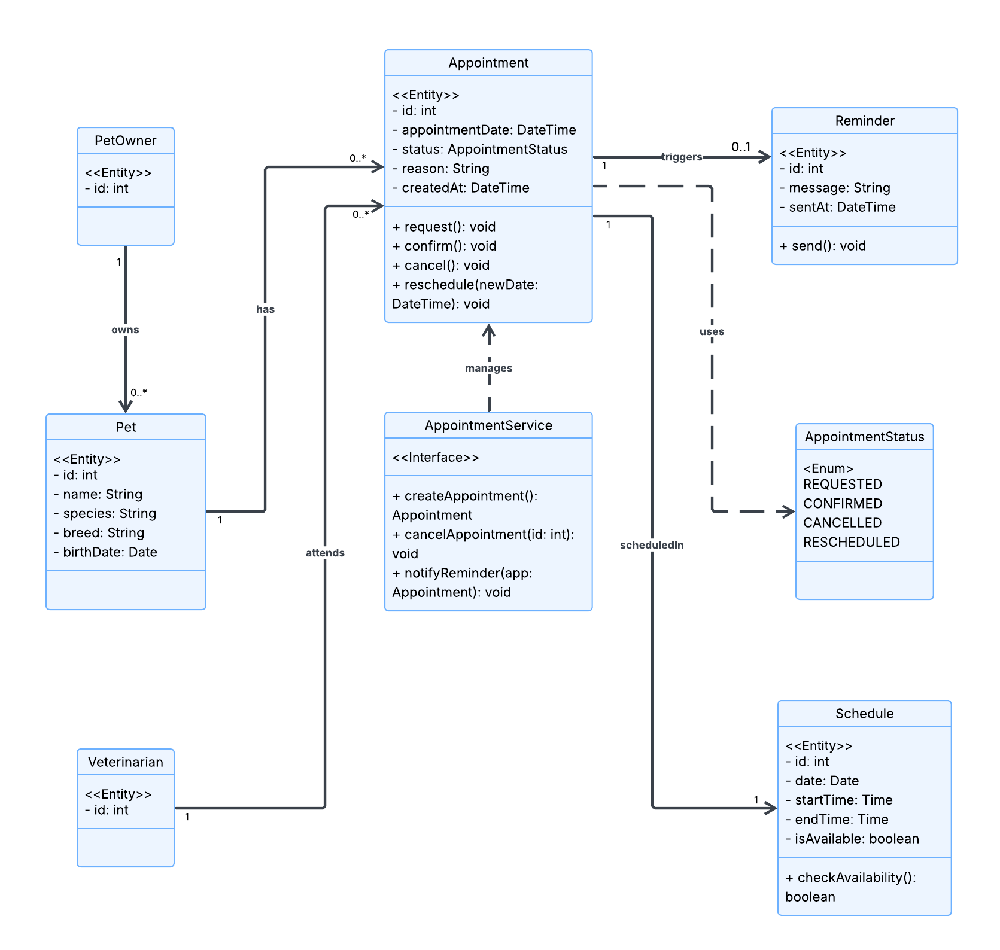
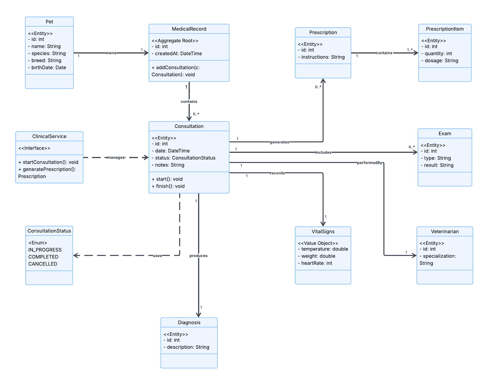
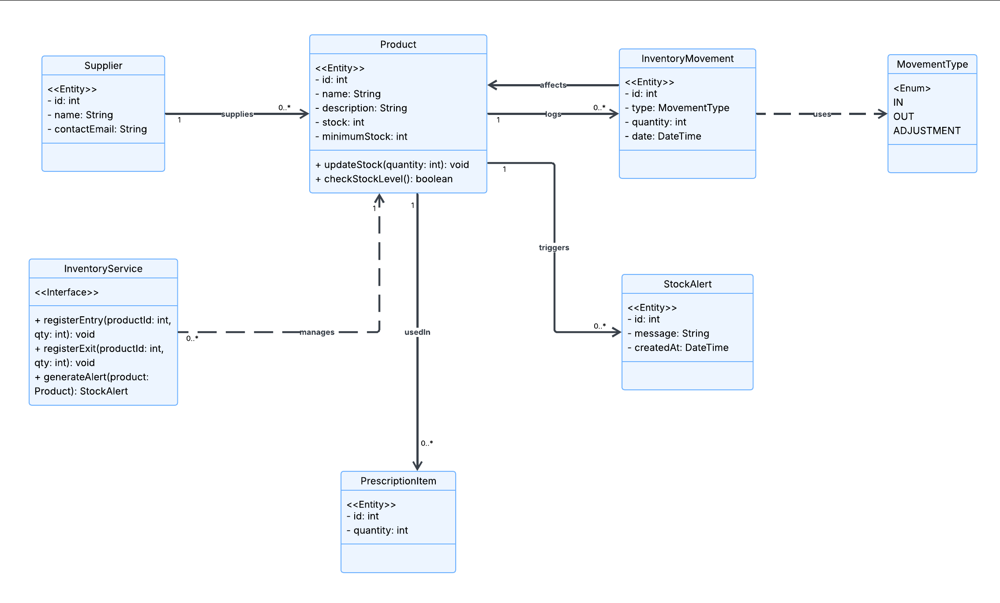

<div align="center">

<br>


# Universidad Peruana de Ciencias Aplicadas
### Facultad de Ingeniería · Ciclo 2026-10

<br>

# Informe de Proyecto - Avance 1

## Presentado por ´PetHealt Team´


## Startup: Pawtient

*Sistema de gestión de clínicas veterinarias*

<br>

**Código del Curso:** 1ASI0730 &nbsp;|&nbsp; **Nombre del Curso:** Aplicaciones Web

**NRC:** `10203`

**Profesor:** Alex Humberto Sánchez Ponce

<br>

### Integrantes de ´PetHealt Team´

`U202410239` - `Salinas Guzmán, Brianna Cristina`

`U202315007` - `Quintanilla Pozo, Gonzalo Samuel`

`U202315171` - `Salazar Miranda, Mateo Paolo`

`U202311469` - `Arroyo Gonzales, Emily Juliette`

`U202314898` - `Acuache Lucas, Mathias Joaquin`

### **Abril 2026**

</div>

---

<br>
<div align="center">
  
## Registro de Versiones del Informe

| Versión | Fecha | Participantes | Descripción de modificación |
|:-------:|:-----:|:-----:|:---------------------------|
| AV1 | 2026-04-08 | Salinas Guzmán, Brianna Cristina <br> Quintanilla Pozo, Gonzalo Samuel <br> Salazar Miranda, Mateo Paolo <br> Arroyo Gonzales, Emily Juliette <br> Acuache Lucas, Mathias Joaquin | Avance 1 del reporte del proyecto y primera versión de la landing page |
| | | | |

</div>

---

<br>

## Project Report Collaboration Insights

**URL del Repositorio:** [`https://github.com/PetHealt/Pawtient-report.git`](https://github.com/PetHealt/Pawtient-report.git)

*(Esta sección se irá expandiendo con cada entrega)*

---

<br>

## Tabla de Contenidos
  #### [Contenido](#-tabla-de-contenidos)
  #### [Student Outcome](#-student-outcome)

  #### [Capítulo I: Introducción](#capítulo-i-introducción-1)
  - [1.1. Startup Profile](#11-startup-profile)
    - [1.1.1. Descripción de la Startup](#111-descripción-de-la-startup)
    - [1.1.2. Perfiles de integrantes del equipo](#112-perfiles-de-integrantes-del-equipo)
  - [1.2. Solution Profile](#12-solution-profile)
    - [1.2.1. Antecedentes y problemática](#121-antecedentes-y-problemática)
    - [1.2.2. Lean UX Process](#122-lean-ux-process)
      - [1.2.2.1. Lean UX Problem Statements](#1221-lean-ux-problem-statements)
      - [1.2.2.2. Lean UX Assumptions](#1222-lean-ux-assumptions)
      - [1.2.2.3. Lean UX Hypothesis Statements](#1223-lean-ux-hypothesis-statements)
      - [1.2.2.4. Lean UX Canvas](#1224-lean-ux-canvas)
  - [1.3. Segmentos objetivo](#13-segmentos-objetivo)
 
  #### [Capítulo II: Requirements Elicitation & Analysis](#capítulo-ii-requirements-elicitation--analysis-1)
  - [2.1. Competidores](#21-competidores)
    - [2.1.1. Análisis competitivo](#211-análisis-competitivo)
    - [2.1.2. Estrategias y tácticas frente a competidores](#212-estrategias-y-tácticas-frente-a-competidores)
  - [2.2. Entrevistas](#22-entrevistas)
    - [2.2.1. Diseño de entrevistas](#221-diseño-de-entrevistas)
    - [2.2.2. Registro de entrevistas](#222-registro-de-entrevistas)
    - [2.2.3. Análisis de entrevistas](#223-análisis-de-entrevistas)
  - [2.3. Needfinding](#23-needfinding)
    - [2.3.1. User Personas](#231-user-personas)
    - [2.3.2. User Task Matrix](#232-user-task-matrix)
    - [2.3.3. User Journey Mapping](#233-user-journey-mapping)
    - [2.3.4. Empathy Mapping](#234-empathy-mapping)
  - [2.4. Big Picture Event Storming](#24-big-picture-event-storming)
  - [2.5. Ubiquitous Language](#25-ubiquitous-language)
    
  #### [Capítulo III: Requirements Specification](#capítulo-iii-requirements-specification-1)
  - [3.1. User Stories](#31-user-stories)
  - [3.2. Impact Mapping](#32-impact-mapping)
  - [3.3. Product Backlog](#33-product-backlog)
    
  #### [Capítulo IV: Product Design](#capítulo-iv-product-design-1)
  - [4.1. Style Guidelines](#41-style-guidelines)
    - [4.1.1. General Style Guidelines](#411-general-style-guidelines)
    - [4.1.2. Web Style Guidelines](#412-web-style-guidelines)
  - [4.2. Information Architecture](#42-information-architecture)
    - [4.2.1. Organization Systems](#421-organization-systems)
    - [4.2.2. Labeling Systems](#422-labeling-systems)
    - [4.2.3. SEO Tags and Meta Tags](#423-seo-tags-and-meta-tags)
    - [4.2.4. Searching Systems](#424-searching-systems)
    - [4.2.5. Navigation Systems](#425-navigation-systems)
  - [4.3. Landing Page UI Design](#43-landing-page-ui-design)
    - [4.3.1. Landing Page Wireframe](#431-landing-page-wireframe)
    - [4.3.2. Landing Page Mock-up](#432-landing-page-mock-up)
  - [4.4. Web Applications UX/UI Design](#44-web-applications-uxui-design)
    - [4.4.1. Web Applications Wireframes](#441-web-applications-wireframes)
    - [4.4.2. Web Applications Wireflow Diagrams](#442-web-applications-wireflow-diagrams)
    - [4.4.3. Web Applications Mock-ups](#443-web-applications-mock-ups)
    - [4.4.4. Web Applications User Flow Diagrams](#444-web-applications-user-flow-diagrams)
  - [4.5. Web Applications Prototyping](#45-web-applications-prototyping)
  - [4.6. Domain-Driven Software Architecture](#46-domain-driven-software-architecture)
    - [4.6.1. Design-Level Event Storming](#461-design-level-event-storming)
    - [4.6.2. Software Architecture Context Diagram](#462-software-architecture-context-diagram)
    - [4.6.3. Software Architecture Container Diagrams](#463-software-architecture-container-diagrams)
    - [4.6.4. Software Architecture Components Diagrams](#464-software-architecture-components-diagrams)
  - [4.7. Software Object-Oriented Design](#47-software-object-oriented-design)
    - [4.7.1. Class Diagrams](#471-class-diagrams)
  - [4.8. Database Design](#48-database-design)
    - [4.8.1. Database Diagrams](#481-database-diagrams)
      
  #### [Capítulo V: Product Implementation, Validation & Deployment](#capítulo-v-product-implementation-validation--deployment-1)
  - [5.1. Software Configuration Management](#51-software-configuration-management)
    - [5.1.1. Software Development Environment Configuration](#511-software-development-environment-configuration)
    - [5.1.2. Source Code Management](#512-source-code-management)
    - [5.1.3. Source Code Style Guide & Conventions](#513-source-code-style-guide--conventions)
    - [5.1.4. Software Deployment Configuration](#514-software-deployment-configuration)
  - [5.2. Landing Page, Services & Applications Implementation](#52-landing-page-services--applications-implementation)
    - [5.2.1. Sprint 1](#521-sprint-1)
  - [5.3. Validation Interviews](#53-validation-interviews)
  - [5.4. Video About-the-Product](#54-video-about-the-product)
    
  #### [Conclusiones](#conclusiones-1)
  
  #### [Recomendaciones](#recomendaciones-1)

  #### [Video About-the-Team](#video-about-the-team-1)
  
  #### [Bibliografía](#-bibliografía)
  
  #### [Anexos](#anexos-1)

---

<br>

## Student Outcome

En el siguiente cuadro se describen las acciones realizadas y enunciados de conclusiones que permiten sustentar el logro alcanzado.

| Criterio específico | Acciones realizadas | Conclusiones |
|:---|:---|:---|
| **5.c1. Trabaja en equipo para proporcionar liderazgo en forma conjunta.** | **Salinas Guzmán, Brianna** <br> AV1: Demostré liderazgo colaborativo al guiar la estructuración del sistema mediante la elaboración del Ubiquitous Language, User Stories, Impact Mapping y Product Backlog, facilitando la alineación del equipo en torno al dominio del problema. Apliqué comunicación efectiva y escucha activa para integrar ideas del equipo y tomar decisiones conjuntas. Asimismo, contribuí en el diseño técnico (Class Diagrams, Database Design y Database Diagrams), promoviendo pensamiento analítico y responsabilidad compartida en las decisiones de arquitectura. <br><br> **Quintanilla Pozo, Gonzalo** <br> AV1: (acción específica) <br><br> **Salazar Miranda, Mateo** <br> AV1: (acción específica) <br><br> **Arroyo Gonzales, Emily** <br> AV1: (acción específica) <br><br> **Acuache Lucas, Mathias** <br> AV1: (acción específica) | (Completar de forma grupal en cada entrega) |
| **5.c2. Crea un entorno colaborativo e inclusivo, establece metas, planifica tareas y cumple objetivos** | **Salinas Guzmán, Brianna** <br> AV1: Contribuí a la creación de un entorno colaborativo mediante la organización y priorización del Product Backlog y User Stories, estableciendo metas claras para el desarrollo del sistema Pawtient. Apliqué habilidades de organización y gestión del tiempo para cumplir con los entregables asignados. Promoví una comunicación clara a través del Ubiquitous Language, facilitando la comprensión común del proyecto, y demostré proactividad y compromiso al asegurar la coherencia entre requerimientos y diseño técnico. <br><br> **Quintanilla Pozo, Gonzalo** <br> AV1: (acción específica) <br><br> **Salazar Miranda, Mateo** <br> AV1: (acción específica) <br><br> **Arroyo Gonzales, Emily** <br> AV1: (acción específica) <br><br> **Acuache Lucas, Mathias** <br> AV1: (acción específica) | (Completar de forma grupal en cada entrega) |

---

<div align="center">

# Capítulo I: Introducción

</div>

---

## 1.1. Startup Profile

### 1.1.1. Descripción de la Startup


---

###   1.1.2. Perfiles de integrantes del equipo

<div align="center">
  
#### Integrante 1


| Campo | Detalle |
|:------|:--------|
| **Nombres y Apellidos** | `Salinas Guzmán, Brianna` |
| **Código de estudiante** | `U202410239` |
| **Carrera** | Ingeniería de Software |

</div>
<br>

**Descripción:**
*Soy estudiante de Ingeniería de Software con conocimientos en desarrollo de aplicaciones, estructuras de datos y programación orientada a objetos. Tengo experiencia trabajando con lenguajes como C++, Pyhton, SQL para base de datos y en la gestión de proyectos utilizando Git y GitHub para el control de versiones. Además, cuento con formación complementaria en marketing digital, lo que me permite aportar una perspectiva orientada al usuario y al posicionamiento del producto. Me considero una persona responsable, con capacidad de aprendizaje autónomo y habilidades para trabajar en equipo y comunicar ideas de manera clara.*

---

<br>

<div align="center">
  
#### Integrante 2


| Campo | Detalle |
|:------|:--------|
| **Nombres y Apellidos** | `Apellidos, Nombres` |
| **Código de estudiante** | `codigo` |
| **Carrera** | Ingeniería de Software |
</div>

**Descripción:**
*(Párrafo describiendo principales conocimientos técnicos y habilidades que puede aportar al equipo)*

---
<br>

<div align="center">
  
#### Integrante 3


| Campo | Detalle |
|:------|:--------|
| **Nombres y Apellidos** | `Apellidos, Nombres` |
| **Código de estudiante** | `codigo` |
| **Carrera** | Ingeniería de Software |
</div>

**Descripción:**
*(Párrafo describiendo principales conocimientos técnicos y habilidades que puede aportar al equipo)*

---
<br>
<div align="center">

#### Integrante 4


| Campo | Detalle |
|:------|:--------|
| **Nombres y Apellidos** | `Apellidos, Nombres` |
| **Código de estudiante** | `codigo` |
| **Carrera** | Ingeniería de Software |
</div>

**Descripción:**
*(Párrafo describiendo principales conocimientos técnicos y habilidades que puede aportar al equipo)*

---
<br>
<div align="center">
  
#### Integrante 5


| Campo | Detalle |
|:------|:--------|
| **Nombres y Apellidos** | `Apellidos, Nombres` |
| **Código de estudiante** | `codigo` |
| **Carrera** | Ingeniería de Software |
</div>

**Descripción:**
*(Párrafo describiendo principales conocimientos técnicos y habilidades que puede aportar al equipo)*

---
<br>


## 1.2. Solution Profile

### 1.2.1. Antecedentes y problemática


---

### 1.2.2. Lean UX Process


#### 1.2.2.1. Lean UX Problem Statements


**Problem Statement 1:**


---

#### 1.2.2.2. Lean UX Assumptions

**Business Assumptions:**


**User Assumptions:**


---

#### 1.2.2.3. Lean UX Hypothesis Statements

> *(Estructura: "Creemos que [resultado] se logrará si [usuario] logra [beneficio] con [característica]")*

**Hypothesis 1:**
> Creemos que **[resultado de negocio]** se logrará si **[usuario/segmento]** logra **[beneficio esperado]** con **[característica o solución propuesta]**.

**Hypothesis 2:**
> Creemos que **[resultado de negocio]** se logrará si **[usuario/segmento]** logra **[beneficio esperado]** con **[característica o solución propuesta]**.

**Hypothesis 3:**
> Creemos que **[resultado de negocio]** se logrará si **[usuario/segmento]** logra **[beneficio esperado]** con **[característica o solución propuesta]**.

---

#### 1.2.2.4. Lean UX Canvas

*(Incluir captura de imagen del Lean UX Canvas elaborado en la herramienta indicada)*


*(Descripción y análisis del Lean UX Canvas)*

---

## 1.3. Segmentos objetivo

> *(Describir los segmentos asociados al dominio del problema, incluyendo características demográficas e información estadística de sustento)*

### Segmento objetivo 1: `[Nombre del segmento]`

*(Descripción del segmento: características demográficas, perfil, necesidades y estadísticas de respaldo)*

**Características demográficas:**
- **Edad:** `[rango de edad]`
- **Género:** `[distribución]`
- **Ubicación:** `[contexto geográfico]`
- **Ocupación:** `[tipo de ocupación]`
- **Nivel socioeconómico:** `[nivel]`

*(Estadísticas de sustento con fuentes referenciadas)*

---

### Segmento objetivo 2: `[Nombre del segmento]`

*(Descripción del segmento: características demográficas, perfil, necesidades y estadísticas de respaldo)*

**Características demográficas:**
- **Edad:** `[rango de edad]`
- **Género:** `[distribución]`
- **Ubicación:** `[contexto geográfico]`
- **Ocupación:** `[tipo de ocupación]`
- **Nivel socioeconómico:** `[nivel]`

*(Estadísticas de sustento con fuentes referenciadas)*

---

<div align="center">

# Capítulo II: Requirements Elicitation & Analysis

</div>

---

## 2.1. Competidores

> *(Identificar y describir mínimo 3 competidores directos o indirectos con modelos de negocio basados en productos digitales similares)*

### 2.1.1. Análisis competitivo

**¿Por qué llevar a cabo este análisis?**
*(Escribir la pregunta que busca responder o el objetivo de este análisis)*

#### Competitive Analysis Landscape

| | **BrandRadar** | **Competidor 1** | **Competidor 2** | **Competidor 3** |
|:--|:--:|:--:|:--:|:--:|
| **Logo** | *(logo)* | *(logo)* | *(logo)* | *(logo)* |
| **Overview** | | | | |
| **Ventaja competitiva** | | | | |
| **Mercado objetivo** | | | | |
| **Estrategias de marketing** | | | | |
| **Productos & Servicios** | | | | |
| **Precios & Costos** | | | | |
| **Canales de distribución** | | | | |
| **Fortalezas** | | | | |
| **Debilidades** | | | | |
| **Oportunidades** | | | | |
| **Amenazas** | | | | |

---

### 2.1.2. Estrategias y tácticas frente a competidores

*(Describir las estrategias y tácticas preliminares que aplicará el startup para afrontar las fortalezas y aprovechar las debilidades de los competidores, así como el contexto de oportunidades y amenazas)*

---

## 2.2. Entrevistas

> *(Investigación basada en recolección de información mediante entrevistas a representantes de los segmentos objetivo)*

### 2.2.1. Diseño de entrevistas

*(Incluir las preguntas principales y complementarias para entrevistas, dirigidas a cada segmento objetivo)*

**Segmento objetivo 1: `[Nombre del segmento]`**

*Preguntas principales:*
1. *(Pregunta 1)*
2. *(Pregunta 2)*
3. *(Pregunta 3)*

*Preguntas complementarias:*
1. *(Pregunta complementaria 1)*
2. *(Pregunta complementaria 2)*

---

**Segmento objetivo 2: `[Nombre del segmento]`**

*Preguntas principales:*
1. *(Pregunta 1)*
2. *(Pregunta 2)*
3. *(Pregunta 3)*

*Preguntas complementarias:*
1. *(Pregunta complementaria 1)*
2. *(Pregunta complementaria 2)*

---

### 2.2.2. Registro de entrevistas
<div align="center">
  
**Segmento objetivo 1: `nombre del segmento`**

<br>

#### Entrevista 1
*Imagen de la entrevista*


<br>

| Campo | Detalle |
|:------|:--------|
| **Nombres y apellidos** | `[Nombre del entrevistado]` |
| **Edad** | `[Edad]` |
| **Ubicación** | `[Distrito]` |
| **Fecha de entrevista** | `YYYY-MM-DD` |
| **Duración** | `[HH:MM]` |
| **Enlace al video** | [Ver entrevista en Microsoft Stream](`URL`) — Inicia en `[MM:SS]` |

**Resumen:**

</div>

*(Redactar resumen de la entrevista)*

<br>
<div align="center">
  
#### Entrevista 2
*Imagen de la entrevista*


<br>

| Campo | Detalle |
|:------|:--------|
| **Nombres y apellidos** | `[Nombre del entrevistado]` |
| **Edad** | `[Edad]` |
| **Ubicación** | `[Distrito]` |
| **Fecha de entrevista** | `YYYY-MM-DD` |
| **Duración** | `[HH:MM]` |
| **Enlace al video** | [Ver entrevista en Microsoft Stream](`URL`) — Inicia en `[MM:SS]` |

**Resumen:**

</div>

*(Redactar resumen de la entrevista)*

<br>
<div align="center">
  
#### Entrevista 3

*Imagen de la entrevista*


<br>

| Campo | Detalle |
|:------|:--------|
| **Nombres y apellidos** | `[Nombre del entrevistado]` |
| **Edad** | `[Edad]` |
| **Ubicación** | `[Distrito]` |
| **Fecha de entrevista** | `YYYY-MM-DD` |
| **Duración** | `[HH:MM]` |
| **Enlace al video** | [Ver entrevista en Microsoft Stream](`URL`) — Inicia en `[MM:SS]` |

**Resumen:**

</div>

*Redactar resumen de la entrevista*

---
<div align="center">
  
**Segmento objetivo 2: `nombre del segmento`**

<br>

#### Entrevista 1

*Imagen de la entrevista*


<br>

| Campo | Detalle |
|:------|:--------|
| **Nombres y apellidos** | `[Nombre del entrevistado]` |
| **Edad** | `[Edad]` |
| **Ubicación** | `[Distrito]` |
| **Fecha de entrevista** | `YYYY-MM-DD` |
| **Duración** | `[HH:MM]` |
| **Enlace al video** | [Ver entrevista en Microsoft Stream](`URL`) — Inicia en `[MM:SS]` |

**Resumen:**

</div>

*(Redactar de forma descriptiva las respuestas del entrevistado a las preguntas realizadas. Incluir todas las características objetivas y subjetivas: personalidad, marcas e influencias, tecnología, canales de interacción, browser, dispositivos, etc.)*

<br>

<div align="center">
  
#### Entrevista 2

*Imagen de la entrevista*


<br>

| Campo | Detalle |
|:------|:--------|
| **Nombres y apellidos** | `[Nombre del entrevistado]` |
| **Edad** | `[Edad]` |
| **Ubicación** | `[Distrito]` |
| **Fecha de entrevista** | `YYYY-MM-DD` |
| **Duración** | `[HH:MM]` |
| **Enlace al video** | [Ver entrevista en Microsoft Stream](`URL`) — Inicia en `[MM:SS]` |

**Resumen:**

</div>

*(Redactar resumen de la entrevista)*

<br>

<div align="center">

#### Entrevista 3

*Imagen de la entrevista*


<br>

| Campo | Detalle |
|:------|:--------|
| **Nombres y apellidos** | `[Nombre del entrevistado]` |
| **Edad** | `[Edad]` |
| **Ubicación** | `[Distrito]` |
| **Fecha de entrevista** | `YYYY-MM-DD` |
| **Duración** | `[HH:MM]` |
| **Enlace al video** | [Ver entrevista en Microsoft Stream](`URL`) — Inicia en `[MM:SS]` |

**Resumen:**

</div>

*(Redactar resumen de la entrevista)*

---

### 2.2.3. Análisis de entrevistas

> *(Análisis por segmento objetivo con sustento estadístico — porcentajes)*

**Segmento objetivo 1: `[Nombre del segmento]`**

*(Identificar con sustento estadístico todas las características objetivas y subjetivas representativas del segmento, necesarias para la construcción de los arquetipos)*

**Segmento objetivo 2: `[Nombre del segmento]`**

*(Identificar con sustento estadístico todas las características objetivas y subjetivas representativas del segmento, necesarias para la construcción de los arquetipos)*

---

## 2.3. Needfinding

> *(Artefactos resultantes del proceso de análisis de la información recolectada)*

### 2.3.1. User Personas

*(Introducción explicando la relación entre los artefactos y las principales características tomadas del análisis de entrevistas y competencia)*

**User Persona — Segmento 1: `[Nombre del Persona]`**

*(Captura de la ficha elaborada en UXPressia)*


---

**User Persona — Segmento 2: `[Nombre del Persona]`**

*(Captura de la ficha elaborada en UXPressia)*


---

### 2.3.2. User Task Matrix

*(Introducción estableciendo los segmentos considerados)*

| Tarea (Task) | `[Persona 1]` Frecuencia | `[Persona 1]` Importancia | `[Persona 2]` Frecuencia | `[Persona 2]` Importancia |
|:-------------|:------------------------:|:-------------------------:|:------------------------:|:-------------------------:|
| *(Tarea 1)* | Alta / Media / Baja | Alta / Media / Baja | Alta / Media / Baja | Alta / Media / Baja |
| *(Tarea 2)* | | | | |
| *(Tarea 3)* | | | | |
| *(Tarea 4)* | | | | |
| *(Tarea 5)* | | | | |

*(Explicación resaltando las tareas con mayor frecuencia e importancia, principales diferencias y coincidencias entre los User Personas)*

---

### 2.3.3. User Journey Mapping

*(Introducción resumiendo el end-to-end journey que se pretende ilustrar — versión As-Is)*

**User Journey Map — `[Persona 1]`**

*(Captura del diagrama elaborado en UXPressia)*


---

**User Journey Map — `[Persona 2]`**

*(Captura del diagrama elaborado en UXPressia)*


---

### 2.3.4. Empathy Mapping

*(Resumen del proceso de elaboración y capturas de los Empathy Maps)*

**Empathy Map — `[Persona 1]`**

*(Captura elaborada en UXPressia)*


---

**Empathy Map — `[Persona 2]`**

*(Captura elaborada en UXPressia)*


---

## 2.4. Big Picture Event Storming

> *(Sesión colaborativa enfocada en entender el dominio del negocio en general. Referencia: https://bit.ly/bpes-guide)*

*(Introducción al proceso realizado y explicación de las etapas)*

*(Capturas del Big Picture Event Storming elaborado en LucidChart / Miro)*


*(Explicación de los eventos, actores y flujos identificados)*

---

## 2.5. Ubiquitous Language

>*A continuación se presenta el glosario de términos clave utilizados en el dominio del sistema **Pawtient**, orientado a la gestión de clínicas veterinarias. Este lenguaje común permite una comunicación clara y sin ambigüedades entre todos los stakeholders: veterinarios, administradores, dueños de mascotas y el equipo de desarrollo.*

<br>

## Actores del dominio

| Término (EN) | Término (ES) | Definición |
|:---|:---|:---|
| `Veterinarian / Admin` | Veterinario / Administrador | Usuario interno de la clínica con privilegios para gestionar citas, consultas, inventario y reportes. En el sistema se identifica como un único rol con acceso completo. |
| `Pet Owner` | Dueño de mascota | Persona externa responsable de una o más mascotas registradas. Puede iniciar sesión para consultar información, pero no tiene acceso administrativo. |
| `Supplier` | Proveedor | Entidad externa que abastece insumos médicos a la clínica. Puede ser registrado, editado o eliminado por el veterinario/admin. |

<br>

## Gestión de clínica y usuarios

| Término (EN) | Término (ES) | Definición |
|:---|:---|:---|
| `Clinic` | Clínica | Entidad principal del sistema que agrupa veterinarios, mascotas, citas e inventario bajo una misma organización. |
| `Subscription Plan` | Plan de suscripción | Plan comercial que determina las funcionalidades habilitadas para una clínica (ej. Paw Basic). Activado al registrar la clínica. |
| `User Account` | Cuenta de usuario | Credenciales de acceso al sistema, asociadas a un rol (veterinario/admin o dueño de mascota). |
| `Session` | Sesión | Período activo de uso del sistema tras autenticación exitosa. |
| `Access Data` | Datos de acceso | Información guardada localmente para facilitar el inicio de sesión recurrente. |

<br>

## Mascotas y pacientes

| Término (EN) | Término (ES) | Definición |
|:---|:---|:---|
| `Pet` | Mascota | Animal registrado en el sistema, asociado a un dueño de mascota. Es la unidad de atención clínica. |
| `Patient` | Paciente | Mascota en el contexto de una consulta médica activa. El término se usa cuando la mascota está siendo atendida. |
| `Triage` | Triaje | Proceso de valoración inicial del paciente al ingresar a consulta, donde se registran signos vitales básicos. |
| `Vital Signs` | Signos vitales | Mediciones fisiológicas registradas durante el triaje (temperatura, peso, frecuencia cardíaca, etc.). |

<br>

## Citas y agenda

| Término (EN) | Término (ES) | Definición |
|:---|:---|:---|
| `Appointment` | Cita | Reserva programada para la atención de un paciente en una fecha y hora específica. |
| `Availability` | Disponibilidad | Configuración de horarios en los que un veterinario puede recibir citas. |
| `Appointment Request` | Solicitud de cita | Acción del dueño de mascota de pedir una cita. Inicia el flujo de confirmación. |
| `Confirmed Appointment` | Cita confirmada | Cita que ha sido aceptada y agendada formalmente. |
| `Cancelled Appointment` | Cita cancelada | Cita que fue anulada antes de realizarse. Genera una pregunta de negocio: ¿se bloquea al usuario si cancela con poca anticipación? |
| `Rescheduled Appointment` | Cita reprogramada | Cita que fue modificada a una nueva fecha u hora. |
| `Appointment Reminder` | Recordatorio de cita | Notificación enviada automáticamente al dueño de mascota antes de la cita. |

<br>

## Consulta médica

| Término (EN) | Término (ES) | Definición |
|:---|:---|:---|
| `Medical Consultation` | Consulta médica | Atención clínica realizada durante una cita donde el veterinario evalúa al paciente. Comienza con el triaje y finaliza con el cierre de la consulta. |
| `Diagnosis` | Diagnóstico | Identificación de una enfermedad o condición médica, emitida por el veterinario tras la evaluación. |
| `Prescription` | Receta médica | Documento generado por el veterinario que especifica medicamentos, dosis y duración del tratamiento. |
| `Medical Exam` | Examen médico | Estudio complementario solicitado durante la consulta (ej. análisis de sangre, rayos X). Se adjunta como archivo al historial. |
| `Lab Result` | Resultado de laboratorio | Resultado de un examen médico. Puede cargarse como PDF o JPG al historial del paciente. |
| `Closed Consultation` | Consulta finalizada | Estado de la consulta una vez que el veterinario ha completado el diagnóstico, emitido receta y adjuntado exámenes si aplica. |
| `Medical History` | Historial médico | Registro acumulado de todas las consultas, diagnósticos, recetas y exámenes de un paciente a lo largo del tiempo. |
| `Shared Medical History` | Historial compartido | Historial médico enviado/entregado al dueño de mascota al finalizar la consulta. |

<br>

## Inventario y suministros

| Término (EN) | Término (ES) | Definición |
|:---|:---|:---|
| `Medical Supply` | Insumo médico | Producto utilizado en la clínica: medicamentos, materiales de uso clínico, etc. Registrado con un stock inicial. |
| `Initial Stock` | Stock inicial | Cantidad definida al registrar un insumo médico por primera vez en el sistema. |
| `Stock Adjustment` | Ajuste de inventario | Modificación manual del nivel de stock de un insumo, registrada por el veterinario/admin. |
| `Critical Stock Alert` | Alerta de stock crítico | Notificación generada automáticamente cuando el stock de un insumo cae por debajo del umbral mínimo. |
| `Discounted Medication` | Medicamento descontado | Medicamento dispensado al paciente durante una consulta, que descuenta unidades del inventario automáticamente. |
| `Supply Expense` | Gasto de insumos | Registro del costo asociado al uso o compra de insumos. Aparece en los reportes financieros. |

<br>

## Proveedores

| Término (EN) | Término (ES) | Definición |
|:---|:---|:---|
| `Added Supplier` | Proveedor agregado | Proveedor nuevo registrado en el sistema. |
| `Edited Supplier` | Proveedor editado | Proveedor cuya información fue actualizada. |
| `Deleted Supplier` | Proveedor eliminado | Proveedor removido del sistema. Acción irreversible. |

<br>

## Facturación y reportes

| Término (EN) | Término (ES) | Definición |
|:---|:---|:---|
| `Service Invoice` | Boleta de atención | Documento generado al finalizar una consulta que detalla los servicios prestados y su costo. |
| `Client Payment` | Pago de cliente | Registro del pago efectuado por el dueño de mascota, asociado a una boleta de atención. |
| `Cancelled Sale` | Venta cancelada | Registro de una transacción que fue anulada antes o después de la emisión de la boleta. |
| `Income Report` | Reporte de ingresos | Reporte generado que consolida los ingresos de la clínica en un período determinado. |
| `Supply Expense Report` | Reporte de gastos de insumos | Reporte que detalla el consumo y costo de los insumos utilizados en un período. |

<br>

## Eventos del dominio (Domain Events)

Los siguientes son los eventos significativos identificados en el Event Storming. Representan hechos ocurridos en el sistema que tienen impacto en el negocio:

| Evento (EN) | Evento (ES) | Bounded Context |
|:---|:---|:---|
| `ClinicRegistered` | Clínica registrada | Gestión de clínica |
| `SubscriptionPlanActivated` | Plan de suscripción activado | Gestión de clínica |
| `UserRegistered` | Usuario registrado | Gestión de usuarios |
| `SessionStarted` | Sesión iniciada | Gestión de usuarios |
| `AccessDataSaved` | Datos de acceso guardados | Gestión de usuarios |
| `PetOwnerAccountRegistered` | Cuenta de dueño registrada | Gestión de usuarios |
| `PetRegistered` | Mascota registrada | Mascotas |
| `AvailabilityConfigured` | Disponibilidad configurada | Agenda |
| `AppointmentRequested` | Cita solicitada | Agenda |
| `AppointmentConfirmed` | Cita confirmada | Agenda |
| `AppointmentCancelled` | Cita cancelada | Agenda |
| `AppointmentRescheduled` | Cita reprogramada | Agenda |
| `AppointmentReminderSent` | Recordatorio de cita enviado | Agenda |
| `PatientAdmittedToTriage` | Paciente ingresado a triaje | Consulta médica |
| `VitalSignsRegistered` | Signos vitales registrados | Consulta médica |
| `MedicalConsultationStarted` | Consulta médica iniciada | Consulta médica |
| `DiagnosisIssued` | Diagnóstico emitido | Consulta médica |
| `PrescriptionGenerated` | Receta médica generada | Consulta médica |
| `MedicalExamAttached` | Examen adjuntado | Consulta médica |
| `ConsultationClosed` | Consulta finalizada | Consulta médica |
| `MedicalHistoryShared` | Historial médico compartido | Consulta médica |
| `SupplierAdded` | Proveedor agregado | Inventario |
| `SupplierEdited` | Proveedor editado | Inventario |
| `SupplierDeleted` | Proveedor eliminado | Inventario |
| `MedicalSupplyRegistered` | Insumo médico registrado | Inventario |
| `InitialStockDefined` | Stock inicial definido | Inventario |
| `MedicationDispensed` | Medicamento descontado por venta | Inventario |
| `CriticalStockAlertGenerated` | Alerta de stock crítico generada | Inventario |
| `StockAdjustmentMade` | Ajuste de inventario realizado | Inventario |
| `ServiceInvoiceGenerated` | Boleta de atención generada | Facturación |
| `ClientPaymentRegistered` | Pago de cliente registrado | Facturación |
| `SaleCancelled` | Venta cancelada | Facturación |
| `IncomeReportGenerated` | Reporte de ingresos generado | Facturación |
| `SupplyExpenseRegistered` | Gasto de insumos registrado | Facturación |


<br>

---

<div align="center">

# Capítulo III: Requirements Specification

</div>

---

## 3.1. User Stories

>*Las User Stories fueron definidas a partir del análisis de entrevistas realizadas a los dos segmentos objetivo: personal clínico de centros veterinarios y dueños de mascotas. Se incluyen además User Stories para la Landing Page y Technical Stories para el RESTful API. Los criterios de aceptación siguen la estructura Gherkin (Given–When–Then) y están redactados en tiempo presente, tercera persona, sin referencias a detalles de interfaz de usuario.*

<br>

| Epic / Story ID | Título | Descripción | Criterios de Aceptación | Relacionado con (Epic ID) |
|---|---|---|---|---|
| **EP01** | **Autenticación y Gestión de Usuarios** | Proveer un sistema seguro de registro, inicio de sesión y gestión de roles para veterinarios, administradores de clínica y dueños de mascotas. | — | — |
| US01 | Registrar cuenta como veterinario | Como veterinario, quiero crear una cuenta en Pawtient con mis datos profesionales para acceder a las funcionalidades del sistema de gestión clínica. | **Escenario 1 – Registro exitoso:** <br> **Given** que el veterinario completa todos los campos obligatorios (nombre, apellido, correo, contraseña y número de colegiatura), <br> **When** envía el formulario de registro, <br> **Then** el sistema crea la cuenta, envía un correo de verificación y muestra un mensaje de confirmación. <br><br> **Escenario 2 – Correo ya registrado:** <br> **Given** que el veterinario ingresa un correo electrónico que ya existe en el sistema, <br> **When** envía el formulario, <br> **Then** el sistema muestra el mensaje "El correo ya está registrado" y no crea una cuenta duplicada. <br><br> **Escenario 3 – Contraseña débil:** <br> **Given** que el veterinario ingresa una contraseña que no cumple los requisitos mínimos de seguridad, <br> **When** envía el formulario, <br> **Then** el sistema resalta los requisitos incumplidos y no permite que el registro continúe. | EP01 |
| US02 | Iniciar sesión en la plataforma | Como usuario registrado (veterinario, administrador o dueño de mascota), quiero iniciar sesión con mis credenciales para acceder a las funcionalidades según mi rol. | **Escenario 1 – Inicio de sesión exitoso:** <br> **Given** que el usuario ingresa un correo y contraseña válidos, <br> **When** confirma el inicio de sesión, <br> **Then** el sistema autentica al usuario, genera un token de sesión y lo redirige al panel correspondiente a su rol. <br><br> **Escenario 2 – Credenciales incorrectas:** <br> **Given** que el usuario ingresa una contraseña incorrecta, <br> **When** intenta iniciar sesión, <br> **Then** el sistema muestra el mensaje "Credenciales inválidas" sin especificar cuál campo es incorrecto y deniega el acceso. <br><br> **Escenario 3 – Cuenta no verificada:** <br> **Given** que el usuario registrado no ha verificado su correo electrónico, <br> **When** intenta iniciar sesión, <br> **Then** el sistema informa que la cuenta requiere verificación y ofrece reenviar el correo de confirmación. | EP01 |
| US03 | Recuperar contraseña olvidada | Como usuario registrado, quiero recuperar el acceso a mi cuenta en caso de olvidar mi contraseña para no perder el acceso a la plataforma. | **Escenario 1 – Correo de recuperación enviado:** <br> **Given** que el usuario ingresa su correo registrado en el formulario de recuperación, <br> **When** confirma la solicitud, <br> **Then** el sistema envía un enlace de restablecimiento de contraseña válido por 30 minutos. <br><br> **Escenario 2 – Correo no registrado:** <br> **Given** que el usuario ingresa un correo que no existe en el sistema, <br> **When** confirma la solicitud, <br> **Then** el sistema muestra el mensaje genérico "Si el correo está registrado, recibirás un enlace" sin confirmar ni negar la existencia de la cuenta. <br><br> **Escenario 3 – Enlace expirado:** <br> **Given** que el usuario intenta usar un enlace de recuperación después de los 30 minutos de validez, <br> **When** accede al enlace, <br> **Then** el sistema indica que el enlace ha expirado y permite solicitar uno nuevo. | EP01 |
| **EP02** | **Gestión de Historiales Clínicos** | Centralizar los registros médicos de las mascotas en formato digital, eliminando el uso de historias en papel o Excel y permitiendo el acceso desde dispositivos móviles. | — | — |
| US04 | Registrar historia clínica de mascota | Como veterinario, quiero crear y guardar la historia clínica digital de una mascota para eliminar el uso de registros físicos y acceder a la información desde cualquier dispositivo. | **Escenario 1 – Registro exitoso:** <br> **Given** que el veterinario completa todos los campos obligatorios (nombre de mascota, especie, raza, peso, diagnóstico, tratamiento y fecha), <br> **When** confirma el guardado, <br> **Then** el sistema almacena el registro y muestra un mensaje de confirmación. <br><br> **Escenario 2 – Campos incompletos:** <br> **Given** que el veterinario intenta guardar una historia clínica con campos obligatorios vacíos, <br> **When** confirma el guardado, <br> **Then** el sistema resalta los campos faltantes y no permite continuar hasta completarlos. <br><br> **Escenario 3 – Acceso desde dispositivo móvil:** <br> **Given** que el veterinario accede al sistema desde un dispositivo móvil, <br> **When** crea o consulta una historia clínica, <br> **Then** el sistema muestra el formulario completo y funcional sin pérdida de campos ni funcionalidades. | EP02 |
| US05 | Consultar historial médico de una mascota | Como veterinario, quiero buscar y visualizar el historial completo de una mascota para tomar decisiones clínicas informadas durante la consulta. | **Escenario 1 – Búsqueda por nombre de mascota:** <br> **Given** que el veterinario ingresa el nombre de la mascota en el buscador del módulo de historiales, <br> **When** el sistema procesa la búsqueda, <br> **Then** muestra los registros coincidentes ordenados cronológicamente de forma descendente. <br><br> **Escenario 2 – Sin resultados:** <br> **Given** que el veterinario realiza una búsqueda, <br> **When** no existe ningún registro con ese nombre, <br> **Then** el sistema muestra el mensaje "No se encontraron registros" y ofrece la opción de crear uno nuevo. <br><br> **Escenario 3 – Visualización de vacunas aplicadas:** <br> **Given** que el veterinario abre el historial de una mascota, <br> **When** navega a la sección de vacunación, <br> **Then** el sistema lista todas las vacunas aplicadas con fecha de aplicación, número de lote y fecha de próxima dosis. | EP02 |
| US06 | Editar y actualizar historia clínica | Como veterinario, quiero actualizar la historia clínica de una mascota después de cada consulta para mantener la información vigente y con trazabilidad de cambios. | **Escenario 1 – Actualización exitosa:** <br> **Given** que el veterinario abre un registro existente y modifica el diagnóstico o tratamiento, <br> **When** guarda los cambios, <br> **Then** el sistema registra la actualización incluyendo la fecha, hora y nombre del usuario que realizó el cambio. <br><br> **Escenario 2 – Edición sin permisos:** <br> **Given** que un usuario sin rol de veterinario intenta editar una historia clínica, <br> **When** intenta acceder al modo de edición, <br> **Then** el sistema deniega la acción y muestra el mensaje "No tienes permisos para editar este registro". <br><br> **Escenario 3 – Historial de cambios visible:** <br> **Given** que el veterinario revisa una historia clínica, <br> **When** accede a la sección de trazabilidad, <br> **Then** el sistema muestra un registro cronológico de todas las modificaciones realizadas con nombre del autor y fecha. | EP02 |
| US07 | Registrar vacunas aplicadas | Como veterinario, quiero registrar cada vacuna aplicada durante una consulta vinculándola al historial de la mascota para mantener un calendario de vacunación actualizado. | **Escenario 1 – Registro de vacuna exitoso:** <br> **Given** que el veterinario completa los campos de vacunación (nombre de vacuna, lote, fecha de aplicación y próxima dosis), <br> **When** confirma el registro, <br> **Then** el sistema guarda la entrada y la añade al historial de vacunación de la mascota. <br><br> **Escenario 2 – Fecha de próxima dosis en el pasado:** <br> **Given** que el veterinario ingresa una fecha de próxima dosis anterior a la fecha actual, <br> **When** intenta guardar, <br> **Then** el sistema muestra una advertencia indicando que la fecha corresponde al pasado y solicita confirmación para continuar. <br><br> **Escenario 3 – Programación automática de recordatorio:** <br> **Given** que se registra una vacuna con fecha de próxima dosis, <br> **When** el sistema confirma el guardado, <br> **Then** programa automáticamente un recordatorio para notificar al dueño 7 días antes de la fecha indicada. | EP02 |
| **EP03** | **Programación y Gestión de Citas** | Digitalizar y automatizar la agenda de citas para reducir el estrés del personal clínico y mejorar la experiencia del dueño de mascota. | — | — |
| US08 | Agendar cita desde la clínica | Como veterinario, quiero registrar una nueva cita en el sistema para organizar la agenda diaria sin depender de llamadas manuales ni registros en papel. | **Escenario 1 – Cita registrada correctamente:** <br> **Given** que el veterinario selecciona fecha, hora, veterinario asignado y mascota del cliente, <br> **When** confirma el registro, <br> **Then** el sistema añade la cita al calendario y envía automáticamente una notificación al dueño de la mascota. <br><br> **Escenario 2 – Horario no disponible:** <br> **Given** que el veterinario selecciona un horario ya ocupado por el mismo profesional, <br> **When** intenta confirmar, <br> **Then** el sistema indica la no disponibilidad y sugiere los próximos horarios libres. <br><br> **Escenario 3 – Cita fuera del horario de atención:** <br> **Given** que el veterinario intenta registrar una cita fuera del horario configurado por la clínica, <br> **When** intenta confirmar, <br> **Then** el sistema muestra una advertencia indicando que el horario seleccionado está fuera del rango configurado. | EP03 |
| US09 | Agendar cita como dueño de mascota | Como dueño de mascota, quiero solicitar una cita veterinaria desde mi celular para evitar llamadas telefónicas y reducir el tiempo invertido en coordinar turnos. | **Escenario 1 – Solicitud enviada exitosamente:** <br> **Given** que el dueño selecciona una clínica, una de sus mascotas registradas y una fecha y hora disponibles, <br> **When** confirma la solicitud, <br> **Then** el sistema registra la cita y envía una confirmación mediante notificación push. <br><br> **Escenario 2 – Sin horarios disponibles en la fecha seleccionada:** <br> **Given** que el dueño selecciona una fecha en la que todos los horarios están ocupados, <br> **When** intenta avanzar, <br> **Then** el sistema muestra el mensaje "No hay horarios disponibles para esta fecha" y permite seleccionar otra. <br><br> **Escenario 3 – Cancelación con anticipación:** <br> **Given** que el dueño tiene una cita confirmada y la cancela con al menos 2 horas de anticipación, <br> **When** confirma la cancelación, <br> **Then** el sistema libera el horario, notifica a la clínica y elimina los recordatorios asociados. | EP03 |
| US10 | Visualizar agenda del día | Como veterinario, quiero ver un resumen de las citas programadas para el día en curso para organizar mi jornada de trabajo de forma eficiente. | **Escenario 1 – Visualización correcta de la agenda:** <br> **Given** que el veterinario accede al panel principal, <br> **When** selecciona la vista de agenda diaria, <br> **Then** el sistema lista todas las citas del día ordenadas por hora con nombre de mascota, dueño y motivo de consulta. <br><br> **Escenario 2 – Agenda vacía:** <br> **Given** que no existen citas programadas para el día en curso, <br> **When** el veterinario accede a la agenda, <br> **Then** el sistema muestra el mensaje "No hay citas programadas para hoy". <br><br> **Escenario 3 – Filtro por veterinario:** <br> **Given** que la clínica tiene múltiples veterinarios, <br> **When** el administrador aplica un filtro por un profesional específico, <br> **Then** el sistema muestra únicamente las citas asignadas a ese veterinario. | EP03 |
| US11 | Recibir recordatorios de citas | Como dueño de mascota, quiero recibir recordatorios automáticos antes de las citas de mi mascota para no olvidar los turnos médicos. | **Escenario 1 – Recordatorio 24 horas antes:** <br> **Given** que existe una cita confirmada, <br> **When** faltan 24 horas para la cita, <br> **Then** el sistema envía una notificación push al dueño con la fecha, hora, nombre de la clínica y veterinario asignado. <br><br> **Escenario 2 – Recordatorio 1 hora antes:** <br> **Given** que existe una cita confirmada, <br> **When** falta 1 hora para la cita, <br> **Then** el sistema envía un segundo recordatorio de confirmación al dueño. <br><br> **Escenario 3 – Recordatorios desactivados por el usuario:** <br> **Given** que el dueño ha desactivado los recordatorios de citas en su configuración, <br> **When** el sistema evalúa el envío de una alerta, <br> **Then** no envía ninguna notificación para ese tipo de evento. | EP03 |
| **EP04** | **Trazabilidad de Suministros e Inventario** | Proveer control en tiempo real del inventario de medicamentos e insumos para evitar faltantes, vencimientos y errores operativos en la clínica. | — | — |
| US12 | Registrar ingreso de suministros | Como administrador de clínica, quiero registrar el ingreso de nuevos suministros al inventario para mantener el stock actualizado en tiempo real. | **Escenario 1 – Ingreso registrado exitosamente:** <br> **Given** que el administrador completa los campos de nombre del producto, cantidad, unidad, fecha de vencimiento y proveedor, <br> **When** confirma el registro, <br> **Then** el sistema actualiza el stock y registra la transacción con fecha y usuario responsable. <br><br> **Escenario 2 – Producto ya existente en inventario:** <br> **Given** que el administrador registra un suministro con el mismo nombre que uno existente, <br> **When** confirma el ingreso, <br> **Then** el sistema suma la cantidad al stock existente sin crear un registro duplicado. <br><br> **Escenario 3 – Alerta de producto próximo a vencer:** <br> **Given** que un producto tiene fecha de vencimiento dentro de los próximos 30 días, <br> **When** el administrador lo registra, <br> **Then** el sistema genera una alerta visible en el panel principal indicando la proximidad del vencimiento. | EP04 |
| US13 | Consultar niveles de stock | Como veterinario, quiero consultar el nivel actual de un suministro para verificar disponibilidad antes de prescribir un tratamiento. | **Escenario 1 – Consulta exitosa:** <br> **Given** que el veterinario busca un suministro por nombre en el módulo de inventario, <br> **When** el producto existe, <br> **Then** el sistema muestra la cantidad disponible, la unidad de medida y la fecha de vencimiento más próxima. <br><br> **Escenario 2 – Stock mínimo alcanzado:** <br> **Given** que el stock de un suministro cae por debajo del nivel mínimo definido, <br> **When** el sistema realiza la verificación periódica, <br> **Then** genera una alerta y notifica al administrador de la clínica. <br><br> **Escenario 3 – Producto sin existencia:** <br> **Given** que el veterinario busca un suministro cuyo stock es cero, <br> **When** el sistema responde a la consulta, <br> **Then** muestra el mensaje "Sin stock disponible" junto con la fecha del último ingreso registrado. | EP04 |
| US14 | Registrar consumo de suministros por consulta | Como veterinario, quiero registrar los insumos utilizados durante una consulta para descontarlos automáticamente del inventario y mantener la trazabilidad de uso. | **Escenario 1 – Descuento automático de inventario:** <br> **Given** que el veterinario registra los insumos usados al cerrar una consulta, <br> **When** guarda el registro, <br> **Then** el sistema descuenta las cantidades del inventario y vincula la transacción al historial clínico de la mascota. <br><br> **Escenario 2 – Cantidad solicitada supera el stock disponible:** <br> **Given** que el veterinario intenta registrar una cantidad que supera el stock actual, <br> **When** intenta guardar, <br> **Then** el sistema muestra una alerta de stock insuficiente y no permite completar el registro hasta corregir la cantidad. <br><br> **Escenario 3 – Reporte de consumo mensual:** <br> **Given** que el administrador accede al módulo de reportes y selecciona el período mensual, <br> **When** genera el reporte, <br> **Then** el sistema presenta un detalle de consumo por insumo con cantidad total utilizada y costo estimado. | EP04 |
| US15 | Generar alertas de reabastecimiento | Como administrador de clínica, quiero recibir alertas automáticas cuando el stock de un suministro sea bajo para solicitar reposición con anticipación y evitar faltantes. | **Escenario 1 – Alerta generada automáticamente:** <br> **Given** que el stock de un suministro desciende al nivel mínimo configurado, <br> **When** el sistema procesa la transacción de descuento, <br> **Then** genera una alerta visible en el panel del administrador con el nombre del suministro y la cantidad actual. <br><br> **Escenario 2 – Configuración del nivel mínimo:** <br> **Given** que el administrador edita la ficha de un suministro e ingresa un nivel mínimo de stock, <br> **When** guarda la configuración, <br> **Then** el sistema utiliza ese valor como umbral para las futuras alertas de reabastecimiento. <br><br> **Escenario 3 – Alerta de vencimiento masivo:** <br> **Given** que varios suministros tienen fecha de vencimiento dentro de los próximos 15 días, <br> **When** el sistema ejecuta la revisión diaria, <br> **Then** agrupa las alertas en una sola notificación que lista todos los productos afectados. | EP04 |
| **EP05** | **Perfiles y Gestión de Mascotas** | Permitir a los dueños gestionar el perfil digital de sus mascotas con historial, vacunas y documentos accesibles desde el celular. | — | — |
| US16 | Crear perfil digital de mascota | Como dueño de mascota, quiero registrar el perfil de mi mascota en la plataforma para centralizar su información médica y acceder a ella en cualquier momento. | **Escenario 1 – Perfil creado exitosamente:** <br> **Given** que el dueño completa los campos de nombre, especie, raza, fecha de nacimiento y foto, <br> **When** confirma el registro, <br> **Then** el sistema crea el perfil y lo muestra en la sección "Mis mascotas" de la cuenta. <br><br> **Escenario 2 – Registro de múltiples mascotas:** <br> **Given** que el dueño desea registrar una segunda mascota, <br> **When** selecciona "Agregar mascota" y completa los datos, <br> **Then** el sistema crea un perfil independiente y lo lista junto a las mascotas previamente registradas. <br><br> **Escenario 3 – Historial visible desde el perfil:** <br> **Given** que el dueño abre el perfil de una mascota, <br> **When** navega a la sección de historial, <br> **Then** el sistema muestra todas las consultas anteriores ordenadas por fecha con diagnóstico y nombre del veterinario tratante. | EP05 |
| US17 | Compartir historial médico con una clínica | Como dueño de mascota, quiero compartir el historial de mi mascota con una nueva clínica para que el veterinario cuente con información previa relevante. | **Escenario 1 – Compartir mediante código temporal:** <br> **Given** que el dueño genera un código de acceso temporal desde el perfil de su mascota, <br> **When** el veterinario ingresa ese código en el sistema, <br> **Then** el sistema muestra el historial clínico completo durante el período de validez del código de 24 horas. <br><br> **Escenario 2 – Código expirado:** <br> **Given** que el veterinario intenta usar un código de acceso después de las 24 horas de validez, <br> **When** el sistema valida el código, <br> **Then** muestra el mensaje "Código expirado" y solicita al dueño generar uno nuevo. <br><br> **Escenario 3 – Acceso revocado por el dueño:** <br> **Given** que el dueño compartió el historial con una clínica, <br> **When** revoca el acceso desde su configuración, <br> **Then** el sistema invalida el código de forma inmediata y la clínica ya no puede visualizar el historial. | EP05 |
| US18 | Buscar clínicas veterinarias cercanas | Como dueño de mascota, quiero buscar clínicas veterinarias cercanas con sus reseñas y servicios para elegir el mejor lugar para atender a mi mascota. | **Escenario 1 – Búsqueda por ubicación exitosa:** <br> **Given** que el dueño activa la búsqueda de clínicas cercanas, <br> **When** el sistema detecta su ubicación, <br> **Then** muestra un listado de clínicas ordenadas por distancia con nombre, dirección, calificación y servicios disponibles. <br><br> **Escenario 2 – Sin clínicas en el área:** <br> **Given** que el sistema no encuentra clínicas dentro del radio de búsqueda predeterminado, <br> **When** presenta los resultados, <br> **Then** muestra el mensaje "No se encontraron clínicas en tu área" y ofrece ampliar el radio de búsqueda. <br><br> **Escenario 3 – Filtro por tipo de servicio:** <br> **Given** que el dueño aplica un filtro por tipo de servicio (ej. urgencias, vacunación, grooming), <br> **When** el sistema procesa el filtro, <br> **Then** muestra únicamente las clínicas que ofrecen ese servicio específico. | EP05 |
| **EP06** | **Notificaciones y Recordatorios Automatizados** | Automatizar el envío de alertas para vacunas, citas y cuidados preventivos tanto al equipo clínico como a los dueños de mascotas. | — | — |
| US19 | Recibir recordatorios de vacunación | Como dueño de mascota, quiero recibir alertas cuando la vacuna de mi mascota esté próxima para no perder el calendario de vacunación. | **Escenario 1 – Alerta 7 días antes de la fecha:** <br> **Given** que el calendario de vacunación tiene una dosis programada, <br> **When** faltan 7 días para la fecha de aplicación, <br> **Then** el sistema envía una notificación push al dueño con el nombre de la vacuna y un enlace para agendar la cita. <br><br> **Escenario 2 – Alerta el día de la vacuna:** <br> **Given** que es el día en que corresponde aplicar una vacuna programada, <br> **When** el sistema ejecuta la revisión diaria, <br> **Then** envía un recordatorio urgente al dueño indicando que la vacuna corresponde a ese día. <br><br> **Escenario 3 – Recordatorio cancelado tras aplicación:** <br> **Given** que la clínica registra la vacuna como aplicada, <br> **When** el sistema actualiza el historial clínico, <br> **Then** cancela todos los recordatorios pendientes de esa dosis y programa el siguiente según el esquema de dosis. | EP06 |
| US20 | Configurar preferencias de notificación | Como dueño de mascota, quiero personalizar el tipo y frecuencia de notificaciones que recibo para gestionar las alertas según mis necesidades. | **Escenario 1 – Configuración guardada exitosamente:** <br> **Given** que el dueño accede a los ajustes de notificaciones y selecciona los tipos de alerta deseados, <br> **When** guarda los cambios, <br> **Then** el sistema aplica las nuevas preferencias en todos los envíos posteriores. <br><br> **Escenario 2 – Todas las notificaciones desactivadas:** <br> **Given** que el dueño desactiva todas las notificaciones desde su configuración, <br> **When** el sistema intenta enviar cualquier alerta, <br> **Then** no realiza ningún envío hasta que las preferencias sean reactivadas manualmente. <br><br> **Escenario 3 – Configuración por defecto restaurada:** <br> **Given** que el dueño selecciona "Restaurar valores por defecto" en la configuración de notificaciones, <br> **When** el sistema procesa la acción, <br> **Then** habilita todas las categorías de notificación con las frecuencias estándar predefinidas. | EP06 |
| US21 | Recibir notificaciones de resultados y seguimiento | Como dueño de mascota, quiero recibir notificaciones cuando el veterinario actualice el estado de seguimiento de mi mascota para mantenerme informado después de cada consulta. | **Escenario 1 – Notificación de actualización de seguimiento:** <br> **Given** que el veterinario añade una nota de seguimiento al historial de una mascota, <br> **When** el sistema confirma el guardado, <br> **Then** envía una notificación push al dueño indicando que hay una actualización disponible en el perfil de su mascota. <br><br> **Escenario 2 – Notificación de resultados de examen:** <br> **Given** que el veterinario registra los resultados de un examen de laboratorio vinculado a una consulta, <br> **When** confirma el registro, <br> **Then** el sistema notifica al dueño que los resultados están disponibles para su revisión. <br><br> **Escenario 3 – Historial de notificaciones accesible:** <br> **Given** que el dueño desea revisar notificaciones previas, <br> **When** accede al centro de notificaciones, <br> **Then** el sistema muestra el historial de los últimos 30 días ordenado cronológicamente con estado de lectura. | EP06 |
| **EP07** | **Landing Page de Pawtient** | Presentar la propuesta de valor de Pawtient a los visitantes, diferenciando el mensaje por segmento y facilitando el registro o contacto con la plataforma. | — | — |
| US22 | Conocer la propuesta de valor como visitante de clínica veterinaria | Como visitante del segmento clínica veterinaria, quiero ver los beneficios del sistema en la landing page para evaluar si Pawtient se adapta a las necesidades de mi centro. | **Escenario 1 – Sección de beneficios visible:** <br> **Given** que el visitante accede a la landing page y navega a la sección dirigida a clínicas, <br> **When** la sección carga, <br> **Then** se visualizan al menos tres beneficios clave (gestión de historiales, agenda digital, control de inventario) con íconos y descripciones claras. <br><br> **Escenario 2 – Llamada a la acción funcional:** <br> **Given** que el visitante revisa la sección de clínicas, <br> **When** activa la opción "Solicitar demo" o "Registrar mi clínica", <br> **Then** el sistema lo lleva al formulario de registro sin recargar la página completa. <br><br> **Escenario 3 – Visualización en dispositivos móviles:** <br> **Given** que el visitante accede a la landing page desde un smartphone, <br> **When** navega por la sección de beneficios para clínicas, <br> **Then** el contenido se adapta correctamente a la pantalla sin desbordamientos ni pérdida de información. | EP07 |
| US23 | Conocer la propuesta de valor como visitante dueño de mascota | Como visitante del segmento dueño de mascota, quiero entender cómo Pawtient me ayuda a cuidar mejor a mi mascota para decidir si me registro en la plataforma. | **Escenario 1 – Sección para dueños visible:** <br> **Given** que el visitante llega a la landing page, <br> **When** navega hasta la sección dirigida a dueños de mascotas, <br> **Then** visualiza los beneficios principales (recordatorios de vacunas, historial digital, búsqueda de clínicas) con lenguaje accesible y no técnico. <br><br> **Escenario 2 – Testimonios visibles:** <br> **Given** que el visitante llega a la sección de testimonios, <br> **When** la página carga completamente, <br> **Then** se muestran al menos dos testimonios de dueños de mascotas con nombre, tipo de mascota y valoración. <br><br> **Escenario 3 – Registro desde la landing page:** <br> **Given** que el visitante revisa la sección de dueños y decide registrarse, <br> **When** activa el botón de registro, <br> **Then** el sistema lo redirige al formulario de creación de cuenta como dueño de mascota. | EP07 |
| US24 | Navegar entre secciones de la landing page | Como visitante de la landing page, quiero usar el menú de navegación para desplazarme rápidamente a cualquier sección y conocer todo el contenido disponible. | **Escenario 1 – Desplazamiento suave entre secciones:** <br> **Given** que el visitante selecciona un elemento del menú de navegación, <br> **When** el enlace apunta a una sección dentro de la misma página, <br> **Then** el sistema ejecuta un desplazamiento suave hasta esa sección sin recargar la página. <br><br> **Escenario 2 – Menú visible durante el scroll:** <br> **Given** que el visitante hace scroll hacia abajo, <br> **When** supera la altura del encabezado inicial, <br> **Then** el menú permanece fijo en la parte superior de la pantalla y se mantiene accesible durante la navegación. <br><br> **Escenario 3 – Sección activa resaltada en el menú:** <br> **Given** que el visitante se encuentra en una sección específica de la página, <br> **When** el scroll posiciona esa sección como la principal visible en pantalla, <br> **Then** el ítem correspondiente del menú se resalta visualmente para indicar la ubicación actual. | EP07 |
| US25 | Ver preguntas frecuentes en la landing page | Como visitante de la landing page, quiero consultar las preguntas frecuentes de la plataforma para resolver dudas antes de registrarme sin necesidad de contactar al equipo de soporte. | **Escenario 1 – Sección FAQ visible y accesible:** <br> **Given** que el visitante navega a la sección de preguntas frecuentes, <br> **When** la sección carga, <br> **Then** el sistema muestra al menos 6 preguntas organizadas por categoría (clínicas y dueños de mascotas). <br><br> **Escenario 2 – Expansión de respuesta:** <br> **Given** que el visitante selecciona una pregunta del listado, <br> **When** la activa, <br> **Then** el sistema expande la respuesta correspondiente sin redirigir a otra página. <br><br> **Escenario 3 – Enlace de contacto al final de la sección:** <br> **Given** que el visitante revisa las preguntas frecuentes y no encuentra respuesta a su duda, <br> **When** llega al final de la sección, <br> **Then** el sistema muestra un enlace o formulario de contacto para consultas adicionales. | EP07 |
| **EP08** | **Technical Stories – RESTful API** | Proveer endpoints seguros, documentados y funcionales que soporten todas las operaciones del sistema Pawtient para su integración con el frontend web y la aplicación móvil. | — | — |
| TS01 | Endpoint de autenticación de usuarios | Como developer, quiero un endpoint POST /api/v1/auth/login que valide credenciales y devuelva un token JWT para que el frontend pueda gestionar sesiones de forma segura. | **Escenario 1 – Autenticación exitosa (200):** <br> **Given** que el developer envía una petición POST con email y password válidos, <br> **When** el servidor valida las credenciales, <br> **Then** retorna HTTP 200 con un token JWT, el rol del usuario y el tiempo de expiración del token. <br><br> **Escenario 2 – Credenciales inválidas (401):** <br> **Given** que el developer envía credenciales incorrectas, <br> **When** el servidor valida el body de la petición, <br> **Then** retorna HTTP 401 con el mensaje "Invalid credentials" sin especificar cuál campo es incorrecto. <br><br> **Escenario 3 – Body malformado (400):** <br> **Given** que el developer envía una petición sin los campos requeridos (email o password), <br> **When** el servidor valida el body, <br> **Then** retorna HTTP 400 con el mensaje "Missing required fields" y la lista de campos faltantes. | EP08 |
| TS02 | Endpoint de creación de historia clínica | Como developer, quiero un endpoint POST /api/v1/records que permita crear una nueva historia clínica para que el frontend registre consultas desde cualquier cliente. | **Escenario 1 – Creación exitosa (201):** <br> **Given** que el developer envía una petición POST con body válido (petId, diagnosis, treatment, date, vetId) y token de autenticación vigente, <br> **When** el servidor procesa la solicitud, <br> **Then** retorna HTTP 201 con el objeto creado incluyendo el id generado y la marca de tiempo del registro. <br><br> **Escenario 2 – Campos obligatorios faltantes (400):** <br> **Given** que el developer envía una petición POST con campos obligatorios ausentes, <br> **When** el servidor valida el body, <br> **Then** retorna HTTP 400 con el mensaje "Missing required fields" y la lista de campos faltantes. <br><br> **Escenario 3 – Token inválido o ausente (401):** <br> **Given** que el developer envía la petición sin token de autenticación o con uno expirado, <br> **When** el servidor valida la cabecera Authorization, <br> **Then** retorna HTTP 401 con el mensaje "Unauthorized". | EP08 |
| TS03 | Endpoint de programación de citas | Como developer, quiero un endpoint POST /api/v1/appointments que permita crear citas para que el frontend web y la app móvil puedan agendar turnos de forma unificada. | **Escenario 1 – Cita creada exitosamente (201):** <br> **Given** que el developer envía una petición POST con petId, vetId, clinicId, date y time válidos, <br> **When** el servidor verifica la disponibilidad y procesa la solicitud, <br> **Then** retorna HTTP 201 con el objeto de cita incluyendo el appointmentId y el estado "confirmed". <br><br> **Escenario 2 – Conflicto de horario (409):** <br> **Given** que el developer envía una solicitud para un horario ya ocupado por el mismo veterinario, <br> **When** el servidor valida la disponibilidad, <br> **Then** retorna HTTP 409 con el mensaje "Time slot not available" y la lista de los próximos horarios disponibles. <br><br> **Escenario 3 – Fecha en el pasado (422):** <br> **Given** que el developer envía una fecha anterior a la fecha actual del servidor, <br> **When** el servidor valida el campo date, <br> **Then** retorna HTTP 422 con el mensaje "Invalid or past date". | EP08 |
| TS04 | Endpoint de gestión de inventario | Como developer, quiero endpoints GET /api/v1/inventory y POST /api/v1/inventory para consultar y registrar suministros para que el módulo de trazabilidad opere correctamente. | **Escenario 1 – Listado de inventario exitoso (200):** <br> **Given** que el developer envía una petición GET con token válido y clinicId como parámetro de consulta, <br> **When** el servidor procesa la solicitud, <br> **Then** retorna HTTP 200 con el listado de suministros incluyendo nombre, stock actual, unidad de medida y fecha de vencimiento. <br><br> **Escenario 2 – Ingreso de suministro exitoso (201):** <br> **Given** que el developer envía una petición POST con name, quantity, unit, expirationDate y clinicId válidos, <br> **When** el servidor procesa la solicitud, <br> **Then** retorna HTTP 201 con el registro actualizado; si el producto ya existe, retorna el stock acumulado. <br><br> **Escenario 3 – Flag de stock bajo en la respuesta (200):** <br> **Given** que el developer consulta el inventario y algún suministro tiene stock igual o menor al mínimo configurado, <br> **When** el servidor retorna la lista, <br> **Then** incluye el campo lowStock: true en los objetos de suministros que cumplen esa condición. | EP08 |
| TS05 | Endpoint de notificaciones push | Como developer, quiero un endpoint POST /api/v1/notifications/send que dispare notificaciones push a usuarios para que el sistema automatice recordatorios de vacunas y citas. | **Escenario 1 – Notificación encolada exitosamente (200):** <br> **Given** que el developer envía una petición POST con userId, notificationType (appointment / vaccine / followup) y scheduledDate válidos, <br> **When** el servidor procesa la solicitud, <br> **Then** retorna HTTP 200 con el campo status: "queued" y el notificationId generado. <br><br> **Escenario 2 – Usuario sin dispositivo registrado (404):** <br> **Given** que el developer envía la solicitud para un userId sin token de dispositivo registrado, <br> **When** el servidor consulta el registro del usuario, <br> **Then** retorna HTTP 404 con el mensaje "No device token found for user". <br><br> **Escenario 3 – Tipo de notificación inválido (400):** <br> **Given** que el developer envía un notificationType no reconocido por el sistema, <br> **When** el servidor valida el campo, <br> **Then** retorna HTTP 400 con el mensaje "Invalid notification type" y la lista de tipos aceptados por el sistema. | EP08 |


<br>

**8 Epics**, **22 User Stories funcionales** (incluyendo 4 para la Landing Page) y **5 Technical Stories para el API**, sumando un total de **30 historias**. La distribución cubre los pain points identificados en las entrevistas: historiales físicos dispersos (EP02), gestión manual de citas (EP03), falta de recordatorios (EP06), trazabilidad de suministros (EP04), búsqueda de clínicas (EP05), acceso seguro (EP01), visibilidad de la plataforma (EP07) y contratos técnicos del API (EP08).

<br>

---

## 3.2. Impact Mapping

>*El Impact Mapping de Pawtient permite alinear los objetivos del negocio con las necesidades de los usuarios, asegurando que cada funcionalidad desarrollada genere valor real. A partir de los User Personas identificados: Sebastián Navarro (veterinario) y Camila Rodríguez (dueña de mascota), se definieron los objetivos de negocio (Business Goals), los actores involucrados, los impactos esperados en su comportamiento y los entregables que permiten alcanzarlos.
Los Business Goals han sido formulados bajo el criterio SMART, asegurando que sean específicos, medibles, alcanzables, relevantes y definidos en el tiempo.*

<br>

<div align="center">
  
**Herramienta utilizada:** `UXPressia`



</div>

<br>

El Impact Mapping nos permitió conectar los objetivos de negocio con el comportamiento esperado de los usuarios. A partir de los User Personas, identificamos qué acciones deben realizar para lograr los objetivos, y definimos funcionalidades concretas que luego se traducen en User Stories dentro del Product Backlog.

<br>

---

## 3.3. Product Backlog

>*El Product Backlog de Pawtient representa el conjunto ordenado de todas las User Stories y Technical Stories que guían el desarrollo del producto. El orden de priorización está determinado por el valor que cada historia aporta al negocio, considerando los Business Goals definidos en el Impact Map. Las historias relacionadas con la Landing Page se ubican al inicio dado que deben estar disponibles desde el primer sprint. Las Technical Stories se ubican al final por tratarse de soporte técnico al desarrollo. La estimación de esfuerzo se realizó utilizando la escala de Story Points de Fibonacci (1, 2, 3, 5, 8).*

<br>


| Orden | User Story ID | Título | Descripción | Story Points |
|---|---|---|---|---|
| 1 | US22 | Propuesta de valor para clínicas | Como visitante del segmento clínica, deseo ver los beneficios del sistema en la landing page para evaluar si Pawtient se adapta a las necesidades de mi centro. | 3 |
| 2 | US23 | Propuesta de valor para dueños | Como visitante del segmento dueño de mascota, deseo entender cómo Pawtient me ayuda a cuidar mejor a mi mascota para decidir si me registro en la plataforma. | 3 |
| 3 | US24 | Navegación en landing page | Como visitante de la landing page, deseo usar el menú de navegación para desplazarme rápidamente a cualquier sección y conocer todo el contenido disponible. | 2 |
| 4 | US25 | Preguntas frecuentes | Como visitante de la landing page, deseo consultar las preguntas frecuentes para resolver dudas antes de registrarme sin necesidad de contactar al equipo de soporte. | 2 |
| 5 | US04 | Registrar historia clínica | Como veterinario, deseo crear y guardar la historia clínica digital de una mascota para eliminar el uso de registros físicos y acceder a la información desde cualquier dispositivo. | 8 |
| 6 | US05 | Consultar historial clínico | Como veterinario, deseo buscar y visualizar el historial completo de una mascota para tomar decisiones clínicas informadas durante la consulta. | 5 |
| 7 | US08 | Agendar cita desde la clínica | Como veterinario, deseo registrar una nueva cita en el sistema para organizar la agenda diaria sin depender de llamadas manuales ni registros en papel. | 5 |
| 8 | US10 | Visualizar agenda diaria | Como veterinario, deseo ver un resumen de las citas programadas para el día en curso para organizar mi jornada de trabajo de forma eficiente. | 3 |
| 9 | US16 | Crear perfil de mascota | Como dueño de mascota, deseo registrar el perfil de mi mascota en la plataforma para centralizar su información médica y acceder a ella en cualquier momento. | 5 |
| 10 | US09 | Agendar cita como dueño | Como dueño de mascota, deseo solicitar una cita veterinaria desde mi celular para evitar llamadas telefónicas y reducir el tiempo invertido en coordinar turnos. | 5 |
| 11 | US11 | Recordatorios de citas | Como dueño de mascota, deseo recibir recordatorios automáticos antes de las citas de mi mascota para no olvidar los turnos médicos. | 3 |
| 12 | US07 | Registrar vacunas | Como veterinario, deseo registrar cada vacuna aplicada durante una consulta vinculándola al historial de la mascota para mantener un calendario de vacunación actualizado. | 5 |
| 13 | US19 | Recordatorios de vacunación | Como dueño de mascota, deseo recibir alertas cuando la vacuna de mi mascota esté próxima para no perder el calendario de vacunación. | 3 |
| 14 | US12 | Registrar suministros | Como administrador de clínica, deseo registrar el ingreso de nuevos suministros al inventario para mantener el stock actualizado en tiempo real. | 5 |
| 15 | US13 | Consultar stock | Como veterinario, deseo consultar el nivel actual de un suministro para verificar disponibilidad antes de prescribir un tratamiento. | 3 |
| 16 | US14 | Registrar consumo de suministros | Como veterinario, deseo registrar los insumos utilizados durante una consulta para descontarlos automáticamente del inventario y mantener la trazabilidad de uso. | 5 |
| 17 | US15 | Alertas de reabastecimiento | Como administrador de clínica, deseo recibir alertas automáticas cuando el stock de un suministro sea bajo para solicitar reposición con anticipación y evitar faltantes. | 3 |
| 18 | US06 | Editar historia clínica | Como veterinario, deseo actualizar la historia clínica de una mascota después de cada consulta para mantener la información vigente y con trazabilidad de cambios. | 5 |
| 19 | US20 | Configurar notificaciones | Como dueño de mascota, deseo personalizar el tipo y frecuencia de notificaciones que recibo para gestionar las alertas según mis necesidades. | 2 |
| 20 | US21 | Notificaciones de seguimiento | Como dueño de mascota, deseo recibir notificaciones cuando el veterinario actualice el estado de seguimiento de mi mascota para mantenerme informado después de cada consulta. | 3 |
| 21 | US17 | Compartir historial con clínica | Como dueño de mascota, deseo compartir el historial de mi mascota con una nueva clínica para que el veterinario cuente con información previa relevante. | 5 |
| 22 | US18 | Buscar clínicas cercanas | Como dueño de mascota, deseo buscar clínicas veterinarias cercanas con sus reseñas y servicios para elegir el mejor lugar para atender a mi mascota. | 5 |
| 23 | US01 | Registro de veterinario | Como veterinario, deseo crear una cuenta en Pawtient con mis datos profesionales para acceder a las funcionalidades del sistema de gestión clínica. | 5 |
| 24 | US02 | Inicio de sesión | Como usuario registrado, deseo iniciar sesión con mis credenciales para acceder a las funcionalidades según mi rol. | 3 |
| 25 | US03 | Recuperar contraseña | Como usuario registrado, deseo recuperar el acceso a mi cuenta en caso de olvidar mi contraseña para no perder el acceso a la plataforma. | 3 |
| 26 | TS01 | API – Autenticación | Como developer, deseo un endpoint POST /api/v1/auth/login que valide credenciales y devuelva un token JWT para que el frontend pueda gestionar sesiones de forma segura. | 5 |
| 27 | TS02 | API – Historial clínico | Como developer, deseo un endpoint POST /api/v1/records que permita crear una nueva historia clínica para que el frontend registre consultas desde cualquier cliente. | 5 |
| 28 | TS03 | API – Citas | Como developer, deseo un endpoint POST /api/v1/appointments que permita crear citas para que el frontend web y la app móvil puedan agendar turnos de forma unificada. | 5 |
| 29 | TS04 | API – Inventario | Como developer, deseo endpoints GET y POST /api/v1/inventory para consultar y registrar suministros para que el módulo de trazabilidad opere correctamente. | 5 |
| 30 | TS05 | API – Notificaciones | Como developer, deseo un endpoint POST /api/v1/notifications/send que dispare notificaciones push para que el sistema automatice recordatorios de vacunas y citas. | 5 |

<br>

<div align="center">
  
**Herramienta utilizada:** `Jira`

**URL del Product Backlog:** [Ver Product Backlog en Jira](https://briupalace.atlassian.net/jira/software/projects/PAW/boards/2/backlog?atlOrigin=eyJpIjoiMTE0ZjJmNThkNjBhNDQyNzkwMzI2YTJiMzJkNjRiN2MiLCJwIjoiaiJ9)

<br>

*Captura del Product Backlog en herramienta*



</div>

<br>

### Criterios de priorización aplicados

<br>

El orden del backlog responde a los siguientes criterios en cascada:

1. **Visibilidad inmediata (Sprint 1):** Las User Stories de Landing Page (US22–US25) se priorizan primero porque deben estar disponibles desde el inicio para la adquisición de usuarios, tal como indica el enunciado.

2. **Core del negocio:** Las historias del módulo de historiales clínicos (US04, US05, US06) y citas (US08, US09, US10) se priorizan a continuación por ser el diferencial central de Pawtient y las que directamente impactan el Business Goal 1.

3. **Engagement del dueño:** Las historias de perfil de mascota (US16), recordatorios (US11, US19) y vacunación (US07) se ubican en posición media-alta por su impacto directo en el Business Goal 2.

4. **Inventario y trazabilidad:** Las historias del módulo de suministros (US12–US15) se ubican en posición media por ser críticas para el Business Goal 4 pero de menor urgencia que los módulos core.

5. **Funcionalidades complementarias:** Las historias de configuración (US20), seguimiento (US21), compartir historial (US17) y búsqueda de clínicas (US18) se ubican en posición baja-media por ser mejoras sobre funcionalidad ya establecida.

6. **Autenticación:** Las historias de registro e inicio de sesión (US01–US03) se ubican al final de las User Stories funcionales porque, si bien son necesarias técnicamente, no representan valor directo de negocio para el usuario final y el enunciado indica explícitamente que iniciar el backlog con autenticación es incorrecto.

7. **Technical Stories:** Las TS01–TS05 cierran el backlog por ser soporte técnico del API REST, sin valor de negocio directo perceptible por el usuario.

<br>

---

<div align="center">

# Capítulo IV: Product Design

</div>

---

## 4.1. Style Guidelines

### 4.1.1. General Style Guidelines

*(Explicar las decisiones y referencias visuales sobre conceptos generales: Branding, Typography, Colors, Spacing y tono de comunicación)*

**Branding**

*(Descripción del branding de BrandRadar: logo, isotipo, naming, y principios de identidad visual)*

**Typography**

| Tipo | Fuente | Uso |
|:-----|:------:|:----|
| Display / Heading | `[Fuente principal]` | Títulos y encabezados |
| Body | `[Fuente secundaria]` | Texto de contenido |
| Monospace | `[Fuente monoespaciada]` | Código y datos técnicos |

**Colors**

| Nombre | Hex | Uso |
|:-------|:---:|:----|
| Primary | `#XXXXXX` | Color principal de la marca |
| Secondary | `#XXXXXX` | Color de apoyo |
| Accent | `#XXXXXX` | Énfasis y llamados a la acción |
| Background | `#XXXXXX` | Fondo general |
| Text | `#XXXXXX` | Texto principal |
| Error | `#XXXXXX` | Estados de error |
| Success | `#XXXXXX` | Estados de éxito |

**Spacing**

*(Describir el sistema de espaciado y las unidades base utilizadas)*

**Tono de comunicación**

| Dimensión | Selección |
|:----------|:---------:|
| Divertido / Serio | *(indicar posición en la escala)* |
| Formal / Casual | *(indicar posición en la escala)* |
| Respetuoso / Irreverente | *(indicar posición en la escala)* |
| Entusiasta / Sereno | *(indicar posición en la escala)* |

---

### 4.1.2. Web Style Guidelines

*(Decisiones sobre los estándares visuales y de interacción para responsive web interfaces)*

*(Incluir capturas o especificaciones visuales del Design System basado en Material Design y Angular Material)*

---

## 4.2. Information Architecture

*(Decisiones que dirigen la organización del contenido en las experiencias web — Landing Page y Web Application)*

### 4.2.1. Organization Systems

*(Explicar en qué grupos de información se aplica cada sistema de organización: jerárquica, secuencial o matricial; y los esquemas de categorización: alfabético, cronológico, por tópicos, según audiencia)*

### 4.2.2. Labeling Systems

*(Especificar las etiquetas a utilizar con el mínimo número de palabras, para representar los conjuntos de información y sus asociaciones)*

| Etiqueta | Descripción del contenido que representa |
|:--------:|:-----------------------------------------|
| `[Etiqueta]` | *(Descripción)* |
| `[Etiqueta]` | *(Descripción)* |
| `[Etiqueta]` | *(Descripción)* |

### 4.2.3. SEO Tags and Meta Tags

**Landing Page**

```html
<title>[Título del Landing Page]</title>
<meta name="description" content="[Descripción del Landing Page]" />
<meta name="keywords" content="[keywords, separadas, por, comas]" />
<meta name="author" content="[Nombre del Startup]" />
```

**Web Application**

```html
<title>[Título de la Web Application]</title>
<meta name="description" content="[Descripción de la Web Application]" />
<meta name="keywords" content="[keywords, separadas, por, comas]" />
<meta name="author" content="[Nombre del Startup]" />
```

### 4.2.4. Searching Systems

*(Describir qué opciones de búsqueda ofrecen las aplicaciones, con qué filtros contará el usuario y cómo lucirán los datos después de la búsqueda)*

### 4.2.5. Navigation Systems

*(Explicar las acciones y técnicas que guiarán a los usuarios a través del Landing Page y las aplicaciones, describiendo cómo recorrerán el contenido)*

---

## 4.3. Landing Page UI Design

*(Introducción explicando cómo se traducen las decisiones de diseño y arquitectura de información)*

### 4.3.1. Landing Page Wireframe

*(Wireframes del Landing Page para Desktop Web Browser y Mobile Web Browser)*

**Desktop Web Browser**


**Mobile Web Browser**


### 4.3.2. Landing Page Mock-up

*(Mock-ups del Landing Page para Desktop y Mobile, con Design System aplicado)*

**Desktop Web Browser**


**Mobile Web Browser**


---

## 4.4. Web Applications UX/UI Design

*(Propuesta visual y de interacción para las aplicaciones web)*

### 4.4.1. Web Applications Wireframes

*(Wireframes de las aplicaciones web con principios de diseño inclusivo y arquitectura de información aplicados)*


### 4.4.2. Web Applications Wireflow Diagrams

*(Un Wireflow por cada User goal, considerando los User Personas definidos)*

**User goal: `[Nombre del User goal]`**

*(Descripción del flujo especificado)*


---

**User goal: `[Nombre del User goal]`**

*(Descripción del flujo especificado)*


### 4.4.3. Web Applications Mock-ups

*(Mock-ups de las aplicaciones web con Design System aplicado)*


### 4.4.4. Web Applications User Flow Diagrams

*(User Flows incluyendo Mock-ups de vistas, happy paths y unhappy paths)*

**User goal: `[Nombre del User goal]`**

*(Descripción de los flujos y condiciones especificadas)*


---

## 4.5. Web Applications Prototyping

*(Introducción explicando los principales criterios para las decisiones de interacción)*

*(Prototipos de UI para Desktop y Mobile Web Browser con simulación de interacción y navegación)*

**Prototipo Desktop**


[Ver video de prototipo Desktop en Microsoft Stream](`URL`)

**Prototipo Mobile**


[Ver video de prototipo Mobile en Microsoft Stream](`URL`)

---

## 4.6. Domain-Driven Software Architecture

### 4.6.1. Design-Level Event Storming

*(Introducción y explicación del proceso de Design-Level EventStorming realizado. Referencia: https://bit.ly/dles-guide)*

*(Capturas del Event Storming elaborado en LucidChart / Miro)*


*(Identificación de Bounded Contexts, Aggregates, Events, Commands and Queries)*

### 4.6.2. Software Architecture Context Diagram

*(Introducción y explicación del Context Diagram — C4 Model elaborado en Structurizr)*

*(El sistema como recuadro central, rodeado por usuarios y sistemas externos con los que interactúa)*


*(Explicación del diagrama)*

### 4.6.3. Software Architecture Container Diagrams

*(Introducción y explicación del Container Diagram — C4 Model)*

*(Elementos de alto nivel de la arquitectura, distribución de responsabilidades, tecnologías y comunicación entre containers)*


*(Explicación del diagrama)*

### 4.6.4. Software Architecture Components Diagrams

*(Component Diagrams para cada Container identificado — C4 Model)*

**Bounded Context: `[Nombre del Bounded Context]`**


*(Explicación de los components, sus responsabilidades y detalles de implementación/tecnología)*

---

## 4.7. Software Object-Oriented Design

>*En esta sección se presenta el diseño orientado a objetos del sistema Pawtient mediante diagramas de clases UML, los cuales describen la estructura interna de sus componentes. Los diagramas están organizados por bounded contexts, como gestión de pacientes, citas y suministros, permitiendo una clara separación de responsabilidades. Cada diagrama incluye clases, atributos, métodos y niveles de visibilidad, así como las relaciones entre ellas, especificando asociaciones y multiplicidades. Esto proporciona una visión estructurada del sistema y sirve como base para su implementación.*

<br>

### 4.7.1. Class Diagrams

A continuación, se presentan los diagramas de clases UML para cada bounded context del sistema *Pawtient*, donde se describen las clases, atributos, métodos y sus niveles de visibilidad. Asimismo, se incluyen las relaciones entre clases, especificando su tipo y multiplicidad, lo que permite comprender la estructura y organización del sistema.

<br>

**Bounded Context: `Identity & Access`**

<br>

El bounded context de autenticación gestiona usuarios, roles y sesiones. Las clases principales son User, Role, Session y Clinic.

<br>
<div align="center">
  
*Imagen del Class Diagram*



*Elaboración propia con LucidChart*

</div>

<br>

**Bounded Context: `Appointment Management`**

<br>

El bounded context de citas maneja la agenda, recordatorios y estados del turno.

<br>
<div align="center">
  
*Imagen del Class Diagram*



*Elaboración propia con LucidChart*

</div>


<br>

**Bounded Context: `Clinical Management`**

<br>

El bounded context clínico modela el historial médico, vacunas, diagnósticos y recetas de cada mascota.

<br>
<div align="center">
  
*Imagen del Class Diagram*



*Elaboración propia con LucidChart*

</div>


<br>

**Bounded Context: `Inventory & Supply`**

<br>

El bounded context de inventario gestiona suministros, proveedores, consumo y alertas de stock.

<br>
<div align="center">
  
*Imagen del Class Diagram*



*Elaboración propia con LucidChart*

</div>

<br>

---

## 4.8. Database Design

>*En esta sección se presenta el diseño de la base de datos del sistema Pawtient, la cual está estructurada en base a los bounded contexts definidos previamente. Se modelan diagramas de base de datos relacionales que permiten la persistencia de la información del sistema. Cada diagrama incluye tablas, columnas, claves primarias y foráneas, así como las relaciones entre entidades. Este diseño garantiza la integridad de los datos y la correcta organización de la información según los módulos del sistema.*

<br>

### 4.8.1. Database Diagrams

*En esta sección se presentan los diagramas de base de datos para cada bounded context del sistema Pawtient. Estos diagramas describen la estructura de las tablas, sus columnas, claves primarias y foráneas, así como las relaciones entre ellas, permitiendo definir la persistencia de la información del sistema. Los diagramas han sido elaborados en Visual Studio Code utilizando la extensión **ERD Editor**, la cual permite generar modelos entidad-relación a partir de archivos en formato JSON.*

<br>

<div align="center">
  
**Bounded Context: `Identity & Access (Database Diagram)`**

<br>


</div>

<br>

*Descripcion*

<br>

<div align="center">
  
**Bounded Context: `Appointment Management (Database Diagram)`**

<br>


</div>

<br>

*Descripcion*

<br>

<div align="center">
  
**Bounded Context: `Clinical Management (Database Diagram)`**

<br>


</div>

<br>

*Descripcion*


<br>


<div align="center">
  
**Bounded Context: `Inventory & Supply (Database Diagram)`**

<br>


</div>

<br>

*Descripcion*


<br>

---


<div align="center">

# Capítulo V: Product Implementation, Validation & Deployment

</div>

---

## 5.1. Software Configuration Management

### 5.1.1. Software Development Environment Configuration

*(Especificar los productos de software que deben utilizar los miembros del equipo para colaborar en el ciclo de vida del producto digital)*

| Categoría | Producto | Propósito | Ruta / URL |
|:----------|:--------:|:---------:|:-----------|
| Project Management | `[Producto]` | `[Descripción del propósito]` | `[URL]` |
| Requirements Management | `[Producto]` | `[Descripción del propósito]` | `[URL]` |
| Product UX/UI Design | Figma | Wireframes, Mockups y Prototipos | https://figma.com |
| Product UX/UI Design | UXPressia | User Personas, Journey Maps, Empathy Maps | https://uxpressia.com |
| Software Development | IntelliJ IDEA / VS Code | Desarrollo de Web Services y Frontend | `[URL de descarga]` |
| Software Development | Angular CLI | Frontend Web Application | https://angular.io |
| Software Development | Spring Boot | RESTful Web Services | https://spring.io |
| Software Deployment | `[Plataforma cloud]` | Despliegue de productos | `[URL]` |
| Software Documentation | Swagger / OpenAPI | Documentación de Web Services | `[URL]` |
| Version Control | Git + GitHub | Control de versiones | https://github.com |

---

### 5.1.2. Source Code Management

*(Medios y esquema de organización para el seguimiento de modificaciones)*

**Organización de GitHub:** [`[URL de la organización]`](`[URL]`)

| Producto | Repositorio | URL |
|:--------:|:-----------:|:----|
| Landing Page | `[nombre-repo]` | `[URL]` |
| Frontend Web Application | `[nombre-repo]` | `[URL]` |
| Web Services (RESTful API) | `[nombre-repo]` | `[URL]` |
| Project Report | `[nombre-repo]` | `[URL]` |

**GitFlow Workflow:**

Se implementará GitFlow con las siguientes ramas:

| Rama | Propósito | Convención de nombre |
|:-----|:---------:|:---------------------|
| `main` | Código en producción | `main` |
| `develop` | Integración de features | `develop` |
| `feature/*` | Desarrollo de características | `feature/[descripción-corta]` |
| `release/*` | Preparación de releases | `release/[versión]` (ej: `release/1.0.0`) |
| `hotfix/*` | Correcciones urgentes en producción | `hotfix/[descripción-corta]` |

**Semantic Versioning:** Se aplica [Semantic Versioning 2.0.0](https://semver.org/) para nombrar los releases (`MAJOR.MINOR.PATCH`).

**Conventional Commits:** Se aplican [Conventional Commits](https://www.conventionalcommits.org/) para los mensajes de commits:

```
<tipo>[ámbito opcional]: <descripción>

Tipos: feat | fix | docs | style | refactor | test | chore
```

---

### 5.1.3. Source Code Style Guide & Conventions

*(Convenciones de nombrado y programación para cada lenguaje utilizado en la solución)*

| Lenguaje / Framework | Convención adoptada | Referencia |
|:--------------------:|:-------------------:|:-----------|
| HTML | HTML Style Guide | https://www.w3schools.com/html/html5_syntax.asp |
| CSS | Google HTML/CSS Style Guide | https://google.github.io/styleguide/htmlcssguide.html |
| JavaScript / TypeScript | Google TypeScript Style Guide | https://google.github.io/styleguide/tsguide.html |
| Angular | Angular coding style guide | https://angular.io/guide/styleguide |
| Java | Google Java Style Guide | https://google.github.io/styleguide/javaguide.html |
| Spring Boot | Spring Boot Features | https://docs.spring.io/spring-boot/docs/current/reference/html/features.html |
| Gherkin (Acceptance Criteria) | Gherkin Conventions | https://specflow.org/gherkin/gherkin-conventions-for-readable-specifications/ |

> **Nota:** Para todos los lenguajes se aplica la nomenclatura en **inglés**.

---

### 5.1.4. Software Deployment Configuration

*(Configuración del despliegue de la solución — pasos necesarios para lograr el despliegue de cada producto)*

**Landing Page:**
*(Describir pasos de despliegue del Landing Page — plataforma, configuración, automatización)*

**Frontend Web Application:**
*(Describir pasos de despliegue de la Web Application — plataforma, configuración, automatización)*

**Web Services (RESTful API):**
*(Describir pasos de despliegue del API — plataforma, configuración, automatización)*

---

## 5.2. Landing Page, Services & Applications Implementation

### 5.2.1. Sprint 1

#### 5.2.1.1. Sprint Planning 1

*(Introducción al Sprint Planning 1)*

| Campo | Detalle |
|:------|:--------|
| **Sprint #** | Sprint 1 |
| **Date** | `YYYY-MM-DD` |
| **Time** | `HH:MM AM/PM` |
| **Location** | `[Descripción de la ubicación — física o virtual]` |
| **Prepared By** | `[Apellido, Nombre — Team Leader]` |
| **Attendees** | `[Apellido1, Nombre1]` / `[Apellido2, Nombre2]` / ... |
| **Sprint 0 Review Summary** | *(Para el primer sprint, describir el estado inicial del proyecto)* |
| **Sprint 0 Retrospective Summary** | *(Para el primer sprint, describir las expectativas del equipo)* |
| **Sprint 1 Goal** | *(Definir el Goal siguiendo la estructura: Our focus is on... We believe it delivers... This will be confirmed when...)* |
| **Sprint 1 Velocity** | `[Story Points que puede aceptar el equipo]` |
| **Sum of Story Points** | `[Suma de Story Points del Sprint]` |

---

#### 5.2.1.2. Aspect Leaders and Collaborators

*(Introducción explicando los principales aspectos del Sprint)*

| Team Member (Last Name, First Name) | GitHub Username | `[Aspecto 1]` | `[Aspecto 2]` | `[Aspecto 3]` | `[Aspecto n]` |
|:-----------------------------------:|:---------------:|:-------------:|:-------------:|:-------------:|:-------------:|
| `[Apellido, Nombre]` | `[username]` | L | C | C | L |
| `[Apellido, Nombre]` | `[username]` | C | L | C | C |
| `[Apellido, Nombre]` | `[username]` | C | C | L | C |
| `[Apellido, Nombre]` | `[username]` | C | C | C | L |
| `[Apellido, Nombre]` | `[username]` | L | C | C | C |

> **L** = Leader &nbsp;|&nbsp; **C** = Collaborator

---

#### 5.2.1.3. Sprint Backlog 1

*(Introducción que resume el objetivo principal del Sprint 1)*

**URL del Board en herramienta de control:** [`[URL pública del Board]`](`[URL]`)

*(Screenshot del Board del Sprint 1)*


| Sprint # | | | | | | | |
|:--------:|---|---|---|---|---|---|---|
| **Sprint 1** | **User Story** | | **Work-Item / Task** | | | | |
| | **ID** | **Título** | **ID** | **Título** | **Descripción** | **Estimación (h)** | **Asignado a** | **Estado** |
| | US01 | `[Título]` | T01 | `[Título del task]` | `[Descripción]` | `[n]` | `[Nombre]` | To-do / In-Process / To-Review / Done |
| | US01 | | T02 | `[Título del task]` | `[Descripción]` | `[n]` | `[Nombre]` | |
| | US02 | `[Título]` | T03 | `[Título del task]` | `[Descripción]` | `[n]` | `[Nombre]` | |

---

#### 5.2.1.4. Development Evidence for Sprint Review

*(Introducción resumiendo los principales avances en implementación del Sprint 1)*

| Repository | Branch | Commit ID | Commit Message | Commit Message Body | Committed on (Date) |
|:----------:|:------:|:---------:|:--------------:|:-------------------:|:-------------------:|
| `[user/repo]` | `[branch]` | `[commit-id]` | `[mensaje]` | `[cuerpo]` | `YYYY-MM-DD` |
| | | | | | |

---

#### 5.2.1.5. Execution Evidence for Sprint Review

*(Resumen de lo alcanzado en el Sprint 1 — screenshots de vistas implementadas)*

*(Descripción de las vistas implementadas)*


[Ver video de ejecución Sprint 1](`URL`)

---

#### 5.2.1.6. Services Documentation Evidence for Sprint Review

*(Introducción resumiendo los logros de Documentación de Web Services para el Sprint 1)*

> *(Para el Sprint 1, enfocado en Landing Page, puede no aplicar. Documentar si se implementaron endpoints)*

| Endpoint | Acción | Verbo HTTP | Sintaxis | Parámetros | Response ejemplo | URL documentación |
|:--------:|:------:|:----------:|:--------:|:----------:|:----------------:|:-----------------:|
| `[endpoint]` | `[acción]` | `GET/POST/PUT/DELETE` | `[sintaxis]` | `[params]` | `[JSON]` | `[URL]` |

---

#### 5.2.1.7. Software Deployment Evidence for Sprint Review

*(Introducción explicando las actividades de despliegue realizadas durante el Sprint 1)*

*(Capturas e instrucciones de los pasos realizados durante el Sprint: creación de cuentas, configuración de recursos en cloud, configuración de proyectos)*


---

#### 5.2.1.8. Team Collaboration Insights during Sprint

*(Descripción de las actividades de implementación y capturas de analíticos de colaboración en GitHub)*

*(Capturas de analíticos de commits por miembro del equipo en GitHub)*


---

## 5.3. Validation Interviews

### 5.3.1. Diseño de Entrevistas

*(Elementos a incluir en la sesión de validación por segmento objetivo — Landing Page y aplicaciones)*

**Segmento objetivo 1:**
*(Especificar user flows que formarán parte del proceso de validación)*

**Segmento objetivo 2:**
*(Especificar user flows que formarán parte del proceso de validación)*

### 5.3.2. Registro de Entrevistas

*(Para cada segmento se requiere de 3 a 5 entrevistas de validación)*

**Segmento objetivo 1:**

| Campo | Detalle |
|:------|:--------|
| **Nombres y apellidos** | `[Nombre]` |
| **Edad** | `[Edad]` |
| **Distrito** | `[Distrito]` |
| **Enlace al video** | [Ver en Microsoft Stream](`URL`) — Inicia en `[MM:SS]` |

*(Screenshot del video de validación)*


**Resumen:** *(Descripción de las principales apreciaciones del entrevistado)*

### 5.3.3. Evaluaciones según heurísticas

*(Ver formato completo en el Anexo D del enunciado del proyecto)*

**UX Heuristics & Principles Evaluation**
*Usability – Inclusive Design – Information Architecture*

**Site o App a evaluar:** BrandRadar

**Tareas a evaluar:**
1. *(Tarea 1)*
2. *(Tarea 2)*
3. *(Tarea 3)*

**Escala de Severidad:**

| Nivel | Descripción |
|:-----:|:------------|
| 1 | Problema superficial — puede superarse fácilmente o rara vez ocurre |
| 2 | Problema menor — ocurre con más frecuencia o es algo difícil de superar |
| 3 | Problema mayor — ocurre frecuentemente o los usuarios no pueden resolverlo |
| 4 | Problema muy grave — impide al usuario continuar usando la herramienta |

**Tabla Resumen:**

| # | Problema | Severidad | Heurística / Principio violado |
|:-:|:---------|:---------:|:-------------------------------|
| 1 | *(Descripción del problema)* | `[1-4]` | `[Heurística]` |
| 2 | *(Descripción del problema)* | `[1-4]` | `[Heurística]` |

---

## 5.4. Video About-the-Product

*(Introducción y descripción del Video About-the-Product)*

- **Público objetivo:** Visitantes del Landing Page y usuarios de las aplicaciones
- **Duración:** 1 a 3 minutos
- **URL Microsoft Stream:** [`[Nombre del video]`](`URL`)
- **URL YouTube (para incrustar en Landing Page):** [`[Nombre del video]`](`URL`)

*(Screenshot del video)*


---
<br>

## Conclusiones

*(Esta sección se desarrolla progresivamente en cada entrega)*

## Recomendaciones

*(Esta sección se desarrolla progresivamente en cada entrega)*

## Video About-The-Team

*(Incluir screenshot, URL de Microsoft Stream y YouTube, y timing del video)*

---

<br>

##  Bibliografía

*(Listar referencias en formato APA)*


---

<br>

## Anexos


### Anexo A: Participant Performance Report

*(Adjuntar como documento Word y PDF por separado)*

### Anexo B: Videos de Exposiciones

| Entrega | Título | Enlace |
|:-------:|:------:|:------:|
| AV1 | `upc-pre-202610-1asi0729-[10203]-[pethealt]-expo-av1` | `[URL Microsoft Stream]` |


---

<div align="center">

<br>

*PetHealt · Aplicaciones Web · UPC 2026-10*

</div>
